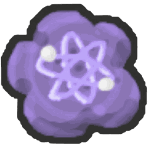

# Ability Atomic Treat

{ align=right width=150 }

*"Always gives a bee an Ability Rate Mutation."*

The **Ability Atomic Treat** is a [treat](treats.md) that always gives a [bee](bees.md) a **Ability Rate** [mutation](mutation.md). It works like an [Atomic Treat](atomic-treat.md), but the mutation is always Ability Rate instead of a random one.

## Effect

* +1,000 [bond](bond.md).
* Gives the bee a Ability Rate mutation. How strong it is depends on the bee's level; see [Mutation strength](mutation.md#mutation-strength).

## Ways to obtain

* **Rebirth reward:** 5 at a time, from one of the later rebirth tiers.

## See also

* [Atomic Treat](atomic-treat.md)
* [Mutation](mutation.md)
* [Treats](treats.md)
