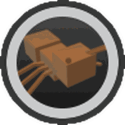

# Ant Amulet

The **Ant Amulet** is an [amulet](amulet.md) that is obtained from participating in the [Ant Challenge](ant-challenge.md).

The amulet gives the player buffs and will always boost [Convert Rate](system-page.md#Convert_Rate). There are five tiers of Ant Amulets, each awarded for reaching a certain point milestone in the Ant Challenge.

The amulet's quality is your Ant Challenge score divided by 400, capped at 1. It is the same linear formula for every tier, so quality is maxed at a score of 400.

## Requirements

<table class="sortable fandom-table">
<tbody><tr>
<th>Requirement(s)
</th>
<th>Amulet
</th></tr>
<tr>
<td>0-24 Points in the Ant Challenge
</td>
<td> Bronze Ant Amulet
</td></tr>
<tr>
<td>25-49 Points in the Ant Challenge
</td>
<td> Silver Ant Amulet
</td></tr>
<tr>
<td>50-99 Points in the Ant Challenge
</td>
<td> Gold Ant Amulet
</td></tr>
<tr>
<td>100-149 Points in the Ant Challenge
</td>
<td> Diamond Ant Amulet
</td></tr>
<tr>
<td>150+ Points in the Ant Challenge
</td>
<td> Supreme Ant Amulet
</td></tr></tbody></table>

## Possible Buffs

*For more information on how amulets generate, see [Amulet#Generation](amulet.md#Generation).*

*Stats in a "Select N" group are drawn evenly without repeats, so each one has an N in M chance. "Separate chance roll" means the stat only appears if an extra chance roll succeeds. "Low values more likely" means high values of that stat are rarer.*

/// tab | Bronze Ant Amulet

<figure class="amulet-tier-icon"><figcaption>The icon for the Bronze Ant Amulet.</figcaption></figure>

<b>How to get:</b> 0-24 Points in the Ant Challenge

<table class="article-table">
<tbody><tr>
<th>Number of stats taken
</th>
<th>Stat
</th>
<th>Range
</th>
<th>Probability of being selected
</th></tr>
<tr>
<td>Guaranteed
</td>
<td><a href="system-page.html#Convert_Rate">Convert Rate</a>
</td>
<td>+15% - +35% Intervals of 1%
</td>
<td>100%
</td></tr>
<tr>
<td rowspan="3">Select 2
</td>
<td><a href="system-page.html#White_Pollen">White Pollen</a>
</td>
<td>+1% - +5% Intervals of 1%
</td>
<td>66.6667%
</td></tr>
<tr>
<td><a href="system-page.html#Red_Pollen">Red Pollen</a>
</td>
<td>+1% - +5% Intervals of 1%
</td>
<td>66.6667%
</td></tr>
<tr>
<td><a href="system-page.html#Blue_Pollen">Blue Pollen</a>
</td>
<td>+1% - +5% Intervals of 1%
</td>
<td>66.6667%
</td></tr></tbody></table>

The tables below give the percentage of a certain stat on the amulet having strength within a specific range, at a few quality milestones. To see the percentage of a certain stat having a specific strength value, see [the designated subpage](ant-amulet-probability.md#Bronze_Ant_Amulet).

*Note that the precise percentages may be off due to floating point errors.*  

### + Convert Rate %

<table class="wikitable" style="border:2px solid">
<tbody><tr>
<th rowspan="2">Quality
</th>
<th colspan="5">Stat ranges
</th>
<th rowspan="2">Average
</th></tr>
<tr>
<th>+15%-+19%
</th>
<th>+20%-+24%
</th>
<th>+25%-+29%
</th>
<th>+30%-+34%
</th>
<th>+35%
</th></tr>
<tr>
<td><b>0</b> (0 points)
</td>
<td>56.062%
</td>
<td>26.8%
</td>
<td>12.95%
</td>
<td>4.15%
</td>
<td>0.032%
</td>
<td>+20%
</td></tr>
<tr>
<td><b>0.0075</b> (3 points)
</td>
<td>55.52%
</td>
<td>27.18%
</td>
<td>13.085%
</td>
<td>4.19%
</td>
<td>0.032%
</td>
<td>+20%
</td></tr>
<tr>
<td><b>0.015</b> (6 points)
</td>
<td>54.96%
</td>
<td>27.57%
</td>
<td>13.22%
</td>
<td>4.22%
</td>
<td>0.032%
</td>
<td>+20%
</td></tr>
<tr>
<td><b>0.0225</b> (9 points)
</td>
<td>54.38%
</td>
<td>27.97%
</td>
<td>13.36%
</td>
<td>4.26%
</td>
<td>0.032%
</td>
<td>+20%
</td></tr>
<tr>
<td><b>0.03</b> (12 points)
</td>
<td>53.78%
</td>
<td>28.39%
</td>
<td>13.49%
</td>
<td>4.3%
</td>
<td>0.032%
</td>
<td>+20%
</td></tr>
<tr>
<td><b>0.0375</b> (15 points)
</td>
<td>53.17%
</td>
<td>28.82%
</td>
<td>13.64%
</td>
<td>4.33%
</td>
<td>0.033%
</td>
<td>+20%
</td></tr>
<tr>
<td><b>0.045</b> (18 points)
</td>
<td>52.54%
</td>
<td>29.27%
</td>
<td>13.78%
</td>
<td>4.37%
</td>
<td>0.033%
</td>
<td>+20%
</td></tr>
<tr>
<td><b>0.0525</b> (21 points)
</td>
<td>51.88%
</td>
<td>29.74%
</td>
<td>13.93%
</td>
<td>4.41%
</td>
<td>0.033%
</td>
<td>+21%
</td></tr>
<tr>
<td><b>0.06</b> (24 points)
</td>
<td>51.21%
</td>
<td>30.22%
</td>
<td>14.085%
</td>
<td>4.45%
</td>
<td>0.034%
</td>
<td>+21%
</td></tr></tbody></table>

### + White Pollen %

<table class="wikitable" style="border:2px solid">
<tbody><tr>
<th rowspan="2">Quality
</th>
<th colspan="5">Stat ranges
</th>
<th rowspan="2">Average
</th></tr>
<tr>
<th>+1%
</th>
<th>+2%
</th>
<th>+3%
</th>
<th>+4%
</th>
<th>+5%
</th></tr>
<tr>
<td><b>0</b> (0 points)
</td>
<td>38.49%
</td>
<td>35.79%
</td>
<td>17.59%
</td>
<td>7.31%
</td>
<td>0.82%
</td>
<td>+2%
</td></tr>
<tr>
<td><b>0.0075</b> (3 points)
</td>
<td>37.57%
</td>
<td>36.44%
</td>
<td>17.79%
</td>
<td>7.37%
</td>
<td>0.82%
</td>
<td>+2%
</td></tr>
<tr>
<td><b>0.015</b> (6 points)
</td>
<td>36.61%
</td>
<td>37.12%
</td>
<td>17.99%
</td>
<td>7.44%
</td>
<td>0.83%
</td>
<td>+2%
</td></tr>
<tr>
<td><b>0.0225</b> (9 points)
</td>
<td>35.62%
</td>
<td>37.84%
</td>
<td>18.2%
</td>
<td>7.51%
</td>
<td>0.84%
</td>
<td>+2%
</td></tr>
<tr>
<td><b>0.03</b> (12 points)
</td>
<td>34.57%
</td>
<td>38.59%
</td>
<td>18.42%
</td>
<td>7.58%
</td>
<td>0.84%
</td>
<td>+2%
</td></tr>
<tr>
<td><b>0.0375</b> (15 points)
</td>
<td>33.48%
</td>
<td>39.39%
</td>
<td>18.63%
</td>
<td>7.65%
</td>
<td>0.85%
</td>
<td>+2%
</td></tr>
<tr>
<td><b>0.045</b> (18 points)
</td>
<td>32.34%
</td>
<td>40.23%
</td>
<td>18.86%
</td>
<td>7.72%
</td>
<td>0.86%
</td>
<td>+2%
</td></tr>
<tr>
<td><b>0.0525</b> (21 points)
</td>
<td>31.13%
</td>
<td>41.12%
</td>
<td>19.087%
</td>
<td>7.79%
</td>
<td>0.86%
</td>
<td>+2.1%
</td></tr>
<tr>
<td><b>0.06</b> (24 points)
</td>
<td>29.86%
</td>
<td>42.074%
</td>
<td>19.32%
</td>
<td>7.87%
</td>
<td>0.87%
</td>
<td>+2.1%
</td></tr></tbody></table>

### + Red Pollen %

<table class="wikitable" style="border:2px solid">
<tbody><tr>
<th rowspan="2">Quality
</th>
<th colspan="5">Stat ranges
</th>
<th rowspan="2">Average
</th></tr>
<tr>
<th>+1%
</th>
<th>+2%
</th>
<th>+3%
</th>
<th>+4%
</th>
<th>+5%
</th></tr>
<tr>
<td><b>0</b> (0 points)
</td>
<td>38.49%
</td>
<td>35.79%
</td>
<td>17.59%
</td>
<td>7.31%
</td>
<td>0.82%
</td>
<td>+2%
</td></tr>
<tr>
<td><b>0.0075</b> (3 points)
</td>
<td>37.57%
</td>
<td>36.44%
</td>
<td>17.79%
</td>
<td>7.37%
</td>
<td>0.82%
</td>
<td>+2%
</td></tr>
<tr>
<td><b>0.015</b> (6 points)
</td>
<td>36.61%
</td>
<td>37.12%
</td>
<td>17.99%
</td>
<td>7.44%
</td>
<td>0.83%
</td>
<td>+2%
</td></tr>
<tr>
<td><b>0.0225</b> (9 points)
</td>
<td>35.62%
</td>
<td>37.84%
</td>
<td>18.2%
</td>
<td>7.51%
</td>
<td>0.84%
</td>
<td>+2%
</td></tr>
<tr>
<td><b>0.03</b> (12 points)
</td>
<td>34.57%
</td>
<td>38.59%
</td>
<td>18.42%
</td>
<td>7.58%
</td>
<td>0.84%
</td>
<td>+2%
</td></tr>
<tr>
<td><b>0.0375</b> (15 points)
</td>
<td>33.48%
</td>
<td>39.39%
</td>
<td>18.63%
</td>
<td>7.65%
</td>
<td>0.85%
</td>
<td>+2%
</td></tr>
<tr>
<td><b>0.045</b> (18 points)
</td>
<td>32.34%
</td>
<td>40.23%
</td>
<td>18.86%
</td>
<td>7.72%
</td>
<td>0.86%
</td>
<td>+2%
</td></tr>
<tr>
<td><b>0.0525</b> (21 points)
</td>
<td>31.13%
</td>
<td>41.12%
</td>
<td>19.087%
</td>
<td>7.79%
</td>
<td>0.86%
</td>
<td>+2.1%
</td></tr>
<tr>
<td><b>0.06</b> (24 points)
</td>
<td>29.86%
</td>
<td>42.074%
</td>
<td>19.32%
</td>
<td>7.87%
</td>
<td>0.87%
</td>
<td>+2.1%
</td></tr></tbody></table>

### + Blue Pollen %

<table class="wikitable" style="border:2px solid">
<tbody><tr>
<th rowspan="2">Quality
</th>
<th colspan="5">Stat ranges
</th>
<th rowspan="2">Average
</th></tr>
<tr>
<th>+1%
</th>
<th>+2%
</th>
<th>+3%
</th>
<th>+4%
</th>
<th>+5%
</th></tr>
<tr>
<td><b>0</b> (0 points)
</td>
<td>38.49%
</td>
<td>35.79%
</td>
<td>17.59%
</td>
<td>7.31%
</td>
<td>0.82%
</td>
<td>+2%
</td></tr>
<tr>
<td><b>0.0075</b> (3 points)
</td>
<td>37.57%
</td>
<td>36.44%
</td>
<td>17.79%
</td>
<td>7.37%
</td>
<td>0.82%
</td>
<td>+2%
</td></tr>
<tr>
<td><b>0.015</b> (6 points)
</td>
<td>36.61%
</td>
<td>37.12%
</td>
<td>17.99%
</td>
<td>7.44%
</td>
<td>0.83%
</td>
<td>+2%
</td></tr>
<tr>
<td><b>0.0225</b> (9 points)
</td>
<td>35.62%
</td>
<td>37.84%
</td>
<td>18.2%
</td>
<td>7.51%
</td>
<td>0.84%
</td>
<td>+2%
</td></tr>
<tr>
<td><b>0.03</b> (12 points)
</td>
<td>34.57%
</td>
<td>38.59%
</td>
<td>18.42%
</td>
<td>7.58%
</td>
<td>0.84%
</td>
<td>+2%
</td></tr>
<tr>
<td><b>0.0375</b> (15 points)
</td>
<td>33.48%
</td>
<td>39.39%
</td>
<td>18.63%
</td>
<td>7.65%
</td>
<td>0.85%
</td>
<td>+2%
</td></tr>
<tr>
<td><b>0.045</b> (18 points)
</td>
<td>32.34%
</td>
<td>40.23%
</td>
<td>18.86%
</td>
<td>7.72%
</td>
<td>0.86%
</td>
<td>+2%
</td></tr>
<tr>
<td><b>0.0525</b> (21 points)
</td>
<td>31.13%
</td>
<td>41.12%
</td>
<td>19.087%
</td>
<td>7.79%
</td>
<td>0.86%
</td>
<td>+2.1%
</td></tr>
<tr>
<td><b>0.06</b> (24 points)
</td>
<td>29.86%
</td>
<td>42.074%
</td>
<td>19.32%
</td>
<td>7.87%
</td>
<td>0.87%
</td>
<td>+2.1%
</td></tr></tbody></table>

///

/// tab | Silver Ant Amulet

<figure class="amulet-tier-icon"><figcaption>The icon for the Silver Ant Amulet.</figcaption></figure>

<b>How to get:</b> 25-49 Points in the Ant Challenge

<table class="article-table">
<tbody><tr>
<th>Number of stats taken
</th>
<th>Stat
</th>
<th>Range
</th>
<th>Probability of being selected
</th></tr>
<tr>
<td>Guaranteed
</td>
<td><a href="system-page.html#Convert_Rate">Convert Rate</a>
</td>
<td>+40% - +60% Intervals of 1%
</td>
<td>100%
</td></tr>
<tr>
<td rowspan="3">Select 1
</td>
<td><a href="system-page.html#Movespeed">Player Movespeed</a>
</td>
<td>+1
</td>
<td>33.3333%
</td></tr>
<tr>
<td><a href="system-page.html#Critical_Chance">Critical Chance</a>
</td>
<td>+1%
</td>
<td>33.3333%
</td></tr>
<tr>
<td><a href="system-page.html#Critical_Power">Critical Power</a>
</td>
<td>+5% - +10% Intervals of 1% Low values more likely (bias 3:1)
</td>
<td>33.3333%
</td></tr>
<tr>
<td rowspan="3">Select 2
</td>
<td><a href="system-page.html#White_Pollen">White Pollen</a>
</td>
<td>+5% - +10% Intervals of 1%
</td>
<td>66.6667%
</td></tr>
<tr>
<td><a href="system-page.html#Red_Pollen">Red Pollen</a>
</td>
<td>+5% - +10% Intervals of 1%
</td>
<td>66.6667%
</td></tr>
<tr>
<td><a href="system-page.html#Blue_Pollen">Blue Pollen</a>
</td>
<td>+5% - +10% Intervals of 1%
</td>
<td>66.6667%
</td></tr></tbody></table>

The tables below give the percentage of a certain stat on the amulet having strength within a specific range, at a few quality milestones. To see the percentage of a certain stat having a specific strength value, see [the designated subpage](ant-amulet-probability.md#Silver_Ant_Amulet).

*Note that the precise percentages may be off due to floating point errors.*  

### + Convert Rate %

<table class="wikitable" style="border:2px solid">
<tbody><tr>
<th rowspan="2">Quality
</th>
<th colspan="5">Stat ranges
</th>
<th rowspan="2">Average
</th></tr>
<tr>
<th>+40%-+44%
</th>
<th>+45%-+49%
</th>
<th>+50%-+54%
</th>
<th>+55%-+59%
</th>
<th>+60%
</th></tr>
<tr>
<td><b>0.0625</b> (25 points)
</td>
<td>50.98%
</td>
<td>30.39%
</td>
<td>14.14%
</td>
<td>4.46%
</td>
<td>0.034%
</td>
<td>+46%
</td></tr>
<tr>
<td><b>0.07</b> (28 points)
</td>
<td>50.27%
</td>
<td>30.9%
</td>
<td>14.29%
</td>
<td>4.51%
</td>
<td>0.034%
</td>
<td>+46%
</td></tr>
<tr>
<td><b>0.0775</b> (31 points)
</td>
<td>49.54%
</td>
<td>31.42%
</td>
<td>14.45%
</td>
<td>4.55%
</td>
<td>0.034%
</td>
<td>+46%
</td></tr>
<tr>
<td><b>0.085</b> (34 points)
</td>
<td>48.78%
</td>
<td>31.98%
</td>
<td>14.62%
</td>
<td>4.59%
</td>
<td>0.034%
</td>
<td>+46%
</td></tr>
<tr>
<td><b>0.0925</b> (37 points)
</td>
<td>47.99%
</td>
<td>32.55%
</td>
<td>14.79%
</td>
<td>4.63%
</td>
<td>0.035%
</td>
<td>+46%
</td></tr>
<tr>
<td><b>0.1</b> (40 points)
</td>
<td>47.18%
</td>
<td>33.15%
</td>
<td>14.96%
</td>
<td>4.67%
</td>
<td>0.035%
</td>
<td>+46%
</td></tr>
<tr>
<td><b>0.1075</b> (43 points)
</td>
<td>46.32%
</td>
<td>33.78%
</td>
<td>15.14%
</td>
<td>4.72%
</td>
<td>0.035%
</td>
<td>+46%
</td></tr>
<tr>
<td><b>0.115</b> (46 points)
</td>
<td>45.44%
</td>
<td>34.45%
</td>
<td>15.32%
</td>
<td>4.76%
</td>
<td>0.036%
</td>
<td>+46%
</td></tr>
<tr>
<td><b>0.1225</b> (49 points)
</td>
<td>44.51%
</td>
<td>35.14%
</td>
<td>15.5%
</td>
<td>4.81%
</td>
<td>0.036%
</td>
<td>+46%
</td></tr></tbody></table>

### + Critical Power %

<table class="wikitable" style="border:2px solid">
<tbody><tr>
<th rowspan="2">Quality
</th>
<th colspan="6">Stat ranges
</th>
<th rowspan="2">Average
</th></tr>
<tr>
<th>+5%
</th>
<th>+6%
</th>
<th>+7%
</th>
<th>+8%
</th>
<th>+9%
</th>
<th>+10%
</th></tr>
<tr>
<td><b>0.0625</b> (25 points)
</td>
<td>29.69%
</td>
<td>35.27%
</td>
<td>19.26%
</td>
<td>10.62%
</td>
<td>4.63%
</td>
<td>0.53%
</td>
<td>+6.3%
</td></tr>
<tr>
<td><b>0.07</b> (28 points)
</td>
<td>29.22%
</td>
<td>35.58%
</td>
<td>19.36%
</td>
<td>10.66%
</td>
<td>4.65%
</td>
<td>0.53%
</td>
<td>+6.3%
</td></tr>
<tr>
<td><b>0.0775</b> (31 points)
</td>
<td>28.74%
</td>
<td>35.9%
</td>
<td>19.46%
</td>
<td>10.71%
</td>
<td>4.66%
</td>
<td>0.53%
</td>
<td>+6.3%
</td></tr>
<tr>
<td><b>0.085</b> (34 points)
</td>
<td>28.24%
</td>
<td>36.24%
</td>
<td>19.56%
</td>
<td>10.75%
</td>
<td>4.68%
</td>
<td>0.53%
</td>
<td>+6.3%
</td></tr>
<tr>
<td><b>0.0925</b> (37 points)
</td>
<td>27.72%
</td>
<td>36.59%
</td>
<td>19.66%
</td>
<td>10.8%
</td>
<td>4.7%
</td>
<td>0.54%
</td>
<td>+6.3%
</td></tr>
<tr>
<td><b>0.1</b> (40 points)
</td>
<td>27.17%
</td>
<td>36.96%
</td>
<td>19.77%
</td>
<td>10.84%
</td>
<td>4.71%
</td>
<td>0.54%
</td>
<td>+6.3%
</td></tr>
<tr>
<td><b>0.1075</b> (43 points)
</td>
<td>26.61%
</td>
<td>37.35%
</td>
<td>19.89%
</td>
<td>10.89%
</td>
<td>4.73%
</td>
<td>0.54%
</td>
<td>+6.3%
</td></tr>
<tr>
<td><b>0.115</b> (46 points)
</td>
<td>26.019%
</td>
<td>37.75%
</td>
<td>20.0008%
</td>
<td>10.94%
</td>
<td>4.75%
</td>
<td>0.54%
</td>
<td>+6.3%
</td></tr>
<tr>
<td><b>0.1225</b> (49 points)
</td>
<td>25.4%
</td>
<td>38.18%
</td>
<td>20.12%
</td>
<td>10.99%
</td>
<td>4.77%
</td>
<td>0.54%
</td>
<td>+6.3%
</td></tr></tbody></table>

### + White Pollen %

<table class="wikitable" style="border:2px solid">
<tbody><tr>
<th rowspan="2">Quality
</th>
<th colspan="6">Stat ranges
</th>
<th rowspan="2">Average
</th></tr>
<tr>
<th>+5%
</th>
<th>+6%
</th>
<th>+7%
</th>
<th>+8%
</th>
<th>+9%
</th>
<th>+10%
</th></tr>
<tr>
<td><b>0.0625</b> (25 points)
</td>
<td>22.071%
</td>
<td>40.54%
</td>
<td>20.73%
</td>
<td>11.24%
</td>
<td>4.86%
</td>
<td>0.55%
</td>
<td>+6.4%
</td></tr>
<tr>
<td><b>0.07</b> (28 points)
</td>
<td>20.3%
</td>
<td>41.83%
</td>
<td>21.037%
</td>
<td>11.37%
</td>
<td>4.91%
</td>
<td>0.56%
</td>
<td>+6.4%
</td></tr>
<tr>
<td><b>0.0775</b> (31 points)
</td>
<td>18.36%
</td>
<td>43.29%
</td>
<td>21.35%
</td>
<td>11.49%
</td>
<td>4.95%
</td>
<td>0.56%
</td>
<td>+6.4%
</td></tr>
<tr>
<td><b>0.085</b> (34 points)
</td>
<td>16.17%
</td>
<td>44.97%
</td>
<td>21.67%
</td>
<td>11.62%
</td>
<td>5%
</td>
<td>0.57%
</td>
<td>+6.5%
</td></tr>
<tr>
<td><b>0.0925</b> (37 points)
</td>
<td>13.6%
</td>
<td>47.021%
</td>
<td>22.0087%
</td>
<td>11.75%
</td>
<td>5.046%
</td>
<td>0.57%
</td>
<td>+6.5%
</td></tr>
<tr>
<td><b>0.1</b> (40 points)
</td>
<td>10%
</td>
<td>50.082%
</td>
<td>22.36%
</td>
<td>11.89%
</td>
<td>5.095%
</td>
<td>0.58%
</td>
<td>+6.5%
</td></tr>
<tr>
<td><b>0.1075</b> (43 points)
</td>
<td>8.0031%
</td>
<td>51.53%
</td>
<td>22.72%
</td>
<td>12.03%
</td>
<td>5.14%
</td>
<td>0.58%
</td>
<td>+6.6%
</td></tr>
<tr>
<td><b>0.115</b> (46 points)
</td>
<td>6.94%
</td>
<td>52.012%
</td>
<td>23.088%
</td>
<td>12.17%
</td>
<td>5.19%
</td>
<td>0.59%
</td>
<td>+6.6%
</td></tr>
<tr>
<td><b>0.1225</b> (49 points)
</td>
<td>6.19%
</td>
<td>52.18%
</td>
<td>23.48%
</td>
<td>12.32%
</td>
<td>5.25%
</td>
<td>0.59%
</td>
<td>+6.6%
</td></tr></tbody></table>

### + Red Pollen %

<table class="wikitable" style="border:2px solid">
<tbody><tr>
<th rowspan="2">Quality
</th>
<th colspan="6">Stat ranges
</th>
<th rowspan="2">Average
</th></tr>
<tr>
<th>+5%
</th>
<th>+6%
</th>
<th>+7%
</th>
<th>+8%
</th>
<th>+9%
</th>
<th>+10%
</th></tr>
<tr>
<td><b>0.0625</b> (25 points)
</td>
<td>22.071%
</td>
<td>40.54%
</td>
<td>20.73%
</td>
<td>11.24%
</td>
<td>4.86%
</td>
<td>0.55%
</td>
<td>+6.4%
</td></tr>
<tr>
<td><b>0.07</b> (28 points)
</td>
<td>20.3%
</td>
<td>41.83%
</td>
<td>21.037%
</td>
<td>11.37%
</td>
<td>4.91%
</td>
<td>0.56%
</td>
<td>+6.4%
</td></tr>
<tr>
<td><b>0.0775</b> (31 points)
</td>
<td>18.36%
</td>
<td>43.29%
</td>
<td>21.35%
</td>
<td>11.49%
</td>
<td>4.95%
</td>
<td>0.56%
</td>
<td>+6.4%
</td></tr>
<tr>
<td><b>0.085</b> (34 points)
</td>
<td>16.17%
</td>
<td>44.97%
</td>
<td>21.67%
</td>
<td>11.62%
</td>
<td>5%
</td>
<td>0.57%
</td>
<td>+6.5%
</td></tr>
<tr>
<td><b>0.0925</b> (37 points)
</td>
<td>13.6%
</td>
<td>47.021%
</td>
<td>22.0087%
</td>
<td>11.75%
</td>
<td>5.046%
</td>
<td>0.57%
</td>
<td>+6.5%
</td></tr>
<tr>
<td><b>0.1</b> (40 points)
</td>
<td>10%
</td>
<td>50.082%
</td>
<td>22.36%
</td>
<td>11.89%
</td>
<td>5.095%
</td>
<td>0.58%
</td>
<td>+6.5%
</td></tr>
<tr>
<td><b>0.1075</b> (43 points)
</td>
<td>8.0031%
</td>
<td>51.53%
</td>
<td>22.72%
</td>
<td>12.03%
</td>
<td>5.14%
</td>
<td>0.58%
</td>
<td>+6.6%
</td></tr>
<tr>
<td><b>0.115</b> (46 points)
</td>
<td>6.94%
</td>
<td>52.012%
</td>
<td>23.088%
</td>
<td>12.17%
</td>
<td>5.19%
</td>
<td>0.59%
</td>
<td>+6.6%
</td></tr>
<tr>
<td><b>0.1225</b> (49 points)
</td>
<td>6.19%
</td>
<td>52.18%
</td>
<td>23.48%
</td>
<td>12.32%
</td>
<td>5.25%
</td>
<td>0.59%
</td>
<td>+6.6%
</td></tr></tbody></table>

### + Blue Pollen %

<table class="wikitable" style="border:2px solid">
<tbody><tr>
<th rowspan="2">Quality
</th>
<th colspan="6">Stat ranges
</th>
<th rowspan="2">Average
</th></tr>
<tr>
<th>+5%
</th>
<th>+6%
</th>
<th>+7%
</th>
<th>+8%
</th>
<th>+9%
</th>
<th>+10%
</th></tr>
<tr>
<td><b>0.0625</b> (25 points)
</td>
<td>22.071%
</td>
<td>40.54%
</td>
<td>20.73%
</td>
<td>11.24%
</td>
<td>4.86%
</td>
<td>0.55%
</td>
<td>+6.4%
</td></tr>
<tr>
<td><b>0.07</b> (28 points)
</td>
<td>20.3%
</td>
<td>41.83%
</td>
<td>21.037%
</td>
<td>11.37%
</td>
<td>4.91%
</td>
<td>0.56%
</td>
<td>+6.4%
</td></tr>
<tr>
<td><b>0.0775</b> (31 points)
</td>
<td>18.36%
</td>
<td>43.29%
</td>
<td>21.35%
</td>
<td>11.49%
</td>
<td>4.95%
</td>
<td>0.56%
</td>
<td>+6.4%
</td></tr>
<tr>
<td><b>0.085</b> (34 points)
</td>
<td>16.17%
</td>
<td>44.97%
</td>
<td>21.67%
</td>
<td>11.62%
</td>
<td>5%
</td>
<td>0.57%
</td>
<td>+6.5%
</td></tr>
<tr>
<td><b>0.0925</b> (37 points)
</td>
<td>13.6%
</td>
<td>47.021%
</td>
<td>22.0087%
</td>
<td>11.75%
</td>
<td>5.046%
</td>
<td>0.57%
</td>
<td>+6.5%
</td></tr>
<tr>
<td><b>0.1</b> (40 points)
</td>
<td>10%
</td>
<td>50.082%
</td>
<td>22.36%
</td>
<td>11.89%
</td>
<td>5.095%
</td>
<td>0.58%
</td>
<td>+6.5%
</td></tr>
<tr>
<td><b>0.1075</b> (43 points)
</td>
<td>8.0031%
</td>
<td>51.53%
</td>
<td>22.72%
</td>
<td>12.03%
</td>
<td>5.14%
</td>
<td>0.58%
</td>
<td>+6.6%
</td></tr>
<tr>
<td><b>0.115</b> (46 points)
</td>
<td>6.94%
</td>
<td>52.012%
</td>
<td>23.088%
</td>
<td>12.17%
</td>
<td>5.19%
</td>
<td>0.59%
</td>
<td>+6.6%
</td></tr>
<tr>
<td><b>0.1225</b> (49 points)
</td>
<td>6.19%
</td>
<td>52.18%
</td>
<td>23.48%
</td>
<td>12.32%
</td>
<td>5.25%
</td>
<td>0.59%
</td>
<td>+6.6%
</td></tr></tbody></table>

///

/// tab | Gold Ant Amulet

<figure class="amulet-tier-icon"><figcaption>The icon for the Gold Ant Amulet.</figcaption></figure>

<b>How to get:</b> 50-99 Points in the Ant Challenge

<table class="article-table">
<tbody><tr>
<th>Number of stats taken
</th>
<th>Stat
</th>
<th>Range
</th>
<th>Probability of being selected
</th></tr>
<tr>
<td>Guaranteed
</td>
<td><a href="system-page.html#Convert_Rate">Convert Rate</a>
</td>
<td>+60% - +80% Intervals of 1%
</td>
<td>100%
</td></tr>
<tr>
<td>Potentially
</td>
<td><a href="system-page.html#Bee_Attack">Bee Attack</a>
</td>
<td>+0 - +1 Intervals of 1 Low values more likely (bias 20:1)
</td>
<td>5% (separate chance roll)
</td></tr>
<tr>
<td rowspan="3">Select 1
</td>
<td><a href="system-page.html#Movespeed">Player Movespeed</a>
</td>
<td>+1 - +2 Intervals of 1
</td>
<td>33.3333%
</td></tr>
<tr>
<td><a href="system-page.html#Critical_Chance">Critical Chance</a>
</td>
<td>+1% - +2% Intervals of 1% Low values more likely (bias 3:1)
</td>
<td>33.3333%
</td></tr>
<tr>
<td><a href="system-page.html#Critical_Power">Critical Power</a>
</td>
<td>+10% - +25% Intervals of 1% Low values more likely (bias 3:1)
</td>
<td>33.3333%
</td></tr>
<tr>
<td rowspan="3">Select 2
</td>
<td><a href="system-page.html#White_Pollen">White Pollen</a>
</td>
<td>+10% - +15% Intervals of 1%
</td>
<td>66.6667%
</td></tr>
<tr>
<td><a href="system-page.html#Red_Pollen">Red Pollen</a>
</td>
<td>+10% - +15% Intervals of 1%
</td>
<td>66.6667%
</td></tr>
<tr>
<td><a href="system-page.html#Blue_Pollen">Blue Pollen</a>
</td>
<td>+10% - +15% Intervals of 1%
</td>
<td>66.6667%
</td></tr></tbody></table>

The tables below give the percentage of a certain stat on the amulet having strength within a specific range, at a few quality milestones. To see the percentage of a certain stat having a specific strength value, see [the designated subpage](ant-amulet-probability.md#Gold_Ant_Amulet).

*Note that the precise percentages may be off due to floating point errors.*  

### + Convert Rate %

<table class="wikitable" style="border:2px solid">
<tbody><tr>
<th rowspan="2">Quality
</th>
<th colspan="5">Stat ranges
</th>
<th rowspan="2">Average
</th></tr>
<tr>
<th>+60%-+64%
</th>
<th>+65%-+69%
</th>
<th>+70%-+74%
</th>
<th>+75%-+79%
</th>
<th>+80%
</th></tr>
<tr>
<td><b>0.125</b> (50 points)
</td>
<td>44.19%
</td>
<td>35.38%
</td>
<td>15.57%
</td>
<td>4.83%
</td>
<td>0.036%
</td>
<td>+66%
</td></tr>
<tr>
<td><b>0.1425</b> (57 points)
</td>
<td>41.82%
</td>
<td>37.19%
</td>
<td>16.024%
</td>
<td>4.94%
</td>
<td>0.037%
</td>
<td>+66%
</td></tr>
<tr>
<td><b>0.16</b> (64 points)
</td>
<td>39.13%
</td>
<td>39.26%
</td>
<td>16.51%
</td>
<td>5.056%
</td>
<td>0.038%
</td>
<td>+67%
</td></tr>
<tr>
<td><b>0.1775</b> (71 points)
</td>
<td>36.045%
</td>
<td>41.71%
</td>
<td>17.029%
</td>
<td>5.18%
</td>
<td>0.038%
</td>
<td>+67%
</td></tr>
<tr>
<td><b>0.195</b> (78 points)
</td>
<td>32.37%
</td>
<td>44.7%
</td>
<td>17.58%
</td>
<td>5.31%
</td>
<td>0.039%
</td>
<td>+67%
</td></tr>
<tr>
<td><b>0.2125</b> (85 points)
</td>
<td>27.68%
</td>
<td>48.66%
</td>
<td>18.18%
</td>
<td>5.44%
</td>
<td>0.04%
</td>
<td>+67%
</td></tr>
<tr>
<td><b>0.23</b> (92 points)
</td>
<td>20.59%
</td>
<td>54.97%
</td>
<td>18.81%
</td>
<td>5.59%
</td>
<td>0.041%
</td>
<td>+67%
</td></tr>
<tr>
<td><b>0.2475</b> (99 points)
</td>
<td>17.1%
</td>
<td>57.61%
</td>
<td>19.5%
</td>
<td>5.74%
</td>
<td>0.042%
</td>
<td>+67%
</td></tr></tbody></table>

### + Bee Attack

<table class="wikitable" style="border:2px solid">
<tbody><tr>
<th rowspan="2">Quality
</th>
<th colspan="2">Stat ranges
</th>
<th rowspan="2">Average
</th></tr>
<tr>
<th>+0
</th>
<th>+1
</th></tr>
<tr>
<td><b>0.125</b> (50 points)
</td>
<td>84.52%
</td>
<td>15.48%
</td>
<td>+0.15
</td></tr>
<tr>
<td><b>0.1425</b> (57 points)
</td>
<td>84.5%
</td>
<td>15.5%
</td>
<td>+0.16
</td></tr>
<tr>
<td><b>0.16</b> (64 points)
</td>
<td>84.47%
</td>
<td>15.53%
</td>
<td>+0.16
</td></tr>
<tr>
<td><b>0.1775</b> (71 points)
</td>
<td>84.45%
</td>
<td>15.55%
</td>
<td>+0.16
</td></tr>
<tr>
<td><b>0.195</b> (78 points)
</td>
<td>84.42%
</td>
<td>15.58%
</td>
<td>+0.16
</td></tr>
<tr>
<td><b>0.2125</b> (85 points)
</td>
<td>84.39%
</td>
<td>15.61%
</td>
<td>+0.16
</td></tr>
<tr>
<td><b>0.23</b> (92 points)
</td>
<td>84.36%
</td>
<td>15.64%
</td>
<td>+0.16
</td></tr>
<tr>
<td><b>0.2475</b> (99 points)
</td>
<td>84.33%
</td>
<td>15.67%
</td>
<td>+0.16
</td></tr></tbody></table>

### + Player Movespeed

<table class="wikitable" style="border:2px solid">
<tbody><tr>
<th rowspan="2">Quality
</th>
<th colspan="2">Stat ranges
</th>
<th rowspan="2">Average
</th></tr>
<tr>
<th>+1
</th>
<th>+2
</th></tr>
<tr>
<td><b>0.125</b> (50 points)
</td>
<td>81.77%
</td>
<td>18.23%
</td>
<td>+1.18
</td></tr>
<tr>
<td><b>0.1425</b> (57 points)
</td>
<td>81.28%
</td>
<td>18.72%
</td>
<td>+1.19
</td></tr>
<tr>
<td><b>0.16</b> (64 points)
</td>
<td>80.75%
</td>
<td>19.25%
</td>
<td>+1.19
</td></tr>
<tr>
<td><b>0.1775</b> (71 points)
</td>
<td>80.19%
</td>
<td>19.81%
</td>
<td>+1.2
</td></tr>
<tr>
<td><b>0.195</b> (78 points)
</td>
<td>79.6%
</td>
<td>20.4%
</td>
<td>+1.2
</td></tr>
<tr>
<td><b>0.2125</b> (85 points)
</td>
<td>78.97%
</td>
<td>21.03%
</td>
<td>+1.21
</td></tr>
<tr>
<td><b>0.23</b> (92 points)
</td>
<td>78.3%
</td>
<td>21.7%
</td>
<td>+1.22
</td></tr>
<tr>
<td><b>0.2475</b> (99 points)
</td>
<td>77.57%
</td>
<td>22.43%
</td>
<td>+1.22
</td></tr></tbody></table>

### + Critical Chance %

<table class="wikitable" style="border:2px solid">
<tbody><tr>
<th rowspan="2">Quality
</th>
<th colspan="2">Stat ranges
</th>
<th rowspan="2">Average
</th></tr>
<tr>
<th>+1%
</th>
<th>+2%
</th></tr>
<tr>
<td><b>0.125</b> (50 points)
</td>
<td>83.68%
</td>
<td>16.32%
</td>
<td>+1.2%
</td></tr>
<tr>
<td><b>0.1425</b> (57 points)
</td>
<td>83.5%
</td>
<td>16.5%
</td>
<td>+1.2%
</td></tr>
<tr>
<td><b>0.16</b> (64 points)
</td>
<td>83.32%
</td>
<td>16.68%
</td>
<td>+1.2%
</td></tr>
<tr>
<td><b>0.1775</b> (71 points)
</td>
<td>83.12%
</td>
<td>16.88%
</td>
<td>+1.2%
</td></tr>
<tr>
<td><b>0.195</b> (78 points)
</td>
<td>82.92%
</td>
<td>17.085%
</td>
<td>+1.2%
</td></tr>
<tr>
<td><b>0.2125</b> (85 points)
</td>
<td>82.69%
</td>
<td>17.31%
</td>
<td>+1.2%
</td></tr>
<tr>
<td><b>0.23</b> (92 points)
</td>
<td>82.45%
</td>
<td>17.55%
</td>
<td>+1.2%
</td></tr>
<tr>
<td><b>0.2475</b> (99 points)
</td>
<td>82.19%
</td>
<td>17.81%
</td>
<td>+1.2%
</td></tr></tbody></table>

### + Critical Power %

<table class="wikitable" style="border:2px solid">
<tbody><tr>
<th rowspan="2">Quality
</th>
<th colspan="4">Stat ranges
</th>
<th rowspan="2">Average
</th></tr>
<tr>
<th>+10%-+14%
</th>
<th>+15%-+19%
</th>
<th>+20%-+24%
</th>
<th>+25%
</th></tr>
<tr>
<td><b>0.125</b> (50 points)
</td>
<td>63.52%
</td>
<td>28.29%
</td>
<td>8.13%
</td>
<td>0.059%
</td>
<td>+14%
</td></tr>
<tr>
<td><b>0.1425</b> (57 points)
</td>
<td>63.049%
</td>
<td>28.68%
</td>
<td>8.21%
</td>
<td>0.06%
</td>
<td>+14%
</td></tr>
<tr>
<td><b>0.16</b> (64 points)
</td>
<td>62.55%
</td>
<td>29.095%
</td>
<td>8.3%
</td>
<td>0.06%
</td>
<td>+14%
</td></tr>
<tr>
<td><b>0.1775</b> (71 points)
</td>
<td>62.0083%
</td>
<td>29.54%
</td>
<td>8.39%
</td>
<td>0.061%
</td>
<td>+14%
</td></tr>
<tr>
<td><b>0.195</b> (78 points)
</td>
<td>61.43%
</td>
<td>30.031%
</td>
<td>8.48%
</td>
<td>0.061%
</td>
<td>+14%
</td></tr>
<tr>
<td><b>0.2125</b> (85 points)
</td>
<td>60.8%
</td>
<td>30.56%
</td>
<td>8.58%
</td>
<td>0.062%
</td>
<td>+14%
</td></tr>
<tr>
<td><b>0.23</b> (92 points)
</td>
<td>60.11%
</td>
<td>31.13%
</td>
<td>8.69%
</td>
<td>0.062%
</td>
<td>+15%
</td></tr>
<tr>
<td><b>0.2475</b> (99 points)
</td>
<td>59.37%
</td>
<td>31.76%
</td>
<td>8.81%
</td>
<td>0.063%
</td>
<td>+15%
</td></tr></tbody></table>

### + White Pollen %

<table class="wikitable" style="border:2px solid">
<tbody><tr>
<th rowspan="2">Quality
</th>
<th colspan="6">Stat ranges
</th>
<th rowspan="2">Average
</th></tr>
<tr>
<th>+10%
</th>
<th>+11%
</th>
<th>+12%
</th>
<th>+13%
</th>
<th>+14%
</th>
<th>+15%
</th></tr>
<tr>
<td><b>0.125</b> (50 points)
</td>
<td>5.98%
</td>
<td>52.19%
</td>
<td>23.61%
</td>
<td>12.37%
</td>
<td>5.26%
</td>
<td>0.59%
</td>
<td>+12%
</td></tr>
<tr>
<td><b>0.1425</b> (57 points)
</td>
<td>4.86%
</td>
<td>51.83%
</td>
<td>24.59%
</td>
<td>12.73%
</td>
<td>5.39%
</td>
<td>0.61%
</td>
<td>+12%
</td></tr>
<tr>
<td><b>0.16</b> (64 points)
</td>
<td>4.12%
</td>
<td>50.97%
</td>
<td>25.67%
</td>
<td>13.11%
</td>
<td>5.52%
</td>
<td>0.62%
</td>
<td>+12%
</td></tr>
<tr>
<td><b>0.1775</b> (71 points)
</td>
<td>3.58%
</td>
<td>49.75%
</td>
<td>26.87%
</td>
<td>13.51%
</td>
<td>5.66%
</td>
<td>0.63%
</td>
<td>+12%
</td></tr>
<tr>
<td><b>0.195</b> (78 points)
</td>
<td>3.17%
</td>
<td>48.22%
</td>
<td>28.21%
</td>
<td>13.95%
</td>
<td>5.8%
</td>
<td>0.65%
</td>
<td>+12%
</td></tr>
<tr>
<td><b>0.2125</b> (85 points)
</td>
<td>2.85%
</td>
<td>46.38%
</td>
<td>29.74%
</td>
<td>14.41%
</td>
<td>5.96%
</td>
<td>0.66%
</td>
<td>+12%
</td></tr>
<tr>
<td><b>0.23</b> (92 points)
</td>
<td>2.58%
</td>
<td>44.2%
</td>
<td>31.51%
</td>
<td>14.91%
</td>
<td>6.12%
</td>
<td>0.68%
</td>
<td>+12%
</td></tr>
<tr>
<td><b>0.2475</b> (99 points)
</td>
<td>2.37%
</td>
<td>41.61%
</td>
<td>33.59%
</td>
<td>15.44%
</td>
<td>6.29%
</td>
<td>0.7%
</td>
<td>+12%
</td></tr></tbody></table>

### + Red Pollen %

<table class="wikitable" style="border:2px solid">
<tbody><tr>
<th rowspan="2">Quality
</th>
<th colspan="6">Stat ranges
</th>
<th rowspan="2">Average
</th></tr>
<tr>
<th>+10%
</th>
<th>+11%
</th>
<th>+12%
</th>
<th>+13%
</th>
<th>+14%
</th>
<th>+15%
</th></tr>
<tr>
<td><b>0.125</b> (50 points)
</td>
<td>5.98%
</td>
<td>52.19%
</td>
<td>23.61%
</td>
<td>12.37%
</td>
<td>5.26%
</td>
<td>0.59%
</td>
<td>+12%
</td></tr>
<tr>
<td><b>0.1425</b> (57 points)
</td>
<td>4.86%
</td>
<td>51.83%
</td>
<td>24.59%
</td>
<td>12.73%
</td>
<td>5.39%
</td>
<td>0.61%
</td>
<td>+12%
</td></tr>
<tr>
<td><b>0.16</b> (64 points)
</td>
<td>4.12%
</td>
<td>50.97%
</td>
<td>25.67%
</td>
<td>13.11%
</td>
<td>5.52%
</td>
<td>0.62%
</td>
<td>+12%
</td></tr>
<tr>
<td><b>0.1775</b> (71 points)
</td>
<td>3.58%
</td>
<td>49.75%
</td>
<td>26.87%
</td>
<td>13.51%
</td>
<td>5.66%
</td>
<td>0.63%
</td>
<td>+12%
</td></tr>
<tr>
<td><b>0.195</b> (78 points)
</td>
<td>3.17%
</td>
<td>48.22%
</td>
<td>28.21%
</td>
<td>13.95%
</td>
<td>5.8%
</td>
<td>0.65%
</td>
<td>+12%
</td></tr>
<tr>
<td><b>0.2125</b> (85 points)
</td>
<td>2.85%
</td>
<td>46.38%
</td>
<td>29.74%
</td>
<td>14.41%
</td>
<td>5.96%
</td>
<td>0.66%
</td>
<td>+12%
</td></tr>
<tr>
<td><b>0.23</b> (92 points)
</td>
<td>2.58%
</td>
<td>44.2%
</td>
<td>31.51%
</td>
<td>14.91%
</td>
<td>6.12%
</td>
<td>0.68%
</td>
<td>+12%
</td></tr>
<tr>
<td><b>0.2475</b> (99 points)
</td>
<td>2.37%
</td>
<td>41.61%
</td>
<td>33.59%
</td>
<td>15.44%
</td>
<td>6.29%
</td>
<td>0.7%
</td>
<td>+12%
</td></tr></tbody></table>

### + Blue Pollen %

<table class="wikitable" style="border:2px solid">
<tbody><tr>
<th rowspan="2">Quality
</th>
<th colspan="6">Stat ranges
</th>
<th rowspan="2">Average
</th></tr>
<tr>
<th>+10%
</th>
<th>+11%
</th>
<th>+12%
</th>
<th>+13%
</th>
<th>+14%
</th>
<th>+15%
</th></tr>
<tr>
<td><b>0.125</b> (50 points)
</td>
<td>5.98%
</td>
<td>52.19%
</td>
<td>23.61%
</td>
<td>12.37%
</td>
<td>5.26%
</td>
<td>0.59%
</td>
<td>+12%
</td></tr>
<tr>
<td><b>0.1425</b> (57 points)
</td>
<td>4.86%
</td>
<td>51.83%
</td>
<td>24.59%
</td>
<td>12.73%
</td>
<td>5.39%
</td>
<td>0.61%
</td>
<td>+12%
</td></tr>
<tr>
<td><b>0.16</b> (64 points)
</td>
<td>4.12%
</td>
<td>50.97%
</td>
<td>25.67%
</td>
<td>13.11%
</td>
<td>5.52%
</td>
<td>0.62%
</td>
<td>+12%
</td></tr>
<tr>
<td><b>0.1775</b> (71 points)
</td>
<td>3.58%
</td>
<td>49.75%
</td>
<td>26.87%
</td>
<td>13.51%
</td>
<td>5.66%
</td>
<td>0.63%
</td>
<td>+12%
</td></tr>
<tr>
<td><b>0.195</b> (78 points)
</td>
<td>3.17%
</td>
<td>48.22%
</td>
<td>28.21%
</td>
<td>13.95%
</td>
<td>5.8%
</td>
<td>0.65%
</td>
<td>+12%
</td></tr>
<tr>
<td><b>0.2125</b> (85 points)
</td>
<td>2.85%
</td>
<td>46.38%
</td>
<td>29.74%
</td>
<td>14.41%
</td>
<td>5.96%
</td>
<td>0.66%
</td>
<td>+12%
</td></tr>
<tr>
<td><b>0.23</b> (92 points)
</td>
<td>2.58%
</td>
<td>44.2%
</td>
<td>31.51%
</td>
<td>14.91%
</td>
<td>6.12%
</td>
<td>0.68%
</td>
<td>+12%
</td></tr>
<tr>
<td><b>0.2475</b> (99 points)
</td>
<td>2.37%
</td>
<td>41.61%
</td>
<td>33.59%
</td>
<td>15.44%
</td>
<td>6.29%
</td>
<td>0.7%
</td>
<td>+12%
</td></tr></tbody></table>

///

/// tab | Diamond Ant Amulet

<figure class="amulet-tier-icon"><figcaption>The icon for the Diamond Ant Amulet.</figcaption></figure>

<b>How to get:</b> 100-149 Points in the Ant Challenge

<table class="article-table">
<tbody><tr>
<th>Number of stats taken
</th>
<th>Stat
</th>
<th>Range
</th>
<th>Probability of being selected
</th></tr>
<tr>
<td>Guaranteed
</td>
<td><a href="system-page.html#Convert_Rate">Convert Rate</a>
</td>
<td>+80% - +90% Intervals of 1%
</td>
<td>100%
</td></tr>
<tr>
<td rowspan="3">Select 2
</td>
<td><a href="system-page.html#Movespeed">Player Movespeed</a>
</td>
<td>+2
</td>
<td>66.6667%
</td></tr>
<tr>
<td><a href="system-page.html#Critical_Chance">Critical Chance</a>
</td>
<td>+1% - +2% Intervals of 1% Low values more likely (bias 3:1)
</td>
<td>66.6667%
</td></tr>
<tr>
<td><a href="system-page.html#Critical_Power">Critical Power</a>
</td>
<td>+25% - +40% Intervals of 1% Low values more likely (bias 3:1)
</td>
<td>66.6667%
</td></tr>
<tr>
<td rowspan="3">Select 2
</td>
<td><a href="system-page.html#White_Pollen">White Pollen</a>
</td>
<td>+15% - +20% Intervals of 1%
</td>
<td>66.6667%
</td></tr>
<tr>
<td><a href="system-page.html#Red_Pollen">Red Pollen</a>
</td>
<td>+15% - +20% Intervals of 1%
</td>
<td>66.6667%
</td></tr>
<tr>
<td><a href="system-page.html#Blue_Pollen">Blue Pollen</a>
</td>
<td>+15% - +20% Intervals of 1%
</td>
<td>66.6667%
</td></tr></tbody></table>

The tables below give the percentage of a certain stat on the amulet having strength within a specific range, at a few quality milestones. To see the percentage of a certain stat having a specific strength value, see [the designated subpage](ant-amulet-probability.md#Diamond_Ant_Amulet).

*Note that the precise percentages may be off due to floating point errors.*  

### + Convert Rate %

<table class="wikitable" style="border:2px solid">
<tbody><tr>
<th rowspan="2">Quality
</th>
<th colspan="6">Stat ranges
</th>
<th rowspan="2">Average
</th></tr>
<tr>
<th>+80%-+81%
</th>
<th>+82%-+83%
</th>
<th>+84%-+85%
</th>
<th>+86%-+87%
</th>
<th>+88%-+89%
</th>
<th>+90%
</th></tr>
<tr>
<td><b>0.25</b> (100 points)
</td>
<td>5.84%
</td>
<td>49.31%
</td>
<td>27.34%
</td>
<td>12.78%
</td>
<td>4.56%
</td>
<td>0.17%
</td>
<td>+84%
</td></tr>
<tr>
<td><b>0.2675</b> (107 points)
</td>
<td>5.33%
</td>
<td>47.68%
</td>
<td>28.9%
</td>
<td>13.23%
</td>
<td>4.68%
</td>
<td>0.17%
</td>
<td>+84%
</td></tr>
<tr>
<td><b>0.285</b> (114 points)
</td>
<td>4.91%
</td>
<td>45.67%
</td>
<td>30.72%
</td>
<td>13.7%
</td>
<td>4.81%
</td>
<td>0.18%
</td>
<td>+84%
</td></tr>
<tr>
<td><b>0.3025</b> (121 points)
</td>
<td>4.56%
</td>
<td>43.21%
</td>
<td>32.88%
</td>
<td>14.22%
</td>
<td>4.96%
</td>
<td>0.18%
</td>
<td>+84%
</td></tr>
<tr>
<td><b>0.32</b> (128 points)
</td>
<td>4.25%
</td>
<td>40.12%
</td>
<td>35.57%
</td>
<td>14.77%
</td>
<td>5.1%
</td>
<td>0.19%
</td>
<td>+84%
</td></tr>
<tr>
<td><b>0.3375</b> (135 points)
</td>
<td>3.98%
</td>
<td>35.98%
</td>
<td>39.2%
</td>
<td>15.38%
</td>
<td>5.26%
</td>
<td>0.19%
</td>
<td>+84%
</td></tr>
<tr>
<td><b>0.355</b> (142 points)
</td>
<td>3.74%
</td>
<td>29.13%
</td>
<td>45.46%
</td>
<td>16.043%
</td>
<td>5.43%
</td>
<td>0.2%
</td>
<td>+84%
</td></tr>
<tr>
<td><b>0.3725</b> (149 points)
</td>
<td>3.53%
</td>
<td>25.15%
</td>
<td>48.73%
</td>
<td>16.77%
</td>
<td>5.61%
</td>
<td>0.2%
</td>
<td>+84%
</td></tr></tbody></table>

### + Critical Chance %

<table class="wikitable" style="border:2px solid">
<tbody><tr>
<th rowspan="2">Quality
</th>
<th colspan="2">Stat ranges
</th>
<th rowspan="2">Average
</th></tr>
<tr>
<th>+1%
</th>
<th>+2%
</th></tr>
<tr>
<td><b>0.25</b> (100 points)
</td>
<td>82.15%
</td>
<td>17.85%
</td>
<td>+1.2%
</td></tr>
<tr>
<td><b>0.2675</b> (107 points)
</td>
<td>81.86%
</td>
<td>18.14%
</td>
<td>+1.2%
</td></tr>
<tr>
<td><b>0.285</b> (114 points)
</td>
<td>81.55%
</td>
<td>18.45%
</td>
<td>+1.2%
</td></tr>
<tr>
<td><b>0.3025</b> (121 points)
</td>
<td>81.22%
</td>
<td>18.78%
</td>
<td>+1.2%
</td></tr>
<tr>
<td><b>0.32</b> (128 points)
</td>
<td>80.85%
</td>
<td>19.15%
</td>
<td>+1.2%
</td></tr>
<tr>
<td><b>0.3375</b> (135 points)
</td>
<td>80.44%
</td>
<td>19.56%
</td>
<td>+1.2%
</td></tr>
<tr>
<td><b>0.355</b> (142 points)
</td>
<td>80%
</td>
<td>20.0039%
</td>
<td>+1.2%
</td></tr>
<tr>
<td><b>0.3725</b> (149 points)
</td>
<td>79.5%
</td>
<td>20.5%
</td>
<td>+1.2%
</td></tr></tbody></table>

### + Critical Power %

<table class="wikitable" style="border:2px solid">
<tbody><tr>
<th rowspan="2">Quality
</th>
<th colspan="4">Stat ranges
</th>
<th rowspan="2">Average
</th></tr>
<tr>
<th>+25%-+29%
</th>
<th>+30%-+34%
</th>
<th>+35%-+39%
</th>
<th>+40%
</th></tr>
<tr>
<td><b>0.25</b> (100 points)
</td>
<td>59.26%
</td>
<td>31.85%
</td>
<td>8.83%
</td>
<td>0.063%
</td>
<td>+30%
</td></tr>
<tr>
<td><b>0.2675</b> (107 points)
</td>
<td>58.43%
</td>
<td>32.55%
</td>
<td>8.96%
</td>
<td>0.064%
</td>
<td>+30%
</td></tr>
<tr>
<td><b>0.285</b> (114 points)
</td>
<td>57.52%
</td>
<td>33.32%
</td>
<td>9.094%
</td>
<td>0.065%
</td>
<td>+30%
</td></tr>
<tr>
<td><b>0.3025</b> (121 points)
</td>
<td>56.51%
</td>
<td>34.18%
</td>
<td>9.24%
</td>
<td>0.066%
</td>
<td>+30%
</td></tr>
<tr>
<td><b>0.32</b> (128 points)
</td>
<td>55.38%
</td>
<td>35.14%
</td>
<td>9.41%
</td>
<td>0.067%
</td>
<td>+30%
</td></tr>
<tr>
<td><b>0.3375</b> (135 points)
</td>
<td>54.12%
</td>
<td>36.23%
</td>
<td>9.58%
</td>
<td>0.068%
</td>
<td>+30%
</td></tr>
<tr>
<td><b>0.355</b> (142 points)
</td>
<td>52.69%
</td>
<td>37.46%
</td>
<td>9.78%
</td>
<td>0.069%
</td>
<td>+30%
</td></tr>
<tr>
<td><b>0.3725</b> (149 points)
</td>
<td>51.049%
</td>
<td>38.89%
</td>
<td>10%
</td>
<td>0.07%
</td>
<td>+30%
</td></tr></tbody></table>

### + White Pollen %

<table class="wikitable" style="border:2px solid">
<tbody><tr>
<th rowspan="2">Quality
</th>
<th colspan="6">Stat ranges
</th>
<th rowspan="2">Average
</th></tr>
<tr>
<th>+15%
</th>
<th>+16%
</th>
<th>+17%
</th>
<th>+18%
</th>
<th>+19%
</th>
<th>+20%
</th></tr>
<tr>
<td><b>0.25</b> (100 points)
</td>
<td>2.34%
</td>
<td>41.2%
</td>
<td>33.93%
</td>
<td>15.52%
</td>
<td>6.31%
</td>
<td>0.7%
</td>
<td>+17%
</td></tr>
<tr>
<td><b>0.2675</b> (107 points)
</td>
<td>2.16%
</td>
<td>37.97%
</td>
<td>36.56%
</td>
<td>16.11%
</td>
<td>6.5%
</td>
<td>0.72%
</td>
<td>+17%
</td></tr>
<tr>
<td><b>0.285</b> (114 points)
</td>
<td>2.0055%
</td>
<td>33.79%
</td>
<td>40.039%
</td>
<td>16.74%
</td>
<td>6.69%
</td>
<td>0.73%
</td>
<td>+17%
</td></tr>
<tr>
<td><b>0.3025</b> (121 points)
</td>
<td>1.87%
</td>
<td>26.93%
</td>
<td>46.12%
</td>
<td>17.43%
</td>
<td>6.89%
</td>
<td>0.75%
</td>
<td>+17%
</td></tr>
<tr>
<td><b>0.32</b> (128 points)
</td>
<td>1.76%
</td>
<td>22.7%
</td>
<td>49.47%
</td>
<td>18.19%
</td>
<td>7.11%
</td>
<td>0.77%
</td>
<td>+17%
</td></tr>
<tr>
<td><b>0.3375</b> (135 points)
</td>
<td>1.65%
</td>
<td>20.11%
</td>
<td>51.076%
</td>
<td>19.022%
</td>
<td>7.35%
</td>
<td>0.8%
</td>
<td>+17%
</td></tr>
<tr>
<td><b>0.355</b> (142 points)
</td>
<td>1.56%
</td>
<td>18.18%
</td>
<td>51.9%
</td>
<td>19.95%
</td>
<td>7.59%
</td>
<td>0.82%
</td>
<td>+17%
</td></tr>
<tr>
<td><b>0.3725</b> (149 points)
</td>
<td>1.48%
</td>
<td>16.65%
</td>
<td>52.18%
</td>
<td>20.98%
</td>
<td>7.86%
</td>
<td>0.84%
</td>
<td>+17%
</td></tr></tbody></table>

### + Red Pollen %

<table class="wikitable" style="border:2px solid">
<tbody><tr>
<th rowspan="2">Quality
</th>
<th colspan="6">Stat ranges
</th>
<th rowspan="2">Average
</th></tr>
<tr>
<th>+15%
</th>
<th>+16%
</th>
<th>+17%
</th>
<th>+18%
</th>
<th>+19%
</th>
<th>+20%
</th></tr>
<tr>
<td><b>0.25</b> (100 points)
</td>
<td>2.34%
</td>
<td>41.2%
</td>
<td>33.93%
</td>
<td>15.52%
</td>
<td>6.31%
</td>
<td>0.7%
</td>
<td>+17%
</td></tr>
<tr>
<td><b>0.2675</b> (107 points)
</td>
<td>2.16%
</td>
<td>37.97%
</td>
<td>36.56%
</td>
<td>16.11%
</td>
<td>6.5%
</td>
<td>0.72%
</td>
<td>+17%
</td></tr>
<tr>
<td><b>0.285</b> (114 points)
</td>
<td>2.0055%
</td>
<td>33.79%
</td>
<td>40.039%
</td>
<td>16.74%
</td>
<td>6.69%
</td>
<td>0.73%
</td>
<td>+17%
</td></tr>
<tr>
<td><b>0.3025</b> (121 points)
</td>
<td>1.87%
</td>
<td>26.93%
</td>
<td>46.12%
</td>
<td>17.43%
</td>
<td>6.89%
</td>
<td>0.75%
</td>
<td>+17%
</td></tr>
<tr>
<td><b>0.32</b> (128 points)
</td>
<td>1.76%
</td>
<td>22.7%
</td>
<td>49.47%
</td>
<td>18.19%
</td>
<td>7.11%
</td>
<td>0.77%
</td>
<td>+17%
</td></tr>
<tr>
<td><b>0.3375</b> (135 points)
</td>
<td>1.65%
</td>
<td>20.11%
</td>
<td>51.076%
</td>
<td>19.022%
</td>
<td>7.35%
</td>
<td>0.8%
</td>
<td>+17%
</td></tr>
<tr>
<td><b>0.355</b> (142 points)
</td>
<td>1.56%
</td>
<td>18.18%
</td>
<td>51.9%
</td>
<td>19.95%
</td>
<td>7.59%
</td>
<td>0.82%
</td>
<td>+17%
</td></tr>
<tr>
<td><b>0.3725</b> (149 points)
</td>
<td>1.48%
</td>
<td>16.65%
</td>
<td>52.18%
</td>
<td>20.98%
</td>
<td>7.86%
</td>
<td>0.84%
</td>
<td>+17%
</td></tr></tbody></table>

### + Blue Pollen %

<table class="wikitable" style="border:2px solid">
<tbody><tr>
<th rowspan="2">Quality
</th>
<th colspan="6">Stat ranges
</th>
<th rowspan="2">Average
</th></tr>
<tr>
<th>+15%
</th>
<th>+16%
</th>
<th>+17%
</th>
<th>+18%
</th>
<th>+19%
</th>
<th>+20%
</th></tr>
<tr>
<td><b>0.25</b> (100 points)
</td>
<td>2.34%
</td>
<td>41.2%
</td>
<td>33.93%
</td>
<td>15.52%
</td>
<td>6.31%
</td>
<td>0.7%
</td>
<td>+17%
</td></tr>
<tr>
<td><b>0.2675</b> (107 points)
</td>
<td>2.16%
</td>
<td>37.97%
</td>
<td>36.56%
</td>
<td>16.11%
</td>
<td>6.5%
</td>
<td>0.72%
</td>
<td>+17%
</td></tr>
<tr>
<td><b>0.285</b> (114 points)
</td>
<td>2.0055%
</td>
<td>33.79%
</td>
<td>40.039%
</td>
<td>16.74%
</td>
<td>6.69%
</td>
<td>0.73%
</td>
<td>+17%
</td></tr>
<tr>
<td><b>0.3025</b> (121 points)
</td>
<td>1.87%
</td>
<td>26.93%
</td>
<td>46.12%
</td>
<td>17.43%
</td>
<td>6.89%
</td>
<td>0.75%
</td>
<td>+17%
</td></tr>
<tr>
<td><b>0.32</b> (128 points)
</td>
<td>1.76%
</td>
<td>22.7%
</td>
<td>49.47%
</td>
<td>18.19%
</td>
<td>7.11%
</td>
<td>0.77%
</td>
<td>+17%
</td></tr>
<tr>
<td><b>0.3375</b> (135 points)
</td>
<td>1.65%
</td>
<td>20.11%
</td>
<td>51.076%
</td>
<td>19.022%
</td>
<td>7.35%
</td>
<td>0.8%
</td>
<td>+17%
</td></tr>
<tr>
<td><b>0.355</b> (142 points)
</td>
<td>1.56%
</td>
<td>18.18%
</td>
<td>51.9%
</td>
<td>19.95%
</td>
<td>7.59%
</td>
<td>0.82%
</td>
<td>+17%
</td></tr>
<tr>
<td><b>0.3725</b> (149 points)
</td>
<td>1.48%
</td>
<td>16.65%
</td>
<td>52.18%
</td>
<td>20.98%
</td>
<td>7.86%
</td>
<td>0.84%
</td>
<td>+17%
</td></tr></tbody></table>

///

/// tab | Supreme Ant Amulet

<figure class="amulet-tier-icon"><figcaption>The icon for the Supreme Ant Amulet.</figcaption></figure>

<b>How to get:</b> 150+ Points in the Ant Challenge

<table class="article-table">
<tbody><tr>
<th>Number of stats taken
</th>
<th>Stat
</th>
<th>Range
</th>
<th>Probability of being selected
</th></tr>
<tr>
<td>Guaranteed
</td>
<td><a href="system-page.html#Convert_Rate">Convert Rate</a>
</td>
<td>+90% - +110% Intervals of 1%
</td>
<td>100%
</td></tr>
<tr>
<td rowspan="5">Select 3
</td>
<td><a href="system-page.html#Movespeed">Player Movespeed</a>
</td>
<td>+2 - +3 Intervals of 1 Low values more likely (bias 20:1)
</td>
<td>60%
</td></tr>
<tr>
<td><a href="system-page.html#Critical_Chance">Critical Chance</a>
</td>
<td>+2% - +3% Intervals of 1% Low values more likely (bias 10:1)
</td>
<td>60%
</td></tr>
<tr>
<td><a href="system-page.html#Critical_Power">Critical Power</a>
</td>
<td>+35% - +50% Intervals of 1% Low values more likely (bias 3:1)
</td>
<td>60%
</td></tr>
<tr>
<td><a href="system-page.html#Bee_Attack">Bee Attack</a>
</td>
<td>+1 Low values more likely (bias 20:1)
</td>
<td>60%
</td></tr>
<tr>
<td><a href="system-page.html#Pollen">Pollen</a>
</td>
<td>+1% - +5% Intervals of 1% Low values more likely (bias 10:1)
</td>
<td>60%
</td></tr>
<tr>
<td rowspan="3">Select 2
</td>
<td><a href="system-page.html#White_Pollen">White Pollen</a>
</td>
<td>+20% - +30% Intervals of 1%
</td>
<td>66.6667%
</td></tr>
<tr>
<td><a href="system-page.html#Red_Pollen">Red Pollen</a>
</td>
<td>+20% - +30% Intervals of 1%
</td>
<td>66.6667%
</td></tr>
<tr>
<td><a href="system-page.html#Blue_Pollen">Blue Pollen</a>
</td>
<td>+20% - +30% Intervals of 1%
</td>
<td>66.6667%
</td></tr></tbody></table>

The tables below give the percentage of a certain stat on the amulet having strength within a specific range, at a few quality milestones. To see the percentage of a certain stat having a specific strength value, see [the designated subpage](ant-amulet-probability.md#Supreme_Ant_Amulet).

*Note that the precise percentages may be off due to floating point errors.*  

### + Convert Rate %

<table class="wikitable" style="border:2px solid">
<tbody><tr>
<th rowspan="2">Quality
</th>
<th colspan="5">Stat ranges
</th>
<th rowspan="2">Average
</th></tr>
<tr>
<th>+90%-+94%
</th>
<th>+95%-+99%
</th>
<th>+100%-+104%
</th>
<th>+105%-+109%
</th>
<th>+110%
</th></tr>
<tr>
<td><b>0.375</b> (150 points)
</td>
<td>8.76%
</td>
<td>57.07%
</td>
<td>26.97%
</td>
<td>7.16%
</td>
<td>0.051%
</td>
<td>+99%
</td></tr>
<tr>
<td><b>0.4375</b> (175 points)
</td>
<td>7.15%
</td>
<td>50.5%
</td>
<td>34.14%
</td>
<td>8.15%
</td>
<td>0.056%
</td>
<td>+99%
</td></tr>
<tr>
<td><b>0.5</b> (200 points)
</td>
<td>6.059%
</td>
<td>33.95%
</td>
<td>50.46%
</td>
<td>9.47%
</td>
<td>0.064%
</td>
<td>+100%
</td></tr>
<tr>
<td><b>0.5625</b> (225 points)
</td>
<td>5.26%
</td>
<td>25.96%
</td>
<td>57.38%
</td>
<td>11.33%
</td>
<td>0.073%
</td>
<td>+100.62%
</td></tr>
<tr>
<td><b>0.625</b> (250 points)
</td>
<td>4.65%
</td>
<td>21.44%
</td>
<td>59.62%
</td>
<td>14.2%
</td>
<td>0.085%
</td>
<td>+101.2%
</td></tr>
<tr>
<td><b>0.6875</b> (275 points)
</td>
<td>4.17%
</td>
<td>18.38%
</td>
<td>57.9%
</td>
<td>19.45%
</td>
<td>0.1%
</td>
<td>+101.9%
</td></tr>
<tr>
<td><b>0.75</b> (300 points)
</td>
<td>3.77%
</td>
<td>16.13%
</td>
<td>44.088%
</td>
<td>35.87%
</td>
<td>0.13%
</td>
<td>+102.5%
</td></tr>
<tr>
<td><b>0.8125</b> (325 points)
</td>
<td>3.45%
</td>
<td>14.4%
</td>
<td>35.15%
</td>
<td>46.82%
</td>
<td>0.17%
</td>
<td>+103.1%
</td></tr>
<tr>
<td><b>0.875</b> (350 points)
</td>
<td>3.18%
</td>
<td>13.011%
</td>
<td>29.86%
</td>
<td>53.69%
</td>
<td>0.27%
</td>
<td>+103.7%
</td></tr>
<tr>
<td><b>0.9375</b> (375 points)
</td>
<td>2.95%
</td>
<td>11.87%
</td>
<td>26.14%
</td>
<td>58.46%
</td>
<td>0.58%
</td>
<td>+104.4%
</td></tr>
<tr>
<td><b>1</b> (400+ points)
</td>
<td>2.75%
</td>
<td>10.93%
</td>
<td>23.33%
</td>
<td>51.28%
</td>
<td>11.72%
</td>
<td>+105%
</td></tr></tbody></table>

### + Player Movespeed

<table class="wikitable" style="border:2px solid">
<tbody><tr>
<th rowspan="2">Quality
</th>
<th colspan="2">Stat ranges
</th>
<th rowspan="2">Average
</th></tr>
<tr>
<th>+2
</th>
<th>+3
</th></tr>
<tr>
<td><b>0.375</b> (150 points)
</td>
<td>84.054%
</td>
<td>15.95%
</td>
<td>+2.16
</td></tr>
<tr>
<td><b>0.4375</b> (175 points)
</td>
<td>83.87%
</td>
<td>16.13%
</td>
<td>+2.16
</td></tr>
<tr>
<td><b>0.5</b> (200 points)
</td>
<td>83.62%
</td>
<td>16.38%
</td>
<td>+2.16
</td></tr>
<tr>
<td><b>0.5625</b> (225 points)
</td>
<td>83.3%
</td>
<td>16.7%
</td>
<td>+2.17
</td></tr>
<tr>
<td><b>0.625</b> (250 points)
</td>
<td>82.85%
</td>
<td>17.15%
</td>
<td>+2.17
</td></tr>
<tr>
<td><b>0.6875</b> (275 points)
</td>
<td>82.18%
</td>
<td>17.82%
</td>
<td>+2.18
</td></tr>
<tr>
<td><b>0.75</b> (300 points)
</td>
<td>81.056%
</td>
<td>18.94%
</td>
<td>+2.19
</td></tr>
<tr>
<td><b>0.8125</b> (325 points)
</td>
<td>78.81%
</td>
<td>21.19%
</td>
<td>+2.21
</td></tr>
<tr>
<td><b>0.875</b> (350 points)
</td>
<td>72%
</td>
<td>28.0049%
</td>
<td>+2.28
</td></tr>
<tr>
<td><b>0.9375</b> (375 points)
</td>
<td>22.53%
</td>
<td>77.47%
</td>
<td>+2.77
</td></tr>
<tr>
<td><b>1</b> (400+ points)
</td>
<td>15.34%
</td>
<td>84.66%
</td>
<td>+2.85
</td></tr></tbody></table>

### + Critical Chance %

<table class="wikitable" style="border:2px solid">
<tbody><tr>
<th rowspan="2">Quality
</th>
<th colspan="2">Stat ranges
</th>
<th rowspan="2">Average
</th></tr>
<tr>
<th>+2%
</th>
<th>+3%
</th></tr>
<tr>
<td><b>0.375</b> (150 points)
</td>
<td>83.4%
</td>
<td>16.6%
</td>
<td>+2.2%
</td></tr>
<tr>
<td><b>0.4375</b> (175 points)
</td>
<td>82.99%
</td>
<td>17.014%
</td>
<td>+2.2%
</td></tr>
<tr>
<td><b>0.5</b> (200 points)
</td>
<td>82.44%
</td>
<td>17.56%
</td>
<td>+2.2%
</td></tr>
<tr>
<td><b>0.5625</b> (225 points)
</td>
<td>81.67%
</td>
<td>18.33%
</td>
<td>+2.2%
</td></tr>
<tr>
<td><b>0.625</b> (250 points)
</td>
<td>80.54%
</td>
<td>19.46%
</td>
<td>+2.2%
</td></tr>
<tr>
<td><b>0.6875</b> (275 points)
</td>
<td>78.69%
</td>
<td>21.31%
</td>
<td>+2.2%
</td></tr>
<tr>
<td><b>0.75</b> (300 points)
</td>
<td>75.055%
</td>
<td>24.94%
</td>
<td>+2.2%
</td></tr>
<tr>
<td><b>0.8125</b> (325 points)
</td>
<td>64.27%
</td>
<td>35.73%
</td>
<td>+2.4%
</td></tr>
<tr>
<td><b>0.875</b> (350 points)
</td>
<td>24.94%
</td>
<td>75.055%
</td>
<td>+2.8%
</td></tr>
<tr>
<td><b>0.9375</b> (375 points)
</td>
<td>16.66%
</td>
<td>83.34%
</td>
<td>+2.8%
</td></tr>
<tr>
<td><b>1</b> (400+ points)
</td>
<td>15.34%
</td>
<td>84.66%
</td>
<td>+2.8%
</td></tr></tbody></table>

### + Critical Power %

<table class="wikitable" style="border:2px solid">
<tbody><tr>
<th rowspan="2">Quality
</th>
<th colspan="4">Stat ranges
</th>
<th rowspan="2">Average
</th></tr>
<tr>
<th>+35%-+39%
</th>
<th>+40%-+44%
</th>
<th>+45%-+49%
</th>
<th>+50%
</th></tr>
<tr>
<td><b>0.375</b> (150 points)
</td>
<td>50.79%
</td>
<td>39.11%
</td>
<td>10.028%
</td>
<td>0.07%
</td>
<td>+40%
</td></tr>
<tr>
<td><b>0.4375</b> (175 points)
</td>
<td>41.82%
</td>
<td>47.073%
</td>
<td>11.034%
</td>
<td>0.076%
</td>
<td>+41%
</td></tr>
<tr>
<td><b>0.5</b> (200 points)
</td>
<td>22.32%
</td>
<td>64.96%
</td>
<td>12.63%
</td>
<td>0.085%
</td>
<td>+41%
</td></tr>
<tr>
<td><b>0.5625</b> (225 points)
</td>
<td>14.52%
</td>
<td>69.83%
</td>
<td>15.55%
</td>
<td>0.099%
</td>
<td>+42%
</td></tr>
<tr>
<td><b>0.625</b> (250 points)
</td>
<td>10.16%
</td>
<td>66.73%
</td>
<td>22.98%
</td>
<td>0.13%
</td>
<td>+43%
</td></tr>
<tr>
<td><b>0.6875</b> (275 points)
</td>
<td>7.78%
</td>
<td>41.79%
</td>
<td>50.25%
</td>
<td>0.18%
</td>
<td>+44%
</td></tr>
<tr>
<td><b>0.75</b> (300 points)
</td>
<td>7.013%
</td>
<td>34.61%
</td>
<td>58.14%
</td>
<td>0.23%
</td>
<td>+44%
</td></tr>
<tr>
<td><b>0.8125</b> (325 points)
</td>
<td>6.38%
</td>
<td>29.86%
</td>
<td>63.44%
</td>
<td>0.32%
</td>
<td>+45%
</td></tr>
<tr>
<td><b>0.875</b> (350 points)
</td>
<td>5.86%
</td>
<td>26.38%
</td>
<td>67.27%
</td>
<td>0.49%
</td>
<td>+45%
</td></tr>
<tr>
<td><b>0.9375</b> (375 points)
</td>
<td>5.41%
</td>
<td>23.68%
</td>
<td>69.79%
</td>
<td>1.11%
</td>
<td>+46%
</td></tr>
<tr>
<td><b>1</b> (400+ points)
</td>
<td>5.033%
</td>
<td>21.51%
</td>
<td>58.78%
</td>
<td>14.67%
</td>
<td>+46%
</td></tr></tbody></table>

### + Pollen %

<table class="wikitable" style="border:2px solid">
<tbody><tr>
<th rowspan="2">Quality
</th>
<th colspan="5">Stat ranges
</th>
<th rowspan="2">Average
</th></tr>
<tr>
<th>+1%
</th>
<th>+2%
</th>
<th>+3%
</th>
<th>+4%
</th>
<th>+5%
</th></tr>
<tr>
<td><b>0.375</b> (150 points)
</td>
<td>29.86%
</td>
<td>42.074%
</td>
<td>19.32%
</td>
<td>7.87%
</td>
<td>0.87%
</td>
<td>+2.1%
</td></tr>
<tr>
<td><b>0.4375</b> (175 points)
</td>
<td>26.53%
</td>
<td>44.62%
</td>
<td>19.91%
</td>
<td>8.051%
</td>
<td>0.89%
</td>
<td>+2.1%
</td></tr>
<tr>
<td><b>0.5</b> (200 points)
</td>
<td>21.46%
</td>
<td>48.65%
</td>
<td>20.69%
</td>
<td>8.29%
</td>
<td>0.91%
</td>
<td>+2.2%
</td></tr>
<tr>
<td><b>0.5625</b> (225 points)
</td>
<td>11.22%
</td>
<td>57.41%
</td>
<td>21.81%
</td>
<td>8.62%
</td>
<td>0.94%
</td>
<td>+2.3%
</td></tr>
<tr>
<td><b>0.625</b> (250 points)
</td>
<td>6.72%
</td>
<td>59.66%
</td>
<td>23.52%
</td>
<td>9.11%
</td>
<td>0.99%
</td>
<td>+2.4%
</td></tr>
<tr>
<td><b>0.6875</b> (275 points)
</td>
<td>4.52%
</td>
<td>58.024%
</td>
<td>26.5%
</td>
<td>9.9%
</td>
<td>1.06%
</td>
<td>+2.4%
</td></tr>
<tr>
<td><b>0.75</b> (300 points)
</td>
<td>3.068%
</td>
<td>51.18%
</td>
<td>33.18%
</td>
<td>11.38%
</td>
<td>1.19%
</td>
<td>+2.6%
</td></tr>
<tr>
<td><b>0.8125</b> (325 points)
</td>
<td>2.0066%
</td>
<td>23.8%
</td>
<td>57.47%
</td>
<td>15.23%
</td>
<td>1.49%
</td>
<td>+2.9%
</td></tr>
<tr>
<td><b>0.875</b> (350 points)
</td>
<td>1.19%
</td>
<td>11.38%
</td>
<td>33.18%
</td>
<td>51.18%
</td>
<td>3.068%
</td>
<td>+3.4%
</td></tr>
<tr>
<td><b>0.9375</b> (375 points)
</td>
<td>0.87%
</td>
<td>7.89%
</td>
<td>19.4%
</td>
<td>42.41%
</td>
<td>29.43%
</td>
<td>+3.9%
</td></tr>
<tr>
<td><b>1</b> (400+ points)
</td>
<td>0.82%
</td>
<td>7.31%
</td>
<td>17.59%
</td>
<td>35.79%
</td>
<td>38.49%
</td>
<td>+4%
</td></tr></tbody></table>

### + White Pollen %

<table class="wikitable" style="border:2px solid">
<tbody><tr>
<th rowspan="2">Quality
</th>
<th colspan="6">Stat ranges
</th>
<th rowspan="2">Average
</th></tr>
<tr>
<th>+20%-+21%
</th>
<th>+22%-+23%
</th>
<th>+24%-+25%
</th>
<th>+26%-+27%
</th>
<th>+28%-+29%
</th>
<th>+30%
</th></tr>
<tr>
<td><b>0.375</b> (150 points)
</td>
<td>3.51%
</td>
<td>24.72%
</td>
<td>49.047%
</td>
<td>16.88%
</td>
<td>5.64%
</td>
<td>0.21%
</td>
<td>+24%
</td></tr>
<tr>
<td><b>0.4375</b> (175 points)
</td>
<td>2.93%
</td>
<td>17.99%
</td>
<td>52.19%
</td>
<td>20.26%
</td>
<td>6.4%
</td>
<td>0.23%
</td>
<td>+25%
</td></tr>
<tr>
<td><b>0.5</b> (200 points)
</td>
<td>2.52%
</td>
<td>14.42%
</td>
<td>49.57%
</td>
<td>25.82%
</td>
<td>7.41%
</td>
<td>0.26%
</td>
<td>+25%
</td></tr>
<tr>
<td><b>0.5625</b> (225 points)
</td>
<td>2.21%
</td>
<td>12.11%
</td>
<td>35.93%
</td>
<td>40.65%
</td>
<td>8.82%
</td>
<td>0.3%
</td>
<td>+25%
</td></tr>
<tr>
<td><b>0.625</b> (250 points)
</td>
<td>1.96%
</td>
<td>10.46%
</td>
<td>26.67%
</td>
<td>49.63%
</td>
<td>10.92%
</td>
<td>0.35%
</td>
<td>+26%
</td></tr>
<tr>
<td><b>0.6875</b> (275 points)
</td>
<td>1.77%
</td>
<td>9.22%
</td>
<td>21.88%
</td>
<td>52.19%
</td>
<td>14.52%
</td>
<td>0.42%
</td>
<td>+26%
</td></tr>
<tr>
<td><b>0.75</b> (300 points)
</td>
<td>1.61%
</td>
<td>8.24%
</td>
<td>18.71%
</td>
<td>46.44%
</td>
<td>24.46%
</td>
<td>0.54%
</td>
<td>+26%
</td></tr>
<tr>
<td><b>0.8125</b> (325 points)
</td>
<td>1.48%
</td>
<td>7.46%
</td>
<td>16.4%
</td>
<td>33.63%
</td>
<td>40.3%
</td>
<td>0.74%
</td>
<td>+27%
</td></tr>
<tr>
<td><b>0.875</b> (350 points)
</td>
<td>1.37%
</td>
<td>6.82%
</td>
<td>14.63%
</td>
<td>27.86%
</td>
<td>48.16%
</td>
<td>1.17%
</td>
<td>+27%
</td></tr>
<tr>
<td><b>0.9375</b> (375 points)
</td>
<td>1.27%
</td>
<td>6.27%
</td>
<td>13.22%
</td>
<td>24.059%
</td>
<td>52.19%
</td>
<td>2.99%
</td>
<td>+27%
</td></tr>
<tr>
<td><b>1</b> (400+ points)
</td>
<td>1.19%
</td>
<td>5.81%
</td>
<td>12.068%
</td>
<td>21.28%
</td>
<td>39.68%
</td>
<td>19.98%
</td>
<td>+28%
</td></tr></tbody></table>

### + Red Pollen %

<table class="wikitable" style="border:2px solid">
<tbody><tr>
<th rowspan="2">Quality
</th>
<th colspan="6">Stat ranges
</th>
<th rowspan="2">Average
</th></tr>
<tr>
<th>+20%-+21%
</th>
<th>+22%-+23%
</th>
<th>+24%-+25%
</th>
<th>+26%-+27%
</th>
<th>+28%-+29%
</th>
<th>+30%
</th></tr>
<tr>
<td><b>0.375</b> (150 points)
</td>
<td>3.51%
</td>
<td>24.72%
</td>
<td>49.047%
</td>
<td>16.88%
</td>
<td>5.64%
</td>
<td>0.21%
</td>
<td>+24%
</td></tr>
<tr>
<td><b>0.4375</b> (175 points)
</td>
<td>2.93%
</td>
<td>17.99%
</td>
<td>52.19%
</td>
<td>20.26%
</td>
<td>6.4%
</td>
<td>0.23%
</td>
<td>+25%
</td></tr>
<tr>
<td><b>0.5</b> (200 points)
</td>
<td>2.52%
</td>
<td>14.42%
</td>
<td>49.57%
</td>
<td>25.82%
</td>
<td>7.41%
</td>
<td>0.26%
</td>
<td>+25%
</td></tr>
<tr>
<td><b>0.5625</b> (225 points)
</td>
<td>2.21%
</td>
<td>12.11%
</td>
<td>35.93%
</td>
<td>40.65%
</td>
<td>8.82%
</td>
<td>0.3%
</td>
<td>+25%
</td></tr>
<tr>
<td><b>0.625</b> (250 points)
</td>
<td>1.96%
</td>
<td>10.46%
</td>
<td>26.67%
</td>
<td>49.63%
</td>
<td>10.92%
</td>
<td>0.35%
</td>
<td>+26%
</td></tr>
<tr>
<td><b>0.6875</b> (275 points)
</td>
<td>1.77%
</td>
<td>9.22%
</td>
<td>21.88%
</td>
<td>52.19%
</td>
<td>14.52%
</td>
<td>0.42%
</td>
<td>+26%
</td></tr>
<tr>
<td><b>0.75</b> (300 points)
</td>
<td>1.61%
</td>
<td>8.24%
</td>
<td>18.71%
</td>
<td>46.44%
</td>
<td>24.46%
</td>
<td>0.54%
</td>
<td>+26%
</td></tr>
<tr>
<td><b>0.8125</b> (325 points)
</td>
<td>1.48%
</td>
<td>7.46%
</td>
<td>16.4%
</td>
<td>33.63%
</td>
<td>40.3%
</td>
<td>0.74%
</td>
<td>+27%
</td></tr>
<tr>
<td><b>0.875</b> (350 points)
</td>
<td>1.37%
</td>
<td>6.82%
</td>
<td>14.63%
</td>
<td>27.86%
</td>
<td>48.16%
</td>
<td>1.17%
</td>
<td>+27%
</td></tr>
<tr>
<td><b>0.9375</b> (375 points)
</td>
<td>1.27%
</td>
<td>6.27%
</td>
<td>13.22%
</td>
<td>24.059%
</td>
<td>52.19%
</td>
<td>2.99%
</td>
<td>+27%
</td></tr>
<tr>
<td><b>1</b> (400+ points)
</td>
<td>1.19%
</td>
<td>5.81%
</td>
<td>12.068%
</td>
<td>21.28%
</td>
<td>39.68%
</td>
<td>19.98%
</td>
<td>+28%
</td></tr></tbody></table>

### + Blue Pollen %

<table class="wikitable" style="border:2px solid">
<tbody><tr>
<th rowspan="2">Quality
</th>
<th colspan="6">Stat ranges
</th>
<th rowspan="2">Average
</th></tr>
<tr>
<th>+20%-+21%
</th>
<th>+22%-+23%
</th>
<th>+24%-+25%
</th>
<th>+26%-+27%
</th>
<th>+28%-+29%
</th>
<th>+30%
</th></tr>
<tr>
<td><b>0.375</b> (150 points)
</td>
<td>3.51%
</td>
<td>24.72%
</td>
<td>49.047%
</td>
<td>16.88%
</td>
<td>5.64%
</td>
<td>0.21%
</td>
<td>+24%
</td></tr>
<tr>
<td><b>0.4375</b> (175 points)
</td>
<td>2.93%
</td>
<td>17.99%
</td>
<td>52.19%
</td>
<td>20.26%
</td>
<td>6.4%
</td>
<td>0.23%
</td>
<td>+25%
</td></tr>
<tr>
<td><b>0.5</b> (200 points)
</td>
<td>2.52%
</td>
<td>14.42%
</td>
<td>49.57%
</td>
<td>25.82%
</td>
<td>7.41%
</td>
<td>0.26%
</td>
<td>+25%
</td></tr>
<tr>
<td><b>0.5625</b> (225 points)
</td>
<td>2.21%
</td>
<td>12.11%
</td>
<td>35.93%
</td>
<td>40.65%
</td>
<td>8.82%
</td>
<td>0.3%
</td>
<td>+25%
</td></tr>
<tr>
<td><b>0.625</b> (250 points)
</td>
<td>1.96%
</td>
<td>10.46%
</td>
<td>26.67%
</td>
<td>49.63%
</td>
<td>10.92%
</td>
<td>0.35%
</td>
<td>+26%
</td></tr>
<tr>
<td><b>0.6875</b> (275 points)
</td>
<td>1.77%
</td>
<td>9.22%
</td>
<td>21.88%
</td>
<td>52.19%
</td>
<td>14.52%
</td>
<td>0.42%
</td>
<td>+26%
</td></tr>
<tr>
<td><b>0.75</b> (300 points)
</td>
<td>1.61%
</td>
<td>8.24%
</td>
<td>18.71%
</td>
<td>46.44%
</td>
<td>24.46%
</td>
<td>0.54%
</td>
<td>+26%
</td></tr>
<tr>
<td><b>0.8125</b> (325 points)
</td>
<td>1.48%
</td>
<td>7.46%
</td>
<td>16.4%
</td>
<td>33.63%
</td>
<td>40.3%
</td>
<td>0.74%
</td>
<td>+27%
</td></tr>
<tr>
<td><b>0.875</b> (350 points)
</td>
<td>1.37%
</td>
<td>6.82%
</td>
<td>14.63%
</td>
<td>27.86%
</td>
<td>48.16%
</td>
<td>1.17%
</td>
<td>+27%
</td></tr>
<tr>
<td><b>0.9375</b> (375 points)
</td>
<td>1.27%
</td>
<td>6.27%
</td>
<td>13.22%
</td>
<td>24.059%
</td>
<td>52.19%
</td>
<td>2.99%
</td>
<td>+27%
</td></tr>
<tr>
<td><b>1</b> (400+ points)
</td>
<td>1.19%
</td>
<td>5.81%
</td>
<td>12.068%
</td>
<td>21.28%
</td>
<td>39.68%
</td>
<td>19.98%
</td>
<td>+28%
</td></tr></tbody></table>

///

## Trivia

* The Supreme Ant Amulet is the only tier of Ant Amulets that resembles a [Flying Ant](flying-ant.md) rather than a Regular Ant.
* The higher the tiers get, the more sparkles are emitted from the Ant Amulet.

<table class="mw-collapsible autocollapse" style="margin:auto; background:#000; font-size: 10pt; border:5px solid #56CB5A; width: 100%; border-radius: 20px; -moz-border-radius: 20px; -webkit-border-radius: 20px; -khtml-border-radius: 20px; -icab-border-radius: 20px; -o-border-radius: 20px;">
<tbody><tr>
<th colspan="2" style="padding-bottom: 1px; background:#FFEB7C; color:#000; border-radius: 15px; -moz-border-radius: 15px; -webkit-border-radius: 15px; -khtml-border-radius: 15px; -icab-border-radius: 15px; -o-border-radius: 15px; padding: 2px 15px;">Items
</th></tr>
<tr>
<td colspan="2">

<table class="mw-collapsible mw-collapsed NavTable">
<tbody><tr>
<th class="NavTitle" colspan="3">Inventory
</th></tr>
<tr>
<th class="NavCategory">Sub-Inventories
</th>
<td class="NavLinks NavLinksBasicOdd" colspan="2"><b> <a href="sticker.html">Sticker</a> •  <a href="beequip.html">Beequip Case</a></b>
</td></tr>
<tr>
<th class="NavCategory" rowspan="8">Regular
</th>
<td class="NavLinks NavLinksBasicEven" colspan="2"><b> <a href="sprinklers.html">Sprinkler Builder</a> •  <a href="gumdrops.html">Gumdrops</a> •  <a href="coconut.html">Coconut</a> •  <a href="stinger.html">Stinger</a> •  <a href="micro-converter.html">Micro-Converter</a> •  <a href="honeysuckle.html">Honeysuckle</a> •  <a href="whirligig.html">Whirligig</a> •  <a href="jelly-beans.html">Jelly Beans</a> •  <a href="magic-bean.html">Magic Bean</a> •  <a href="cloud-vial.html">Cloud Vial</a> •  <a href="night-bell.html">Night Bell</a> •  <a href="ant-pass.html">Ant Pass</a> •  <a href="robo-pass.html">Robo Pass</a> •  <a href="box-o-frogs.html">Box-O-Frogs</a> •   <a href="turpentine.html">Turpentine</a> •  <a href="egg.html">Eggs</a> •  <a href="royal-jelly.html">Royal Jelly</a> •  <a href="royal-jelly.html#Star_Jelly">Star Jelly</a></b> •  <a href="bloom-shaker.html">Bloom Shaker</a><b></b>
</td></tr>
<tr>
<th class="NavCategory">Crafting Materials
</th>
<td class="NavLinks NavLinksBasicOdd"><b> <a href="red-extract.html">Red Extract</a> •  <a href="blue-extract.html">Blue Extract</a> •  <a href="glitter.html">Glitter</a> •  <a href="glue.html">Glue</a> •  <a href="oil.html">Oil</a> •  <a href="enzymes.html">Enzymes</a> •  <a href="tropical-drink.html">Tropical Drink</a> •  <a href="purple-potion.html">Purple Potion</a> •  <a href="super-smoothie.html">Super Smoothie</a></b>
</td></tr>
<tr>
<th class="NavCategory">Dice
</th>
<td class="NavLinks NavLinksBasicEven"><b> <a href="field-dice.html">Field Dice</a> •  <a href="smooth-dice.html">Smooth Dice</a> •  <a href="loaded-dice.html">Loaded Dice</a></b>
</td></tr>
<tr>
<th class="NavCategory">Treats
</th>
<td class="NavLinks NavLinksBasicOdd"><b> <a href="treat.html">Treat</a> •  <a href="star-treat.html">Star Treat</a> •  <a href="atomic-treat.html">Atomic Treat</a> •  <a href="sunflower-seed.html">Sunflower Seed</a> •  <a href="strawberry.html">Strawberry</a> •  <a href="pineapple.html">Pineapple</a> •  <a href="blueberry.html">Blueberry</a> •  <a href="bitterberry.html">Bitterberry</a> •  <a href="neonberry.html">Neonberry</a> •  <a href="moon-charm.html">Moon Charm</a></b>
</td></tr>
<tr>
<th class="NavCategory">Drives
</th>
<td class="NavLinks NavLinksBasicEven"><b> <a href="drives.html#White_Drive">White Drive</a> •  <a href="drives.html#Red_Drive">Red Drive</a> •  <a href="drives.html#Blue_Drive">Blue Drive</a> •  <a href="drives.html#Glitched_Drive">Glitched Drive</a> •  <a href="broken-drive.html">Broken Drive</a></b>
</td></tr>
<tr>
<th class="NavCategory">Nectar Vials
</th>
<td class="NavLinks NavLinksBasicOdd"><b> <a href="comforting-vial.html">Comforting Vial</a> •  <a href="invigorating-vial.html">Invigorating Vial</a> •  <a href="motivating-vial.html">Motivating Vial</a> •  <a href="refreshing-vial.html">Refreshing Vial</a> •  <a href="satisfying-vial.html">Satisfying Vial</a> •  <a href="nectar-shower-vial.html">Nectar Shower Vial</a></b>
</td></tr>
<tr>
<th class="NavCategory">Balloons
</th>
<td class="NavLinks NavLinksBasicEven"><b> <a href="pink-balloon.html">Pink Balloon</a> •  <a href="red-balloon.html">Red Balloon</a> •  <a href="white-balloon.html">White Balloon</a> •  <a href="black-balloon.html">Black Balloon</a></b>
</td></tr>
<tr>
<th class="NavCategory">Waxes
</th>
<td class="NavLinks NavLinksBasicOdd"><b> <a href="soft-wax.html">Soft Wax</a> •  <a href="hard-wax.html">Hard Wax</a> •  <a href="caustic-wax.html">Caustic Wax</a> •  <a href="swirled-wax.html">Swirled Wax</a></b>
</td></tr>
<tr>
<th class="NavCategory" rowspan="5">Limited or Event
</th>
<th class="NavCategory">Quest Exclusive
</th>
<td class="NavLinks NavLinksBasicEven"><b> <a href="translator.html">Translator</a> •  <a href="spirit-petal.html">Spirit Petal</a> •  <a href="debug-wax.html">Debug Wax</a> •  <a href="nectar-tester.html">Nectar Tester</a></b><b></b>
</td></tr>
<tr>
<th class="NavCategory">Beesmas
</th>
<td class="NavLinks NavLinksBasicOdd"><b> <a href="present.html">Present</a> •  <a href="festive-bean.html">Festive Bean</a> •  <a href="snowflake.html">Snowflake</a> •  <a href="gingerbread-bear.html">Gingerbread Bear</a> •  <a href="aged-gingerbread-bear.html">Aged Gingerbread Bear</a></b>
</td></tr>
<tr>
<th class="NavCategory">Removed
</th>
<td class="NavLinks NavLinksBasicEven"><b> <a href="eviction.html">Eviction</a> •  Plastic Egg</b>
</td></tr>
<tr>
<th class="NavCategory">Unobtainable
</th>
<td class="NavLinks NavLinksBasicOdd"><b> 7-Pronged Cog</b>
</td></tr>
<tr>
<th class="NavCategory">Other
</th>
<td class="NavLinks NavLinksBasicEven"><b> <a href="marshmallow-bee.html">Marshmallow Bee</a></b>
</td></tr>
<tr>
<th class="NavCategory">Currencies
</th>
<td class="NavLinks NavLinksBasicOdd" colspan="2"><b> <a href="cog.html">Cog</a> •  <a href="ticket.html">Ticket</a></b>
</td></tr></tbody></table>
</td></tr>
<tr>
<td colspan="2">

<link href="mw-data:TemplateStyles:r348" rel="mw-deduplicated-inline-style"/>
<table class="mw-collapsible mw-collapsed NavTable">
<tbody><tr>
<th class="NavTitle" colspan="2">Tools
</th></tr>
<tr>
<th class="NavCategory">Pollen Collectors
</th>
<td class="NavLinks NavLinksBasicOdd"><b> <a href="scooper.html">Scooper</a> •  <a href="rake.html">Rake</a> •  <a href="clippers.html">Clippers</a> •  <a href="magnet.html">Magnet</a> •  <a href="vacuum.html">Vacuum</a> •  <a href="super-scooper.html">Super-Scooper</a> •  <a href="pulsar.html">Pulsar</a> •  <a href="electro-magnet.html">Electro-Magnet</a> •  <a href="scissors.html">Scissors</a> •  <a href="honey-dipper.html">Honey Dipper</a> •  <a href="bubble-wand.html">Bubble Wand</a> •  <a href="scythe.html">Scythe</a> •  <a href="sticker-seeker.html">Sticker-Seeker</a> •  <a href="golden-rake.html">Golden Rake</a> •  <a href="spark-staff.html">Spark Staff</a> •  <a href="porcelain-dipper.html">Porcelain Dipper</a> •  <a href="petal-wand.html">Petal Wand</a> •  <a href="dark-scythe.html">Dark Scythe</a> •  <a href="tide-popper.html">Tide Popper</a> •  <a href="gummyballer.html">Gummyballer</a> •  <a href="honey-hammer.html">Honey Hammer</a></b>
</td></tr>
<tr>
<th class="NavCategory">Sprinklers
</th>
<td class="NavLinks NavLinksBasicEven"><b> <a href="basic-sprinkler.html">Basic Sprinkler</a> •  <a href="silver-soakers.html">Silver Soakers</a> •  <a href="golden-gushers.html">Golden Gushers</a> •  <a href="diamond-drenchers.html">Diamond Drenchers</a> •  <a href="the-supreme-saturator.html">The Supreme Saturator</a></b>
</td></tr>
<tr>
<th class="NavCategory">Gliding Tools
</th>
<td class="NavLinks NavLinksBasicOdd"><b> <a href="parachute.html">Parachute</a> •  <a href="glider.html">Glider</a></b>
</td></tr></tbody></table>
</td></tr>
<tr>
<td colspan="2">

<link href="mw-data:TemplateStyles:r348" rel="mw-deduplicated-inline-style"/>
<table class="mw-collapsible mw-collapsed NavTable">
<tbody><tr>
<th class="NavTitle" colspan="2">Accessories
</th></tr>
<tr>
<th class="NavCategory">Bags
</th>
<td class="NavLinks NavLinksBasicOdd"><b> <a href="pouch.html">Pouch</a> •  <a href="jar.html">Jar</a> •  <a href="backpack.html">Backpack</a> •  <a href="canister.html">Canister</a> •  <a href="mega-jug.html">Mega-Jug</a> •  <a href="compressor.html">Compressor</a> •  <a href="elite-barrel.html">Elite Barrel</a> •  <a href="port-o-hive.html">Port-O-Hive</a> •  <a href="red-port-o-hive.html">Red Port-O-Hive</a> •  <a href="blue-port-o-hive.html">Blue Port-O-Hive</a> •  <a href="porcelain-port-o-hive.html">Porcelain Port-O-Hive</a> •  <a href="coconut-canister.html">Coconut Canister</a></b>
</td></tr>
<tr>
<th class="NavCategory">Guards
</th>
<td class="NavLinks NavLinksBasicEven"><b> <a href="brave-guard.html">Brave Guard</a> •  <a href="hasty-guard.html">Hasty Guard</a> •  <a href="bomber-guard.html">Bomber Guard</a> •  <a href="looker-guard.html">Looker Guard</a> •  <a href="blue-guard.html">Blue Guard</a> •  <a href="elite-blue-guard.html">Elite Blue Guard</a> •  <a href="bucko-guard.html">Bucko Guard</a> •  <a href="cobalt-guard.html">Cobalt Guard</a> •  <a href="red-guard.html">Red Guard</a> •  <a href="elite-red-guard.html">Elite Red Guard</a> •  <a href="riley-guard.html">Riley Guard</a> •  <a href="crimson-guard.html">Crimson Guard</a></b>
</td></tr>
<tr>
<th class="NavCategory">Hats
</th>
<td class="NavLinks NavLinksBasicOdd"><b> <a href="helmet.html">Helmet</a> •  Strange Goggles •  <a href="propeller-hat.html">Propeller Hat</a> •  <a href="beekeeper-s-mask.html">Beekeeper's Mask</a> •  <a href="honey-mask.html">Honey Mask</a> •  <a href="fire-mask.html">Fire Mask</a> •  <a href="bubble-mask.html">Bubble Mask</a> •  <a href="demon-mask.html">Demon Mask</a> •  <a href="diamond-mask.html">Diamond Mask</a> •  <a href="gummy-mask.html">Gummy Mask</a></b>
</td></tr>
<tr>
<th class="NavCategory">Belts
</th>
<td class="NavLinks NavLinksBasicEven"><b> <a href="belt-pocket.html">Belt Pocket</a> •  <a href="belt-bag.html">Belt Bag</a> •  <a href="mondo-belt-bag.html">Mondo Belt Bag</a> •  <a href="honeycomb-belt.html">Honeycomb Belt</a> •  <a href="petal-belt.html">Petal Belt</a> •  <a href="coconut-belt.html">Coconut Belt</a></b>
</td></tr>
<tr>
<th class="NavCategory">Boots
</th>
<td class="NavLinks NavLinksBasicOdd"><b> <a href="basic-boots.html">Basic Boots</a> •  <a href="hiking-boots.html">Hiking Boots</a> •  <a href="beekeeper-s-boots.html">Beekeeper's Boots</a>  •  <a href="coconut-clogs.html">Coconut Clogs</a> •  <a href="gummy-boots.html">Gummy Boots</a></b>
</td></tr>
<tr>
<th class="NavCategory">Amulets
</th>
<td class="NavLinks NavLinksBasicEven"><b> <a href="king-beetle-amulet.html">King Beetle Amulet</a> •  <a href="moon-amulet.html">Moon Amulet</a> •  <strong class="mw-selflink selflink">Ant Amulet</strong> •  <a href="star-amulet.html">Star Amulet</a> •  <a href="shell-amulet.html">Shell Amulet</a> •  <a href="stick-bug-amulet.html">Stick Bug Amulet</a> •  <a href="cog-amulet.html">Cog Amulet</a></b>
</td></tr></tbody></table>
</td></tr>
<tr>
<td colspan="2">

<link href="mw-data:TemplateStyles:r348" rel="mw-deduplicated-inline-style"/>
<table class="mw-collapsible mw-collapsed NavTable">
<tbody><tr>
<th class="NavTitle" colspan="2">Beequips
</th></tr>
<tr>
<th class="NavCategory">Non-seasonal
</th>
<td class="NavLinks NavLinksBasicOdd"><b> <a href="thimble.html">Thimble</a> •  <a href="sweatband.html">Sweatband</a> •  <a href="bandage.html">Bandage</a> •  <a href="thumbtack.html">Thumbtack</a> •  <a href="camo-bandana.html">Camo Bandana</a> •  <a href="bottle-cap.html">Bottle Cap</a> •  <a href="kazoo.html">Kazoo</a> •  <a href="smiley-sticker.html">Smiley Sticker</a> •  <a href="whistle.html">Whistle</a> •  <a href="charm-bracelet.html">Charm Bracelet</a> •  <a href="paperclip.html">Paperclip</a> •  <a href="beret.html">Beret</a> •  <a href="bang-snap.html">Bang Snap</a> •  <a href="bead-lizard.html">Bead Lizard</a> •  <a href="pink-shades.html">Pink Shades</a> •  <a href="lei.html">Lei</a> •  <a href="demon-talisman.html">Demon Talisman</a> •  <a href="camphor-lip-balm.html">Camphor Lip Balm</a> •  <a href="autumn-sunhat.html">Autumn Sunhat</a> •  <a href="rose-headband.html">Rose Headband</a> •  <a href="pink-eraser.html">Pink Eraser</a> •  <a href="candy-ring.html">Candy Ring</a></b>
</td></tr>
<tr>
<th class="NavCategory">Beesmas
</th>
<td class="NavLinks NavLinksBasicEven"><b> <a href="elf-cap.html">Elf Cap</a> •  <a href="single-mitten.html">Single Mitten</a> •  <a href="warm-scarf.html">Warm Scarf</a> •  <a href="peppermint-antennas.html">Peppermint Antennas</a> •  <a href="beesmas-top.html">Beesmas Top</a> •  <a href="pinecone.html">Pinecone</a> •  <a href="icicles.html">Icicles</a>  •  <a href="beesmas-tree-hat.html">Beesmas Tree Hat</a> •  <a href="bubble-light.html">Bubble Light</a> •  <a href="snow-tiara.html">Snow Tiara</a> •  <a href="snowglobe.html">Snowglobe</a> •  <a href="reindeer-antlers.html">Reindeer Antlers</a> •  <a href="toy-horn.html">Toy Horn</a> •  <a href="paper-angel.html">Paper Angel</a> •  <a href="toy-drum.html">Toy Drum</a> •  <a href="lump-of-coal.html">Lump Of Coal</a> •  <a href="poinsettia.html">Poinsettia</a> •  <a href="electric-candle.html">Electric Candle</a> •  <a href="festive-wreath.html">Festive Wreath</a></b>
</td></tr></tbody></table>
</td></tr>
<tr>
<td colspan="2">

<link href="mw-data:TemplateStyles:r348" rel="mw-deduplicated-inline-style"/>
<table class="mw-collapsible mw-collapsed NavTable">
<tbody><tr>
<th class="NavTitle" colspan="2">Planters
</th></tr>
<tr>
<th class="NavCategory">One-time Use
</th>
<td class="NavLinks NavLinksBasicOdd"><b> <a href="paper-planter.html">Paper Planter</a> •  <a href="ticket-planter.html">Ticket Planter</a> •  <a href="sticker-planter.html">Sticker Planter</a> •  <a href="festive-planter.html">Festive Planter</a></b>
</td></tr>
<tr>
<th class="NavCategory">Permanent
</th>
<td class="NavLinks NavLinksBasicEven"><b> <a href="plastic-planter.html">Plastic Planter</a> •  <a href="candy-planter.html">Candy Planter</a> •  <a href="red-clay-planter.html">Red Clay Planter</a> •  <a href="blue-clay-planter.html">Blue Clay Planter</a> •  <a href="tacky-planter.html">Tacky Planter</a> •  <a href="pesticide-planter.html">Pesticide Planter</a> •  <a href="petal-planter.html">Petal Planter</a> •  <a href="heat-treated-planter.html">Heat-Treated Planter</a> •  <a href="hydroponic-planter.html">Hydroponic Planter</a> •  <a href="the-planter-of-plenty.html">The Planter Of Plenty</a></b>
</td></tr></tbody></table>
</td></tr></tbody></table>
