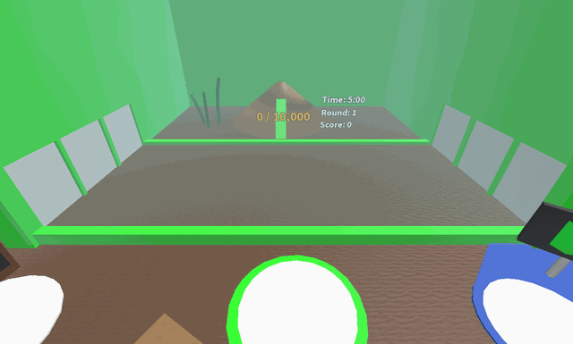

# Ant Challenge

{ align=right width=150 }

The **Ant Challenge** is a challenge found past the [Ant Gate](ant-gate.md), with the objective being to defeat as many ants as possible.

<figure class="mw-halign-center" style="text-align:center"><figcaption>The Ant Challenge arena.</figcaption></figure>

## Accessing and Participating

The player needs 20 [bees](bees.md) in order to pass the Ant Gate and play the Ant Challenge. An [ant pass](ant-pass.md) is also required each time to participate in the challenge. The player can obtain a free [Ant Pass](ant-pass.md) every two hours by using the [Free Ant Pass Dispenser](free-ant-pass-dispenser.md) behind the Ant Gate. If players wish to get more ant passes, they can purchase another one for 10 [Tickets](ticket.md) each at the [Ant Pass Dispenser](ant-pass-dispenser.md). [Panda Bear](panda-bear.md) also gives ant passes in his [quests](quests.md) sometimes.

## Gameplay

Upon entering, the remaining [pollen](pollen.md) in a player's bag is instantly converted. The player has 5 minutes to defeat as many ants as they can. The timer on the right side of the anthill shows the time remaining for the challenge. The ants come in waves, starting with level 1 and 2 ants, and they increase in level with each wave. Each wave launches an assortment of ants that contain Regular Ants, [Fire Ants](fire-ant.md), [Army Ants](army-ant.md), and/or [Flying Ants](flying-ant.md). Every 5th wave always contains a [Giant Ant](giant-ant.md), with the exception of every 40th wave, which contains 2 giant ants. Each ant defeated grants 1 point.

To progress, fill the meter on the anthill by gathering pollen. The amount of pollen needed to progress to the next wave starts at 4,000 and increases by at least 2,000 more than the previous requirement for each wave.

Upon reaching wave 8, the white doors on the sides will start flashing red. This indicates that a lawnmower is about to come out and pass through the lane the door directs to. Move away from the targeted lane to avoid getting damaged. Getting hit by a lawnmower deals 50 base damage.

Lawnmowers will move faster and appear more frequently as the challenge progresses, with multiple lawnmowers running simultaneously possible near the end of the challenge.

The challenge ends upon the player's death, leaving the challenge, or when the 5 minutes are up, whichever happens first. While having the [Haste+](buffs-debuffs.md#From_Areas) buff, if the player walks up the ant hill, the player may leave the challenge. This is a common glitch.

## Rewards

*See also: [Ant Amulet](ant-amulet.md)*

After the challenge ends, a message box pops out on the player's screen presenting the rewards.

<table class="article-table">
<tbody><tr>
<th>Guaranteed Rewards List
</th></tr>
<tr>
<td> <a href="ant-amulet.html">Ant Amulet</a> 

<a href="royal-jelly.html">Royal Jellies</a> 
<a href="honey.html">Honey</a>

</td></tr></tbody></table>

<table class="article-table">
<tbody><tr>
<th>One of the rewards from this list
</th></tr>
<tr>
<td><a href="treat.html">Treats</a> 

<a href="sunflower-seed.html">Sunflower Seeds</a> 
<a href="strawberry.html">Strawberries</a> 
<a href="blueberry.html">Blueberries</a> 
<a href="pineapple.html">Pineapples</a> 
<a href="neonberry.html">Neonberries</a> 
<a href="jelly-beans.html">Jelly Beans</a> 
<a href="robo-pass.html">Robo Pass</a> 
<a href="bandage.html">Bandage</a> 
<a href="bottle-cap.html">Bottle Cap</a> 
<a href="candy-ring.html">Candy Ring</a> 
<a href="camphor-lip-balm.html">Camphor Lip Balm</a> 
<a href="poinsettia.html">Poinsettia</a>(Only During Beesmas) 
<a href="sticker.html#Sticker_Index">Left Facing Ant Sticker</a>(Very Rare)  
<a href="sticker.html#Sticker_Index">Ant Field Stamp Sticker</a>(Unfathomably Rare) 
<a href="sticker.html#Sticker_Index">x2 Convert Speed Voucher</a>(Nearly Impossible)

</td></tr></tbody></table>

The rewards increase in quality and quantity relative to the player's score. A higher score will also give players higher-tier Ant Amulets:

<table class="sortable article-table">
<tbody><tr>
<th>Requirements
</th>
<th>Amulet
</th></tr>
<tr>
<td>0-24 Points
</td>
<td> Bronze Ant Amulet
</td></tr>
<tr>
<td>25-49 Points
</td>
<td> Silver Ant Amulet
</td></tr>
<tr>
<td>50-99 Points
</td>
<td> Gold Ant Amulet
</td></tr>
<tr>
<td>100-149 Points
</td>
<td> Diamond Ant Amulet
</td></tr>
<tr>
<td>150+ Points
</td>
<td> Supreme Ant Amulet
</td></tr></tbody></table>

If the player already has an existing Ant Amulet, they may choose to keep their old one or replace it with the new one, depending on which one has better/more favorable buffs.

## Tips

* Try to collect as many tokens ([Haste](ability-tokens.md#Haste), [Baby Love](ability-tokens.md#Baby_Love), [Bear Morph](ability-tokens.md#Bear_Morph), etc.) as possible before participating in the challenge.
* Rage tokens can be used to take out ants faster, as they increase [Bee Attack](system-page.md#Bee_Attack).
  * Certain [mutations](mutation.md) on [bees](bees.md) that increase attack will also help in defeating ants faster.
* Higher [level](bond.md) bees will be able to make the later waves easier to get through. Bees with higher attack and/or speed will also prove to be more effective than those with lower attack and/or speed.
* A high-level [Vicious Bee](vicious-bee.md) is vital, as the spikes from its ability, [Impale](ability-tokens.md#Impale), can deal significant damage to multiple ants. In addition, wait to activate the ability when many ants are in the arena to maximize it effectively.
* A [Gifted](gifted-bee.md) [Stubborn Bee](stubborn-bee.md) can help in this case as it increases the lifespan of ability tokens, giving the player more time to spawn ants before activating abilities.
* [Windy Bee's](windy-bee.md) [Tornado](ability-tokens.md#Tornado) can be even more effective than Impale in the Ant Challenge. Not only does it collect pollen, but it also deals massive area damage (which cannot miss) and collects tokens. However, haste stacks and powerful [sprinklers](sprinklers.md) are required to maximize their potential.
* [Honey](honey.md) tokens can be used to fill the progress meter on the anthill, so the player may consider using [Honey Bees](honey-bee.md) or [Diamond Bees](diamond-bee.md) to spawn [Honey Gift](ability-tokens.md#Honey_Gift) tokens, or using a [Festive Bee](festive-bee.md) to collect honey tokens from [Festive Gifts](ability-tokens.md#Festive_Gift).
* Having [amulets](amulet.md) that boost bee attack damage, a [Gifted](gifted-bee.md) [Brave Bee](brave-bee.md), and a Gifted [Rage Bee](rage-bee.md) makes it easier to defeat ants.
* The [Fire Mask](fire-mask.md) and [Demon Mask](demon-mask.md) will boost attack and add [Flame-generating passives](passive-abilities.md#Gathering_Flames). Well placed Flames will grant Flame Heat, collect pollen, and do damage to nearby ants.
* Using [Stingers](stinger.md) will boost attack for a short time, which helps clear ants faster and deal with higher-level ants. The player can also use [Red Extracts](red-extract.md)Red and [Blue Extracts](blue-extract.md), [Oils](oil.md), [Glues](glue.md), [Tropical Drinks](tropical-drink.md), and [Gumdrops](gumdrops.md). This will help with honey production and boost bee capabilities but isn't necessary to get a good score.
* [Coconuts](coconut.md) can prove to be an unpredictable but powerful tool to take out clusters of ants. [Coconuts](coconut.md) can deal incredible amounts of damage, are capable of damaging high-level ants, and collect decent amounts of pollen.
  * If the player has [Coconut Clogs](coconut-clogs.md), catching coconuts will also grant [Coconut Haste](passive-abilities.md#Coconut_Haste), which temporarily makes the player and their bees faster. This can be useful to escape dangerous areas.
* To maximize the score, defeat as many ants as possible in the first three minutes, as later waves get more difficult and the lawnmowers appear more frequently and move faster.
* Tools are the best way to fill up the honey meter, this because your bees will be attacking and won't be able to collect pollen.
* If there is too many ants and the bees can't deal with them, the player shouldn't use their Tool because it will fill up the honey meter (if in the field) and summon more ants.
* Since the player has 100% [Instant Conversion](instant-conversion.md) in the Ant Challenge, don't try to go after tokens from [Coin Scatter](passive-abilities.md#Coin_Scatter) or coconuts, since they won't have much value, as they have nothing to convert from, making them virtually useless.
* Sprinklers can be useful for regenerating flowers and making pollen collection easier, especially when ants and lawnmowers cut the player off from certain areas of the field.
* During any beesmas, try to play the ant challenge with the Honeyday Buff, this will increase how fast the meter fills
* Using the [Glider](glider.md) can help as the player can glide over ants and fire trails, escaping from certain situations.
* Zoom out all the way to see where all the ants are and where lawnmowers may be coming from.
* When new ants spawn, it is a good idea to go as far away from the ant hill as possible, to avoid being hit by an incoming ant.
* [Star Saw](passive-abilities.md#Star_Saw), a [Supreme Star Amulet](star-amulet.md) passive, is very effective at defeating ants and collecting pollen.
* Standing near the side of the field where the lawnmowers come out can make the lawnmowers easier to avoid.
* The player use the small gap between the field and the wall to avoid running over fire trails, though lawnmowers and ants can still damage the player.
* If a [Honeystorm](honeystorm.md) is summoned during the challenge, it is a good idea to go after the honey tokens in earlier waves or when there aren't too many ants since the honey tokens collected can contribute significantly to the honey meter when a large number of tokens are collected.
* While the [Coconut Canister](coconut-canister.md)’s ability, Emergency Coconut Shield, is active, getting hit by the lawnmowers will heal the player instead of damaging them.
* Wear the Gummy Mask and intentionally activate [Gummy Morph](passive-abilities.md#Gummy_Morph) during harder stages of the challenge, as this grants +300 attack to Gummy Bee.
* Intentionally activate the Emergency Coconut Shield 2–4 minutes before starting the challenge to avoid wasting it in early levels.
* Though the ants spawned during the challenge are random, it is possible to predict what ants might spawn. During the first 15 rounds, flying ants are generally more common than army ants. After 15 rounds, army ants become much more common. Giants ants spawn every 5 waves, and always come with either fire ants or regular ants. This information can be helpful when dealing with quests that require defeating specific types of ants.
* Having **Lua error in Module:Item\_image at line 88: Template error! There's no such file named File:Invigorating Nectar.png for Template:I.**[Invigorating Nectar](nectar.md) can help buff bee attack.

## Music

## Trivia

* If a player uses a [Whirligig](whirligig.md) during an Ant Challenge, it used to teleport the player to the starting platform after teleporting to the hive, thus ending the challenge and granting an amulet with the score the player left with.
  * During an unknown update, this was fixed to teleport the player to the center of the [field](ant-field.md).
  * However, during a later unknown update, the player is instead teleported back to their hive, which teleports them back to the challenge platform and ends the challenge.
* Despite being lawnmowers, they actually do not affect any of the flowers when they pass through.
* Prior to the 2018-11-25 update, the Ant Challenge can only hold up to 20 ants at once.[1]
* Since the Egg Hunt 2019 update, the player can get [Jelly Beans](jelly-beans.md) as a reward from the Ant Challenge.
* If the player uses jelly beans while inside or right outside the Ant Challenge, no jelly bean tokens will appear.

  

* Upon entering the arena, the player's bag will instantly be converted, and the player will gain a boost of +100% [Instant Conversion](instant-conversion.md). The boost is represented by the [Ant Pass](ant-pass.md) icon.
  * There used to be a visual glitch that when leaving the ant challenge, the player would still have this buff. It was only a visual glitch, so the player did not actually have a +100% Instant Conversion boost active.
  * Before the 2018-11-25 update, a Haste token with an expired timer would represent the boost is now represented as the [Ant Pass](ant-pass.md) icon.
* There is an ant pass token hidden behind the Ant Challenge area. To get it, go behind the [leaderboard](all-time-top-ant-exterminators.md) and follow the hallway around the corner. This also leads to the [Gummy Bee Claimer](gummy-bee-egg-claim.md).
* If the player has equipped their tool and dies right when the Ant Challenge is about to end, they will respawn without their pollen collector equipped. However, the character's arm will be positioned to look like it's actually holding it.
* There used to be a bug where the pollen meter displayed the cumulative total instead of the total required to reach the next wave. This was fixed in the 2018-09-10 update.
* Players are able to glitch into the [Ant Field](ant-field.md) without triggering the actual challenge. This can only be achieved by having a slow internet connection or [bear morph](ability-tokens.md#Bear_Morph) and/or [Haste+](buffs-debuffs.md#From_Areas).
* If the player leaves their sprinkler(s) in the field and the challenge ends without the player dying, the sprinklers remain in the field.
* If a player glitches inside and then someone starts it, then the player who glitched in will be kicked out.
* There is a rare glitch where an Ant or a Fire Ant can get stuck on the wall where the lawnmowers come from.
* There was a glitch prior to February 2022, where sometimes, when the player starts the challenge, they won't actually be teleported inside, forfeiting the challenge instantly.
* Giant Ants will give the player's bees 3 bond, being the least efficient way to level up bees.
* It is only possible to go through 100 waves of the challenge. This is because it takes about three seconds to progress to the next wave and there is a total time limit of 5 minutes (300 seconds). 300 seconds divided by 3 seconds per wave would be 100 waves.
* If the player manages to somehow glitch out of the Ant Challenge, the player will be teleported back to the center of the field. However, if you do this repeatedly, eventually the challenge will end and a message will pop up saying "Ant Challenge ended because you left."

## References

1. ↑ [[1]](https://discord.com/channels/427553293862961153/427573109600550919/492424387262152726) Discord message from Onett.

<table class="mw-collapsible mw-collapsed NavTable">
<tbody><tr>
<th class="NavTitle" colspan="2">Locations
</th></tr>
<tr>
<th class="NavCategory"><a href="fields.html">Fields</a>
</th>
<td class="NavLinks NavLinksBasicOdd"><b><a href="sunflower-field.html">Sunflower Field</a> • <a href="dandelion-field.html">Dandelion Field</a> • <a href="mushroom-field.html">Mushroom Field</a> • <a href="blue-flower-field.html">Blue Flower Field</a> • <a href="clover-field.html">Clover Field</a> • <a href="spider-field.html">Spider Field</a> • <a href="bamboo-field.html">Bamboo Field</a> • <a href="strawberry-field.html">Strawberry Field</a> • <a href="pineapple-patch.html">Pineapple Patch</a> • <a href="stump-field.html">Stump Field</a> • <a href="cactus-field.html">Cactus Field</a> • <a href="pumpkin-patch.html">Pumpkin Patch</a> • <a href="pine-tree-forest.html">Pine Tree Forest</a> • <a href="rose-field.html">Rose Field</a> • <a href="ant-field.html">Ant Field</a> • <a href="hub-field.html">Hub Field</a> • <a href="mountain-top-field.html">Mountain Top Field</a> • <a href="coconut-field.html">Coconut Field</a> • <a href="pepper-patch.html">Pepper Patch</a></b>
</td></tr>
<tr>
<th class="NavCategory"><a href="shops.html">Shops</a>
</th>
<td class="NavLinks NavLinksBasicEven"><b><a href="basic-egg-shop.html">Basic Egg Shop</a> • <a href="boost-market.html">Boost Market</a> • <a href="treat-shop.html">Treat Shop</a> • <a href="gumdrop-shop.html">Gumdrop Shop</a> • <a href="royal-jelly-shop.html">Royal Jelly Shop</a> • <a href="ticket-shop.html">Ticket Shop</a> • <a href="noob-shop.html">Noob Shop</a> • <a href="pro-shop.html">Pro Shop</a> • <a href="magic-bean-shop.html">Magic Bean Shop</a> • <a href="badge-bearer-s-guild.html">Badge Bearer's Guild</a> • <a href="dapper-bear-s-shop.html">Dapper Bear's Shop</a> • <a href="stinger-shop.html">Stinger Shop</a> • <a href="mountain-top-shop.html">Mountain Top Shop</a> • <a href="blue-hq.html">Blue HQ</a> • <a href="red-hq.html">Red HQ</a> • <a href="hub-field-shop.html">Hub Field Shop</a> • <a href="robo-bear-s-shop.html">Robo Bear's Shop</a> • <a href="petal-shop.html">Petal Shop</a> • <a href="coconut-cave.html">Coconut Cave</a> • <a href="ticket-tent.html">Ticket Tent</a> • <a href="robux-shop.html">Robux Shop</a></b>
</td></tr>
<tr>
<th class="NavCategory">Gates
</th>
<td class="NavLinks NavLinksBasicOdd"><b><a href="basic-bee-gate.html">Basic Bee Gate</a> • <a href="brave-bee-gate.html">Brave Bee Gate</a> • <a href="honey-bee-gate.html">Honey Bee Gate</a> • <a href="ant-gate.html">Ant Gate</a> • <a href="lion-bee-gate.html">Lion Bee Gate</a> • <a href="bear-gate.html">Bear Gate</a> • <a href="windy-bee-gate.html">Windy Bee Gate</a></b>
</td></tr>
<tr>
<th class="NavCategory">Machines
</th>
<td class="NavLinks NavLinksBasicEven"><b><a href="honey-dispenser.html">Honey Dispenser</a> • <a href="royal-jelly-dispenser.html">Royal Jelly Dispenser</a> • <a href="treat-dispenser.html">Treat Dispenser</a> • <a href="instant-converter.html">Instant Converter</a> • <a href="wealth-clock.html">Wealth Clock</a> • <a href="moon-amulet-generator.html">Moon Amulet Generator</a> • <a href="memory-match.html">Memory Match</a> • <a href="blue-field-booster.html">Blue Field Booster</a> • <a href="red-field-booster.html">Red Field Booster</a> • <a href="field-booster.html">Field Booster</a> • <a href="blueberry-dispenser.html">Blueberry Dispenser</a> • <a href="strawberry-dispenser.html">Strawberry Dispenser</a> • <a href="blue-extract-dispenser.html">Blue Extract Dispenser</a> • <a href="red-extract-dispenser.html">Red Extract Dispenser</a> • <a href="honeystorm.html">Honeystorm</a> • <a href="special-sprout-summoner.html">Special Sprout Summoner</a> • <a href="free-ant-pass-dispenser.html">Free Ant Pass Dispenser</a> • <a href="ant-pass-dispenser.html">Ant Pass Dispenser</a> • <a href="glue-dispenser.html">Glue Dispenser</a> • <a href="blender.html">Blender</a> • <a href="coconut-dispenser.html">Coconut Dispenser</a> • <a href="mythic-meteor-shower.html">Mythic Meteor Shower</a> • <a href="free-robo-pass-dispenser.html">Free Robo Pass Dispenser</a> • <a href="robo-pass-dispenser.html">Robo Pass Dispenser</a> • <a href="sticker-stack.html">Sticker Stack</a> • <a href="sticker-printer.html">Sticker Printer</a> • <a href="nectar-condenser.html">Nectar Condenser</a></b>
</td></tr>
<tr>
<th class="NavCategory">Transportation
</th>
<td class="NavLinks NavLinksBasicOdd"><b><a href="slingshot.html">Slingshot</a> • <a href="yellow-cannon.html">Yellow Cannon</a> • <a href="blue-cannon.html">Blue Cannon</a> • <a href="red-cannon.html">Red Cannon</a> • <a href="blue-teleporter.html">Blue Teleporter</a> • <a href="red-teleporter.html">Red Teleporter</a></b>
</td></tr>
<tr>
<th class="NavCategory"><a href="leaderboards.html">Leaderboards</a>
</th>
<td class="NavLinks NavLinksBasicEven"><b><a href="daily-top-honeymakers.html">Daily Top Honeymakers</a> • <a href="all-time-top-honeymakers.html">All-Time Top Honeymakers</a> • <a href="all-time-top-battlers-most-battle-points.html">All-Time Top Battlers</a> • Top Ant Exterminators • Fastest Crab Slayers • Top Stick Bug Fighters • Top Bucko Bee Helpers • Top Riley Bee Helpers • <a href="most-commando-captures.html">Most Commando Captures</a> • Top Brown Bear Helpers • All-Time Top Red Collectors • All-Time Top Blue Collectors • All-Time Top White Collectors • Daily Top Red Collectors • Daily Top Blue Collectors • Daily Top White Collectors • Highest Damage to a Single Puffshroom • Tallest Sticker Stack • Highest Robo Bear Challenge Scores • <a href="highest-snowbear-level.html">Highest Snowbear Level</a> • <a href="highest-robo-party-cake-rank.html">Highest Robo Party Cake Rank</a></b>
</td></tr>
<tr>
<th class="NavCategory">Other Places
</th>
<td class="NavLinks NavLinksBasicOdd"><b><a href="hive.html">Hive</a> • <a href="obstacle-courses.html">Obstacle Courses</a> • King Beetle Lair • <a href="white-tunnel.html">White Tunnel</a> • <a href="werewolf-s-cave.html">Werewolf's Cave</a> • <strong class="mw-selflink selflink">Ant Challenge</strong> • <a href="star-hall.html">Star Hall</a> • <a href="gummy-bear-s-lair.html">Gummy Bear's Lair</a> • <a href="ant-challenge-info.html">Ant Challenge Info</a> • <a href="vicious-bee-egg-claim.html">Vicious Bee Claimer</a> • <a href="gummy-bee-egg-claim.html">Gummy Bee Claimer</a> • <a href="wind-shrine.html">Wind Shrine</a> • <a href="mazes.html">Mazes</a> • <a href="hive-hub.html">Hive Hub</a> • <a href="sticker-seeker-quest-machine.html">Sticker-Seeker Quest Machine</a></b>
</td></tr>
<tr>
<th class="NavCategory">Event Locations
</th>
<td class="NavLinks NavLinksBasicEven"><b><a href="beesmas-tree.html">Beesmas Tree</a> • Computer • <a href="gift-boxes.html">Gift Boxes</a> • <a href="honey-wreath.html">Honey Wreath</a> • <a href="stockings.html">Stockings</a> • <a href="gingerbread-house.html">Gingerbread House</a> • <a href="snowbear-summoner.html">Snowbear Summoner</a> • <a href="beesmas-lights.html">Beesmas Lights</a> • <a href="samovar.html">Samovar</a> • <a href="beesmas-feast.html">Beesmas Feast</a> • <a href="onett-s-lid-art.html">Onett's Lid Art</a> • <a href="wind-shrine.html#Galentine_Shrine">Galentine Shrine</a> • <a href="memory-match.html#Winter_Memory_Match">Winter Memory Match</a> • <a href="snow-machine.html">Snow Machine</a> • <a href="honeyday-candles.html">Honeyday Candles</a> • <a href="robo-party-cake.html">Robo Party Cake</a> • <a href="gummy-beacon.html">Gummy Beacon</a> • <a href="naughty-list.html">Naughty List</a></b>
</td></tr></tbody></table>
