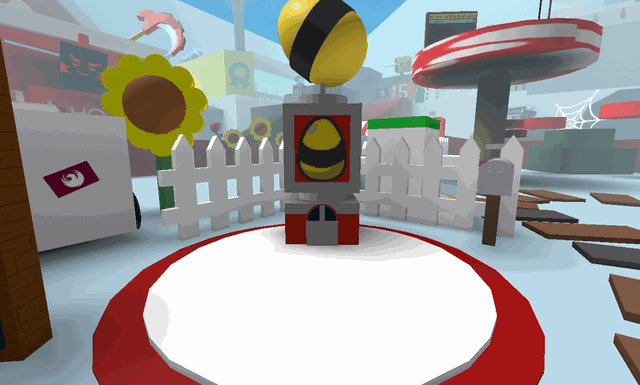

# Basic Egg Shop

<aside class="portable-infobox pi-background pi-border-color pi-theme-wikia pi-layout-stacked" role="region">
<h2 class="pi-item pi-item-spacing pi-title pi-secondary-background" data-source="title">Basic Egg Shop</h2>
<figure class="pi-item pi-image pi-photo"></figure>
<section class="pi-item pi-group pi-border-color">
<h2 class="pi-item pi-header pi-secondary-font pi-item-spacing pi-secondary-background">Information</h2>
<div class="pi-item pi-data pi-item-spacing pi-border-color" data-source="usage">
<h3 class="pi-data-label pi-secondary-font">Usage</h3>
<div class="pi-data-value pi-font">Obtaining <a href="hive-slot.html">Hive Slots</a> through <a href="egg.html#Basic_Egg"><span class="color-template color-template-basic-egg color-template-background-clip">Basic Eggs</span></a></div>
</div>
<div class="pi-item pi-data pi-item-spacing pi-border-color" data-source="requirement">
<h3 class="pi-data-label pi-secondary-font">Requirement(s)</h3>
<div class="pi-data-value pi-font"><a href="honey.html"><span class="color-template color-template-honey">Honey</span></a> (varies)</div>
</div>
<div class="pi-item pi-data pi-item-spacing pi-border-color" data-source="cooldown">
<h3 class="pi-data-label pi-secondary-font">Cooldown</h3>
<div class="pi-data-value pi-font">None</div>
</div>
<div class="pi-item pi-data pi-item-spacing pi-border-color" data-source="location">
<h3 class="pi-data-label pi-secondary-font">Location</h3>
<div class="pi-data-value pi-font">Between the <a href="sunflower-field.html">Sunflower Field</a> and the <a href="dandelion-field.html">Dandelion Field</a></div>
</div>
</section>
</aside>

The **Basic Egg Shop** is a [shop](shops.md) located next to the [Sunflower Field](sunflower-field.md) and behind an [Instant Converter](instant-converter.md). It sells [Basic Eggs](egg.md#Basic_Egg) for increasing amounts of [honey](honey.md).

The cost begins at 1,000 honey and increases exponentially (see Formula section below), eventually capping off at 10,000,000 honey for the 22nd egg and beyond.

<figure class="mw-halign-right" typeof="mw:Error mw:File"><figcaption>A chart for the eggs' price.</figcaption></figure>

<table class="article-table mw-collapsible mw-collapsed">
<tbody><tr>
<th><a href="egg.html#Basic_Egg"><span class="color-template color-template-basic-egg color-template-background-clip">Basic Eggs</span></a>
</th>
<th><a href="honey.html"><span class="color-template color-template-honey">Honey</span></a>
</th></tr>
<tr>
<td>1
</td>
<td>1,000
</td></tr>
<tr>
<td>2
</td>
<td>2,500
</td></tr>
<tr>
<td>3
</td>
<td>4,250
</td></tr>
<tr>
<td>4
</td>
<td>6,708
</td></tr>
<tr>
<td>5
</td>
<td>10,313
</td></tr>
<tr>
<td>6
</td>
<td>15,669
</td></tr>
<tr>
<td>7
</td>
<td>23,670
</td></tr>
<tr>
<td>8
</td>
<td>35,648
</td></tr>
<tr>
<td>9
</td>
<td>53,596
</td></tr>
<tr>
<td>10
</td>
<td>80,506
</td></tr>
<tr>
<td>11
</td>
<td>120,858
</td></tr>
<tr>
<td>12
</td>
<td>181,378
</td></tr>
<tr>
<td>13
</td>
<td>272,151
</td></tr>
<tr>
<td>14
</td>
<td>408,304
</td></tr>
<tr>
<td>15
</td>
<td>612,527
</td></tr>
<tr>
<td>16
</td>
<td>918,857
</td></tr>
<tr>
<td>17
</td>
<td>1,378,348
</td></tr>
<tr>
<td>18
</td>
<td>2,067,580
</td></tr>
<tr>
<td>19
</td>
<td>3,101,426
</td></tr>
<tr>
<td>20
</td>
<td>4,652,191
</td></tr>
<tr>
<td>21
</td>
<td>6,978,337
</td></tr>
<tr>
<td>22+
</td>
<td>10,000,000
</td></tr></tbody></table>

## Formula

The cost of egg number N is calculated as follows:

```
base = 1000
cost = base
i = 0
while i < N-1 do
    cost = 1.5*cost + base/(i+1)
    i = i + 1
end
```

This comes out roughly exponential, but there isn't a "nice neat numbers" exponential formula.

```
Base = 1000
t = Base
i = 0
NN = 21
For [i=0; t= Base, i < NN, i++, t=1.5*t+Base/(i+1);{Print[Floor[t+0.5]]}]
```

This does not work for Term 22, as the price caps out at 10,000,000 honey.

## Trivia

* The Basic Egg Shop and stacking the [Round Basic Bee sticker](sticker.md#Stickers) are the only ways to obtain a [Basic Egg](egg.md#Basic_Egg), other than the one given to the player at the start of the game.
* Just like the other machine lookalikes, the model of the machine is a modified version of the [Gumball Machine](https://create.roblox.com/store/asset/126202248/Gumball-Machine) model by @wonderful72pike.

<table class="mw-collapsible mw-collapsed NavTable">
<tbody><tr>
<th class="NavTitle" colspan="2">Locations
</th></tr>
<tr>
<th class="NavCategory"><a href="fields.html">Fields</a>
</th>
<td class="NavLinks NavLinksBasicOdd"><b><a href="sunflower-field.html">Sunflower Field</a> • <a href="dandelion-field.html">Dandelion Field</a> • <a href="mushroom-field.html">Mushroom Field</a> • <a href="blue-flower-field.html">Blue Flower Field</a> • <a href="clover-field.html">Clover Field</a> • <a href="spider-field.html">Spider Field</a> • <a href="bamboo-field.html">Bamboo Field</a> • <a href="strawberry-field.html">Strawberry Field</a> • <a href="pineapple-patch.html">Pineapple Patch</a> • <a href="stump-field.html">Stump Field</a> • <a href="mixed-brick-field.html">Mixed Brick Field</a> • <a href="blue-brick-field.html">Blue Brick Field</a> • <a href="red-brick-field.html">Red Brick Field</a> • <a href="white-brick-field.html">White Brick Field</a> • <a href="cactus-field.html">Cactus Field</a> • <a href="pumpkin-patch.html">Pumpkin Patch</a> • <a href="pine-tree-forest.html">Pine Tree Forest</a> • <a href="rose-field.html">Rose Field</a> • <a href="ant-field.html">Ant Field</a> • <a href="hub-field.html">Hub Field</a> • <a href="mountain-top-field.html">Mountain Top Field</a> • <a href="coconut-field.html">Coconut Field</a> • <a href="pepper-patch.html">Pepper Patch</a></b>
</td></tr>
<tr>
<th class="NavCategory"><a href="shops.html">Shops</a>
</th>
<td class="NavLinks NavLinksBasicEven"><b><strong class="mw-selflink selflink">Basic Egg Shop</strong> • <a href="boost-market.html">Boost Market</a> • <a href="treat-shop.html">Treat Shop</a> • <a href="gumdrop-shop.html">Gumdrop Shop</a> • <a href="royal-jelly-shop.html">Royal Jelly Shop</a> • <a href="ticket-shop.html">Ticket Shop</a> • <a href="noob-shop.html">Noob Shop</a> • <a href="pro-shop.html">Pro Shop</a> • <a href="magic-bean-shop.html">Magic Bean Shop</a> • <a href="badge-bearer-s-guild.html">Badge Bearer's Guild</a> • <a href="dapper-bear-s-shop.html">Dapper Bear's Shop</a> • <a href="stinger-shop.html">Stinger Shop</a> • <a href="mountain-top-shop.html">Mountain Top Shop</a> • <a href="blue-hq.html">Blue HQ</a> • <a href="red-hq.html">Red HQ</a> • <a href="hub-field-shop.html">Hub Field Shop</a> • <a href="robo-bear-s-shop.html">Robo Bear's Shop</a> • <a href="petal-shop.html">Petal Shop</a> • <a href="coconut-cave.html">Coconut Cave</a> • <a href="ticket-tent.html">Ticket Tent</a> • <a href="robux-shop.html">Robux Shop</a></b>
</td></tr>
<tr>
<th class="NavCategory">Gates
</th>
<td class="NavLinks NavLinksBasicOdd"><b><a href="basic-bee-gate.html">Basic Bee Gate</a> • <a href="brave-bee-gate.html">Brave Bee Gate</a> • <a href="honey-bee-gate.html">Honey Bee Gate</a> • <a href="ant-gate.html">Ant Gate</a> • <a href="lion-bee-gate.html">Lion Bee Gate</a> • <a href="bear-gate.html">Bear Gate</a> • <a href="windy-bee-gate.html">Windy Bee Gate</a></b>
</td></tr>
<tr>
<th class="NavCategory">Machines
</th>
<td class="NavLinks NavLinksBasicEven"><b><a href="honey-dispenser.html">Honey Dispenser</a> • <a href="royal-jelly-dispenser.html">Royal Jelly Dispenser</a> • <a href="treat-dispenser.html">Treat Dispenser</a> • <a href="instant-converter.html">Instant Converter</a> • <a href="wealth-clock.html">Wealth Clock</a> • <a href="moon-amulet-generator.html">Moon Amulet Generator</a> • <a href="memory-match.html">Memory Match</a> • <a href="blue-field-booster.html">Blue Field Booster</a> • <a href="red-field-booster.html">Red Field Booster</a> • <a href="field-booster.html">Field Booster</a> • <a href="blueberry-dispenser.html">Blueberry Dispenser</a> • <a href="strawberry-dispenser.html">Strawberry Dispenser</a> • <a href="honeystorm.html">Honeystorm</a> • <a href="special-sprout-summoner.html">Special Sprout Summoner</a> • <a href="free-ant-pass-dispenser.html">Free Ant Pass Dispenser</a> • <a href="ant-pass-dispenser.html">Ant Pass Dispenser</a> • <a href="glue-dispenser.html">Glue Dispenser</a> • <a href="blender.html">Blender</a> • <a href="coconut-dispenser.html">Coconut Dispenser</a> • <a href="mythic-meteor-shower.html">Mythic Meteor Shower</a> • <a href="free-robo-pass-dispenser.html">Free Robo Pass Dispenser</a> • <a href="robo-pass-dispenser.html">Robo Pass Dispenser</a> • <a href="sticker-stack.html">Sticker Stack</a> • <a href="sticker-printer.html">Sticker Printer</a> • <a href="nectar-condenser.html">Nectar Condenser</a></b>
</td></tr>
<tr>
<th class="NavCategory">Transportation
</th>
<td class="NavLinks NavLinksBasicOdd"><b><a href="slingshot.html">Slingshot</a> • <a href="yellow-cannon.html">Yellow Cannon</a> • <a href="blue-cannon.html">Blue Cannon</a> • <a href="red-cannon.html">Red Cannon</a> • <a href="blue-teleporter.html">Blue Teleporter</a> • <a href="red-teleporter.html">Red Teleporter</a></b>
</td></tr>
<tr>
<th class="NavCategory"><a href="leaderboards.html">Leaderboards</a>
</th>
<td class="NavLinks NavLinksBasicEven"><b><a href="daily-top-honeymakers.html">Daily Top Honeymakers</a> • <a href="all-time-top-honeymakers.html">All-Time Top Honeymakers</a> • <a href="all-time-top-battlers-most-battle-points.html">All-Time Top Battlers</a> • Top Ant Exterminators • Fastest Crab Slayers • Top Stick Bug Fighters • Top Bucko Bee Helpers • Top Riley Bee Helpers • <a href="most-commando-captures.html">Most Commando Captures</a> • Top Brown Bear Helpers • All-Time Top Red Collectors • All-Time Top Blue Collectors • All-Time Top White Collectors • Daily Top Red Collectors • Daily Top Blue Collectors • Daily Top White Collectors • Highest Damage to a Single Puffshroom • Tallest Sticker Stack • Highest Robo Bear Challenge Scores • <a href="highest-snowbear-level.html">Highest Snowbear Level</a> • <a href="highest-robo-party-cake-rank.html">Highest Robo Party Cake Rank</a></b>
</td></tr>
<tr>
<th class="NavCategory">Other<br/>Places
</th>
<td class="NavLinks NavLinksBasicOdd"><b><a href="hive.html">Hive</a> • <a href="obstacle-courses.html">Obstacle Courses</a> • King Beetle Lair • <a href="white-tunnel.html">White Tunnel</a> • <a href="werewolf-s-cave.html">Werewolf's Cave</a> • <a href="ant-challenge.html">Ant Challenge</a> • <a href="star-hall.html">Star Hall</a> • <a href="gummy-bear-s-lair.html">Gummy Bear's Lair</a> • <a href="ant-challenge-info.html">Ant Challenge Info</a> • <a href="vicious-bee-egg-claim.html">Vicious Bee Egg Claim</a> • <a href="gummy-bee-egg-claim.html">Gummy Bee Egg Claim</a> • <a href="wind-shrine.html">Wind Shrine</a> • <a href="mazes.html">Mazes</a> • <a href="hive-hub.html">Hive Hub</a> • <a href="sticker-seeker-quest-machine.html">Sticker-Seeker Quest Machine</a></b>
</td></tr>
<tr>
<th class="NavCategory">Event<br/>Locations
</th>
<td class="NavLinks NavLinksBasicEven"><b><a href="beesmas-tree.html">Beesmas Tree</a> • <span class="new" data-uncrawlable-url="L3dpa2kvQ29tcHV0ZXI/YWN0aW9uPWVkaXQmcmVkbGluaz0x" title="Computer (page does not exist)">Computer</span> • <a href="gift-boxes.html">Gift Boxes</a> • <a href="honey-wreath.html">Honey Wreath</a> • <a href="stockings.html">Stockings</a> • <a href="gingerbread-house.html">Gingerbread House</a> • <a href="snowbear-summoner.html">Snowbear Summoner</a> • <a href="beesmas-lights.html">Beesmas Lights</a> • <a href="samovar.html">Samovar</a> • <a href="beesmas-feast.html">Beesmas Feast</a> • <a href="onett-s-lid-art.html">Onett's Lid Art</a> • <a href="wind-shrine.html#Galentine_Shrine">Galentine Shrine</a> • <a href="memory-match.html#Winter_Memory_Match">Winter Memory Match</a> • <a href="snow-machine.html">Snow Machine</a> • <a href="honeyday-candles.html">Honeyday Candles</a> • <a href="robo-party-cake.html">Robo Party Cake</a> • <a href="gummy-beacon.html">Gummy Beacon</a> • <a href="naughty-list.html">Naughty List</a></b>
</td></tr></tbody></table>

