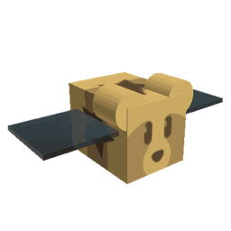
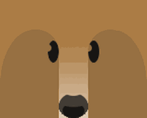

# Bear Bee

Bear Bee

<input type="radio" name="bee-infobox-tab" id="bee-tab-original" checked>
<label for="bee-tab-original">Original</label>
<input type="radio" name="bee-infobox-tab" id="bee-tab-gifted">
<label for="bee-tab-gifted">Gifted</label>

<i>"A friendly bee who periodically transforms you into a bear!"</i>

<b>Rarity</b>Event

<b>Color</b>Colorless

<b>Energy</b>35

<b>Speed</b>14

<b>Attack</b>5

Color Scheme

<b>Skin</b><code>#a05f41</code><code>#232313</code><code>#a05f41</code>

*This article is about the bee called the "Bear Bee." For the Bear NPC of a similar name, see "[Bee Bear](bee-bear.md)."*

**Bear Bee** is a Colorless [Event bee](bees-event.md). You can get this bee by redeeming a [Bear Bee Voucher](sticker.md#Sticker_Index), which can be obtained by purchasing in the [Robux Shop](robux-shop.md) for 800 Robux, from trading, as an incredibly rare drop from [Tunnel Bear](tunnel-bear.md) and very rarely from the [Retro Swarm Challenge](retro-swarm-challenge.md).

Similar to all other Event bees, this bee does not have a favorite treat, and can only become [gifted](gifted-bee.md) if the player bought it during its release, by feeding it a [Star Treat](star-treat.md), [Gingerbread Bears](gingerbread-bear.md) or [Aged Gingerbread Bears](aged-gingerbread-bear.md).

Bear Bee likes the [Pumpkin Patch](pumpkin-patch.md) and the [Pine Tree Forest](pine-tree-forest.md). It dislikes the [Blue Flower Field](blue-flower-field.md).

## Stats

* Collects 15 [Pollen](pollen.md) in 2 seconds.
* Makes 200 [Honey](honey.md) in 2 seconds.
* +75% [Energy](energy.md), +50% gather and convert speed, +5 [Gather Amount](stats.md#Gather_Amount), +120 [Convert Amount](system-page.md#Convert_Amount), +4 [Attack](stats.md#Attack).
* 🌟 [Gifted Hive Bonus](gifted-bee.md): +10% [Pollen](system-page.md#Pollen).

### Abilities

*  **[Bear Morph](ability-tokens.md#Bear_Morph)** Transforms you into a random bear! Grants ×2 Pollen and boosts [Speed](system-page.md#Movespeed) and [Jump Power](system-page.md#Jump_Power). If Gifted, has a 20% chance to transform the player into a rare bear that gives special boosts (either [Mother Bear](mother-bear.md), which gives x2.5 Pollen and an additional x1.5 [Pollen from Bee Gathering](system-page.md#Bee_Gather_Pollen) or [Science Bear](science-bear.md), which adds +1 Conversion Link).

<table style="font-size:1.5vh; color:#000; width:100%; background:#fff; padding: 15px 0; border:none; color:#000; border-left:15px #000 solid">
<tbody><tr>
<td style="width:100%; text-align:center">

Bear Bee has a base pollen collection of <b>15 </b> in <b>2 seconds</b>. 

That's equivalent to 7.5  per second. 

(<b>30 </b> in <b>2 seconds</b> with x2 Bee Pollen gamepass)

</td></tr></tbody></table>

<table align="center" class="wikitable" style="text-align:center; width:80%;">
<tbody><tr>
<th colspan="5"> Pollen Collection
</th></tr>
<tr>
<td rowspan="2">Flower Tier
</td><td colspan="1" rowspan="2">Bee Pollen
</td><td colspan="2">with Critical Hit
</td></tr>
<tr>
<td>without Melody
</td><td>with Melody
</td></tr>
<tr>
<td>Single
</td><td>15
</td><td>30
</td><td>45
</td></tr>
<tr>
<td>Double
</td><td>30
</td><td>60
</td><td>90
</td></tr>
<tr>
<td>Triple
</td><td>45
</td><td>90
</td><td>135
</td></tr>
<tr>
<td>Large
</td><td>60
</td><td>120
</td><td>180
</td></tr>
<tr>
<td>Star
</td><td>75
</td><td>150
</td><td>225
</td></tr>
</tbody></table>

<table style="font-size:1.5vh; color:#000; width:100%; background:linear-gradient(to left, #FFB75E, #ED8F03); padding: 15px 0; border:none; color:#fff; border-left:15px #fff solid">
<tbody><tr>
<td style="width:100%; text-align:center">

Bear Bee can make <b>200 </b> in <b>2 seconds</b>!

That's equivalent to <b>100  per second</b>.

(<b>200  in 1 second</b> with x2 Honeymaking Speed)

</td></tr>
</tbody></table>

<table align="center" class="wikitable" style="text-align:center; width:75%">
<tbody><tr>
<th>Honey Collection with Science Enhancement
</th></tr>
<tr>
<td>
<h3>Levels 1-8</h3><table align="center" class="wikitable" style="text-align:center;">
<tbody><tr>
<th><i>Science Enhancement</i>
</th><th>Production Rate
</th><th>Number of Produced Honey
</th></tr>
<tr>
<td>1
</td><td>25%
</td><td>250
</td></tr>
<tr>
<td>2
</td><td>50%
</td><td>300
</td></tr>
<tr>
<td>3
</td><td>75%
</td><td>350
</td></tr>
<tr>
<td>4
</td><td>100%
</td><td>400
</td></tr>
<tr>
<td>5
</td><td>125%
</td><td>450
</td></tr>
<tr>
<td>6
</td><td>150%
</td><td>500
</td></tr>
<tr>
<td>7
</td><td>175%
</td><td>550
</td></tr>
<tr>
<td>8
</td><td>200%
</td><td>600
</td></tr>
</tbody></table><h3>Levels 9-16</h3><table align="center" class="wikitable" style="text-align:center;">
<tbody><tr>
<th><i>Science Enhancement</i>
</th><th>Production Rate
</th><th>Number of Produced Honey
</th></tr>
<tr>
<td>9
</td><td>225%
</td><td>650
</td></tr>
<tr>
<td>10
</td><td>250%
</td><td>700
</td></tr>
<tr>
<td>11
</td><td>275%
</td><td>750
</td></tr>
<tr>
<td>12
</td><td>300%
</td><td>800
</td></tr>
<tr>
<td>13
</td><td>325%
</td><td>850
</td></tr>
<tr>
<td>14
</td><td>350%
</td><td>900
</td></tr>
<tr>
<td>15
</td><td>375%
</td><td>950
</td></tr>
<tr>
<td>16
</td><td>400%
</td><td>1000
</td></tr>
</tbody></table><h3>Levels 17-24</h3><table align="center" class="wikitable" style="text-align:center;">
<tbody><tr>
<th><i>Science Enhancement</i>
</th><th>Production Rate
</th><th>Number of Produced Honey
</th></tr>
<tr>
<td>17
</td><td>425%
</td><td>1050
</td></tr>
<tr>
<td>18
</td><td>450%
</td><td>1100
</td></tr>
<tr>
<td>19
</td><td>475%
</td><td>1150
</td></tr>
<tr>
<td>20
</td><td>500%
</td><td>1200
</td></tr>
<tr>
<td>21
</td><td>525%
</td><td>1250
</td></tr>
<tr>
<td>22
</td><td>550%
</td><td>1300
</td></tr>
<tr>
<td>23
</td><td>575%
</td><td>1350
</td></tr>
<tr>
<td>24
</td><td>600%
</td><td>1400
</td></tr>
</tbody></table><h3>Levels 25-31</h3><table align="center" class="wikitable" style="text-align:center;">
<tbody><tr>
<th><i>Science Enhancement</i>
</th><th>Production Rate
</th><th>Number of Produced Honey
</th></tr>
<tr>
<td>25
</td><td>625%
</td><td>1450
</td></tr>
<tr>
<td>26
</td><td>650%
</td><td>1500
</td></tr>
<tr>
<td>27
</td><td>675%
</td><td>1550
</td></tr>
<tr>
<td>28
</td><td>700%
</td><td>1600
</td></tr>
<tr>
<td>29
</td><td>725%
</td><td>1650
</td></tr>
<tr>
<td>30
</td><td>750%
</td><td>1700
</td></tr>
<tr>
<td>31
</td><td>775%
</td><td>1750
</td></tr>
</tbody></table>

</td></tr>
</tbody></table>

## Trivia

* Bear Morph's extra jump power and speed can give early access to things such as [royal jellies](royal-jelly.md) and [tickets](ticket.md) that can normally only be accessed later in the game.
* The First-edition [Bear Bee Pack](robux-shop.md) was available in the first month of the game's release for 650 Robux. Later, when it went on sale again, it cost 1,000 Robux. It currently costs 800 Robux.
* This was the first Event bee added to the game and the only Event bee which was in the original release.
* This was the first bee that is obtainable with Robux, the second being [Festive Bee](festive-bee.md), the third being [Windy Bee](windy-bee.md), the fourth being [Fuzzy Bee](fuzzy-bee.md), the fifth being [Puppy Bee](puppy-bee.md), the sixth and seventh being [Precise Bee](precise-bee.md) and [Buoyant Bee](buoyant-bee.md), the eighth being [Digital Bee](digital-bee.md).
* This bee, Festive Bee, [Gummy Bee](gummy-bee.md), [Vicious Bee](vicious-bee.md), Windy Bee, and Digital Bee are the only Event bees obtainable without spending tickets.
  * Gummy Bee was previously purchasable with tickets and the Festive Bee is currently purchasable for 500 tickets.
* This bee, Gummy Bee, [Tabby Bee](tabby-bee.md), Puppy Bee, Festive Bee, Windy Bee, and Digital Bee are the only bees that can be a First Edition Bee.
* Before the 2018-11-25 update, Bear Bee's [Gifted Hive Bonus](gifted-bee.md#List_of_Hive_Bonuses) was +20% [White Pollen](system-page.md#White_Pollen). It was later changed to +40% White Pollen and then to +5% Pollen. The current [Gifted Hive Bonus](gifted-bee.md#List_of_Hive_Bonuses) is +10% Pollen.
* This bee, Tabby Bee, Puppy Bee, [Tadpole Bee](tadpole-bee.md), and [Lion Bee](lion-bee.md) are the only bees based on real life animals other than bees.
* This bee, Festive Bee, Gummy Bee, [Photon Bee](photon-bee.md), and Tabby Bee are the only bees to have a gifted bonus that affects its signature ability.
  * This enhanced Bear Morph in the gifted hive bonus, adding Science Bear and Mother Bear morphs, was added in the 2019-04-17 Update.
* This bee is the only bee who can transform the player into a bear, and one of three ways to do so. The other ways are by using the [Gummy Mask](gummy-mask.md), which can transform the player into [Gummy Bear](gummy-bear.md), and redeeming certain expired [codes](codes.md).
* This is the only Event bee that can become gifted without the use of a star treat or gingerbread bear, as all First Edition Bear Bees become automatically gifted when the owner joins the game if they are not gifted yet.
* There is a glitch in which dying with bear morph active will leave the player's character without a head when it deactivates.
* There is a [sticker](sticker.md) that can be obtained by a Gifted Bear Bee, that being the Bear Bee Offer Sticker, as an extremely rare drop while gathering in the [Pineapple Patch](pineapple-patch.md), or a 1/3 chance from feeding it a [Star Treat](star-treat.md).
* Bear Bee LLC, the company created by Onett that owns the Re://:Swarm trademark, uses this bee for the company's name.[1]

<table class="mw-collapsible mw-collapsed NavTable">
<tbody><tr>
<th class="NavTitle" colspan="2">Bees
</th></tr>
<tr>
<th class="NavCategory">Common &amp; Rare
</th>
<td class="NavLinks NavLinksRare"><b> <a href="basic-bee.html">Basic Bee</a> •  <a href="bomber-bee.html">Bomber Bee</a>  •  <a href="brave-bee.html">Brave Bee</a> •  <a href="bumble-bee.html">Bumble Bee</a> •  <a href="cool-bee.html">Cool Bee</a> •  <a href="hasty-bee.html">Hasty Bee</a> •  <a href="looker-bee.html">Looker Bee</a> •  <a href="rad-bee.html">Rad Bee</a> •  <a href="rascal-bee.html">Rascal Bee</a> •  <a href="stubborn-bee.html">Stubborn Bee</a></b>
</td></tr>
<tr>
<th class="NavCategory">Epic
</th>
<td class="NavLinks NavLinksEpic"><b> <a href="bubble-bee.html">Bubble Bee</a> •  <a href="bucko-bee.html">Bucko Bee</a> •  <a href="commander-bee.html">Commander Bee</a> •  <a href="demo-bee.html">Demo Bee</a> •  <a href="exhausted-bee.html">Exhausted Bee</a> •  <a href="fire-bee.html">Fire Bee</a> •  <a href="frosty-bee.html">Frosty Bee</a> •  <a href="honey-bee.html">Honey Bee</a> •  <a href="rage-bee.html">Rage Bee</a> •  <a href="riley-bee.html">Riley Bee</a> •  <a href="shocked-bee.html">Shocked Bee</a></b>
</td></tr>
<tr>
<th class="NavCategory">Legendary
</th>
<td class="NavLinks NavLinksLegend"><b> <a href="baby-bee.html">Baby Bee</a> •  <a href="carpenter-bee.html">Carpenter Bee</a> •  <a href="demon-bee.html">Demon Bee</a> •  <a href="diamond-bee.html">Diamond Bee</a> •  <a href="lion-bee.html">Lion Bee</a> •  <a href="music-bee.html">Music Bee</a> •  <a href="ninja-bee.html">Ninja Bee</a> •  <a href="shy-bee.html">Shy Bee</a></b>
</td></tr>
<tr>
<th class="NavCategory">Mythic
</th>
<td class="NavLinks NavLinksMythic"><b> <a href="buoyant-bee.html">Buoyant Bee</a> •  <a href="fuzzy-bee.html">Fuzzy Bee</a> •  <a href="precise-bee.html">Precise Bee</a> •  <a href="spicy-bee.html">Spicy Bee</a> •  <a href="tadpole-bee.html">Tadpole Bee</a> •  <a href="vector-bee.html">Vector Bee</a></b>
</td></tr>
<tr>
<th class="NavCategory">Event
</th>
<td class="NavLinks NavLinksEvent"><b> <strong class="mw-selflink selflink">Bear Bee</strong> •  <a href="cobalt-bee.html">Cobalt Bee</a> •  <a href="crimson-bee.html">Crimson Bee</a> •  <a href="digital-bee.html">Digital Bee</a> •  <a href="festive-bee.html">Festive Bee</a> •  <a href="gummy-bee.html">Gummy Bee</a> •  <a href="photon-bee.html">Photon Bee</a> •  <a href="puppy-bee.html">Puppy Bee</a> •  <a href="tabby-bee.html">Tabby Bee</a> •  <a href="vicious-bee.html">Vicious Bee</a> •  <a href="windy-bee.html">Windy Bee</a></b>
</td></tr></tbody></table>

1. ↑ [[1]](https://trademarks.justia.com/owners/bear-bee-llc-3823322/) Trademarks owned by Bear Bee LLC.

## All bees

--8<-- "all-bees.md"
