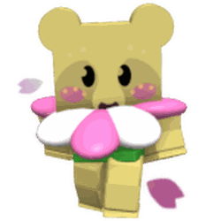

# Bee Bear/2025

This piece of content goes bye bye.

The following content has been removed from the game. The contents below may be archival, but feel free to edit below.

## 2025 Quests

### Quests

<table class="article-table mw-collapsible mw-collapsed">
<tbody><tr>
<th>Quest Name
</th>
<th>Requirements
</th>
<th>Reward
</th></tr>
<tr>
<td>Beesmas Begins (1)
</td>
<td>
<ul><li>Convert 4,000 <a href="pollen.html">Pollen</a> at <a href="hive.html">Hive</a>.</li>
<li>Collect 200 <a href="pollen.html">Pollen</a> from the <a href="dandelion-field.html">Dandelion Field</a>.</li>
<li>Collect 200 <a href="pollen.html">Red Pollen</a>.</li>
<li>Collect 5 <a href="snowflake.html">Snowflakes</a>.</li></ul>
</td>
<td>2,000 <a href="honey.html">Honey</a> 

5 <a href="ticket.html">Tickets</a> 
1 <a href="royal-jelly.html">Royal Jelly</a> 
1 <a href="cloud-vial.html">Cloud Vial</a> 
1 <a href="gingerbread-bear.html">Gingerbread Bear</a>

</td></tr>
<tr>
<td>Blooms For Beesmas (2)
</td>
<td>
<ul><li>Collect 2,500 <a href="pollen.html">Blue Pollen</a>.</li>
<li>Collect 25 <a href="ability-tokens.html">Ability Tokens</a>.</li>
<li>Catch 50 <a href="bloom.html#Petals">Petals</a>.</li></ul>
</td>
<td>20,000 <a href="honey.html">Honey</a> 

5 <a href="ticket.html">Tickets</a> 
1 <a href="present.html">Present</a> 
1 <a href="gingerbread-bear.html">Gingerbread Bear</a>

</td></tr>
<tr>
<td>Time To Decorate (3)
</td>
<td>
<ul><li>Collect 20,000 <a href="pollen.html">Pollen</a> from the <a href="clover-field.html">Clover Field</a>.</li>
<li>Collect 10,000 <a href="pollen.html">White Pollen</a>.</li>
<li>Pop 10 Level 3+ <a href="bloom.html">Blooms</a>.</li>
<li>Catch 10 <a href="bloom.html#Petals">Green Bloom Petals</a>.</li>
<li>Defeat 1 <a href="spider.html">Spider</a>.</li>
<li>Give 1 <a href="present.html">Present</a> to NPCs.</li></ul>
</td>
<td>100,000 <a href="honey.html">Honey</a> 

5 <a href="ticket.html">Tickets</a> 
5 <a href="whirligig.html">Whirligigs</a> 
1 <a href="paper-planter.html">Paper Planter</a> 
1 <a href="gingerbread-bear.html">Gingerbread Bear</a>

</td></tr>
<tr>
<td>A Season For Stickers (4)
</td>
<td>
<ul><li>Catch 250 <a href="bloom.html#Petals">Bloom Petals</a>.</li>
<li>Catch 50 <a href="bloom.html#Petals">Pink Bloom Petals</a>.</li>
<li>Collect 50 Strawberries.</li>
<li>Collect a <a href="sticker.html">Sticker</a> (without Trading).</li>
<li>Stick a <a href="sticker.html">Sticker</a> to your Hive.</li>
<li>Collect 100,000 <a href="pollen.html">Red Pollen</a>.</li>
<li>Collect 100 <a href="ability-tokens.html#Bomb">Bomb Tokens</a>.</li></ul>
</td>
<td>1 <a href="present.html">Present</a> 

500,000 <a href="honey.html">Honey</a> 
5 <a href="ticket.html">Tickets</a> 
5 <a href="jelly-beans.html">Jelly Beans</a> 
1 <a href="gingerbread-bear.html">Gingerbread Bear</a>

</td></tr>
<tr>
<td>Searching for Snowflakes (5)
</td>
<td>
<ul><li>Pop 10 Level 4+ <a href="bloom.html">Blooms</a>.</li>
<li>Catch 50 <a href="bloom.html#Petals">Petals</a> in the <a href="spider-field.html">Spider Field</a>.</li>
<li>Catch 50 <a href="bloom.html#Petals">Petals</a> in the <a href="pineapple-patch.html">Pineapple Patch</a>.</li>
<li>Collect 100 <a href="snowflake.html">Snowflakes</a>.</li>
<li>Defeat 3 <a href="mantis.html">Mantis</a>.</li>
<li>Open 2 <a href="gift-boxes.html">Gift Boxes</a>.</li>
<li>Admire <a href="black-bear.html">Black Bear</a>'s Honey Wreath (x2).</li>
<li>Purchase 1 <a href="bee-bear-s-catalog.html">Bee Bear's Catalog</a> item.</li>
<li>Collect 100,000 <a href="pollen.html">White Pollen</a>.</li>
<li>Collect 5,000 <a href="goo.html">Goo</a>.</li></ul>
</td>
<td>1 <a href="gingerbread-bear.html">Gingerbread Bear</a> 

500,000 <a href="honey.html">Honey</a> 
1 <a href="ticket-planter.html">Ticket Planter</a> 
1 <a href="oil.html">Oil</a> 
1 <a href="atomic-treat.html">Atomic Treat</a>

</td></tr>
<tr>
<td>Let Beesmas Joy Sprout (6)
</td>
<td>
<ul><li>Catch 300 <a href="bloom.html#Petals">Yellow Bloom Petals</a>.</li>
<li>Catch 50 <a href="bloom.html#Petals">Violet Bloom Petals</a>.</li>
<li>Collect 10 <a href="gumdrops.html">Gumdrops</a>.</li>
<li>Defeat 3 <a href="spider.html">Spiders</a>.</li>
<li>Summon and Defeat a Level 5 <a href="snowbear.html">Snowbear</a>.</li>
<li>Collect 250,000 <a href="pollen.html">Pollen</a> from the <a href="sunflower-field.html">Sunflower Field</a>.</li>
<li>Collect 50 Tokens from <a href="sprout.html">Sprouts</a>.</li></ul>
</td>
<td>2 <a href="gingerbread-bear.html">Gingerbread Bears</a> 

1 <a href="present.html">Present</a> 
1,500,000 <a href="honey.html">Honey</a> 
5 <a href="ticket.html">Tickets</a> 
3 <a href="smooth-dice.html">Smooth Dice</a> 
3 <a href="magic-bean.html">Magic Beans</a>

</td></tr>
<tr>
<td>The Presents of Planters (7)
</td>
<td>
<ul><li>Collect 800,000 <a href="pollen.html">Pollen</a> from the <a href="bamboo-field.html">Bamboo Field</a>.</li>
<li>Collect 500,000 <a href="pollen.html">Pollen</a> from the <a href="mushroom-field.html">Mushroom Field</a>.</li>
<li>Collect 2 Hours of <a href="nectar.html">Nectar</a>.</li>
<li>Collect 25 Tokens from <a href="planter.html">Planters</a> in the <a href="bamboo-field.html">Bamboo Field</a>.</li>
<li>Collect 25 Tokens from <a href="planter.html">Planters</a> in the <a href="mushroom-field.html">Mushroom Field</a>.</li>
<li>Collect 200 Tokens from <a href="sparkles.html">Sparkles</a>.</li>
<li>Collect 50 <a href="snowflake.html">Snowflakes</a>.</li>
<li>Pop a Level 7+ <a href="bloom.html">Bloom</a>.</li>
<li>Defeat 2 <a href="werewolf.html">Werewolfs</a>.</li>
<li>Admire <a href="black-bear.html">Black Bear</a>'s Honey Wreath (x3).</li></ul>
</td>
<td>2 <a href="gingerbread-bear.html">Gingerbread Bears</a> 

4,000,000 <a href="honey.html">Honey</a> 
5 <a href="ticket.html">Tickets</a> 
3 <a href="soft-wax.html">Soft Waxes</a> 
1 <a href="box-o-frogs.html">Box-O-Frogs</a>

</td></tr>
<tr>
<td>Slaying the Slimey Scrooges (8)
</td>
<td>
<ul><li>Deal 10,000 Damage with the <a href="slingshot.html">Slingshot</a>.</li>
<li>Drink 1 <a href="retro-swarm-challenge.html#Boost_Items">Bloxiade</a> in the <a href="retro-swarm-challenge.html">Retro Swarm Challenge</a>.</li>
<li>Complete Round 8 in the <a href="retro-swarm-challenge.html">Retro Swarm Challenge</a>.</li>
<li>Catch 50 <a href="bloom.html#Petals">Cyan Petals</a>.</li>
<li>Purchase 2 <a href="bee-bear-s-catalog.html">Bee Bear's Catalog</a> items.</li>
<li>Collect 2,000,000 <a href="pollen.html">Blue Pollen</a>.</li>
<li>Collect 300,000 <a href="pollen.html">Pollen</a> from the <a href="blue-brick-field.html">Blue Brick Field</a>.</li>
<li>Collect 100 <a href="brick-bloom.html">Brick Bloom</a> Tokens.</li></ul>
</td>
<td>1 <a href="present.html">Present</a> 

10,000,000 <a href="honey.html">Honey</a> 
10 <a href="ticket.html">Tickets</a> 
3 <a href="enzymes.html">Enzymes</a> 
2 <a href="gingerbread-bear.html">Gingerbread Bears</a>

</td></tr>
<tr>
<td>Festive Fetching Frolic (9)
</td>
<td>
<ul><li>Catch 250 <a href="bloom.html#Petals">Petals</a> in the <a href="hub-field.html">Hub Field</a>.</li>
<li>Catch 50 <a href="bloom.html#Petals">Marigold Bloom Petals</a>.</li>
<li>Catch 25 <a href="bloom.html#Petals">Periwinkle Bloom Petals</a>.</li>
<li>Collect 100 <a href="snowflake.html">Snowflake</a> Tokens.</li>
<li>Collect 100 <a href="sunflower-seed.html">Sunflower Seeds</a>.</li>
<li>Collect 10 <a href="magic-bean.html">Magic Beans</a>.</li>
<li>Defeat 5 <a href="giant-ant.html">Giant Ants</a>.</li>
<li>Check <a href="mother-bear.html">Mother Bear</a>'s Gingerbread House twice.</li>
<li>Catch 10 Falling <a href="beesmas-lights.html">Beesmas Lights</a>.</li>
<li>Make 25,000,000 <a href="honey.html">Honey</a>.</li></ul>
</td>
<td>2 <a href="gingerbread-bear.html">Gingerbread Bears</a> 

25,000,000 <a href="honey.html">Honey</a> 
10 <a href="ticket.html">Tickets</a> 
5 <a href="micro-converter.html">Micro-Converters</a> 
1 <a href="bloom-shaker.html">Bloom Shaker</a>

</td></tr>
<tr>
<td>An Extra Merry Mission (10)
</td>
<td>
<ul><li>Collect 15,000,000 <a href="pollen.html">White Pollen</a>.</li>
<li>Collect 10,000,000 <a href="pollen.html">Pollen</a> from the <a href="strawberry-field.html">Strawberry Field</a>.</li>
<li>Pop a Level 7+ <a href="bloom.html">Bloom</a>.</li>
<li>Catch 500 <a href="bloom.html#Petals">Red Bloom Petals</a>.</li>
<li>Catch 100 <a href="bloom.html#Petals">Scarlet Bloom Petals</a>.</li>
<li>Collect 100 Tokens from <a href="ability-tokens.html#Festive_Gift">Festive Gifts</a>.</li>
<li>Collect 250 Snowflakes.</li>
<li>Collect 10 <a href="honeysuckle.html">Honeysuckles</a>.</li>
<li>Feed 100 <a href="treats.html">Treats</a>.</li>
<li>Feed 50 <a href="pineapple.html">Pineapples</a>.</li>
<li>Use 10 <a href="soft-wax.html">Soft Wax</a>.</li>
<li>Feed 1 <a href="gingerbread-bear.html">Gingerbread Bear</a>.</li>
<li>Collect 5 <a href="sticker.html">Stickers</a> (without Trading).</li>
<li>Collect 10 Tokens from <a href="brown-bear.html">Brown Bear</a>'s Stockings.</li>
<li>Summon and Defeat a Level 7 <a href="snowbear.html">Snowbear</a>.</li></ul>
</td>
<td>50,000,000 <a href="honey.html">Honey</a> 

1 <a href="sticker.html#Sticker_Index">Ticket Voucher</a> 
1 <a href="festive-planter.html">Festive Planter</a> 
2 <a href="gingerbread-bear.html">Gingerbread Bears</a> 
1 <a href="present.html">Present</a>

</td></tr>
<tr>
<td>The Night Before Beesmas (11)
</td>
<td>
<ul><li>Collect 25,000,000 <a href="pollen.html">Red Pollen</a>.</li>
<li>Collect 3 Hours of <a href="nectar.html">Invigorating Nectar</a>.</li>
<li>Pop 500 Level 5+ <a href="bloom.html">Blooms</a>.</li>
<li>Catch 50 Grey Bloom Petals in the <a href="rose-field.html">Rose Field</a>.</li>
<li>Catch 5 Violet Bloom Petals in the <a href="strawberry-field.html">Strawberry Field</a>.</li>
<li>Collect 150 Tokens from <a href="sprout.html">Sprouts</a>.</li>
<li>Collect 100 Moon Charms.</li>
<li>Collect 5 Gingerbread Bears.</li>
<li>Use the <a href="moon-amulet-generator.html">Moon Amulet Generator</a> 3 Times.</li>
<li>Defeat 4 <a href="scorpion.html">Scorpions</a>.</li>
<li>Defeat 2 <a href="werewolf.html">Werewolves</a>.</li>
<li>Defeat 8 Vicious Bees.</li>
<li>Deliver 5 <a href="present.html">Presents</a>.</li></ul>
</td>
<td>75,000,000 <a href="honey.html">Honey</a> 

10 <a href="ticket.html">Tickets</a> 
3 <a href="red-extract.html">Red Extracts</a> 
3 <a href="red-balloon.html">Red Balloons</a> 
3 <a href="hard-wax.html">Hard Waxes</a> 
3 <a href="gingerbread-bear.html">Gingerbread Bears</a>

</td></tr>
<tr>
<td>Family Festivities (12)
</td>
<td>
<ul><li>Collect 40,000,000 Pollen from the <a href="pumpkin-patch.html">Pumpkin Patch</a>.</li>
<li>Collect 40,000,000 Pollen with <a href="ability-tokens.html#Bomb">Bomb</a>.</li>
<li>Catch 750 <a href="bloom.html">Yellow Bloom Petals</a>.</li>
<li>Boost the Pumpkin Patch 3 times.</li>
<li>Collect 100 <a href="sunflower-seed.html">Sunflower Seeds</a> from <a href="planter.html">Planters</a>.</li>
<li>Collect 500 <a href="ability-tokens.html#Focus">Focus Tokens</a>.</li>
<li>Share 100 <a href="jelly-beans.html">Jelly Bean Tokens</a>.</li>
<li>Pop 10 <a href="puffshroom.html">Puffshrooms</a> in the Pumpkin Patch.</li>
<li>Complete 6 <a href="polar-bear.html">Polar Bear</a> Quests.</li>
<li>Dig in to Polar Bear's <a href="beesmas-feast.html">Beesmas Feast</a> 3 times.</li></ul>
</td>
<td>150,000,000 <a href="honey.html">Honey</a> 

1 <a href="present.html">Present</a> 
3 <a href="gingerbread-bear.html">Gingerbread Bears</a> 
10 <a href="ticket.html">Tickets</a> 
1 <a href="royal-jelly.html#Star_Jelly">Star Jelly</a> 
3 <a href="oil.html">Oils</a>

</td></tr>
<tr>
<td>Black Beesmas (13)
</td>
<td>
<ul><li>Catch 1,500 <a href="bloom.html">Black Bloom Petals</a>.</li>
<li>Catch 20 Black Bloom Petals in the <a href="dandelion-field.html">Dandelion Field</a>.</li>
<li>Catch 15 Black Bloom Petals in the <a href="bamboo-field.html">Bamboo Field</a>.</li>
<li>Catch 10 Black Bloom Petals in the <a href="mushroom-field.html">Mushroom Field</a>.</li>
<li>Catch 5 Black Bloom Petals in the <a href="pine-tree-forest.html">Pine Tree Forest</a>.</li>
<li>Defeat 5 <a href="spider.html">Spiders</a>.</li>
<li>Purchase 4 <a href="bee-bear-s-catalog.html">Bee Bear's Catalog</a> items.</li>
<li>Convert 50,000,000 <a href="pollen.html">Pollen</a> at the Hive.</li></ul>
</td>
<td>200,000,000 <a href="honey.html">Honey</a> 

3 <a href="glitter.html">Glitter</a> 
3 <a href="gingerbread-bear.html">Gingerbread Bears</a> 
10 <a href="ticket.html">Tickets</a> 
1 <a href="black-balloon.html">Black Balloon</a> 
3 <a href="bloom-shaker.html">Bloom Shakers</a>

</td></tr>
<tr>
<td>Stocking Up On Stickers (14) (before nerf)
</td>
<td>
<ul><li>Catch 1,000 <a href="bloom.html">Pink Bloom Petals</a>.</li>
<li>Catch 50 <a href="bloom.html">Green Bloom Petals</a> in the <a href="hub-field.html">Hub Field</a>.</li>
<li>Collect 5 Tokens from <a href="sprout.html">Sticker Sprouts</a>.</li>
<li>Collect 5 Tokens from <a href="stockings.html">Brown Bear's Stockings</a>.</li>
<li>Collect 400 <a href="snowflake.html">Snowflakes</a>.</li>
<li>Collect 20 <a href="soft-wax.html">Soft Waxes</a>.</li>
<li>Collect 10 <a href="glue.html">Glues</a>.</li>
<li>Collect 20 <a href="sticker.html">Stickers</a> (without Trading).</li>
<li>Collect 100,000,000 <a href="pollen.html">White Pollen</a>.</li>
<li>Donate 3 Stickers to the <a href="public-sticker-board.html">Public Sticker Board</a>.</li>
<li>Use <a href="samovar.html">Dapper Bear's Samovar</a> 2 times.</li>
<li>Obtain one of the following stickers to give to Bee Bear:
<ul><li>1 Flying Brave Bee Sticker</li>
<li>1 Flying Ninja Bee Sticker</li>
<li>1 Wobbly Looker Bee Sticker</li>
<li>1 Shocked Hive Slot Sticker</li>
<li>1 Round Rascal Bee Sticker</li>
<li>1 Flying Rad Bee Sticker</li>
<li>1 Blob Bumble Bee Sticker</li></ul></li></ul>
</td>
<td>300,000,000 <a href="honey.html">Honey</a> 

1 <a href="present.html">Present</a> 
10 <a href="ticket.html">Tickets</a> 
1 <a href="sticker-planter.html">Sticker Planter</a> 
1 <a href="purple-potion.html">Purple Potion</a> 
1 <a href="bloom-shaker.html">Bloom Shaker</a> 
3 <a href="gingerbread-bear.html">Gingerbread Bears</a>

10 <a href="ticket.html">Tickets</a> (if the player completed the quest before the <a href="updates.html#2026-04-23">2026-04-23 update</a>)

</td></tr>
<tr>
<td>Festive Bee's Trial (15)
</td>
<td>
<ul><li>Collect 25,000,000 Honey from <a href="bloom.html">Bloom Petals</a>.</li>
<li>Pop 100 Level 8+ <a href="bloom.html">Blooms</a>.</li>
<li>Catch 250 <a href="bloom.html">Periwinkle Bloom Petals</a>.</li>
<li>Catch 25 Periwinkle Bloom Petals in the <a href="stump-field.html">Stump Field</a>.</li>
<li>Catch 25 <a href="bloom.html">Red Bloom Petals</a> in the <a href="spider-field.html">Spider Field</a>.</li>
<li>Catch 5 <a href="bloom.html">Merigold Bloom Petals</a> in the <a href="mountain-top-field.html">Mountain Top Field</a>.</li>
<li>Complete Round 15 in the <a href="retro-swarm-challenge.html">Retro Swarm Challenge</a>.</li>
<li>Deal 100,000 Damage with the <a href="retro-swarm-challenge.html#Weapons">Illumina</a>.</li>
<li>Collect 150,000,000 <a href="pollen.html">Red Pollen</a>.</li>
<li>Collect 1000 <a href="ability-tokens.html#Bomb">Red Bomb Tokens</a>.</li>
<li>Collect 100 Tokens from <a href="ability-tokens.html#Festive_Gift">Festive Gifts</a>.</li>
<li>Collect 250 Tokens from <a href="snowbear.html">Snowbear</a>.</li>
<li>Collect 10 <a href="micro-converter.html">Micro-Converters</a>.</li>
<li>Collect 10 <a href="glitter.html">Glitters</a>.</li>
<li>Catch 40 <a href="mythic-meteor-shower.html">Mythic Meteors</a>.</li>
<li>Check <a href="gingerbread-house.html">Mother Bear's Gingerbread House</a> 3 times.</li>
<li>Defeat a Level 9+ Snowbear</li>
<li>Admire <a href="honey-wreath.html">Black Bear's Honey Wreath</a> 3 times.</li></ul>
</td>
<td>500,000,000 <a href="honey.html">Honey</a> 

25 <a href="ticket.html">Tickets</a> 
1 <a href="super-smoothie.html">Super Smoothie</a> 
3 <a href="bloom-shaker.html">Bloom Shakers</a> 
5 <a href="gingerbread-bear.html">Gingerbread Bears</a> 
1 <a href="cub-buddy.html#Skins">Cub Buddy</a> or 1 <a href="sticker.html#Sticker_Index">Cub Buddy Voucher</a>

</td></tr>
<tr>
<td>Presents for Petal Cub (1/5): Daisies (16)
</td>
<td>
<ul><li>Collect 250,000,000 Pollen.</li>
<li>Collect 50,000,000 Goo.</li>
<li>Collect 4 Hours of Satisfying Nectar.</li>
<li>Catch 3,000 White Bloom Petals.</li>
<li>Catch 500 Grey Bloom Petals.</li>
<li>Catch a White Bloom Petal in the Sunflower Field.</li>
<li>Catch a White Bloom Petal in the Strawberry Field.</li>
<li>Catch a White Bloom Petal in the Mountain Top Field.</li>
<li>Collect 1,000 Mark Tokens.</li>
<li>Collect 10 Gingerbread Bears.</li>
<li>Collect 50 Stacks of Mondo Chick Blessing.</li>
<li>Collect 250 Tokens from Cub Buddy.</li>
<li>Pop 1 Rare Puffshroom in the Dandelion Field.</li>
<li>Collect 3 Hours of Cool Breeze from Snowflakes.</li>
<li>Obtain 1 Small White Daisy Sticker to give to Petal Cub.</li></ul>
</td>
<td>1,000,000,000 <a href="honey.html">Honey</a> 

1 <a href="sticker.html#Sticker_Index">Ticket Voucher</a> 
2 <a href="bloom-shaker.html">Bloom Shakers</a> 
5 <a href="swirled-wax.html">Swirled Waxes</a> 
5 <a href="tropical-drink.html">Tropical Drinks</a> 
1 <a href="white-balloon.html">White Balloon</a> 
5 <a href="gingerbread-bear.html">Gingerbread Bears</a> 
1 <a href="present.html">Present</a>

</td></tr>
<tr>
<td>Presents for Petal Cub (2/5): Forget-Me-Nots (17)
</td>
<td>
<ul><li>Collect 1,000,000,000 Pollen.</li>
<li>Collect 8 Hours of Comforting Nectar.</li>
<li>Catch 4,000 Blue Bloom Petals.</li>
<li>Catch 50 Cyan Bloom Petals in the Blue Flower Field.</li>
<li>Catch 1 Blue Bloom Petal in the Cactus Field.</li>
<li>Catch 1 Blue Bloom Petal in the Coconut Field.</li>
<li>Catch 1 Blue Bloom Petal in the Stump Field.</li>
<li>Collect 500 Sparkles Tokens.</li>
<li>Pop 2,500 Bubbles.</li>
<li>Match 50 Pairs in Memory Match.</li>
<li>Collect 50 Blue Extracts.</li>
<li>Collect 25 Enzymes.</li>
<li>Collect 10 Whirligigs.</li>
<li>Use Bucko Bee's Snow Machine 4 times.</li>
<li>Purchase 7 Bee Bear's Catalog Items.</li>
<li>Obtain one of the following to give to Petal Cub:
<ul><li>1 Waving Townsperson Sticker</li>
<li>1 Blue Square Sticker</li>
<li>1 Blowing Leaf Sticker</li>
<li>1 Small Dandelion Sticker</li></ul></li></ul>
</td>
<td>5,000,000,000 <a href="honey.html">Honey</a> 

1 <a href="sticker.html#Sticker_Index">Ticket Voucher</a> 
4 <a href="bloom-shaker.html">Bloom Shakers</a> 
5 <a href="glitter.html">Glitter</a> 
5 <a href="caustic-wax.html">Caustic Waxes</a> 
5 <a href="loaded-dice.html">Loaded Dice</a> 
1 <a href="black-balloon.html">Black Balloon</a> 
5 <a href="gingerbread-bear.html">Gingerbread Bears</a>

</td></tr>
<tr>
<td>Presents for Petal Cub (3/5): Tulips (18)
</td>
<td>
<ul><li>Collect 5,000,000,000 Pollen.</li>
<li>Collect 12 Hours of Refreshing Nectar.</li>
<li>Catch 3,000 Yellow Bloom Petals.</li>
<li>Catch 500 Pink Bloom Petals.</li>
<li>Catch 1 Pink Bloom Petal in the Mountain Top Field.</li>
<li>Catch 1 Pink Bloom Petal in the Coconut Field.</li>
<li>Catch 1 Pink Bloom Petal in the Pepper Patch.</li>
<li>Collect 50 Red Extracts.</li>
<li>Collect 50 Oils.</li>
<li>Collect 50 Honeysuckles.</li>
<li>Collect 50 Stacks of Puffshroom Blessing.</li>
<li>Defeat 1 Rare Puffshroom in the Sunflower Field.</li>
<li>Catch 50 Falling Beesmas Lights.</li>
<li>Admire Riley Bee's Honeyday Candles 3 times.</li>
<li>Obtain a Small Pink Tulip sticker to give to Petal Cub.</li></ul>
</td>
<td>25,000,000,000 <a href="honey.html">Honey</a> 

1 <a href="sticker.html#Sticker_Index">Ticket Voucher</a> 
6 <a href="bloom-shaker.html">Bloom Shakers</a> 
3 <a href="nectar-shower-vial.html">Nectar Shower Vials</a> 
10 <a href="magic-bean.html">Magic Beans</a> 
10 <a href="glue.html">Glues</a> 
10 <a href="pink-balloon.html">Pink Balloons</a> 
5 <a href="gingerbread-bear.html">Gingerbread Bears</a> 
1 <a href="present.html">Present</a>

</td></tr>
<tr>
<td>Presents for Petal Cub (4/5): Lilacs (19)
</td>
<td>
<ul><li>Collect 10,000,000,000 Pollen.</li>
<li>Collect 500,000,000 Honey from Bloom Petals.</li>
<li>Collect 16 Hours Motivating Nectar.</li>
<li>Catch 2,000 Violet Bloom Petals.</li>
<li>Catch 500 Green Bloom Petals.</li>
<li>Catch 1 Violet Bloom Petal in the Bamboo Field.</li>
<li>Catch 1 Violet Bloom Petal in the Pineapple Patch.</li>
<li>Catch 1 Violet Bloom Petal in the Stump Field.</li>
<li>Collect 250 Melody Tokens.</li>
<li>Catch 250 Falling Coconuts.</li>
<li>Collect 50 Neonberry.</li>
<li>Collect 25 Purple Potions.</li>
<li>Defeat 25 Rhino Beetles.</li>
<li>Help Complete 25 Robo Parties.</li>
<li>Gander at Onett's Lid Art 2 times.</li>
<li>Obtain one of the following to give to Petal Cub:
<ul><li>1 Purple 4-Point Flower Sticker</li>
<li>1 Precise Eye Sticker</li>
<li>1 Purple Fleuron Sticker</li>
<li>1 Prism Painting Sticker</li>
<li>1 Banana Painting Sticker</li></ul></li></ul>
</td>
<td>100,000,000,000 <a href="honey.html">Honey</a> 

1 <a href="sticker.html#Sticker_Index">Ticket Voucher</a> 
8 <a href="bloom-shaker.html">Bloom Shakers</a> 
5 <a href="caustic-wax.html">Caustic Waxes</a> 
25 <a href="purple-potion.html">Purple Potions</a> 
1 <a href="festive-bean.html">Festive Bean</a> 
5 <a href="gingerbread-bear.html">Gingerbread Bears</a> 
1 <a href="present.html">Present</a> 

</td></tr>
<tr>
<td>Presents for Petal Cub (5/5): The Final Bouquet (20)
</td>
<td>
<ul><li>Collect 25,000,000,000 Pollen.</li>
<li>Collect 48 Hours of Nectar.</li>
<li>Pollinate 2,500 Flowers.</li>
<li>Pop 500 Level 10+ Blooms.</li>
<li>Catch 1,000 Petals in the Hub Field.</li>
<li>Catch 500 Red Bloom Petals.</li>
<li>Catch 500 White Bloom Petals.</li>
<li>Catch 500 Blue Bloom Petals.</li>
<li>Catch 500 Yellow Bloom Petals.</li>
<li>Catch 500 Merigold Bloom Petals.</li>
<li>Catch 500 Green Bloom Petals.</li>
<li>Catch 500 Pink Bloom Petals.</li>
<li>Catch 500 Violet Bloom Petals.</li>
<li>Catch 500 Cyan Bloom Petals.</li>
<li>Catch 500 Periwinkle Bloom Petals.</li>
<li>Catch 500 Scarlet Bloom Petals.</li>
<li>Catch 500 Grey Bloom Petals.</li>
<li>Catch 500 Black Bloom Petals.</li>
<li>Collect 1,000 Brick Bloom Tokens.</li>
<li>Share 250 Jelly Beans.</li>
<li>Collect 250 Bitterberries.</li>
<li>Collect 50 Hard Waxes.</li>
<li>Collect 25 Gingerbread Bears.</li>
<li>Apply 500 Stacks of Field Boosts.</li>
<li>Boost the Mountain Top Field 10 times.</li>
<li>Defeat 1 Epic Puffshroom in the Rose Field.</li>
<li>Purchase 9 Bee Bear's Catalog Items.</li>
<li>Complete Robo Party Rank 18.</li>
<li>Use Dapper Bear's Samovar 4 times.</li>
<li>Defeat a Level 12+ Snowbear.</li>
<li>Give 10 Presents.</li>
<li>Obtain 1 of the following to give to Petal Cub:
<ul><li>1 Diamond Trim Sticker</li>
<li>1 Cyan Decorative Border Sticker</li>
<li>1 Diamond Cluster Sticker</li>
<li>1 Yellow Swirled Marble Sticker</li>
<li>1 Blue And Green Marble Sticker</li>
<li>1 Orange Swirled Marble Sticker</li></ul></li>
<li>Obtain a Small Tickseed sticker to give to Petal Cub.</li></ul>
</td>
<td>250,000,000,000 <a href="honey.html">Honey</a> 

1 <a href="sticker.html#Sticker_Index">Ticket Voucher</a> 
10 <a href="bloom-shaker.html">Bloom Shakers</a> 
1 <a href="festive-planter.html">Festive Planter</a> 
1 <a href="festive-bean.html">Festive Bean</a> 
5 <a href="super-smoothie.html">Super Smoothies</a> 
10 <a href="gingerbread-bear.html">Gingerbread Bears</a> 
1 <a href="cub-buddy.html#Skins">Petal Cub</a> 
Summons nighttime

</td></tr></tbody></table>

### Dialogue

<table class="article-table mw-collapsible mw-collapsed">
<tbody><tr>
<th>Quest name
</th>
<th>Dialogue
</th></tr>
<tr>
<td>Beesmas Begins
</td>
<td>Ho ho ho hoo! Merry Beesmas!! Happy Honeydays!!! It's me, Bee Bear! The magical half-bee, half-bear winter mascot of Beesmas. Here to spread festive cheer with my jolly crew: Festive Bee, Reindeer Puppy Bee, and Cub Buddy too! Yes, it's Beesmas, the most wonderful time of the year. A time to celebrate our bees. A time for making honey. And a time for handing out [Presents]! If you help me complete my quests, I've got many surprises in store for you. Including [Presents] you can give to the bears around the map for [Ornaments] to hang on the Beesmas Tree! Each [Ornament] on the tree grants special boosts to you and your bees, all winter long! With all the boosts Beesmas has in store, it's never been a better time to play Re://:Swarm! Ho ho! So lets [sic] get to the festivities! We've so much to do. The joy of all the bears and bees on the mountain depends on me and YOU! Convert 400 Pollen into Honey at your hive... Collect 200 Pollen in the Dandelion Field behind me... Collect 200 Pollen from Red Flowers... And collect 10 [Snowflakes], which you'll see fall onto the fields every now and then.

 
<i>-During-</i>

Beesmas is a blessing to every bear, bee and beekeeper. With all the buffs the Beesmas tree provides, honey flows abundantly! NOONE has to go lacking! But to get those buffs, we've got to spread some cheer with these quests. That's how we make the [Presents]!

 
<i>-Completion-</i>

🎵 We wish you a merry Beesmas 🎵 🎵 We Wish you a merry Beesmas.. 🎵 🎵 We WISH you a merry Beesmas... 🎵 🎵 Full of honey and cheer! 🎵 Splendid work, little one! We're off to a good start. I've got a few rewards for you: A [Royal Jelly], which you can use to transform a bee in your hive into a random type... And a [Gingerbread Bear], which you can use to purchase goods from my extremely generously priced Catalog! Have a look for yourself. To open my catalog [sic] Gingerbread Bear icon on the right of the screen. In there, you can spend [Snowflakes] and [Gingerbread Bears] on all sorts of goodies! I've got everything a beekeeper needs to start making serious moolah. Now let's continue! Complete 1 more quest, and we'll wrap up the first [Present] for you to hand out.

</td></tr>
<tr>
<td>Blooms For Beesmas
</td>
<td>Collecting Pollen can be quite a chore if you aren't smart about it! But there are so many magical things that really speed things up. Like the Ability Tokens of your Bees! Boosts, Bombs, and so much more. And there's something new and extra useful this year: Blooms! Blooms are big flowers that sometimes pop up on the field. Collect pollen near them to pop them! When they do, their petals will fly into the air. Catch them for honey and special, powerful buffs! Ho ho hoo. Collecting petals is yet another joyful activity that will make this Beesmas truly special. Go test them out to complete your first [Present]: Collect 2,500 Pollen from Blue Flowers... Collect 25 Ability Tokens spawned by your bees... And catch 50 Petals from Blooms!

 
<i>-During-</i>

Catching Blooms of the same color in a short duration increases their power. They reach their maximum potential at 100 stacks. Ho ho! That's a lot of Blooms to catch.

 
<i>-Completion-</i>

Ho hoooo! I saw you catch those! You're quick! But not as quick as me and my Festive Bee. Each Beesmas night, we fly around the world at 10,000 MPH, delivering gifts to every cub and keeper. I don't mean to brag. Just saying though - we're fast! And we've just completed wrapping up the first [Present]! Take this and deliver it to a bear of your choice. You'll bring them so much Beesmas joy! And they'll give you something very special in return...

</td></tr>
<tr>
<td>Time To Decorate
</td>
<td>During Beesmas, the bears all work to set up seasonal decorations, which are as useful as they are pretty! But they need YOUR help to compelte them. Beesmas is about teamwork, after all! So for my next quest, you'll need to complete someone ELSES [sic] quest, too. The more decorations you help set up, the more honey you'll be able to make! Because each decoration offers special powerful perks and abilities. Now let's get out there and start sprucing this place up! Collect 20,000 pollen from the Clover Field... Collect 10,000 Pollen from White Flowers... Pop 10 Level 3 Blooms, or higher. Blooms increase in level each time you pop them! Catch 5 Green Bloom Petals, which you'll probably see on the Clover Field... Defeat 1 Spider... Deliver 1 [Present] to a character of your choosing... And complete one other character's Beesmas quest, to set up a special decoration.

 
<i>-During-</i>

Green Blooms grant Critical Chance. Which is absolutely splendiforous! Critical Chance grants your pollen collection and attacks a chance to be doubled in power.

 
<i>-Completion-</i>
🎵 Oh Beesmas tree.. Oh Beesmas treeee... 🎵 🎵 Your Beesmas buffs are growing 🎵 🎵 Oh Beesmas tree, oh Beesmas tree... 🎵 🎵 To get the honey flowing! 🎵 Ho ho! Oh yes, that [Ornament] looks so nice up there. It's inspired awe in little Cub Buddy here. And if you continue completing these quests, I think a Cub Buddy may just want to join you! But we're still a ways from there... Complete 1 more quest, and I'll have another [Present] for you to give out.

</td></tr>
<tr>
<td>A Season For Stickers
</td>
<td>Beesmas is blooming with decorations and joy! The whole map is getting more pretty. So lets [sic] make your hive more pretty, too! Let's find a Sticker, somewhere around the map. You might see them stuck walls [sic]. Collect them to stick on your hive. They [sic] purely cosmetic, but that stuff is important too! Why? Because nobody wants to look at a boring old basic bland hive, silly. Not during Beesmas! That wouldn't be right! We're all trying to look our best out here, for this most wonderful time of the year. Collect 100,000 Pollen from Red Flowers... Catch 50 Bloom Petals... Collect 10 Pink Bloom petals, often found on the Strawberry Field... Collect 100 Bomb Ability Tokens... Collect 50 [Strawberries]... Collect a Sticker... And stick a Sticker onto your hive.

 
<i>-During-</i>

If you find a Sticker, be sure to look it up in the Sticker Index. And try to learn the worth of each one of your Stickers. Some are quite valuable - if you find one used in quests, you could trade it for some cool stuff!

 
<i>-Completion-</i>
Oh ho ho. That's a nice [Sticker] you stuck up there. I think you deserve another [Present]! Go hand this out, and stick another [Ornament] on the Beesmas tree. Then come back for another quest. Make haste, the success of Beesmas depends on it!

</td></tr>
<tr>
<td>Searching For Snowflakes
</td>
<td>[Snowflakes] are so special, and they only appear at this time of year. You can use them to give temporary blessings to all players in your server! They'll be very thankful, because those blessings speed up honeymaking. But think before you use them - because you might want to spend them in my catalog. It's quite a conundrum. Do you save them up for the catalog, or do you use them? I'll let you choose... but you should probably save them. Just saying. Collect 100,000 Pollen from White Flowers... Collect 5,000 Goo by using [Gumdrops] on a field... Catch 50 Bloom Petals in the Spider Field... Catch 50 Bloom Petals in the Pineapple Patch... Pop 10 Level 4+ Blooms... Collect 100 [Snowflakes]... Defeat 5 Mantises, which you can find on the Pineapple Patch and in the Pine Tree Forest... Use Black Bear's Honey Wreath decoration... And purchase 1 offer from Bee Bear's Catalog!

 
<i>-During-</i>

Every bundle in my catalog was meticulously assembled by hand. by [sic] one of my many Festive Bees back at my workshop. There they work all day, 24/7, without even a peep of complaining. Because they live purely to spread the joy of others! Isn't that right Festive Bee? ... That's what I thought. Ho hoo! 

 
<i>-Completion-</i>
🎵 Siilent niight... 🎵 🎵 Hooney night... 🎵 🎵 Beesmas quests are quite alright 🎵 🎵 Making honey, so sweet and so and [sic] mild 🎵 🎵 Spreading joy to each bee, bear and child 🎵 🎵 [Snowflakes] make things a bree-eeze... 🎵 🎵 [Snowflakes] make it a breeze! 🎵 Ho ho ho ho. [Snowflakes]! Great work out there! Here, Festive Bee prepared something special just for you. It's a [Ticket Planter]! Place this on a field, and it'll grow over time. Once its [sic] fully grown, you can collect it for lots of special goodies and Nectar, which is extremely important. Complete 1 more quest, and your next [Present] will be ready.

</td></tr>
<tr>
<td>Let Beesmas Joy Sprout
</td>
<td>Want to know the best way to collect lots and lots of [Treats] and fruits? From Sprouts, of course! They're magical plants that spread gifts all around the field when popped. These spawn every once in a while in the middle of fields. They've got huge spotlights on them, so you can't miss them. They can be quite difficult to pop, so it's best to work as a team! I'm sure other players will just love having you there to collect tokens from their Sprouts. Because Beesmas is about sharing. And who wouldn't want to share with other players??? Collect 250,000 Pollen from the Sunflower Field... Collect 300 Yellow Bloom Petals... Collect 50 Violet Bloom Petals, which are quite rare, but you can sometimes find them on Mushroom, Clover, and Blue Flower field and more. Collect 50 Tokens from Sprouts... Collect 10 Gumdrops Tokens... Defeat 3 Spiders... And defeat a level 5 Snowbear! Talk to Panda Bear to learn more about that.

 
<i>-During-</i>

Violet Petals are a little tricky, but they show up most often in the Clover Field. They grant Super Crit Chance! It's like critical hits for critical hits! And Super Crits even instantly convert! Sounds like magic to me.

 
<i>-Completion-</i>

Wonderful! Your work out there has helped spread enough joy to manifest yet another [Present]! Deliver it to another NPC to make them really happy, and to make the Beesmas Tree even more powerful.

</td></tr>
<tr>
<td>The Presents of Planters
</td>
<td>What ARE Planters??? Do you know? Not many do. I gave you some earlier, but do you know how they work? Well, I know! Because I'm magic. And also because I read up on them on the wiki. Listen closely, little one. If you're serious about honeymaking, you NEED to use your Planters. They are the best source of Nectar - special buffs which grant insane multipliers to your pollen and more! Farming without Nectar is like shoveling snow with your hands instead of a shovel. Or like writing a book with a pencil, instead of a computer... Like, you COULD do it, but why would you?? Unless you just like taking 100 times longer to do stuff. Ho ho! Nectar is magic, and magic is joy, and joy is love and love is what Beesmas is all about. Plus, Planters give lots of materials you will need for crafting serious gear. That's where Festive Bee gets all the fruits for her Festive Gifts, you know. So for this next quest, go plant some Planters!

 
<i>-During-</i>

Want to know a jolly little tip for collecting Planter tokens fast? Ho ho! Well, just use a [Paper Planter]! [Paper Planters] may not give great Nectar, but they give plenty of Tokens, and they grow extra fast. Don't forget, you can buy them in the shop near the Pineapple Patch.

 
<i>-Completion-</i>

🎵 Planter pot, planter pot, planter pot rock 🎵 🎵 They're gonna bring you so many things 🎵 🎵 Wax and Nectar and even a [Treat] 🎵 🎵 That's the Planter pot rocckk ~ 🎵 Ho hoooo! Did you get anything good in those things? Maybe some [Soft Wax]? That stuff is great for crafting even BETTER planters! Now, let's keep spreading that cheer to each and every field. Complete my next quest, and I'll have another [Present] ready for you!

</td></tr>
<tr>
<td>Slaying the Slimey Scrooges
</td>
<td>The mountain is reall starting to look merry, thanks to you and your bees! But the mountain isn't the ONLY place we need to worry about. Every inch of the universe needs to know Beesmas cheer! And there's one inch which is straight up un-jolly, overrun with nasty scrooges. The Retro Swarm Challenge! A forsaken land, forgotten to time. In there, nasty Zombies and Slimes from the year 2010 are terrorizing the hives, and RUINING Beesmas! They come from a time before Re://:Swarm even existed. A time before the world even knew proper JOY! Sad! And now they've come to destroy our fun in the present. Oh ho no no no, not on our watch. Quickly, take yourself to the purple portal and go clean that place up. Teach that naughty 1x1x1x1 the meaning of Beesmas, by obliterating his forces. If you don't, Beesmas will be ruined, and this [Present] we're working on for you may as well go in the trash!

 
<i>-During-</i>

Reindeer Puppy Bee LOVES the Retro Swarm Challenge. Why? Well, I think it thinks all the Slimes are just giant tennis balls! A world full of smelly rotting Zombies and giant tennis balls?? That's like puppy heaven!

 
<i>-Completion-</i>

Ho hooo! We're saved! Cub Buddy was so worried, but you saved the day! Not just for destroying those Slimes. But for helping to fund this whole operation through my catalog! Every [Snowflake] and [Gingerbread Bear] spent there goes straight to my quest reward fund for next year Will [sic] a small percentage kept to fund my jolly lifestyle, of course. But that means it's actually YOU who is bringing Beesmas joy to all the Bee Swarm players! And for that, you deserve the next [Present]. Go get yourself another [Ornament], and keep pumping up that Beesmas Tree! I want it to glow bright and gaudy so that the naughty mobs might know its might.

</td></tr>
<tr>
<td>Festive Fetching Frolic
</td>
<td>This Reindeer Puppy Bee is useless in the fields nowadays. Why so? Well, with all the falling Petals, [Snowflakes], and Beesmas Lights... He just can't stay focused! He loses track of his ball, and keeps chasing random stuff around. But maybe he's got the right idea. You see, those jolly things are great for honeymaking! Blooms, especially, can amplify your boosting to an incredibly [sic] degree! You might even call it magic! The Instant Conversion they provide can present your backpack from filling up too quickly. Especially helpful when you have field boosts and other effects multiplying your pollen Such as the Inspire stacks you obtain from the Falling Beesmas Lights. So go make like a Puppy Bee and try to catch all the stuff you can!

 
<i>-During-</i>

Marigold Petals look like a dark, orangish yellow. Sunflower Field is your best bet for finding them. Although they show up in lots of fields, like Clover and Blue Flower.

 
<i>-Completion-</i>

🎵 Jingle Blooms, Jingle Blooms, Jingle all the wayyy 🎵 🎵 Oh what fun it is to catch those Petals as they sway!🎵 🎵 Jingle Blooms, Jingle Blooms, Jingle all the wayyyy 🎵 🎵 Unique instant converting will help to save the day! 🎵 Yaaaay! That looked like so much fun. But we don't have time to frolic around forever... We've got many more [Presents] to wrap. So let's get right back into it!

</td></tr>
<tr>
<td>An Extra Merry Mission
</td>
<td>As a magical half-bee myself, I know how it can be for bees sometimes out there. It's a hard life, digging around in flowers. Shooting lasers out your butt at ladybugs. A thankless life, often. ALL that work for what? A couple hundred thousand [Treats]?? How is a poor little bee supposed to even fit those in its square little body? But it's times like Beesmas that makes it all worth it. Times when the WHOLE world comes together to celebrate these little troopers. Their precious, wobbly little wings. Their derpy, low-resolution faces. They bring us such joy! And they make us a LOT of honey! Let's celebrate them extra hard with this next, more challenging quest. Complete it, and I'll have another [Present], as well as a few more extra special things for you.

 
<i>-During-</i>

Scarlet Petals are quite tricky to spot. They're basically just slightly darker Red Petals. You can find a LOT of them in the Pepper Patch, if you're not a little noobie who can't even go there. But for everyone else, the Rose Field's not a bad option, too. Ho ho!

 
<i>-Completion-</i>

Ho ho ho! That was faster than I expected! Your bees seem so exhausted! But also fulfilled. That’s exactly where they want to be - a day well lived! And with that, Festive Bee and I have finished a few extra special rewards for you. Cub Buddy helped wrap a little bit too. It’s not very good at it but we try to keep it busy too. Here’s what you earned: a [Present], of course... But also a [Festive Planter]! This is the most special type of single-use Planter of all. It grants TONS of Nectar and crafting goodies. You never know what you might get! And you’ve also earned this: a [Ticket Voucher]! You can redeem 1 [Ticket Voucher] per day for 100 [Tickets]! A pretty decent chunk, if you need it. But you could also trade it. Now, go enjoy your gifts, but return soon. Because I think it might be time for you to start earning a Cub Buddy of your own...

</td></tr>
<tr>
<td>The Night Before Beesmas
</td>
<td>Twas the night before Beesmas, and all through the flowers... There were beekeepers farming, for hours and hours. Catching those petals, and popping those Sprouts... Spreading Honeyday cheer, without fear or doubts. Until all of a sudden, oh ho ho, what a fright: The Vicious Bee appeared to ruin the night! And it killed every beekeeper, bee, cub and bear... And Beesmas was ruined. Despair. Despair, Despair. ... We can't let that happen. We still have [Presents] to hand out! And we've even got a Cub Buddy just for you. If you complete these next 5 quests. So get out there and save Beesmas! Put that naughty spikey scrooge in its place!

 
<i>-During-</i>

Violet Petals in the Strawberry Field and Grey Petals in the Rose Field are super rare! But don’t lose hope - they spawn with small chances. It might take 10, 50, or 100 Blooms but you’ll find them! They’ll show up eventually, as long as you bee-lieve.

 
<i>-Completion-</i>

🎵 It's beginning to look a lot like Beesmas 🎵 🎵 Everywhere you gooo 🎵 🎵 There's a spirit in the air, jolly junk is everywhere 🎵 🎵 And there's soooo muuuch snoowww ~ 🎵 Ho ho ho ho hooo! I like snow. Splendid work! Showed that Vicious Bee who's boss! Oh, and that Petal catching - now that was impressive. Your honeymaking moves make even the scroogiest non-beeliever feel the spirit of the Honeydays! Complete 1 more quest, and we'll have another [Present] for you! And complete 4 more quests, and I think this Cub Buddy might want to ditch little ol Bee Bear and hang out with someone cooler.

</td></tr>
<tr>
<td>Family Festivities
</td>
<td>Beesmas is about celebrating the ones we love most - OUR BEES. But also, we mustn't forget our dear families. Ho ho. That's why every winter I come to this mountain to spend quality time with my dear dear cousin, Polar Bear. But with all the [Present] packing and quest giving and catalog stocking I'm tasked to do, I haven't been able to spend much time with him. Say, why don't you and your bees go pay a visit to my culinarily gifted cousin? Keep him company while Festive Bee and I wrap up your next [Present]. You know, completing his quests for Polar Power is one of the greatest gifts you can give to your bees. Each Polar Power stack permanently increases the maximum energy of your bees. So if you're sick of your lazy bees leaving you hung out to dry, you'll need to whip up some dishes with Polar Bear! And remember, if you complete 4 more quests, there's a Cub Buddy waiting for you!

 
<i>-During-</i>

Advanced beekeepers will have hundreds, even THOUSANDS of stacks of Polar Power! With that much bee energy, your bees will hardly ever have to sleep at all! Considering that bees spend energy every time they gather from flowers or attack an enemy, that's a big help. So do make sure you're spending time with dear Polar Bear. Those Scorpion Salads aren't going to toss themselves!

 
<i>-Completion-</i>

How is dear Polar Bear doing? He still up there cooking stuff? Ho ho hoo! You could say whipping up magical recipes runs in the family. Except while he's busy baking boring old potatoes and turkeys, I'm cooking up merrily magical [Presents]!Like this one! It's the 6th [Present] I've given you so far. Deliver it with haste, and return for your next quest. The joy of the Honeydays is at stake! So do make sure you're spending time with dear Polar Bear. Those Scorpion Salads aren't going to toss themselves!

</td></tr>
<tr>
<td>Black Beesmas
</td>
<td>Sometimes I wonder, what would the world look like without Beesmas? Oooohh... I shudder at the thought! A dark, dark world, without the splendorous glow of the Beesmas Tree. No Gift Boxes to open, no [Presents] to hand out, OOOOhhh, cover your ears, Festive Bee! Don't even imagine such horrors! A world without a Cub Buddy, or equivalently valued voucher, to look forward too... A world without the ridiculously cheap offerings in my generous catalog. A world without value! A dark, dark world, which we shall NOT let happen. By the merry might of questing and petal catching, we will preserve Beesmas for all eternity! We will pluck out every petal of sadness, and cast them into oblivion! As the world shifts and shakes and melts away in the inevitable flux of time - BEESMAS will remain. For as long as there is a spark of consciousness in this universe, Festive Bee and I will work diligently in my workshop! For the ONLY thing eternal is the relentless merry might of BEESMAS. By the great Bubble Bee Man in the sky - SO LET IT BE! HO HOOOO!!

 
<i>-During-</i>

Black Petals double the pollen you receive from Bomb abilities! Which sounds like a blessing - although too much Pollen can become a bag-filling curse. But Petals also grant UNIQUE INSTANT CONVERSION! What does that even mean? Well, think of it this way. Before your Pollen even has a chance to go into your bag, the Petal converts 40% of it into Honey immediately! And each type of Petal will perform this independently. If you catch 3 different colored Petals, that means around 78% of all Pollen you collect will be instantly converted for the duration of their buffs. Too confusing? That's alright. Just think of it as MAGIC!

 
<i>-Completion-</i>

🎵 I'm dreammming, of a Blaaaack Beesmas ~ 🎵 🎵 Where we have finally met our doom 🎵 🎵 Where the mobs, so scary 🎵 🎵 Destroy everything merry 🎵 🎵 And all that remains, is a singular.. sad and lonely... black bloom 🎵 ... Ugh! Enough of all that doom and gloom! We've got [Presents] to wrap, and a Cub Buddy to build! Good work out there, little one! Just 2 more quests until your Cub Buddy is done.

</td></tr>
<tr>
<td>Stocking Up On Stickers
</td>
<td>Pollen is splendid, and honey's oh so sweet... But there's something else, extra magical, which makes Beesmas complete. Something everyone asked for. And everyone loves! Ho ho! Oh yes, something sticky, and scrappy, and doodly, and just so jolly I can barely stand to look at them. I'm talking about STICKERS! The real reason everyone plays this beekeeping themed game. Stick them to your hive to express yourself, in a very limited fashion. Trade them for Beequips to maximize your profits. Heck, the Cub Buddies themselves are just elaborate stickers brought to life by honeyday magic! Stickers are everywhere! They're stuck to walls, stuffed into Sticker Sprouts, and even given in exchange for eggs at the Sticker Printer. And most importantly, they're sometimes required for quests. Like this one. Don't worry, though. I'll keep it simple. Just a dash of sticker magic to spruce the season up. And in exchange, we'll be able to wrap up yet another [Present] for you to deliver! Ho hoo, sounds fair??

 
<i>-During-</i>

Some stickers are super valuable, worth a bunch of "signs"! What are signs? They're Star Signs! The stickers representing the astrological symbols. Why do Bee Swarm players assign values in signs? Are they weirdly obsessed with semiotics? Ho ho hoo! No, I don't think so. It just happened. Nobody really knows why! Just roll with it!

 
<i>-Completion-</i>

Marvelous! Merry! I can feel it - the magic of Beesmas emanating off that Sticker you got for me! Now - we'll just extract that magic very carefully... ...(clip clip)... ...(krumple krumple)... Now we have to feed the scraps to Puppy Bee... ...(nom nom nom)... Watch as his nose begins to GLOW! Cool! And what's that, hidden behind his reindeer horns??? It's a [Present]!!! Ho ho! Wow! Here, you take it and give it to someone special. You'll make their day. Then return for an extra special quest... Cause it's time to make your CUB BUDDY!

</td></tr>
<tr>
<td>Festive Bee's Trial
</td>
<td>Look around, little ones! Look at all the cheer we've already spread! And it's all thanks to YOU and your merry bee crew! Ho hooo! In fact, I think you may have proven yourself worthy for a CUB BUDDY! ... Oh? What's that, Festive Bee? ...(she's buzzing in his ear)... Hmm. You make a good point. Festive Bee says she's just about convinced. But not quite. You see, she pours hundreds of hours of jolly, joyful labor into each and every one of these cubs. She stuffs them with fluff, fills them with cogs, and then performs the secret ritual which brings them to life! It's a lot of work! And she doesn't want all that to go waste on just any old beekeeper. Each Cub Buddy should only be given to one of the chosen HEROES of Beesmas. And right now, you're more of a sidekick. You've spread a lot of cheer, sure. But not, you know, a magically HEROIC amount. But if you complete this final trial, Festive Bee agrees you will have proven yourself worthy! Are you ready to complete this ridiculous quest to prove Festive Bee wrong once and for all? We all want to see you do it! We're all rooting for you! And Beesmas itself depends on it. So go, get out there and make us proud! Or else Festive Bee might just give this Cub Buddy to someone a bit more worthy. You can live up to our expectations!!! As long as you bee-lieve...

 
<i>-During-</i>

This Festive Bee is the most magical one of all. That's why she gets to wear a Festive Wreath! It's a special Beequip which teaches her the Festive Mark ability, which grants boosts and gifts to all players! If you want a Festive Wreath for YOUR Festive Bee, well, you'll need to make this Beesmas truly special. We've hidden one in the Festive Gift Box behind Onett's Lid Art... But you'll need to complete 13 Beesmas decoration quests to unwrap it! And no, my quests don't count. Keep up, silly! Ho ho ho

 
<i>-Completion-</i>

🎵 Joy to the world! 🎵 🎵 The quest is done! 🎵 🎵 You earned, a Cub, Buddyyyy ~ 🎵 🎵 You caught that stuff, and popped those blooooms 🎵 🎵 And proved yourself finally 🎵 🎵 As worthy to Festive Bee 🎵 And earned yoursellllf, a Cub Buddy!!! 🎵 Ho ho hooo! Yes, you did it! Festive Bee is truly impressed, and has deemed you a true hero of Beesmas! So take this little cub, and add it to your jolly crew! Cub Buddy will stick with you through thick and thin, trying its best to collect tokens. But don't expect too much, it's a baby after all. It's mostly there for moral support! Its cuteness will inspired joy year round. Thank you! You have proven yourself to be Bee Bear's most valuable helper. Keep spreading that cheer! And completing those decoration quests! And then return to me in a while - when the timing feels right - and we'll have some even harder quests for you... Quest that will reward this year's yet-to-be-revealed and exclusive Cub Buddy Skin! What could it be? Ho hooo! That's a Bee Bear's secret ~

</td></tr>
<tr>
<td>Presents For Petal Cub (1/5): Daisies
</td>
<td>Ho ho! You did it, you earned a plain old Cub Buddy! Sure, it's cute. But what if it could be BEAUTIFUL? As beautiful as a blooming flower... Ooooh, wouldn't that be splendid? Well it can! Through the power of Beesmas, we can yassify your Cub Buddy with pretty pretty petals! But it won't be easy. If you want this year's exclusive [Petal Cub Skin], you'll have to complete 5 brutally bloom-centric quests. Are you ready to catch even MORE petals? I hope so, because Beesmas depends on it. And all the other Honeydays depend on it too. It's April, so let's save Beester while we're at it! Catch petals to save Beester and we'll give you another [Present] to deliver! On your mark, get set, GO!!!!

 
<i>-During-</i>

Petal Cub flower fact: A single daisy is actually made of a bunch of tiny flowers called flourets bounched together. Every petal is it's [sic] own flower, and every yellow thingy in the middle is too. It's like an entire flower swarm - how appropriate! Ho ho ho!

<i>-Completion-</i>

Petal Cub Buddy sure is sweet, but also a bit hard to please. We'll have to hope these gifts of flower themed stickers will win it over. Wonderful work catching all those white petals, by the way! Each one you catch spawns 100 [Snowflakes] in a different server. In fact, that's where all [Snowflakes] come from. If you stopped catching white petals, it would stop snowing altogether, and Beesmas would be impossible to complete. Complete 4 more quests, and the [Petal Cub Skin] will be yours!

</td></tr>
<tr>
<td>Presents for Petal Cub (2/5): Forget-Me-Nots
</td>
<td>Petal Cub is a botany expert. It knows more about flowers than any bee, and flowers are all bees think about. Heck, Petal Cub knows more about botany than I do! And I'm magic! Petal Cub taught me that flowers are made of 4 main parts: petals, sepals, pistils, and stamens. Petal Cub also taught me that there are sooo many different types of flowers. Daisies, Sunflowers, Roses and uh... This one other type of flower that's blue... What's it called again? Hmm. I forget, ho ho hoo! Why don't you go pluck a bunch of Blue petals while I try to remember.

 
<i>-During-</i>

Petal Cub flower fact: In real life, blue petals are super super rare. The blue color actually comes from chemically altering red pigments. In fact, they're almost as rare as blue petals are in the Coconut Field. I'd guess it'll take around 200 Blooms to find a single blue petal in there.

<i>-Completion-</i>

🎵 Sending you forget-me-nots 🎵 🎵 To help you to remember 🎵🎵 Baby Bee, forget-me-not 🎵🎵 I want you to remember 🎵🎵 Sending you forget-me-nots 🎵🎵 To help you to remember 🎵🎵 Cub Buddy, forget-me-not 🎵🎵 I want you to rememberrr ~ 🎵Ho hoo! What a great song, thank you Patrice Rushen. Circa 1982. Post-disco.OH! And that's what the flower was called: Forget-Me-Not!Fantastic work out there, little one. You're winning over Petal Cub slowly but surely.And you're making the world more merry while you're at it.Complete 3 more quests, and your [Petal Cub Skin] will be ready!

</td></tr>
<tr>
<td>Presents for Petal Cub (3/5): Tulips
</td>
<td>I remember the day I first met Petal Cub. Reindeer Puppy Bee and I were playing fetch in the Tulip Field when all of a sudden, it popped out of a Bloom! I remember Petal Cub's first words: "Flowers use visual, olfactory, and tactile cues to guide pollinator species. Cues we perceive as emergent beauty! It was a Beesmas miracle!! But ever since, I've been trying to find a home for Petal Cub. My crew is already too big... But this delicate cub requires special care. It can't be overwatered, and it requires plenty of sunlight. That's why we're training you with these extra challenging Petal-themed quests. Complete just 3 more, and I'll feel good rehoming Petal Cub with you and your bees.

 
<i>-During-</i>

Petal Cub flower fact: In the 1600s, a single tulip bulb could cost more than an entire house! Instead of crypto or stocks, people were investing in flowers! Tulips were truly the Cub Buddy skins of their time.

<i>-Completion-</i>

Marvelous! You tip-toed through the tulips and caught thousands of Petals without even losing your mind! For that, you've earned a very special gift. No, not the [Petal Cub Skin]... It's another [Present]! You know the drill - deliver this to an NPC to make their Beesmas/Beester extra special! After that, return for the last 2 of my quests. The [Petal Cub Skin] is nearly yours!

</td></tr>
<tr>
<td>Presents for Petal Cub (4/5): Lilacs
</td>
<td>Beesmas is all about celebrating bees, obviously. But when you really think about it, it's about celebrating flowers too! Ho hoo, oh yes! The bees and the flowers go hand in hand. They are an inseparable duo! Flowers attract the bees and grant them the special presents of nectar and pollen. In return, the bees grant the flowering plants the greatest gift of alll: the magic of pollination - OF REPRODUCTION ITSELF! It's the perfect exchange of gifts. And giving gifts is what the honeydays are all about! Do you get it now?? Do you see why petals are so important this Beesmas? It's because without PETALS, the BEES wouldn't even know where to go. They'd be lost. We'd all be lost. This entire mountain, this entire game, can only exist thanks to the magical guidance of FLOWERS and their PETALS. So we need MORE petals. MOOOOORE PETALS!!! Festive Bee, tell the factory to ramp up [Bloom Shaker] production to maximum overdrive! And you, beekeeper - get back out there and start catching if you ever want that [Petal Cub Skin]!

 
<i>-During-</i>

Petal Cub flower fact: A lilac bush can live for HUNDREDS of years. Some lilac bushes are nearly as old as I am! Now that's magic!!!

<i>-Completion-</i>

🎵 I don't want a lot of Beesmas...🎵 🎵 There is just one thing I need 🎵 🎵 I don't care about the [Ornaments] 🎵 🎵 Hanging on the Beesmas Tree... 🎵 🎵 Pollen quests are quite alright 🎵 🎵 But they just don't hit as right 🎵 🎵 As catching petals dOOoo... 🎵 🎵 All I want for Beesmas, is BLOOMS!! 🎵 And I got them, ho hoo! Thanks to the work of you and your bees! Your work out there was simply MAGICAL! There's no other way to explain it. And that magic inspired Festive Bee to finish this: a [Present]! That's the last [Present] my jolly crew and I will grant you this Beesmas... But we've one more gift to give you, the most wonderful gift of all. The [Petal Cub Skin]!  Complete just one more quest to save Beesmas and earn the most precious Cub Skin we've concocted yet. 

</td></tr>
<tr>
<td>Presents for Petal Cub (5/5): The Final Bouquet
</td>
<td>Look around us, little ones! Look at how fantastically festive every inch of the map has become! Ho hoo! Yes, we've really outdone ourselves this very long Beesmas. And that's all thanks to YOU and your petal catching dedication! In fact, I think you've nearly proven yourself as worthy of caring for a Petal Cub. But not just yet. It's time for our last quest... the merriest mission of all... Let's assemble a grand Beesmas bouquet, by catching a bunch of EVERY type of petal! Only then will you earn your [Petal Cub Skin], and Beesmas will be saved!! We're so so close, don't lose hope now! Let's finalize the festivities, and move on with our year! Goood luuck little one!

<i>-During-</i>

Petal Cub flower fact: Bees can see super secret hidden patterns on flowers that us bears and beekeepers are blind to. These patterns are only visible through ultraviolet light. They help guide the bees to the sweet stuff in the middle. That's why we'd never be able to collect as much nectar or pollen as our precious bees can. All the more reason to celebrate them! Ho ho!

<i>-Completion-</i>

GATHER ROUND FESTIVE BEE, PUPPY BEE, CUB BUDDIES TOO! Take a look at all those PETALS! Our Beesmas dreams have come true! Every bee, bear, and buddy is brimming with cheer. Because the end of our questing is finally here! So thank you, little one, for all you have done. You and your bees sure know festive fun! You funded my magic, through catalog spend [sic]. And popped every bloom needed until the very end. So take this dear Petal Cub, and treat it just right. Merry Beesmas to ALL, and to ALL a good night! 

</td></tr>
<tr>
<td>Conclusion (before the <a href="updates.html#2026-1-16">2026-1-16 update</a>)
</td>
<td>Beesmas is in full swing! But I'm wrapping up a few things for my next few quests... Return in a few days, and I'll have more quests that reward a [Cub Buddy Voucher]! Until then, keep helping the other bears with the decorating. Let's cover this whole map in festive nonsense! To celebrate the bees!
</td></tr>
<tr>
<td>Conclusion (before the <a href="updates.html#2026-4-23">2026-4-23 update</a>)
</td>
<td>Beesmas is in full swing! But I'm wrapping up a few things for my next few quests... Return later this winter, and I'll have more quests for this year's exclusive Cub Buddy skin [sic]Until then, keep helping the other bears with the decorating. Let's cover this whole map in festive nonsense! To celebrate the bees!
</td></tr>
<tr>
<td>Conclusion (latest)
</td>
<td>My Festive Bee and I can move so fast, that it appears like we're still standing here when we're actually not. We're just popping in every other millisecond to keep things looking festive! Ho ho ho! I'm delivering thousands of gifts as we speak. That's the power of Beesmas! As long as you beelieve.
</td></tr></tbody></table>
