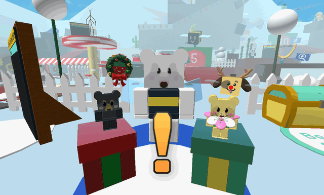
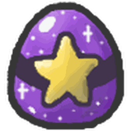

# Bee Bear's Catalog

{ .wiki-photo }

This piece of content goes bye bye.

The following content has been removed from the game. The contents below may be archival, but feel free to edit below.

**Bee Bear's Catalog** is a limited-time shop that players can use to purchase various products during Beesmas 2020, 2021, 2022, Summer 2024, Winter 2024, and 2025. It can be accessed through a side tab on the right side of the screen. Its description is: "Beesmas event shop! Purchase items for Gingerbread Bears and Snowflakes."

There is a countdown below the icon of the shop, which counts down the time until Beesmas ends.

The shop sells items and bundles of many varieties. The player cannot purchase an item or bundle more than once.

Buying items from the Catalog is sometimes required in NPC quests like [Bee Bear's.](bee-bear.md)

You can only buy items in this shop with [Snowflakes](snowflake.md) and [Gingerbread Bears](gingerbread-bear.md).

Successfully purchasing items from the catalog gives a message:  
Purchased {Item/Bundle}!

Attempting to purchase items from the catalog without sufficient items gives a message:  

Can't afford {Item/Bundle}

## Shop Items

### 2025

## 2025

### Bundles

<table class="article-table">
<tbody><tr>
<th>Bundle
</th>
<th>Price
</th>
<th>Gives
</th></tr>
<tr>
<td><figure class="mw-halign-center" typeof="mw:Error mw:File"><figcaption></figcaption></figure>
Winter Winds Bundle

</td>
<td>33 <a href="snowflake.html">Snowflakes</a>
</td>
<td>3 <a href="cloud-vial.html">Cloud Vials</a> 

3 <a href="whirligig.html">Whirligigs</a> 
33 <a href="gumdrops.html">Gumdrops</a>

</td></tr>
<tr>
<td><figure class="mw-halign-center" typeof="mw:Error mw:File"><figcaption></figcaption></figure>
Bowl-Of-Beans Bundle

</td>
<td>250 <a href="snowflake.html">Snowflakes</a>
</td>
<td>5 <a href="magic-bean.html">Magic Beans</a> 

5 <a href="royal-jelly.html">Royal Jellies</a> 
10 <a href="jelly-beans.html">Jelly Beans</a> 
50 <a href="bitterberry.html">Bitterberries</a>

</td></tr>
<tr>
<td><figure class="mw-halign-center" typeof="mw:Error mw:File"><figcaption></figcaption></figure>
White Beesmas Bundle

</td>
<td>100 <a href="snowflake.html">Snowflakes</a>

3 <a href="gingerbread-bear.html">Gingerbread Bears</a> 

</td>
<td>2 <a href="white-balloon.html">White Balloons</a> 

3 <a href="glitter.html">Glitter</a> 
4 <a href="soft-wax.html">Soft Waxes</a> 
5 <a href="royal-jelly.html">Royal Jellies</a>

</td></tr>
<tr>
<td><figure class="mw-halign-center" typeof="mw:Error mw:File"><figcaption></figcaption></figure>
Festive Floral Bundle

</td>
<td>400 <a href="snowflake.html">Snowflakes</a>
</td>
<td>1 <a href="bloom-shaker.html">Bloom Shaker</a> 

10 <a href="oil.html">Oils</a> 
10 <a href="field-dice.html">Field Dice</a> 
40 <a href="honeysuckle.html">Honeysuckles</a>

</td></tr>
<tr>
<td><figure class="mw-halign-center" typeof="mw:Error mw:File"><figcaption></figcaption></figure>
Night-Before Bundle

</td>
<td>10 <a href="gingerbread-bear.html">Gingerbread Bears</a>
</td>
<td>1 <a href="night-bell.html">Night Bell</a> 

10 <a href="enzymes.html">Enzymes</a> 
50 <a href="moon-charm.html">Moon Charms</a> 
1 <a href="egg.html#Gifted_Exhausted_Bee_Egg">Gifted Exhausted Bee Egg</a>

</td></tr>
<tr>
<td><figure class="mw-halign-center" typeof="mw:Error mw:File"><figcaption></figcaption></figure>
Super Snowman Bundle

</td>
<td>800 <a href="snowflake.html">Snowflakes</a>
</td>
<td><a href="snowglobe.html">Snowglobes</a> 

25 <a href="blue-extract.html">Blue Extracts</a> 
25 <a href="stinger.html">Stingers</a> 
1 <a href="egg.html#Gifted_Frosty_Bee_Egg">Gifted Frosty Bee Egg</a>

</td></tr>
<tr>
<td><figure class="mw-halign-center" typeof="mw:Error mw:File"><figcaption></figcaption></figure>
Festive Fun Pack

</td>
<td>1,000 <a href="snowflake.html">Snowflakes</a>

5 <a href="gingerbread-bear.html">Gingerbread Bears</a> 

</td>
<td>1 <a href="festive-planter.html">Festive Planter</a> 

1 <a href="red-balloon.html">Red Balloon</a> 
5 <a href="hard-wax.html">Hard Waxes</a> 
5 <a href="loaded-dice.html">Loaded Dice</a>

</td></tr>
<tr>
<td><figure class="mw-halign-center" typeof="mw:Error mw:File"><figcaption></figcaption></figure>
Poinsettia Bundle

</td>
<td>250 <a href="snowflake.html">Snowflakes</a>

25 <a href="gingerbread-bear.html">Gingerbread Bears</a> 

</td>
<td>1 <a href="poinsettia.html">Poinsettia</a> 

5 <a href="ant-pass.html">Ant Passes</a> 
25 <a href="red-extract.html">Red Extracts</a> 
250 <a href="pineapple.html">Pineapples</a>

</td></tr>
<tr>
<td><figure class="mw-halign-center" typeof="mw:Error mw:File"><figcaption></figcaption></figure>
Saint Puff's Pack

</td>
<td>50 <a href="gingerbread-bear.html">Gingerbread Bears</a>
</td>
<td>1 <a href="sticker.html#Sticker_Index">Festive Pufferfish Sticker</a> 

1 <a href="royal-jelly.html#Star_Jelly">Star Jelly</a> 
1 <a href="black-balloon.html">Black Balloon</a> 
1 <a href="sticker-planter.html">Sticker Planter</a> 
10 <a href="glue.html">Glues</a>

</td></tr>
<tr>
<td><figure class="mw-halign-center" typeof="mw:Error mw:File"><figcaption></figcaption></figure>
Frozen Forest Pack

</td>
<td>1,200 <a href="snowflake.html">Snowflakes</a>

40 <a href="gingerbread-bear.html">Gingerbread Bears</a> 

</td>
<td>1 <a href="pinecone.html">Pinecone</a> 

1 <a href="comforting-vial.html">Comforting Vial</a> 
5 <a href="swirled-wax.html">Swirled Waxes</a> 
50 <a href="whirligig.html">Whirligigs</a> 
500 <a href="sunflower-seed.html">Sunflower Seeds</a>

</td></tr>
<tr>
<td><figure class="mw-halign-center" typeof="mw:Error mw:File"><figcaption></figcaption></figure>
Season's Sharing Bundle

</td>
<td>600 <a href="snowflake.html">Snowflakes</a>

60 <a href="gingerbread-bear.html">Gingerbread Bears</a> 

</td>
<td>1 <a href="nectar-shower-vial.html">Nectar Shower Vial</a> 

25 <a href="magic-bean.html">Magic Beans</a> 
50 <a href="jelly-beans.html">Jelly Beans</a> 
1,000 <a href="gumdrops.html">Gumdrops</a>

</td></tr>
<tr>
<td><figure class="mw-halign-center" typeof="mw:Error mw:File"><figcaption></figcaption></figure>
Radioactive Bundle

</td>
<td>150 <a href="snowflake.html">Snowflakes</a>

150 <a href="gingerbread-bear.html">Gingerbread Bears</a> 

</td>
<td>1 <a href="beesmas-tree-hat.html">Beesmas Tree Hat</a> 

5 <a href="atomic-treat.html">Atomic Treats</a> 
10 <a href="caustic-wax.html">Caustic Waxes</a> 
15 <a href="micro-converter.html">Micro-Converters</a> 
50 <a href="neonberry.html">Neonberries</a>

</td></tr>
<tr>
<td><figure class="mw-halign-center" typeof="mw:Error mw:File"><figcaption></figcaption></figure>
Snow Queen Bundle

</td>
<td>11,111 <a href="snowflake.html">Snowflakes</a>
</td>
<td>1 <a href="snow-tiara.html">Snow Tiara</a> 

1 <a href="festive-bean.html">Festive Bean</a> 
5 <a href="swirled-wax.html">Swirled Waxes</a> 
25 <a href="blue-extract.html">Blue Extracts</a> 
1 <a href="egg.html#Gifted_Diamond_Bee_Egg">Gifted Diamond Bee Egg</a>

</td></tr>
<tr>
<td><figure class="mw-halign-center" typeof="mw:Error mw:File"><figcaption></figcaption></figure>
Reindeer Bundle

</td>
<td>250 <a href="gingerbread-bear.html">Gingerbread Bears</a>
</td>
<td>1 <a href="reindeer-antlers.html">Reindeer Antlers</a> 

1 <a href="super-smoothie.html">Super Smoothie</a> 
25 <a href="oil.html">Oils</a> 
25 <a href="glitter.html">Glitter</a> 
100 <a href="coconut.html">Coconuts</a>

</td></tr>
<tr>
<td><figure class="mw-halign-center" typeof="mw:Error mw:File"><figcaption></figcaption></figure>
Tempting Ticket Pack

</td>
<td>55,555 <a href="snowflake.html">Snowflakes</a>
</td>
<td>1 <a href="sticker.html#Sticker_Index">Ticket Voucher</a> 

5 <a href="festive-bean.html">Festive Beans</a> 
5 <a href="ticket-planter.html">Ticket Planters</a> 
5 <a href="robo-pass.html">Robo Passes</a> 
555 <a href="ticket.html">Tickets</a>

</td></tr>
<tr>
<td><figure class="mw-halign-center" typeof="mw:Error mw:File"><figcaption></figcaption></figure>
Purple-Turple Mega Pack

</td>
<td>25,000 <a href="snowflake.html">Snowflakes</a>

250 <a href="gingerbread-bear.html">Gingerbread Bears</a> 

</td>
<td>1 <a href="turpentine.html">Turpentine</a> 

10 <a href="festive-planter.html">Festive Planters</a> 
10 <a href="caustic-wax.html">Caustic Waxes</a> 
10 <a href="swirled-wax.html">Swirled Waxes</a> 
100 <a href="purple-potion.html">Purple Potions</a>

</td></tr></tbody></table>

### Eggs

<table class="article-table">
<tbody><tr>
<th>Egg
</th>
<th>Price
</th>
<th>Description
</th></tr>
<tr>
<td><figure class="mw-halign-center"></figure>
<a href="egg.html#Silver_Egg">Silver Egg</a>

</td>
<td>25 <a href="snowflake.html">Snowflakes</a> 

5 <a href="gingerbread-bear.html">Gingerbread Bears</a>

</td>
<td>Hatches into a Rare, <a href="bees-epic.html">Epic</a>, <a href="bees-legendary.html">Legendary</a>, or <a href="bees-mythic.html">Mythic Bee</a>!
</td></tr>
<tr>
<td><figure class="mw-halign-center"></figure>
<a href="egg.html#Gold_Egg">Gold Egg</a>

</td>
<td>10 <a href="gingerbread-bear.html">Gingerbread Bears</a>
</td>
<td>Hatches into a Epic, <a href="bees-legendary.html">Legendary</a>, or <a href="bees-mythic.html">Mythic Bee</a>!
</td></tr>
<tr>
<td><figure class="mw-halign-center"></figure>
<a href="egg.html#Diamond_Egg">Diamond Egg</a>

</td>
<td>1,000 <a href="snowflake.html">Snowflakes</a>
</td>
<td>Always hatches into a Legendary or Mythic Bee!
</td></tr>
<tr>
<td><figure class="mw-halign-center"></figure>
<a href="egg.html#Mythic_Egg">Mythic Egg</a>

</td>
<td>500 <a href="snowflake.html">Snowflakes</a> 

100 <a href="gingerbread-bear.html">Gingerbread Bears</a>

</td>
<td>Always hatches into a random Mythic bee!
</td></tr>
<tr>
<td><figure class="mw-halign-center"></figure>
<a href="egg.html#Gifted_Silver_Egg">Gifted Silver Egg</a>

</td>
<td>2,500 <a href="snowflake.html">Snowflakes</a> 

10 <a href="gingerbread-bear.html">Gingerbread Bears</a>

</td>
<td>Always hatches into a random Gifted Rare, Epic, Legendary or Mythic bee!
</td></tr>
<tr>
<td><figure class="mw-halign-center"></figure>
<a href="egg.html#Gifted_Gold_Egg">Gifted Gold Egg</a>

</td>
<td>100 <a href="gingerbread-bear.html">Gingerbread Bears</a>
</td>
<td>Always hatches into a random Gifted Epic, Legendary or Mythic bee!
</td></tr>
<tr>
<td><figure class="mw-halign-center"></figure>
<a href="egg.html#Gifted_Diamond_Egg">Gifted Diamond Egg</a>

</td>
<td>15,000 <a href="snowflake.html">Snowflakes</a>
</td>
<td>Always hatches into a random Gifted Legendary or Mythic bee!
</td></tr>
<tr>
<td><figure class="mw-halign-center"></figure>
<a href="egg.html#Gifted_Mythic_Egg">Gifted Mythic Egg</a>

</td>
<td>10,000 <a href="snowflake.html">Snowflakes</a> 

150 <a href="gingerbread-bear.html">Gingerbread Bears</a>

</td>
<td>Always hatches into a random Gifted Mythic bee!
</td></tr></tbody></table>

### Stickers

<table class="article-table">
<tbody><tr>
<th>Sticker
</th>
<th>Price
</th>
<th>Description
</th></tr>
<tr>
<td><figure class="mw-halign-center"></figure>
Cyan Star Sticker

</td>
<td>10,000 <a href="snowflake.html">Snowflakes</a>
</td>
<td>A Sticker that can be stuck to your hive.
</td></tr>
<tr>
<td><figure class="mw-halign-center"></figure>
Shining Star Sticker

</td>
<td>10,000 <a href="snowflake.html">Snowflakes</a>
</td>
<td>A Sticker that can be stuck to your hive.
</td></tr>
<tr>
<td><figure class="mw-halign-center"></figure>
Black Star Sticker

</td>
<td>10,000 <a href="snowflake.html">Snowflakes</a>
</td>
<td>A Sticker that can be stuck to your hive.
</td></tr>
<tr>
<td><figure class="mw-halign-center"></figure>
Banana Painting Sticker

</td>
<td>100 <a href="gingerbread-bear.html">Gingerbread Bears</a>
</td>
<td>A Sticker that can be stuck to your hive.
</td></tr>
<tr>
<td><figure class="mw-halign-center"></figure>
Prism Painting Sticker

</td>
<td>100 <a href="gingerbread-bear.html">Gingerbread Bears</a>
</td>
<td>A Sticker that can be stuck to your hive.
</td></tr>
<tr>
<td><figure class="mw-halign-center"></figure>
Wavy Festive Hive Skin

</td>
<td>2,500 <a href="snowflake.html">Snowflakes</a> 

10 <a href="gingerbread-bear.html">Gingerbread Bears</a>

</td>
<td>A hive skin with undulating edges in the color scheme of Festive Bee!
</td></tr>
<tr>
<td><figure class="mw-halign-center"></figure>
Flying Festive Bee Sticker

</td>
<td>20,000 <a href="snowflake.html">Snowflakes</a>
</td>
<td>A Sticker that can be stuck to your hive.
</td></tr></tbody></table>

### Other

<table class="article-table">
<tbody><tr>
<th>Item
</th>
<th>Price
</th>
<th>Description
</th></tr>
<tr>
<td><figure class="mw-halign-center"></figure>
<a href="present.html">Present</a>

</td>
<td>250 <a href="snowflake.html">Snowflakes</a> 

10 <a href="gingerbread-bear.html">Gingerbread Bears</a>

</td>
<td>A festively wrapped gift. Exchange it with an NPC for prizes!
</td></tr>
<tr>
<td><figure class="mw-halign-center"></figure>
50 <a href="super-smoothie.html">Super Smoothies</a>

</td>
<td>500 <a href="gingerbread-bear.html">Gingerbread Bears</a>
</td>
<td>50 Super Smoothies! Grants many boosts for 20 minutes.
</td></tr>
<tr>
<td><figure class="mw-halign-center"></figure>
<a href="star-treat.html">Star Treat</a>

</td>
<td>10,000 <a href="snowflake.html">Snowflakes</a>
</td>
<td>Turns a bee into a Gifted Bee!
</td></tr></tbody></table>

## Trivia

* Items from the Bee Bear's Catalog are all one-time purchases, meaning that the player can only buy them once and can't buy them again.
* In order to buy all the items from the catalog, the player would have needed:
  * 29,460 [Snowflakes](snowflake.md) and 1,118 [Gingerbread Bears](gingerbread-bear.md) during Beesmas 2020.
  * 55,571 [Snowflakes](snowflake.md) and 1,195 [Gingerbread Bears](gingerbread-bear.md) during Beesmas 2021.
  * 107,635 [Snowflakes](snowflake.md) and 1,379 [Gingerbread Bears](gingerbread-bear.md) during Beesmas 2022.
  * 111,729 [Snowflakes](snowflake.md) and 1,546 [Gingerbread Bears](gingerbread-bear.md) during Beesmas Summer 2024.
  * 153,857 [Snowflakes](snowflake.md) and 1,619 [Gingerbread Bears](gingerbread-bear.md) during Beesmas Winter 2024.
  * 188,224 [Snowflakes](snowflake.md) and 1,738 [Gingerbread Bears](gingerbread-bear.md) during Beesmas 2025.
* Shortly after Beesmas Summer 2024 released, Onett reduced sticker requirements for some quests and made a few stickers purchasable in the catalog as well as making a few of them more common.
  * Since Onett didn't update every single server, some servers didn't have the new sticker offers in the catalog.
  * The next day, Onett updated the Hive Hubs to fix Bee Bear's 15th quest. Because all of these servers were updated to the latest version, you could easily go to the Hive Hubs if you didn't want to keep looking for a server with the updated catalog.
* If the player bought something from the catalog, the system would say +[Item Name] (From [Item Name]). This was changed in Beesmas 2022 to simply say +[Item Name].
* This was the very first limited time shop or catalog in the game to exist.
* The 2020 Beesmas Pinecone Bundle used to have a scripting error, where it gave 30 [Glues](glue.md) instead of 30 [Enzymes](enzymes.md).
* This was the only non-robux shop to have bundles sold in it.
* During Beesmas 2021, The Catalog's timer was extended with the release of Beesmas Part 2 to give the players more time to complete the new quests, since the Beesmas Part 2 update came late.
* Items bought in the Bee Bear's Catalog can exceed the items cap.
* [Gingerbread Bears](gingerbread-bear.md) from last year's Beesmas turn into [Aged Gingerbread Bears](aged-gingerbread-bear.md) when the next Beesmas event starts.
  * These [Aged Gingerbread Bears](aged-gingerbread-bear.md) can not be used to buy items from Bee Bear's Catalog — only [Gingerbread Bears](gingerbread-bear.md) obtained in the same Beesmas event can.
  * [Aged Gingerbread Bears](aged-gingerbread-bear.md) do not age further than they have, so there will be no difference between [Aged Gingerbread Bears](aged-gingerbread-bear.md) that came from 2020 versus those that came from 2022.
* This, the [Mondo Gift Box](gift-boxes.md), [Sticker-Seeker Quest Machine](sticker-seeker-quest-machine.md) and the [leaderboards](leaderboards.md) are the only non-robux ways to obtain a Gifted Mythic Egg.
* Its description changed from "Winter" to "Beesmas" during Beesmas 2024, most likely due to it releasing in the summer.
* During the summer of Beesmas 2024, the price on the Percussive Bundle of 808 [Snowflakes](snowflake.md) (and 8 [Gingerbread Bears](gingerbread-bear.md)) is a reference to the Roland TR-808 drum machine, commonly referred to simply as an "808".
  * The 808 is the most popular drum machine in the history of music, being initially used in '80s new wave music, and since then, in nearly every rap or hip hop song ever made. Similarly, the 8 [Gingerbread Bears](gingerbread-bear.md) are likely a reference to the Roland TR-08 Rhythm Composer, which is a digital re-release of the original drum machine, and/or it may refer to the Roland TR-8S, which also uses the same percussive sound.
* The format for the timer is DD:HH:SS (D for Days, H for Hours, and S for Seconds).
* The button is placed on the same place the Bear Bee Offer was placed during its release, and has a similar appearance.

<table class="mw-collapsible mw-collapsed NavTable">
<tbody><tr>
<th class="NavTitle" colspan="2">Locations
</th></tr>
<tr>
<th class="NavCategory"><a href="fields.html">Fields</a>
</th>
<td class="NavLinks NavLinksBasicOdd"><b><a href="sunflower-field.html">Sunflower Field</a> • <a href="dandelion-field.html">Dandelion Field</a> • <a href="mushroom-field.html">Mushroom Field</a> • <a href="blue-flower-field.html">Blue Flower Field</a> • <a href="clover-field.html">Clover Field</a> • <a href="spider-field.html">Spider Field</a> • <a href="bamboo-field.html">Bamboo Field</a> • <a href="strawberry-field.html">Strawberry Field</a> • <a href="pineapple-patch.html">Pineapple Patch</a> • <a href="stump-field.html">Stump Field</a> • <a href="cactus-field.html">Cactus Field</a> • <a href="pumpkin-patch.html">Pumpkin Patch</a> • <a href="pine-tree-forest.html">Pine Tree Forest</a> • <a href="rose-field.html">Rose Field</a> • <a href="ant-field.html">Ant Field</a> • <a href="hub-field.html">Hub Field</a> • <a href="mountain-top-field.html">Mountain Top Field</a> • <a href="coconut-field.html">Coconut Field</a> • <a href="pepper-patch.html">Pepper Patch</a></b>
</td></tr>
<tr>
<th class="NavCategory"><a href="shops.html">Shops</a>
</th>
<td class="NavLinks NavLinksBasicEven"><b><a href="basic-egg-shop.html">Basic Egg Shop</a> • <a href="boost-market.html">Boost Market</a> • <a href="treat-shop.html">Treat Shop</a> • <a href="gumdrop-shop.html">Gumdrop Shop</a> • <a href="royal-jelly-shop.html">Royal Jelly Shop</a> • <a href="ticket-shop.html">Ticket Shop</a> • <a href="noob-shop.html">Noob Shop</a> • <a href="pro-shop.html">Pro Shop</a> • <a href="magic-bean-shop.html">Magic Bean Shop</a> • <a href="badge-bearer-s-guild.html">Badge Bearer's Guild</a> • <a href="dapper-bear-s-shop.html">Dapper Bear's Shop</a> • <a href="stinger-shop.html">Stinger Shop</a> • <a href="mountain-top-shop.html">Mountain Top Shop</a> • <a href="blue-hq.html">Blue HQ</a> • <a href="red-hq.html">Red HQ</a> • <a href="hub-field-shop.html">Hub Field Shop</a> • <a href="robo-bear-s-shop.html">Robo Bear's Shop</a> • <a href="petal-shop.html">Petal Shop</a> • <a href="coconut-cave.html">Coconut Cave</a> • <a href="ticket-tent.html">Ticket Tent</a> • <a href="robux-shop.html">Robux Shop</a></b>
</td></tr>
<tr>
<th class="NavCategory">Gates
</th>
<td class="NavLinks NavLinksBasicOdd"><b><a href="basic-bee-gate.html">Basic Bee Gate</a> • <a href="brave-bee-gate.html">Brave Bee Gate</a> • <a href="honey-bee-gate.html">Honey Bee Gate</a> • <a href="ant-gate.html">Ant Gate</a> • <a href="lion-bee-gate.html">Lion Bee Gate</a> • <a href="bear-gate.html">Bear Gate</a> • <a href="windy-bee-gate.html">Windy Bee Gate</a></b>
</td></tr>
<tr>
<th class="NavCategory">Machines
</th>
<td class="NavLinks NavLinksBasicEven"><b><a href="honey-dispenser.html">Honey Dispenser</a> • <a href="royal-jelly-dispenser.html">Royal Jelly Dispenser</a> • <a href="treat-dispenser.html">Treat Dispenser</a> • <a href="instant-converter.html">Instant Converter</a> • <a href="wealth-clock.html">Wealth Clock</a> • <a href="moon-amulet-generator.html">Moon Amulet Generator</a> • <a href="memory-match.html">Memory Match</a> • <a href="blue-field-booster.html">Blue Field Booster</a> • <a href="red-field-booster.html">Red Field Booster</a> • <a href="field-booster.html">Field Booster</a> • <a href="blueberry-dispenser.html">Blueberry Dispenser</a> • <a href="strawberry-dispenser.html">Strawberry Dispenser</a> • <a href="honeystorm.html">Honeystorm</a> • <a href="special-sprout-summoner.html">Special Sprout Summoner</a> • <a href="free-ant-pass-dispenser.html">Free Ant Pass Dispenser</a> • <a href="ant-pass-dispenser.html">Ant Pass Dispenser</a> • <a href="glue-dispenser.html">Glue Dispenser</a> • <a href="blender.html">Blender</a> • <a href="coconut-dispenser.html">Coconut Dispenser</a> • <a href="mythic-meteor-shower.html">Mythic Meteor Shower</a> • <a href="free-robo-pass-dispenser.html">Free Robo Pass Dispenser</a> • <a href="robo-pass-dispenser.html">Robo Pass Dispenser</a> • <a href="sticker-stack.html">Sticker Stack</a> • <a href="sticker-printer.html">Sticker Printer</a> • <a href="nectar-condenser.html">Nectar Condenser</a></b>
</td></tr>
<tr>
<th class="NavCategory">Transportation
</th>
<td class="NavLinks NavLinksBasicOdd"><b><a href="slingshot.html">Slingshot</a> • <a href="yellow-cannon.html">Yellow Cannon</a> • <a href="blue-cannon.html">Blue Cannon</a> • <a href="red-cannon.html">Red Cannon</a> • <a href="blue-teleporter.html">Blue Teleporter</a> • <a href="red-teleporter.html">Red Teleporter</a></b>
</td></tr>
<tr>
<th class="NavCategory"><a href="leaderboards.html">Leaderboards</a>
</th>
<td class="NavLinks NavLinksBasicEven"><b><a href="daily-top-honeymakers.html">Daily Top Honeymakers</a> • <a href="all-time-top-honeymakers.html">All-Time Top Honeymakers</a> • <a href="all-time-top-battlers-most-battle-points.html">All-Time Top Battlers</a> • Top Ant Exterminators • Fastest Crab Slayers • Top Stick Bug Fighters • Top Bucko Bee Helpers • Top Riley Bee Helpers • <a href="most-commando-captures.html">Most Commando Captures</a> • Top Brown Bear Helpers • All-Time Top Red Collectors • All-Time Top Blue Collectors • All-Time Top White Collectors • Daily Top Red Collectors • Daily Top Blue Collectors • Daily Top White Collectors • Highest Damage to a Single Puffshroom • Tallest Sticker Stack • Highest Robo Bear Challenge Scores • <a href="highest-snowbear-level.html">Highest Snowbear Level</a> • <a href="highest-robo-party-cake-rank.html">Highest Robo Party Cake Rank</a></b>
</td></tr>
<tr>
<th class="NavCategory">Other Places
</th>
<td class="NavLinks NavLinksBasicOdd"><b><a href="hive.html">Hive</a> • <a href="obstacle-courses.html">Obstacle Courses</a> • King Beetle Lair • <a href="white-tunnel.html">White Tunnel</a> • <a href="werewolf-s-cave.html">Werewolf's Cave</a> • <a href="ant-challenge.html">Ant Challenge</a> • <a href="star-hall.html">Star Hall</a> • <a href="gummy-bear-s-lair.html">Gummy Bear's Lair</a> • <a href="ant-challenge-info.html">Ant Challenge Info</a> • <a href="vicious-bee-egg-claim.html">Vicious Bee Egg Claim</a> • <a href="gummy-bee-egg-claim.html">Gummy Bee Egg Claim</a> • <a href="wind-shrine.html">Wind Shrine</a> • <a href="mazes.html">Mazes</a> • <a href="hive-hub.html">Hive Hub</a> • <a href="sticker-seeker-quest-machine.html">Sticker-Seeker Quest Machine</a></b>
</td></tr>
<tr>
<th class="NavCategory">Event Locations
</th>
<td class="NavLinks NavLinksBasicEven"><b><a href="beesmas-tree.html">Beesmas Tree</a> • Computer • <a href="gift-boxes.html">Gift Boxes</a> • <a href="honey-wreath.html">Honey Wreath</a> • <a href="stockings.html">Stockings</a> • <a href="gingerbread-house.html">Gingerbread House</a> • <a href="snowbear-summoner.html">Snowbear Summoner</a> • <a href="beesmas-lights.html">Beesmas Lights</a> • <a href="samovar.html">Samovar</a> • <a href="beesmas-feast.html">Beesmas Feast</a> • <a href="onett-s-lid-art.html">Onett's Lid Art</a> • <a href="wind-shrine.html#Galentine_Shrine">Galentine Shrine</a> • <a href="memory-match.html#Winter_Memory_Match">Winter Memory Match</a> • <a href="snow-machine.html">Snow Machine</a> • <a href="honeyday-candles.html">Honeyday Candles</a> • <a href="robo-party-cake.html">Robo Party Cake</a> • <a href="gummy-beacon.html">Gummy Beacon</a> • <a href="naughty-list.html">Naughty List</a></b>
</td></tr></tbody></table>

