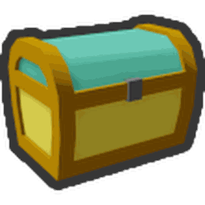

# Beequip Case

{ align=right width=150 }

*"Holds accessories for your bees to wear!"*

The **Beequip Case** is a permanent inventory item that holds your [Beequips](beequip.md). Open it to put Beequips on your bees or take them off.

## Ways to obtain

* [Dapper Bear](dapper-bear.md) gives you one if you don't have a case.

## Beequip Case Slot

{ align=right width=80 }

*"Expands the capacity of your Beequip Case by 1."*

* [Dapper Bear](dapper-bear.md)'s quests: every even-numbered quest from 2 to 20 gives 1.

## Beequip Storage Slot

{ align=right width=80 }

*"Expands the capacity of your Beequip Storage by 1."*

* Bought with [honey](honey.md). The price goes up with each slot you own.

## See also

* [Beequip](beequip.md)
