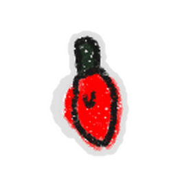

# Beesmas Lights

{ align=right width=150 }

This piece of content goes bye bye.

The following content has been removed from the game. The contents below may be archival, but feel free to edit below.

**Beesmas Lights** would appear in fields as the player collects pollen after completing [Science Bear's](science-bear.md) Beesmas Lights [quest](quests.md).

They fall from the sky in a similar way to the [Star Shower passive](passive-abilities.md#Star_Shower), taking 2 seconds to fall. Whenever a Beesmas Light is caught, it grants the [Inspire](ability-tokens.md#Inspire) buff and converts based on the player's [convert total](system-page.md#Convert_Total). If the player doesn't catch it, the light collects pollen instead. Beesmas Lights spawn after collecting 25 Ability Tokens (with a 30 second cooldown), dropping 5 lights into the field. Beesmas Lights spawn in any field, including the [Ant Field](ant-field.md).

If the player approaches the switch for the Beesmas Lights, located beside [Science Bear](science-bear.md) and has not yet completed his quest, a text box will display reading the following text: "This [*sic*] Beesmas Lights aren't powering on..."

## Trivia

* The Beesmas Lights has the same function as the [Star Shower passive](passive-abilities.md#Star_Shower) with the difference of the fact that the star shower is more focused in a small area than Beesmas Lights.
  * This means that if the passive is disregarded, the Beesmas Lights are the only way to get the inspire buff without [gifted bees](gifted-bee.md) or redeeming certain [codes](codes.md).
* Catching a falling Beesmas Light has a 1 in 10,000 chance to reward a Red/Blue/Green/Yellow Falling Beesmas Light [sticker](sticker.md) (depending on the color of the light).
* Even though falling Beesmas Lights were introduced during the Beesmas 2020 event, the Beesmas Light decorations along the mountain were present during prior Beesmas events.
* Over the course of the removal of several Beesmas events, Beesmas Lights would still fall into fields a few days after Beesmas was over.
  * [Bubble Bee Man](bubble-bee-man.md)'s Beesmas quest dialogue also tends to take longer to be removed.
* The text displayed when standing under the light switch for the Beesmas Lights displays "This Beesmas Lights" instead of "The Beesmas Lights". This is likely an oversight by Onett.
