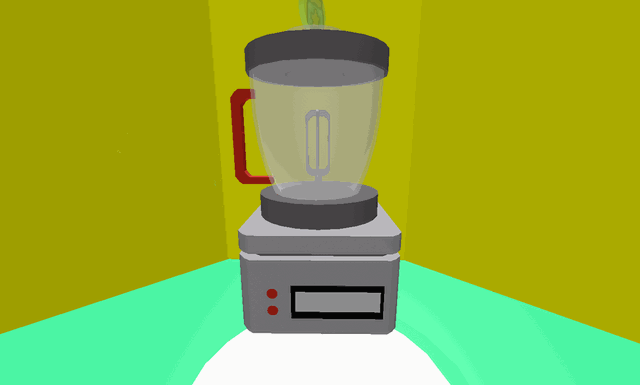
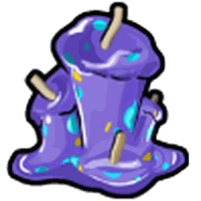

# Blender

<aside class="portable-infobox pi-background pi-border-color pi-theme-wikia pi-layout-stacked" role="region">
<h2 class="pi-item pi-item-spacing pi-title pi-secondary-background" data-source="title">Blender</h2>
<figure class="pi-item pi-image pi-photo"></figure>
<section class="pi-item pi-group pi-border-color">
<h2 class="pi-item pi-header pi-secondary-font pi-item-spacing pi-secondary-background">Information</h2>

<h3 class="pi-data-label pi-secondary-font">Usage</h3>

Crafting consumable items from ingredients

<h3 class="pi-data-label pi-secondary-font">Requirement(s)</h3>

Access to the <a href="badge-bearer-s-guild.html">Badge Bearer's Guild</a>

<h3 class="pi-data-label pi-secondary-font">Cooldown</h3>

None

<h3 class="pi-data-label pi-secondary-font">Location</h3>

Inside the <a href="badge-bearer-s-guild.html">Badge Bearer's Guild</a>

</section>
</aside>

The **Blender** is a machine located in the [Badge Bearer's Guild](badge-bearer-s-guild.md). The machine's usage is to create consumable [items](items.md) from pre-existing items. However, the player is only able to craft one type of item at a time. There is a total of 24 different items that the machine can craft.

## Crafting

Each item takes 5 minutes to craft and the timer only counts down when the player is in-game, unless they have an [Offline Voucher](sticker.md#Sticker_Index), in which it will stay active for up to 24 hours after they log out. The player can end the crafting process at any time by clicking on the "End Crafting" button. This will give the player all finished items, and all unfinished items will be turned back into their ingredients and given back to the player. If the button is green, then everything has been blended. If not (red button), then the Blender has not finished blending. The player can also speed up the blending for a varying amount of [Tickets](ticket.md). For every 1 item being crafted, the Blender requires 1 more ticket to speed up. Except for [Moon Charms](moon-charm.md) and [Gumdrops](gumdrops.md), for which each ticket serves for speeding up whole 10 items.

<table class="sortable article-table">
<tbody><tr>
<th>
Result

</th>
<th>Ingredients
</th></tr>
<tr>
<td>
 <a href="red-extract.html">Red Extract</a>

</td>
<td>50 <a href="strawberry.html">Strawberries</a> 10 <a href="royal-jelly.html">Royal Jellies</a>
</td></tr>
<tr>
<td>
 <a href="blue-extract.html">Blue Extract</a>

</td>
<td>50 <a href="blueberry.html">Blueberries</a> 10 <a href="royal-jelly.html">Royal Jellies</a>
</td></tr>
<tr>
<td>
 <a href="glue.html">Glue</a>

</td>
<td>50 <a href="gumdrops.html">Gumdrops</a> 10 <a href="royal-jelly.html">Royal Jellies</a>
</td></tr>
<tr>
<td>
 <a href="enzymes.html">Enzymes</a>

</td>
<td>50 <a href="pineapple.html">Pineapples</a> 10 <a href="royal-jelly.html">Royal Jellies</a>
</td></tr>
<tr>
<td>
 <a href="oil.html">Oil</a>

</td>
<td>50 <a href="sunflower-seed.html">Sunflower Seeds</a> 10 <a href="royal-jelly.html">Royal Jellies</a>
</td></tr>
<tr>
<td>
 <a href="gumdrops.html">Gumdrops</a>

</td>
<td>3 <a href="blueberry.html">Blueberries</a> 3 <a href="strawberry.html">Strawberries</a> 3 <a href="pineapple.html">Pineapples</a>
</td></tr>
<tr>
<td>
 <a href="moon-charm.html">Moon Charm</a>

</td>
<td>5 <a href="pineapple.html">Pineapples</a> 5 <a href="gumdrops.html">Gumdrops</a> 1 <a href="royal-jelly.html">Royal Jelly</a>
</td></tr>
<tr>
<td>
 <a href="glitter.html">Glitter</a>

</td>
<td>25 <a href="moon-charm.html">Moon Charms</a> 1 <a href="magic-bean.html">Magic Bean</a>
</td></tr>
<tr>
<td>
 <a href="royal-jelly.html#Star_Jelly">Star Jelly</a>

</td>
<td>100 <a href="royal-jelly.html">Royal Jellies</a> 3 <a href="glitter.html">Glitter</a>
</td></tr>
<tr>
<td>
 <a href="tropical-drink.html">Tropical Drink</a>

</td>
<td>10 <a href="coconut.html">Coconuts</a> 2 <a href="enzymes.html">Enzymes</a> 2 <a href="oil.html">Oils</a>
</td></tr>
<tr>
<td>
 <a href="purple-potion.html">Purple Potion</a>

</td>
<td>3 <a href="neonberry.html">Neonberries</a> 3 <a href="red-extract.html">Red Extracts</a> 3 <a href="blue-extract.html">Blue Extracts</a> 3 <a href="glue.html">Glue</a>
</td></tr>
<tr>
<td>
 <a href="super-smoothie.html">Super Smoothie</a>

</td>
<td>3 <a href="neonberry.html">Neonberries</a> 3 <a href="royal-jelly.html#Star_Jelly">Star Jellies</a> 3 <a href="purple-potion.html">Purple Potions</a> 6 <a href="tropical-drink.html">Tropical Drinks</a>
</td></tr>
<tr>
<td>
 <a href="soft-wax.html">Soft Wax</a>

</td>
<td>5 <a href="honeysuckle.html">Honeysuckles</a> 1 <a href="oil.html">Oil</a> 1 <a href="enzymes.html">Enzymes</a> 10 <a href="royal-jelly.html">Royal Jellies</a>
</td></tr>
<tr>
<td>
 <a href="hard-wax.html">Hard Wax</a>

</td>
<td>3 <a href="soft-wax.html">Soft Waxes</a> 3 <a href="enzymes.html">Enzymes</a> 33 <a href="bitterberry.html">Bitterberries</a> 33 <a href="royal-jelly.html">Royal Jellies</a>
</td></tr>
<tr>
<td>
 <a href="caustic-wax.html">Caustic Wax</a>

</td>
<td>5 <a href="hard-wax.html">Hard Waxes</a> 5 <a href="enzymes.html">Enzymes</a> 25 <a href="neonberry.html">Neonberries</a> 5,252 <a href="royal-jelly.html">Royal Jellies</a>
</td></tr>
<tr>
<td>
 <a href="swirled-wax.html">Swirled Wax</a>

</td>
<td>3 <a href="hard-wax.html">Hard Waxes</a> 9 <a href="soft-wax.html">Soft Waxes</a> 6 <a href="purple-potion.html">Purple Potions</a> 3,333 <a href="royal-jelly.html">Royal Jellies</a>
</td></tr>
<tr>
<td>
 <a href="field-dice.html">Field Dice</a>

</td>
<td>1 <a href="soft-wax.html">Soft Wax</a> 1 <a href="whirligig.html">Whirligig</a> 1 <a href="red-extract.html">Red Extract</a> 1 <a href="blue-extract.html">Blue Extract</a>
</td></tr>
<tr>
<td>
 <a href="smooth-dice.html">Smooth Dice</a>

</td>
<td>3 <a href="field-dice.html">Field Dice</a> 3 <a href="soft-wax.html">Soft Waxes</a> 3 <a href="whirligig.html">Whirligigs</a> 3 <a href="oil.html">Oils</a>
</td></tr>
<tr>
<td>
 <a href="loaded-dice.html">Loaded Dice</a>

</td>
<td>3 <a href="smooth-dice.html">Smooth Dice</a> 3 <a href="hard-wax.html">Hard Waxes</a> 3 <a href="oil.html">Oils</a> 1 <a href="glue.html">Glue</a>
</td></tr>
<tr>
<td>
 <a href="turpentine.html">Turpentine</a>

</td>
<td>10 <a href="super-smoothie.html">Super Smoothies</a> 10 <a href="caustic-wax.html">Caustic Waxes</a> 100 <a href="royal-jelly.html#Star_Jelly">Star Jellies</a> 1,000 <a href="honeysuckle.html">Honeysuckles</a>
</td></tr>
<tr>
<td>
 <a href="marshmallow-bee.html">Marshmallow Bee</a>

</td>
<td>3 <a href="turpentine.html">Turpentines</a> 20 <a href="glitter.html">Glitter</a> 10 <a href="soft-wax.html">Soft Waxes</a> 10 <a href="hard-wax.html">Hard Waxes</a> 10 <a href="swirled-wax.html">Swirled Waxes</a> 10 <a href="caustic-wax.html">Caustic Waxes</a>
</td></tr>
<tr>
<td>
 <a href="debug-wax.html">Debug Wax</a>

</td>
<td>1 <a href="turpentine.html">Turpentine</a> 500 <a href="swirled-wax.html">Swirled Waxes</a> 500 <a href="caustic-wax.html">Caustic Waxes</a>
</td></tr>
<tr>
<td>
 <a href="fluxite-wax.html">Fluxite Wax</a>

</td>
<td>10 <a href="debug-wax.html">Debug Waxes</a> 750 <a href="caustic-wax.html">Caustic Waxes</a> 2,000 <a href="swirled-wax.html">Swirled Waxes</a> 4,000 <a href="hard-wax.html">Hard Waxes</a> 7,500 <a href="soft-wax.html">Soft Waxes</a> 3 <a href="turpentine.html">Turpentines</a>
</td></tr>
<tr>
<td>
 <a href="festive-bean.html">Festive Bean</a>

</td>
<td>50 <a href="gingerbread-bear.html">Gingerbread Bears</a> 500 <a href="magic-bean.html">Magic Beans</a> 1 <a href="marshmallow-bee.html">Marshmallow Bee</a>
</td></tr></tbody></table>

## Trivia

* There is a [Star Jelly](royal-jelly.md#Star_Jelly) token on top of the lid of the Blender. It can be obtained by repeatedly jumping on the handle with enough [Jump Power](system-page.md#Jump_Power) or by standing on the gate to the Ace Badge section and gliding towards the top. Additionally, you may perform a difficult head-hitter to get it.
* If you select to craft something but not actually ‘blend’ it, when you leave the blender and open it up again, it would show that you would select the number of red extracts you want to craft, even if the amount displayed is above the amount you would be able to craft with your resources, though you won't be able to select the Confirm option.
* During the start of the Beesmas 2022, players could make progress for "collect items" quests through blender refunds; however, this was soon fixed.
* Crafting something that requires 2 or more strawberries will appear as [-n Strawberrys], being incorrectly spelt as the correct word should be strawberries.
* 

  Crafting something that requires enzymes will appear as [-n Enzymess], being incorrectly spelt with an extra s at the end. However, if you craft the enzymes themselves, the correct spelling will appear.
* The message above the buttons while crafting appears differently if one has the Offline Voucher redeemed. If the player has the Offline Voucher redeemed, it will say: "You've redeemed the offline voucher! The blender will continue running for up to 24 hours while you are offline."

<table class="mw-collapsible mw-collapsed NavTable">
<tbody><tr>
<th class="NavTitle" colspan="2">Locations
</th></tr>
<tr>
<th class="NavCategory"><a href="fields.html">Fields</a>
</th>
<td class="NavLinks NavLinksBasicOdd"><b><a href="sunflower-field.html">Sunflower Field</a> • <a href="dandelion-field.html">Dandelion Field</a> • <a href="mushroom-field.html">Mushroom Field</a> • <a href="blue-flower-field.html">Blue Flower Field</a> • <a href="clover-field.html">Clover Field</a> • <a href="spider-field.html">Spider Field</a> • <a href="bamboo-field.html">Bamboo Field</a> • <a href="strawberry-field.html">Strawberry Field</a> • <a href="pineapple-patch.html">Pineapple Patch</a> • <a href="stump-field.html">Stump Field</a> • <a href="cactus-field.html">Cactus Field</a> • <a href="pumpkin-patch.html">Pumpkin Patch</a> • <a href="pine-tree-forest.html">Pine Tree Forest</a> • <a href="rose-field.html">Rose Field</a> • <a href="ant-field.html">Ant Field</a> • <a href="hub-field.html">Hub Field</a> • <a href="mountain-top-field.html">Mountain Top Field</a> • <a href="coconut-field.html">Coconut Field</a> • <a href="pepper-patch.html">Pepper Patch</a></b>
</td></tr>
<tr>
<th class="NavCategory"><a href="shops.html">Shops</a>
</th>
<td class="NavLinks NavLinksBasicEven"><b><a href="basic-egg-shop.html">Basic Egg Shop</a> • <a href="boost-market.html">Boost Market</a> • <a href="treat-shop.html">Treat Shop</a> • <a href="gumdrop-shop.html">Gumdrop Shop</a> • <a href="royal-jelly-shop.html">Royal Jelly Shop</a> • <a href="ticket-shop.html">Ticket Shop</a> • <a href="noob-shop.html">Noob Shop</a> • <a href="pro-shop.html">Pro Shop</a> • <a href="magic-bean-shop.html">Magic Bean Shop</a> • <a href="badge-bearer-s-guild.html">Badge Bearer's Guild</a> • <a href="dapper-bear-s-shop.html">Dapper Bear's Shop</a> • <a href="stinger-shop.html">Stinger Shop</a> • <a href="mountain-top-shop.html">Mountain Top Shop</a> • <a href="blue-hq.html">Blue HQ</a> • <a href="red-hq.html">Red HQ</a> • <a href="hub-field-shop.html">Hub Field Shop</a> • <a href="robo-bear-s-shop.html">Robo Bear's Shop</a> • <a href="petal-shop.html">Petal Shop</a> • <a href="coconut-cave.html">Coconut Cave</a> • <a href="ticket-tent.html">Ticket Tent</a> • <a href="robux-shop.html">Robux Shop</a></b>
</td></tr>
<tr>
<th class="NavCategory">Gates
</th>
<td class="NavLinks NavLinksBasicOdd"><b><a href="basic-bee-gate.html">Basic Bee Gate</a> • <a href="brave-bee-gate.html">Brave Bee Gate</a> • <a href="honey-bee-gate.html">Honey Bee Gate</a> • <a href="ant-gate.html">Ant Gate</a> • <a href="lion-bee-gate.html">Lion Bee Gate</a> • <a href="bear-gate.html">Bear Gate</a> • <a href="windy-bee-gate.html">Windy Bee Gate</a></b>
</td></tr>
<tr>
<th class="NavCategory">Machines
</th>
<td class="NavLinks NavLinksBasicEven"><b><a href="honey-dispenser.html">Honey Dispenser</a> • <a href="royal-jelly-dispenser.html">Royal Jelly Dispenser</a> • <a href="treat-dispenser.html">Treat Dispenser</a> • <a href="instant-converter.html">Instant Converter</a> • <a href="wealth-clock.html">Wealth Clock</a> • <a href="moon-amulet-generator.html">Moon Amulet Generator</a> • <a href="memory-match.html">Memory Match</a> • <a href="blue-field-booster.html">Blue Field Booster</a> • <a href="red-field-booster.html">Red Field Booster</a> • <a href="field-booster.html">Field Booster</a> • <a href="blueberry-dispenser.html">Blueberry Dispenser</a> • <a href="strawberry-dispenser.html">Strawberry Dispenser</a> • <a href="blue-extract-dispenser.html">Blue Extract Dispenser</a> • <a href="red-extract-dispenser.html">Red Extract Dispenser</a> • <a href="honeystorm.html">Honeystorm</a> • <a href="special-sprout-summoner.html">Special Sprout Summoner</a> • <a href="free-ant-pass-dispenser.html">Free Ant Pass Dispenser</a> • <a href="ant-pass-dispenser.html">Ant Pass Dispenser</a> • <a href="glue-dispenser.html">Glue Dispenser</a> • <strong class="mw-selflink selflink">Blender</strong> • <a href="coconut-dispenser.html">Coconut Dispenser</a> • <a href="mythic-meteor-shower.html">Mythic Meteor Shower</a> • <a href="free-robo-pass-dispenser.html">Free Robo Pass Dispenser</a> • <a href="robo-pass-dispenser.html">Robo Pass Dispenser</a> • <a href="sticker-stack.html">Sticker Stack</a> • <a href="sticker-printer.html">Sticker Printer</a> • <a href="nectar-condenser.html">Nectar Condenser</a></b>
</td></tr>
<tr>
<th class="NavCategory">Transportation
</th>
<td class="NavLinks NavLinksBasicOdd"><b><a href="slingshot.html">Slingshot</a> • <a href="yellow-cannon.html">Yellow Cannon</a> • <a href="blue-cannon.html">Blue Cannon</a> • <a href="red-cannon.html">Red Cannon</a> • <a href="blue-teleporter.html">Blue Teleporter</a> • <a href="red-teleporter.html">Red Teleporter</a></b>
</td></tr>
<tr>
<th class="NavCategory"><a href="leaderboards.html">Leaderboards</a>
</th>
<td class="NavLinks NavLinksBasicEven"><b><a href="daily-top-honeymakers.html">Daily Top Honeymakers</a> • <a href="all-time-top-honeymakers.html">All-Time Top Honeymakers</a> • <a href="all-time-top-battlers-most-battle-points.html">All-Time Top Battlers</a> • Top Ant Exterminators • Fastest Crab Slayers • Top Stick Bug Fighters • Top Bucko Bee Helpers • Top Riley Bee Helpers • <a href="most-commando-captures.html">Most Commando Captures</a> • Top Brown Bear Helpers • All-Time Top Red Collectors • All-Time Top Blue Collectors • All-Time Top White Collectors • Daily Top Red Collectors • Daily Top Blue Collectors • Daily Top White Collectors • Highest Damage to a Single Puffshroom • Tallest Sticker Stack • Highest Robo Bear Challenge Scores • <a href="highest-snowbear-level.html">Highest Snowbear Level</a> • <a href="highest-robo-party-cake-rank.html">Highest Robo Party Cake Rank</a></b>
</td></tr>
<tr>
<th class="NavCategory">Other Places
</th>
<td class="NavLinks NavLinksBasicOdd"><b><a href="hive.html">Hive</a> • <a href="obstacle-courses.html">Obstacle Courses</a> • King Beetle Lair • <a href="white-tunnel.html">White Tunnel</a> • <a href="werewolf-s-cave.html">Werewolf's Cave</a> • <a href="ant-challenge.html">Ant Challenge</a> • <a href="star-hall.html">Star Hall</a> • <a href="gummy-bear-s-lair.html">Gummy Bear's Lair</a> • <a href="ant-challenge-info.html">Ant Challenge Info</a> • <a href="vicious-bee-egg-claim.html">Vicious Bee Claimer</a> • <a href="gummy-bee-egg-claim.html">Gummy Bee Claimer</a> • <a href="wind-shrine.html">Wind Shrine</a> • <a href="mazes.html">Mazes</a> • <a href="hive-hub.html">Hive Hub</a> • <a href="sticker-seeker-quest-machine.html">Sticker-Seeker Quest Machine</a></b>
</td></tr>
<tr>
<th class="NavCategory">Event Locations
</th>
<td class="NavLinks NavLinksBasicEven"><b><a href="beesmas-tree.html">Beesmas Tree</a> • Computer • <a href="gift-boxes.html">Gift Boxes</a> • <a href="honey-wreath.html">Honey Wreath</a> • <a href="stockings.html">Stockings</a> • <a href="gingerbread-house.html">Gingerbread House</a> • <a href="snowbear-summoner.html">Snowbear Summoner</a> • <a href="beesmas-lights.html">Beesmas Lights</a> • <a href="samovar.html">Samovar</a> • <a href="beesmas-feast.html">Beesmas Feast</a> • <a href="onett-s-lid-art.html">Onett's Lid Art</a> • <a href="wind-shrine.html#Galentine_Shrine">Galentine Shrine</a> • <a href="memory-match.html#Winter_Memory_Match">Winter Memory Match</a> • <a href="snow-machine.html">Snow Machine</a> • <a href="honeyday-candles.html">Honeyday Candles</a> • <a href="robo-party-cake.html">Robo Party Cake</a> • <a href="gummy-beacon.html">Gummy Beacon</a> • <a href="naughty-list.html">Naughty List</a></b>
</td></tr></tbody></table>

