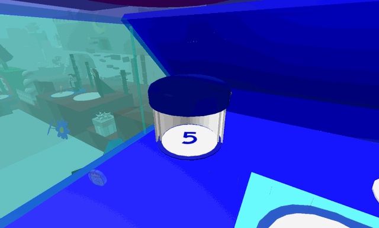

# Blue Field Booster

<aside class="portable-infobox pi-background pi-border-color pi-theme-wikia pi-layout-stacked" role="region">
<h2 class="pi-item pi-item-spacing pi-title pi-secondary-background" data-source="title">Blue Field Booster</h2>
<figure class="pi-item pi-image pi-photo"></figure>
<section class="pi-item pi-group pi-border-color">
<h2 class="pi-item pi-header pi-secondary-font pi-item-spacing pi-secondary-background">Information</h2>

<h3 class="pi-data-label pi-secondary-font">Usage</h3>

Boosting a random blue field for 15 minutes

<h3 class="pi-data-label pi-secondary-font">Requirement(s)</h3>

Access to the <a href="blue-hq.html">Blue HQ</a>

<h3 class="pi-data-label pi-secondary-font">Cooldown</h3>

45 minutes

<h3 class="pi-data-label pi-secondary-font">Location</h3>

On the top floor of the <a href="blue-hq.html">Blue HQ</a>, next to <a href="gifted-bucko-bee.html">Gifted Bucko Bee</a>

</section>
</aside>

The **Blue Field Booster** is a machine that provides a field boost to a random blue field for 15 minutes. It is located on the second floor of the [Blue HQ](blue-hq.md). In order to use it, the player has to have discovered at least 5 different blue [bee](bees.md) types. It has a cooldown of 45 minutes.

The following audio plays when the Blue Field Booster is activated:

## Boosts

* [Blue Flower Field](blue-flower-field.md): +300% [Pollen](pollen.md)
* [Bamboo Field](bamboo-field.md): +100% Pollen
* [Pine Tree Forest](pine-tree-forest.md): +100% Pollen
* [Stump Field](stump-field.md): +100% Pollen (only if Stump Snail is on respawn cooldown.)

## Trivia

* This is one of the three field boosters in the game, along with the [Field Booster](field-booster.md) and the [Red Field Booster](red-field-booster.md).
  * The Blue Field Booster has the same design as the Field Booster and the Red Field Booster, with the only difference being the colors.
* In an update, Bamboo Field Boost was nerfed from 200% to 100% pollen.

<table class="mw-collapsible mw-collapsed NavTable">
<tbody><tr>
<th class="NavTitle" colspan="2">Locations
</th></tr>
<tr>
<th class="NavCategory"><a href="fields.html">Fields</a>
</th>
<td class="NavLinks NavLinksBasicOdd"><b><a href="sunflower-field.html">Sunflower Field</a> • <a href="dandelion-field.html">Dandelion Field</a> • <a href="mushroom-field.html">Mushroom Field</a> • <a href="blue-flower-field.html">Blue Flower Field</a> • <a href="clover-field.html">Clover Field</a> • <a href="spider-field.html">Spider Field</a> • <a href="bamboo-field.html">Bamboo Field</a> • <a href="strawberry-field.html">Strawberry Field</a> • <a href="pineapple-patch.html">Pineapple Patch</a> • <a href="stump-field.html">Stump Field</a> • <a href="cactus-field.html">Cactus Field</a> • <a href="pumpkin-patch.html">Pumpkin Patch</a> • <a href="pine-tree-forest.html">Pine Tree Forest</a> • <a href="rose-field.html">Rose Field</a> • <a href="ant-field.html">Ant Field</a> • <a href="hub-field.html">Hub Field</a> • <a href="mountain-top-field.html">Mountain Top Field</a> • <a href="coconut-field.html">Coconut Field</a> • <a href="pepper-patch.html">Pepper Patch</a></b>
</td></tr>
<tr>
<th class="NavCategory"><a href="shops.html">Shops</a>
</th>
<td class="NavLinks NavLinksBasicEven"><b><a href="basic-egg-shop.html">Basic Egg Shop</a> • <a href="boost-market.html">Boost Market</a> • <a href="treat-shop.html">Treat Shop</a> • <a href="gumdrop-shop.html">Gumdrop Shop</a> • <a href="royal-jelly-shop.html">Royal Jelly Shop</a> • <a href="ticket-shop.html">Ticket Shop</a> • <a href="noob-shop.html">Noob Shop</a> • <a href="pro-shop.html">Pro Shop</a> • <a href="magic-bean-shop.html">Magic Bean Shop</a> • <a href="badge-bearer-s-guild.html">Badge Bearer's Guild</a> • <a href="dapper-bear-s-shop.html">Dapper Bear's Shop</a> • <a href="stinger-shop.html">Stinger Shop</a> • <a href="mountain-top-shop.html">Mountain Top Shop</a> • <a href="blue-hq.html">Blue HQ</a> • <a href="red-hq.html">Red HQ</a> • <a href="hub-field-shop.html">Hub Field Shop</a> • <a href="robo-bear-s-shop.html">Robo Bear's Shop</a> • <a href="petal-shop.html">Petal Shop</a> • <a href="coconut-cave.html">Coconut Cave</a> • <a href="ticket-tent.html">Ticket Tent</a> • <a href="robux-shop.html">Robux Shop</a></b>
</td></tr>
<tr>
<th class="NavCategory">Gates
</th>
<td class="NavLinks NavLinksBasicOdd"><b><a href="basic-bee-gate.html">Basic Bee Gate</a> • <a href="brave-bee-gate.html">Brave Bee Gate</a> • <a href="honey-bee-gate.html">Honey Bee Gate</a> • <a href="ant-gate.html">Ant Gate</a> • <a href="lion-bee-gate.html">Lion Bee Gate</a> • <a href="bear-gate.html">Bear Gate</a> • <a href="windy-bee-gate.html">Windy Bee Gate</a></b>
</td></tr>
<tr>
<th class="NavCategory">Machines
</th>
<td class="NavLinks NavLinksBasicEven"><b><a href="honey-dispenser.html">Honey Dispenser</a> • <a href="royal-jelly-dispenser.html">Royal Jelly Dispenser</a> • <a href="treat-dispenser.html">Treat Dispenser</a> • <a href="instant-converter.html">Instant Converter</a> • <a href="wealth-clock.html">Wealth Clock</a> • <a href="moon-amulet-generator.html">Moon Amulet Generator</a> • <a href="memory-match.html">Memory Match</a> • <strong class="mw-selflink selflink">Blue Field Booster</strong> • <a href="red-field-booster.html">Red Field Booster</a> • <a href="field-booster.html">Field Booster</a> • <a href="blueberry-dispenser.html">Blueberry Dispenser</a> • <a href="strawberry-dispenser.html">Strawberry Dispenser</a> • <a href="honeystorm.html">Honeystorm</a> • <a href="special-sprout-summoner.html">Special Sprout Summoner</a> • <a href="free-ant-pass-dispenser.html">Free Ant Pass Dispenser</a> • <a href="ant-pass-dispenser.html">Ant Pass Dispenser</a> • <a href="glue-dispenser.html">Glue Dispenser</a> • <a href="blender.html">Blender</a> • <a href="coconut-dispenser.html">Coconut Dispenser</a> • <a href="mythic-meteor-shower.html">Mythic Meteor Shower</a> • <a href="free-robo-pass-dispenser.html">Free Robo Pass Dispenser</a> • <a href="robo-pass-dispenser.html">Robo Pass Dispenser</a> • <a href="sticker-stack.html">Sticker Stack</a> • <a href="sticker-printer.html">Sticker Printer</a> • <a href="nectar-condenser.html">Nectar Condenser</a></b>
</td></tr>
<tr>
<th class="NavCategory">Transportation
</th>
<td class="NavLinks NavLinksBasicOdd"><b><a href="slingshot.html">Slingshot</a> • <a href="yellow-cannon.html">Yellow Cannon</a> • <a href="blue-cannon.html">Blue Cannon</a> • <a href="red-cannon.html">Red Cannon</a> • <a href="blue-teleporter.html">Blue Teleporter</a> • <a href="red-teleporter.html">Red Teleporter</a></b>
</td></tr>
<tr>
<th class="NavCategory"><a href="leaderboards.html">Leaderboards</a>
</th>
<td class="NavLinks NavLinksBasicEven"><b><a href="daily-top-honeymakers.html">Daily Top Honeymakers</a> • <a href="all-time-top-honeymakers.html">All-Time Top Honeymakers</a> • <a href="all-time-top-battlers-most-battle-points.html">All-Time Top Battlers</a> • Top Ant Exterminators • Fastest Crab Slayers • Top Stick Bug Fighters • Top Bucko Bee Helpers • Top Riley Bee Helpers • <a href="most-commando-captures.html">Most Commando Captures</a> • Top Brown Bear Helpers • All-Time Top Red Collectors • All-Time Top Blue Collectors • All-Time Top White Collectors • Daily Top Red Collectors • Daily Top Blue Collectors • Daily Top White Collectors • Highest Damage to a Single Puffshroom • Tallest Sticker Stack • Highest Robo Bear Challenge Scores • <a href="highest-snowbear-level.html">Highest Snowbear Level</a> • <a href="highest-robo-party-cake-rank.html">Highest Robo Party Cake Rank</a></b>
</td></tr>
<tr>
<th class="NavCategory">Other Places
</th>
<td class="NavLinks NavLinksBasicOdd"><b><a href="hive.html">Hive</a> • <a href="obstacle-courses.html">Obstacle Courses</a> • King Beetle Lair • <a href="white-tunnel.html">White Tunnel</a> • <a href="werewolf-s-cave.html">Werewolf's Cave</a> • <a href="ant-challenge.html">Ant Challenge</a> • <a href="star-hall.html">Star Hall</a> • <a href="gummy-bear-s-lair.html">Gummy Bear's Lair</a> • <a href="ant-challenge-info.html">Ant Challenge Info</a> • <a href="vicious-bee-egg-claim.html">Vicious Bee Egg Claim</a> • <a href="gummy-bee-egg-claim.html">Gummy Bee Egg Claim</a> • <a href="wind-shrine.html">Wind Shrine</a> • <a href="mazes.html">Mazes</a> • <a href="hive-hub.html">Hive Hub</a> • <a href="sticker-seeker-quest-machine.html">Sticker-Seeker Quest Machine</a></b>
</td></tr>
<tr>
<th class="NavCategory">Event Locations
</th>
<td class="NavLinks NavLinksBasicEven"><b><a href="beesmas-tree.html">Beesmas Tree</a> • Computer • <a href="gift-boxes.html">Gift Boxes</a> • <a href="honey-wreath.html">Honey Wreath</a> • <a href="stockings.html">Stockings</a> • <a href="gingerbread-house.html">Gingerbread House</a> • <a href="snowbear-summoner.html">Snowbear Summoner</a> • <a href="beesmas-lights.html">Beesmas Lights</a> • <a href="samovar.html">Samovar</a> • <a href="beesmas-feast.html">Beesmas Feast</a> • <a href="onett-s-lid-art.html">Onett's Lid Art</a> • <a href="wind-shrine.html#Galentine_Shrine">Galentine Shrine</a> • <a href="memory-match.html#Winter_Memory_Match">Winter Memory Match</a> • <a href="snow-machine.html">Snow Machine</a> • <a href="honeyday-candles.html">Honeyday Candles</a> • <a href="robo-party-cake.html">Robo Party Cake</a> • <a href="gummy-beacon.html">Gummy Beacon</a> • <a href="naughty-list.html">Naughty List</a></b>
</td></tr></tbody></table>
