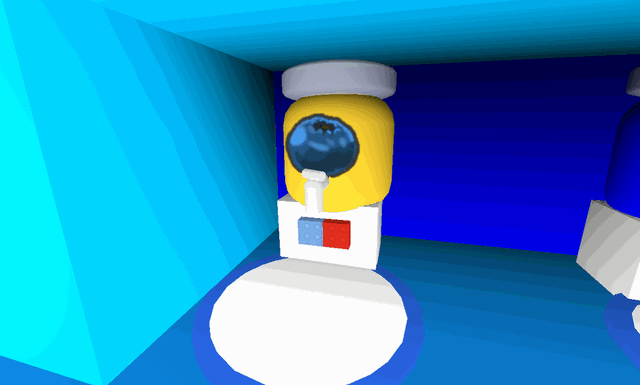

# Blueberry Dispenser

This piece of content contains information obtained through datamining.

Due to the nature of the information, details may be inaccurate or outdated.

Datamined information: The formula for the amount of Honey and Blueberries received based on the number of bees in the player's hive. The table was made using in-game tests. — February 26th, 2026

<aside class="portable-infobox pi-background pi-border-color pi-theme-wikia pi-layout-stacked" role="region">
<h2 class="pi-item pi-item-spacing pi-title pi-secondary-background" data-source="title">Blueberry Dispenser</h2>
<figure class="pi-item pi-image pi-photo"></figure>
<section class="pi-item pi-group pi-border-color">
<h2 class="pi-item pi-header pi-secondary-font pi-item-spacing pi-secondary-background">Information</h2>

<h3 class="pi-data-label pi-secondary-font">Usage</h3>

Grants:
<a href="blueberry.html">Blueberries</a>  <a href="honey.html">Honey</a>  x10 <a href="ability-tokens.html#Boost">Blue Boost Tokens</a>  x5 <a href="ability-tokens.html#Haste">Haste</a>  

<h3 class="pi-data-label pi-secondary-font">Requirement(s)</h3>

Access to the <a href="blue-hq.html">Blue HQ</a>

<h3 class="pi-data-label pi-secondary-font">Cooldown</h3>

4 hours

<h3 class="pi-data-label pi-secondary-font">Location</h3>

Inside the <a href="blue-hq.html">Blue HQ</a>. to the right

</section>
</aside>

The **Blueberry Dispenser** is a Dispenser located on the first floor of the [Blue HQ](blue-hq.md), next to the [Blue Teleporter](blue-teleporter.md). When used, it grants the player [honey](honey.md), [haste](ability-tokens.md#Haste) x5, [blue boost](ability-tokens.md#Boost) x10, and 1 [blueberry](blueberry.md) for each Blue [bee](bees.md) in the player's [hive](hive.md).

It has a cooldown of 4 hours.

If the player does not have any blue bees in their hive, it will not grant any blueberries.

The player must be in the Bee Swarm Simulator Club in order to use this.

## Honey and Blueberry reward amounts

The amount of honey and blueberries given is based on the number of Blue bees the player has in their hive. More specifically, let *cnt* be the number of Blue bees in the player's hive:

* The amount of honey the player receives is equal to \(\left\lfloor {cnt}^{1.5}+0.5\right\rfloor \times 200\), or 500 if the result is less than 500.
* The amount of blueberries the player receives is equal to *cnt*.

Below is a table of the amount of honey a player receives, given the number of Blue bees they have.

<table class="mw-collapsible mw-collapsed fandom-table">
<tbody><tr>
<th>Bees
</th>
<th>Honey
</th>
<th>Bees
</th>
<th>Honey
</th></tr>
<tr>
<td>0-1
</td>
<td>500
</td>
<td>26
</td>
<td>26,600
</td></tr>
<tr>
<td>2
</td>
<td>600
</td>
<td>27
</td>
<td>28,000
</td></tr>
<tr>
<td>3
</td>
<td>1,000
</td>
<td>28
</td>
<td>29,600
</td></tr>
<tr>
<td>4
</td>
<td>1,600
</td>
<td>29
</td>
<td>31,200
</td></tr>
<tr>
<td>5
</td>
<td>2,200
</td>
<td>30
</td>
<td>32,800
</td></tr>
<tr>
<td>6
</td>
<td>3,000
</td>
<td>31
</td>
<td>34,600
</td></tr>
<tr>
<td>7
</td>
<td>3,800
</td>
<td>32
</td>
<td>36,200
</td></tr>
<tr>
<td>8
</td>
<td>4,600
</td>
<td>33
</td>
<td>38,000
</td></tr>
<tr>
<td>9
</td>
<td>5,400
</td>
<td>34
</td>
<td>39,600
</td></tr>
<tr>
<td>10
</td>
<td>6,400
</td>
<td>35
</td>
<td>41,400
</td></tr>
<tr>
<td>11
</td>
<td>7,200
</td>
<td>36
</td>
<td>43,200
</td></tr>
<tr>
<td>12
</td>
<td>8,400
</td>
<td>37
</td>
<td>45,000
</td></tr>
<tr>
<td>13
</td>
<td>9,400
</td>
<td>38
</td>
<td>46,800
</td></tr>
<tr>
<td>14
</td>
<td>10,400
</td>
<td>39
</td>
<td>48,800
</td></tr>
<tr>
<td>15
</td>
<td>11,600
</td>
<td>40
</td>
<td>50,600
</td></tr>
<tr>
<td>16
</td>
<td>12,800
</td>
<td>41
</td>
<td>52,600
</td></tr>
<tr>
<td>17
</td>
<td>14,000
</td>
<td>42
</td>
<td>54,400
</td></tr>
<tr>
<td>18
</td>
<td>15,200
</td>
<td>43
</td>
<td>56,400
</td></tr>
<tr>
<td>19
</td>
<td>16,600
</td>
<td>44
</td>
<td>58,400
</td></tr>
<tr>
<td>20
</td>
<td>17,800
</td>
<td>45
</td>
<td>60,400
</td></tr>
<tr>
<td>21
</td>
<td>19,200
</td>
<td>46
</td>
<td>62,400
</td></tr>
<tr>
<td>22
</td>
<td>20,600
</td>
<td>47
</td>
<td>64,400
</td></tr>
<tr>
<td>23
</td>
<td>22,000
</td>
<td>48
</td>
<td>66,600
</td></tr>
<tr>
<td>24
</td>
<td>23,600
</td>
<td>49
</td>
<td>68,600
</td></tr>
<tr>
<td>25
</td>
<td>25,000
</td>
<td>50
</td>
<td>70,800
</td></tr></tbody></table>

## Trivia

* Before the 2018-11-25 update, the Blueberry Dispenser was in the [Gifted Bucko Bee](gifted-bucko-bee.md)'s spot. However, it was moved after said update to make room for the NPC.
* The only time this dispenser appears in a quest is in [Science Bear's](science-bear.md) *"The Power of Information"*.
* This dispenser gives the same honey per bee as the [Strawberry Dispenser](strawberry-dispenser.md).
* This is one of three dispensers that give [treats](treats.md) in the game with the other two being the [Treat Dispenser](treat-dispenser.md) and the Strawberry Dispenser.
* This is one of four dispensers requiring the player to be part of the Bee Swarm Simulator Club with the others being the [Honey Dispenser](honey-dispenser.md), the Treat Dispenser, and the Strawberry Dispenser.

<table class="mw-collapsible mw-collapsed NavTable">
<tbody><tr>
<th class="NavTitle" colspan="2">Locations
</th></tr>
<tr>
<th class="NavCategory"><a href="fields.html">Fields</a>
</th>
<td class="NavLinks NavLinksBasicOdd"><b><a href="sunflower-field.html">Sunflower Field</a> • <a href="dandelion-field.html">Dandelion Field</a> • <a href="mushroom-field.html">Mushroom Field</a> • <a href="blue-flower-field.html">Blue Flower Field</a> • <a href="clover-field.html">Clover Field</a> • <a href="spider-field.html">Spider Field</a> • <a href="bamboo-field.html">Bamboo Field</a> • <a href="strawberry-field.html">Strawberry Field</a> • <a href="pineapple-patch.html">Pineapple Patch</a> • <a href="stump-field.html">Stump Field</a> • <a href="cactus-field.html">Cactus Field</a> • <a href="pumpkin-patch.html">Pumpkin Patch</a> • <a href="pine-tree-forest.html">Pine Tree Forest</a> • <a href="rose-field.html">Rose Field</a> • <a href="ant-field.html">Ant Field</a> • <a href="hub-field.html">Hub Field</a> • <a href="mountain-top-field.html">Mountain Top Field</a> • <a href="coconut-field.html">Coconut Field</a> • <a href="pepper-patch.html">Pepper Patch</a></b>
</td></tr>
<tr>
<th class="NavCategory"><a href="shops.html">Shops</a>
</th>
<td class="NavLinks NavLinksBasicEven"><b><a href="basic-egg-shop.html">Basic Egg Shop</a> • <a href="boost-market.html">Boost Market</a> • <a href="treat-shop.html">Treat Shop</a> • <a href="gumdrop-shop.html">Gumdrop Shop</a> • <a href="royal-jelly-shop.html">Royal Jelly Shop</a> • <a href="ticket-shop.html">Ticket Shop</a> • <a href="noob-shop.html">Noob Shop</a> • <a href="pro-shop.html">Pro Shop</a> • <a href="magic-bean-shop.html">Magic Bean Shop</a> • <a href="badge-bearer-s-guild.html">Badge Bearer's Guild</a> • <a href="dapper-bear-s-shop.html">Dapper Bear's Shop</a> • <a href="stinger-shop.html">Stinger Shop</a> • <a href="mountain-top-shop.html">Mountain Top Shop</a> • <a href="blue-hq.html">Blue HQ</a> • <a href="red-hq.html">Red HQ</a> • <a href="hub-field-shop.html">Hub Field Shop</a> • <a href="robo-bear-s-shop.html">Robo Bear's Shop</a> • <a href="petal-shop.html">Petal Shop</a> • <a href="coconut-cave.html">Coconut Cave</a> • <a href="ticket-tent.html">Ticket Tent</a> • <a href="robux-shop.html">Robux Shop</a></b>
</td></tr>
<tr>
<th class="NavCategory">Gates
</th>
<td class="NavLinks NavLinksBasicOdd"><b><a href="basic-bee-gate.html">Basic Bee Gate</a> • <a href="brave-bee-gate.html">Brave Bee Gate</a> • <a href="honey-bee-gate.html">Honey Bee Gate</a> • <a href="ant-gate.html">Ant Gate</a> • <a href="lion-bee-gate.html">Lion Bee Gate</a> • <a href="bear-gate.html">Bear Gate</a> • <a href="windy-bee-gate.html">Windy Bee Gate</a></b>
</td></tr>
<tr>
<th class="NavCategory">Machines
</th>
<td class="NavLinks NavLinksBasicEven"><b><a href="honey-dispenser.html">Honey Dispenser</a> • <a href="royal-jelly-dispenser.html">Royal Jelly Dispenser</a> • <a href="treat-dispenser.html">Treat Dispenser</a> • <a href="instant-converter.html">Instant Converter</a> • <a href="wealth-clock.html">Wealth Clock</a> • <a href="moon-amulet-generator.html">Moon Amulet Generator</a> • <a href="memory-match.html">Memory Match</a> • <a href="blue-field-booster.html">Blue Field Booster</a> • <a href="red-field-booster.html">Red Field Booster</a> • <a href="field-booster.html">Field Booster</a> • <strong class="mw-selflink selflink">Blueberry Dispenser</strong> • <a href="strawberry-dispenser.html">Strawberry Dispenser</a> • <a href="honeystorm.html">Honeystorm</a> • <a href="special-sprout-summoner.html">Special Sprout Summoner</a> • <a href="free-ant-pass-dispenser.html">Free Ant Pass Dispenser</a> • <a href="ant-pass-dispenser.html">Ant Pass Dispenser</a> • <a href="glue-dispenser.html">Glue Dispenser</a> • <a href="blender.html">Blender</a> • <a href="coconut-dispenser.html">Coconut Dispenser</a> • <a href="mythic-meteor-shower.html">Mythic Meteor Shower</a> • <a href="free-robo-pass-dispenser.html">Free Robo Pass Dispenser</a> • <a href="robo-pass-dispenser.html">Robo Pass Dispenser</a> • <a href="sticker-stack.html">Sticker Stack</a> • <a href="sticker-printer.html">Sticker Printer</a> • <a href="nectar-condenser.html">Nectar Condenser</a></b>
</td></tr>
<tr>
<th class="NavCategory">Transportation
</th>
<td class="NavLinks NavLinksBasicOdd"><b><a href="slingshot.html">Slingshot</a> • <a href="yellow-cannon.html">Yellow Cannon</a> • <a href="blue-cannon.html">Blue Cannon</a> • <a href="red-cannon.html">Red Cannon</a> • <a href="blue-teleporter.html">Blue Teleporter</a> • <a href="red-teleporter.html">Red Teleporter</a></b>
</td></tr>
<tr>
<th class="NavCategory"><a href="leaderboards.html">Leaderboards</a>
</th>
<td class="NavLinks NavLinksBasicEven"><b><a href="daily-top-honeymakers.html">Daily Top Honeymakers</a> • <a href="all-time-top-honeymakers.html">All-Time Top Honeymakers</a> • <a href="all-time-top-battlers-most-battle-points.html">All-Time Top Battlers</a> • Top Ant Exterminators • Fastest Crab Slayers • Top Stick Bug Fighters • Top Bucko Bee Helpers • Top Riley Bee Helpers • <a href="most-commando-captures.html">Most Commando Captures</a> • Top Brown Bear Helpers • All-Time Top Red Collectors • All-Time Top Blue Collectors • All-Time Top White Collectors • Daily Top Red Collectors • Daily Top Blue Collectors • Daily Top White Collectors • Highest Damage to a Single Puffshroom • Tallest Sticker Stack • Highest Robo Bear Challenge Scores • <a href="highest-snowbear-level.html">Highest Snowbear Level</a> • <a href="highest-robo-party-cake-rank.html">Highest Robo Party Cake Rank</a></b>
</td></tr>
<tr>
<th class="NavCategory">Other Places
</th>
<td class="NavLinks NavLinksBasicOdd"><b><a href="hive.html">Hive</a> • <a href="obstacle-courses.html">Obstacle Courses</a> • King Beetle Lair • <a href="white-tunnel.html">White Tunnel</a> • <a href="werewolf-s-cave.html">Werewolf's Cave</a> • <a href="ant-challenge.html">Ant Challenge</a> • <a href="star-hall.html">Star Hall</a> • <a href="gummy-bear-s-lair.html">Gummy Bear's Lair</a> • <a href="ant-challenge-info.html">Ant Challenge Info</a> • <a href="vicious-bee-egg-claim.html">Vicious Bee Egg Claim</a> • <a href="gummy-bee-egg-claim.html">Gummy Bee Egg Claim</a> • <a href="wind-shrine.html">Wind Shrine</a> • <a href="mazes.html">Mazes</a> • <a href="hive-hub.html">Hive Hub</a> • <a href="sticker-seeker-quest-machine.html">Sticker-Seeker Quest Machine</a></b>
</td></tr>
<tr>
<th class="NavCategory">Event Locations
</th>
<td class="NavLinks NavLinksBasicEven"><b><a href="beesmas-tree.html">Beesmas Tree</a> • Computer • <a href="gift-boxes.html">Gift Boxes</a> • <a href="honey-wreath.html">Honey Wreath</a> • <a href="stockings.html">Stockings</a> • <a href="gingerbread-house.html">Gingerbread House</a> • <a href="snowbear-summoner.html">Snowbear Summoner</a> • <a href="beesmas-lights.html">Beesmas Lights</a> • <a href="samovar.html">Samovar</a> • <a href="beesmas-feast.html">Beesmas Feast</a> • <a href="onett-s-lid-art.html">Onett's Lid Art</a> • <a href="wind-shrine.html#Galentine_Shrine">Galentine Shrine</a> • <a href="memory-match.html#Winter_Memory_Match">Winter Memory Match</a> • <a href="snow-machine.html">Snow Machine</a> • <a href="honeyday-candles.html">Honeyday Candles</a> • <a href="robo-party-cake.html">Robo Party Cake</a> • <a href="gummy-beacon.html">Gummy Beacon</a> • <a href="naughty-list.html">Naughty List</a></b>
</td></tr></tbody></table>
