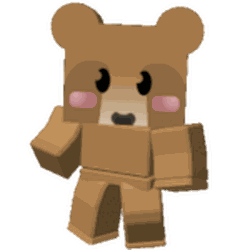

# Brown Bear

{ align=right width=150 }

This piece of content contains information obtained through datamining.

Due to the nature of the information, details may be inaccurate or outdated.

<table class="infobox" style="font-size:12px; color:white; width:300px; background:#a58b59;padding:0; border:none; color:#FFF;">
<tbody><tr>
<td colspan="2" style="background-color:#684a12; font-size:2vh; text-align: center; padding: 15px 0; color:#FFF"><b>Brown Bear</b>
</td></tr>
<tr>
<td colspan="2">
 

</td></tr>
<tr>
<td colspan="2" style="background-color:#684a12; text-align:center">Overview
</td></tr>
<tr>
<td style="padding-left:5px;">Species
</td>
<td>Quest Bear
</td></tr>
<tr>
<td style="padding-left:5px;">Location
</td>
<td>Near the Clover Field and the Wealth Clock.
</td></tr>
<tr>
<td style="padding-left:5px;">Bee Prerequisites
</td>
<td>None
</td></tr>
<tr>
<td colspan="2" style="background-color:#684a12; text-align:center">Color Scheme
</td></tr>
<tr>
<td colspan="2">
<table>
<tbody><tr>
<td>
 

Fur

#634929

</td><td>
 

Fur Shade

#554026

</td></tr>
<tr>
<td>
 

Snout

#634929

#C8A77F

</td><td>
 

Torso

#785d3d

</td></tr>
<tr>
<td>
 

Arms

#94744e

</td><td>
 

Legs

#634b2f

</td></tr>

</tbody></table>
</td></tr></tbody></table>

**Brown Bear** is a [quest giver](quest-givers.md) and one of eight permanent bears that can be accessed in the game, the others being [Black Bear](black-bear.md), [Mother Bear](mother-bear.md), [Panda Bear](panda-bear.md), [Science Bear](science-bear.md), [Dapper Bear](dapper-bear.md), [Polar Bear](polar-bear.md), and [Spirit Bear](spirit-bear.md). He is located behind the [Clover Field](clover-field.md) and next to the [Wealth Clock](wealth-clock.md) and the Top Brown Bear Helpers leaderboard. His [quests](quests.md) primarily focus on collecting [pollen](pollen.md) from randomized [fields](fields.md). After initiating a quest, a new one will be available in 1 hour.

## Quests

Brown Bear is an infinite quest giver. His quests requires collecting pollen from a selection of fields, scaling up in difficulty the more the player completes, with the reward also getting bigger the more difficult it gets. Certain quests are only given if the player has reached a minimum number of bees.

### Scaling

The amount of quests the player has to collect from a field is defined by the function \(P(x)\), where \(x\) is a hard-coded number that is different for each quest. The value of \(P(x)\) scales with the number of Brown Bear quests the player has done.

The function \(P(x)\) is defined as follows:

* \(cnt\) be the number of Brown Bear quests the player has done as of claiming the quest.
* We define 3 variables:
  * \(base=\left\lfloor {\frac {2500\times x+0.5}{100}}\right\rfloor \times 100\)
  * \(inc=\left\lfloor {\frac {5000\times x+0.5}{100}}\right\rfloor \times 100\)
  * \(max=\left\lfloor {\frac {10000000000000\times x+0.5}{100}}\right\rfloor \times 100\)
* Then, we take the following steps:
  * \(basePollen=base+cnt\times inc\)
  * \(scaling\) be equal to:
    * \({({\frac {cnt}{1000}})}^{4}\) if \({\frac {cnt}{1000}}<1\)
    * \({({\frac {cnt}{1000}})}^{2}\) otherwise
  * \(requiredPollen=basePollen+(max-basePollen)\times scaling\)
  * \(interval=10^{\max(\left\lfloor \log _{10}(requiredPollen)\right\rfloor -1,1)}\)
  * \(roundedPollen=\left\lfloor {\frac {requiredPollen}{interval}}+0.5\right\rfloor \times interval\)
  * The function returns \(roundedPollen\).

### Possible quests

There are a total of 41 different quests Brown Bear can give.

<table class="article-table mw-collapsible mw-collapsed">
<tbody><tr>
<th>Quest name
</th>
<th>Minimum number of bees required
</th>
<th>Requirements
</th></tr>
<tr>
<td>Brown Bear: Sun-Dand
</td>
<td>0
</td>
<td>
<ul><li>Collect \(P(0.3)\) Pollen from Sunflower Field.</li>
<li>Collect \(P(0.3)\) Pollen from Dandelion Field.</li></ul>
</td></tr>
<tr>
<td>Brown Bear: Mush-Clove
</td>
<td>0
</td>
<td>
<ul><li>Collect \(P(0.5)\) Pollen from Clover Field.</li>
<li>Collect \(P(0.3)\) Pollen from Mushroom Field.</li></ul>
</td></tr>
<tr>
<td>Brown Bear: Bluf-Clove
</td>
<td>0
</td>
<td>
<ul><li>Collect \(P(0.6)\) Pollen from Clover Field.</li>
<li>Collect \(P(0.3)\) Pollen from Blue Flower Field.</li></ul>
</td></tr>
<tr>
<td>Brown Bear: White-Mush
</td>
<td>0
</td>
<td>
<ul><li>Collect \(P(0.6)\) White Pollen.</li>
<li>Collect \(P(0.3)\) Pollen from Mushroom Field.</li></ul>
</td></tr>
<tr>
<td>Brown Bear: White-Bluf
</td>
<td>0
</td>
<td>
<ul><li>Collect \(P(0.6)\) White Pollen.</li>
<li>Collect \(P(0.3)\) Pollen from Blue Flower Field.</li></ul>
</td></tr>
<tr>
<td>Brown Bear: Solo-Clove
</td>
<td>15
</td>
<td>
<ul><li>Collect \(P(1)\) Pollen from Clover Field.</li></ul>
</td></tr>
<tr>
<td>Brown Bear: Straw-Spide
</td>
<td>5
</td>
<td>
<ul><li>Collect \(P(0.5)\) Pollen from Strawberry Field.</li>
<li>Collect \(P(0.5)\) Pollen from Spider Field.</li></ul>
</td></tr>
<tr>
<td>Brown Bear: Bamb-Spide
</td>
<td>5
</td>
<td>
<ul><li>Collect \(P(0.5)\) Pollen from Bamboo Field.</li>
<li>Collect \(P(0.5)\) Pollen from Spider Field.</li></ul>
</td></tr>
<tr>
<td>Brown Bear: White-Bamb-Mush
</td>
<td>5
</td>
<td>
<ul><li>Collect \(P(0.6)\) White Pollen.</li>
<li>Collect \(P(0.4)\) Pollen from Bamboo Field.</li>
<li>Collect \(P(0.3)\) Pollen from Mushroom Field.</li></ul>
</td></tr>
<tr>
<td>Brown Bear: Red-Straw-Sun
</td>
<td>5
</td>
<td>
<ul><li>Collect \(P(0.6)\) Red Pollen.</li>
<li>Collect \(P(0.3)\) Pollen from Strawberry Field.</li>
<li>Collect \(P(0.2)\) Pollen from Sunflower Field.</li></ul>
</td></tr>
<tr>
<td>Brown Bear: Blue-Clov-Spide
</td>
<td>5
</td>
<td>
<ul><li>Collect \(P(0.6)\) Blue Pollen.</li>
<li>Collect \(P(0.3)\) Pollen from Clover Field.</li>
<li>Collect \(P(0.2)\) Pollen from Spider Field.</li></ul>
</td></tr>
<tr>
<td>Brown Bear: Solo-Spide
</td>
<td>5
</td>
<td>
<ul><li>Collect \(P(1.1)\) Pollen from Spider Field.</li></ul>
</td></tr>
<tr>
<td>Brown Bear: Solo-Straw
</td>
<td>5
</td>
<td>
<ul><li>Collect \(P(1.1)\) Pollen from Strawberry Field.</li></ul>
</td></tr>
<tr>
<td>Brown Bear: Solo-Bamb
</td>
<td>5
</td>
<td>
<ul><li>Collect \(P(1.1)\) Pollen from Bamboo Field.</li></ul>
</td></tr>
<tr>
<td>Brown Bear: Blue-Pinap-Clov
</td>
<td>10
</td>
<td>
<ul><li>Collect \(P(0.8)\) Blue Pollen.</li>
<li>Collect \(P(0.6)\) Pollen from Pineapple Patch.</li>
<li>Collect \(P(0.3)\) Pollen from Clover Field.</li></ul>
</td></tr>
<tr>
<td>Brown Bear: Red-Pinap-Dand
</td>
<td>10
</td>
<td>
<ul><li>Collect \(P(0.8)\) Red Pollen.</li>
<li>Collect \(P(0.6)\) Pollen from Pineapple Patch.</li>
<li>Collect \(P(0.2)\) Pollen from Dandelion Field.</li></ul>
</td></tr>
<tr>
<td>Brown Bear: Pinap-Bamb
</td>
<td>10
</td>
<td>
<ul><li>Collect \(P(0.6)\) Pollen from Pineapple Patch.</li>
<li>Collect \(P(0.5)\) Pollen from Bamboo Field.</li></ul>
</td></tr>
<tr>
<td>Brown Bear: Pinap-Straw
</td>
<td>10
</td>
<td>
<ul><li>Collect \(P(0.6)\) Pollen from Pineapple Patch.</li>
<li>Collect \(P(0.5)\) Pollen from Strawberry Field.</li></ul>
</td></tr>
<tr>
<td>Brown Bear: Solo-Cact
</td>
<td>15
</td>
<td>
<ul><li>Collect \(P(1.1)\) Pollen from Cactus Field.</li></ul>
</td></tr>
<tr>
<td>Brown Bear: White-Cact-Sun
</td>
<td>15
</td>
<td>
<ul><li>Collect \(P(0.8)\) White Pollen.</li>
<li>Collect \(P(0.6)\) Pollen from Cactus Field.</li>
<li>Collect \(P(0.3)\) Pollen from Sunflower Field.</li></ul>
</td></tr>
<tr>
<td>Brown Bear: Blue-Pump-Bluf
</td>
<td>15
</td>
<td>
<ul><li>Collect \(P(0.8)\) Blue Pollen.</li>
<li>Collect \(P(0.6)\) Pollen from Pumpkin Patch.</li>
<li>Collect \(P(0.3)\) Pollen from Blue Flower Field.</li></ul>
</td></tr>
<tr>
<td>Brown Bear: Red-Cact-Rose
</td>
<td>15
</td>
<td>
<ul><li>Collect \(P(0.8)\) Red Pollen.</li>
<li>Collect \(P(0.5)\) Pollen from Cactus Field.</li>
<li>Collect \(P(0.5)\) Pollen from Rose Field.</li></ul>
</td></tr>
<tr>
<td>Brown Bear: Blue-Pine-Mush
</td>
<td>15
</td>
<td>
<ul><li>Collect \(P(0.8)\) Blue Pollen.</li>
<li>Collect \(P(0.6)\) Pollen from Pine Tree Forest.</li>
<li>Collect \(P(0.4)\) Pollen from Mushroom Field.</li></ul>
</td></tr>
<tr>
<td>Brown Bear: White-Pine-Straw
</td>
<td>15
</td>
<td>
<ul><li>Collect \(P(0.8)\) White Pollen.</li>
<li>Collect \(P(0.6)\) Pollen from Pine Tree Forest.</li>
<li>Collect \(P(0.4)\) Pollen from Strawberry Field.</li></ul>
</td></tr>
<tr>
<td>Brown Bear: White-Rose-Bamb
</td>
<td>15
</td>
<td>
<ul><li>Collect \(P(0.8)\) White Pollen.</li>
<li>Collect \(P(0.6)\) Pollen from Rose Field.</li>
<li>Collect \(P(0.4)\) Pollen from Bamboo Field.</li></ul>
</td></tr>
<tr>
<td>Brown Bear: Red-Pump-Dand
</td>
<td>15
</td>
<td>
<ul><li>Collect \(P(0.8)\) Red Pollen.</li>
<li>Collect \(P(0.6)\) Pollen from Pumpkin Patch.</li>
<li>Collect \(P(0.4)\) Pollen from Dandelion Field.</li></ul>
</td></tr>
<tr>
<td>Brown Bear: Red-Mount-Mush
</td>
<td>25
</td>
<td>
<ul><li>Collect \(P(0.8)\) Red Pollen.</li>
<li>Collect \(P(0.7)\) Pollen from Mountain Top Field.</li>
<li>Collect \(P(0.4)\) Pollen from Mushroom Field.</li></ul>
</td></tr>
<tr>
<td>Brown Bear: Blue-Mount-Bluf
</td>
<td>25
</td>
<td>
<ul><li>Collect \(P(0.8)\) Blue Pollen.</li>
<li>Collect \(P(0.7)\) Pollen from Mountain Top Field.</li>
<li>Collect \(P(0.4)\) Pollen from Blue Flower Field.</li></ul>
</td></tr>
<tr>
<td>Brown Bear: Solo-Mount
</td>
<td>25
</td>
<td>
<ul><li>Collect \(P(1.2)\) Pollen from Mountain Top Field.</li></ul>
</td></tr>
<tr>
<td>Brown Bear: Mount-Spide-Rose-Pinap
</td>
<td>25
</td>
<td>
<ul><li>Collect \(P(0.4)\) Pollen from Mountain Top Field.</li>
<li>Collect \(P(0.2)\) Pollen from Spider Field.</li>
<li>Collect \(P(0.2)\) Pollen from Rose Field.</li>
<li>Collect \(P(0.2)\) Pollen from Pineapple Patch.</li></ul>
</td></tr>
<tr>
<td>Brown Bear: Mount-Bamb-Pump-Sun
</td>
<td>25
</td>
<td>
<ul><li>Collect \(P(0.4)\) Pollen from Mountain Top Field.</li>
<li>Collect \(P(0.2)\) Pollen from Bamboo Field.</li>
<li>Collect \(P(0.2)\) Pollen from Pumpkin Patch.</li>
<li>Collect \(P(0.2)\) Pollen from Sunflower Field.</li></ul>
</td></tr>
<tr>
<td>Brown Bear: Blue-Coco-Bluf
</td>
<td>35
</td>
<td>
<ul><li>Collect \(P(0.8)\) Blue Pollen.</li>
<li>Collect \(P(0.7)\) Pollen from Coconut Field.</li>
<li>Collect \(P(0.4)\) Pollen from Blue Flower Field.</li></ul>
</td></tr>
<tr>
<td>Brown Bear: Red-Coco-Mush
</td>
<td>35
</td>
<td>
<ul><li>Collect \(P(0.8)\) Red Pollen.</li>
<li>Collect \(P(0.7)\) Pollen from Coconut Field.</li>
<li>Collect \(P(0.4)\) Pollen from Mushroom Field.</li></ul>
</td></tr>
<tr>
<td>Brown Bear: White-Pepp-Pinap
</td>
<td>35
</td>
<td>
<ul><li>Collect \(P(0.8)\) White Pollen.</li>
<li>Collect \(P(0.7)\) Pollen from Pepper Patch.</li>
<li>Collect \(P(0.4)\) Pollen from Pineapple Patch.</li></ul>
</td></tr>
<tr>
<td>Brown Bear: White-Pepp-Bamb
</td>
<td>35
</td>
<td>
<ul><li>Collect \(P(0.8)\) White Pollen.</li>
<li>Collect \(P(0.7)\) Pollen from Pepper Patch.</li>
<li>Collect \(P(0.4)\) Pollen from Bamboo Field.</li></ul>
</td></tr>
<tr>
<td>Brown Bear: Coco-Pepp-Clove-Pine
</td>
<td>35
</td>
<td>
<ul><li>Collect \(P(0.3)\) Pollen from Coconut Field.</li>
<li>Collect \(P(0.3)\) Pollen from Pepper Patch.</li>
<li>Collect \(P(0.3)\) Pollen from Clover Field.</li>
<li>Collect \(P(0.3)\) Pollen from Pine Tree Forest.</li></ul>
</td></tr>
<tr>
<td>Brown Bear: Coco-Mount-Cact-Rose
</td>
<td>35
</td>
<td>
<ul><li>Collect \(P(0.3)\) Pollen from Coconut Field.</li>
<li>Collect \(P(0.3)\) Pollen from Mountain Top Field.</li>
<li>Collect \(P(0.3)\) Pollen from Cactus Field.</li>
<li>Collect \(P(0.3)\) Pollen from Rose Field.</li></ul>
</td></tr>
<tr>
<td>Brown Bear: Solo-Coco
</td>
<td>35
</td>
<td>
<ul><li>Collect \(P(1.2)\) Pollen from Coconut Field.</li></ul>
</td></tr>
<tr>
<td>Brown Bear: Solo-Stump
</td>
<td>40
</td>
<td>
<ul><li>Collect \(P(1.2)\) Pollen from Stump Field.</li></ul>
</td></tr>
<tr>
<td>Brown Bear: Red-Stump-Mush
</td>
<td>40
</td>
<td>
<ul><li>Collect \(P(0.8)\) Red Pollen.</li>
<li>Collect \(P(0.7)\) Pollen from Stump Field.</li>
<li>Collect \(P(0.3)\) Pollen from Mushroom Field.</li></ul>
</td></tr>
<tr>
<td>Brown Bear: Blue-Stump-Rose
</td>
<td>40
</td>
<td>
<ul><li>Collect \(P(0.8)\) Red Pollen.</li>
<li>Collect \(P(0.7)\) Pollen from Stump Field.</li>
<li>Collect \(P(0.3)\) Pollen from Rose Field.</li></ul>
</td></tr></tbody></table>

## Rewards

Each quest always rewards 1 [Ticket](ticket.md), and increasing amounts of [Royal Jellies](royal-jelly.md) and [Honey](honey.md) depending on the difficulty of the current quest. Every 3 quests, the player is also rewarded 3 [Jelly Beans](jelly-beans.md). Certain thresholds may reward other items as well.

The amount of [Royal Jellies](royal-jelly.md) rewarded can be found using the below table.

<table class="article-table mw-collapsible mw-collapsed">
<tbody><tr>
<th>Number of quests completed
</th>
<th><a href="royal-jelly.html">Royal Jelly</a> amount
</th></tr>
<tr>
<td>0-5</td>
<td>1
</td></tr>
<tr>
<td>6-15</td>
<td>2
</td></tr>
<tr>
<td>16-25</td>
<td>3
</td></tr>
<tr>
<td>26-30</td>
<td>5
</td></tr>
<tr>
<td>31-40</td>
<td>10
</td></tr>
<tr>
<td>41-50</td>
<td>20
</td></tr>
<tr>
<td>51-60</td>
<td>30
</td></tr>
<tr>
<td>61-75</td>
<td>50
</td></tr>
<tr>
<td>76-100</td>
<td>100
</td></tr>
<tr>
<td>101-110</td>
<td>125
</td></tr>
<tr>
<td>111-120</td>
<td>150
</td></tr>
<tr>
<td>121-125</td>
<td>250
</td></tr>
<tr>
<td>126-150</td>
<td>500
</td></tr>
<tr>
<td>151-200</td>
<td>750
</td></tr>
<tr>
<td>201-225</td>
<td>1,000
</td></tr>
<tr>
<td>226-250</td>
<td>1,500
</td></tr>
<tr>
<td>251-300</td>
<td>2,000
</td></tr>
<tr>
<td>301-350</td>
<td>3,000
</td></tr>
<tr>
<td>351-400</td>
<td>5,000
</td></tr>
<tr>
<td>401-450</td>
<td>7,500
</td></tr>
<tr>
<td>451-500</td>
<td>10,000
</td></tr>
<tr>
<td>501-525</td>
<td>12,500
</td></tr>
<tr>
<td>526-550</td>
<td>15,000
</td></tr>
<tr>
<td>551-575</td>
<td>25,000
</td></tr>
<tr>
<td>576-600</td>
<td>50,000
</td></tr>
<tr>
<td>601-700</td>
<td>100,000
</td></tr>
<tr>
<td>701-800</td>
<td>250,000
</td></tr>
<tr>
<td>801-900</td>
<td>500,000
</td></tr>
<tr>
<td>901-1,000</td>
<td>1,000,000
</td></tr>
<tr>
<td>1,001-1,250</td>
<td>1,250,000
</td></tr>
<tr>
<td>1,251-1,500</td>
<td>1,500,000
</td></tr>
<tr>
<td>1,501-2,000</td>
<td>2,000,000
</td></tr>
<tr>
<td>2,001-2,250</td>
<td>2,250,000
</td></tr>
<tr>
<td>2,251-2,500</td>
<td>2,500,000
</td></tr></tbody></table>

Every known milestone is listed below. Bolded quest numbers are special milestones that Brown Bear notifies the player about in their dialogue.

<table class="article-table mw-collapsible mw-collapsed">
<tbody><tr>
<th>Quest Number
</th>
<th>Reward
</th></tr>
<tr>
<td>5
</td>
<td>3 <a href="field-dice.html">Field Dice</a>
</td></tr>
<tr>
<td>10
</td>
<td>5 <a href="micro-converter.html">Micro-Converters</a>
</td></tr>
<tr>
<td>15
</td>
<td>5 <a href="field-dice.html">Field Dice</a>
</td></tr>
<tr>
<td>20
</td>
<td>25 <a href="bitterberry.html">Bitterberries</a>
</td></tr>
<tr>
<td><b>25</b>
</td>
<td>1 <a href="egg.html#Silver_Egg">Silver Egg</a>
</td></tr>
<tr>
<td>30
</td>
<td>5 <a href="micro-converter.html">Micro-Converters</a>
</td></tr>
<tr>
<td>35
</td>
<td>1 <a href="oil.html">Oil</a>
</td></tr>
<tr>
<td>40
</td>
<td>50 <a href="bitterberry.html">Bitterberries</a>
</td></tr>
<tr>
<td>45
</td>
<td>1 <a href="enzymes.html">Enzymes</a>
</td></tr>
<tr>
<td><b>50</b>
</td>
<td>1 <a href="egg.html#Gold_Egg">Gold Egg</a>
</td></tr>
<tr>
<td>55
</td>
<td>1 <a href="magic-bean.html">Magic Bean</a>
</td></tr>
<tr>
<td>60
</td>
<td>50 <a href="bitterberry.html">Bitterberries</a>
</td></tr>
<tr>
<td>65
</td>
<td>5 <a href="field-dice.html">Field Dice</a>
</td></tr>
<tr>
<td>70
</td>
<td>5 <a href="micro-converter.html">Micro-Converters</a>
</td></tr>
<tr>
<td><b>75</b>
</td>
<td>1 <a href="egg.html#Diamond_Egg">Diamond Egg</a>
</td></tr>
<tr>
<td>80
</td>
<td>10 <a href="micro-converter.html">Micro-Converters</a>
</td></tr>
<tr>
<td>85
</td>
<td>1 <a href="tropical-drink.html">Tropical Drink</a>
</td></tr>
<tr>
<td>90
</td>
<td>1 <a href="royal-jelly.html#Star_Jelly">Star Jelly</a>
</td></tr>
<tr>
<td>95
</td>
<td>100 <a href="gumdrops.html">Gumdrops</a>
</td></tr>
<tr>
<td><b>100</b>
</td>
<td>1 <a href="egg.html#Mythic_Egg">Mythic Egg</a>
</td></tr>
<tr>
<td>105
</td>
<td>1 <a href="oil.html">Oil</a>
</td></tr>
<tr>
<td>111
</td>
<td>5 <a href="box-o-frogs.html">Boxes-O-Frogs</a>
</td></tr>
<tr>
<td>115
</td>
<td>1 <a href="enzymes.html">Enzymes</a>
</td></tr>
<tr>
<td>120
</td>
<td>1 <a href="magic-bean.html">Magic Bean</a>
</td></tr>
<tr>
<td>123
</td>
<td>1 <b>Shy Brown Bear Sticker</b>
</td></tr>
<tr>
<td>125
</td>
<td>1 <a href="atomic-treat.html">Atomic Treat</a>
</td></tr>
<tr>
<td>130
</td>
<td>1 <a href="enzymes.html">Enzymes</a>
</td></tr>
<tr>
<td>135
</td>
<td>50 <a href="bitterberry.html">Bitterberries</a>
</td></tr>
<tr>
<td>140
</td>
<td>1 <a href="glue.html">Glue</a>
</td></tr>
<tr>
<td>145
</td>
<td>5 <a href="field-dice.html">Field Dice</a>
</td></tr>
<tr>
<td><b>150</b>
</td>
<td>100 <a href="ticket.html">Tickets</a>
</td></tr>
<tr>
<td>155
</td>
<td>5 <a href="micro-converter.html">Micro-Converters</a>
</td></tr>
<tr>
<td>160
</td>
<td>3 <a href="oil.html">Oils</a>
</td></tr>
<tr>
<td>165
</td>
<td>1 <a href="enzymes.html">Enzymes</a>
</td></tr>
<tr>
<td>170
</td>
<td>5 <a href="micro-converter.html">Micro-Converters</a>
</td></tr>
<tr>
<td>175
</td>
<td>100 <a href="gumdrops.html">Gumdrops</a>
</td></tr>
<tr>
<td>180
</td>
<td>50 <a href="bitterberry.html">Bitterberries</a>
</td></tr>
<tr>
<td>185
</td>
<td>1 <a href="oil.html">Oil</a>
</td></tr>
<tr>
<td>190
</td>
<td>1 <a href="magic-bean.html">Magic Bean</a>
</td></tr>
<tr>
<td>195
</td>
<td>1 <a href="royal-jelly.html#Star_Jelly">Star Jelly</a>
</td></tr>
<tr>
<td><b>200</b>
</td>
<td>1 <a href="egg.html#Mythic_Egg">Mythic Egg</a>
</td></tr>
<tr>
<td>205
</td>
<td>5 <a href="field-dice.html">Field Dice</a>
</td></tr>
<tr>
<td>210
</td>
<td>50 <a href="bitterberry.html">Bitterberries</a>
</td></tr>
<tr>
<td>215
</td>
<td>5 <a href="micro-converter.html">Micro-Converters</a>
</td></tr>
<tr>
<td>220
</td>
<td>1 <a href="magic-bean.html">Magic Bean</a>
</td></tr>
<tr>
<td>225
</td>
<td>1 <a href="atomic-treat.html">Atomic Treat</a>
</td></tr>
<tr>
<td>230
</td>
<td>3 <a href="enzymes.html">Enzymes</a>
</td></tr>
<tr>
<td>235
</td>
<td>1 <a href="glue.html">Glue</a>
</td></tr>
<tr>
<td>240
</td>
<td>100 <a href="gumdrops.html">Gumdrops</a>
</td></tr>
<tr>
<td>245
</td>
<td>50 <a href="bitterberry.html">Bitterberries</a>
</td></tr>
<tr>
<td><b>250</b>
</td>
<td>250 <a href="ticket.html">Tickets</a>
</td></tr>
<tr>
<td>255
</td>
<td>3 <a href="oil.html">Oils</a>
</td></tr>
<tr>
<td>260
</td>
<td>5 <a href="box-o-frogs.html">Boxes-O-Frogs</a>
</td></tr>
<tr>
<td>265
</td>
<td>5 <a href="field-dice.html">Field Dice</a>
</td></tr>
<tr>
<td>270
</td>
<td>5 <a href="micro-converter.html">Micro-Converters</a>
</td></tr>
<tr>
<td><b>275</b>
</td>
<td>1 <a href="egg.html#Gifted_Gold_Egg">Gifted Gold Egg</a>
</td></tr>
<tr>
<td>280
</td>
<td>1 <a href="magic-bean.html">Magic Bean</a>
</td></tr>
<tr>
<td>285
</td>
<td>3 <a href="oil.html">Oils</a>
</td></tr>
<tr>
<td>290
</td>
<td>100 <a href="gumdrops.html">Gumdrops</a>
</td></tr>
<tr>
<td>295
</td>
<td>50 <a href="bitterberry.html">Bitterberries</a>
</td></tr>
<tr>
<td><b>300</b>
</td>
<td>1 <a href="cub-buddy.html#Skins">Brown Cub</a>
</td></tr>
<tr>
<td>305
</td>
<td>3 <a href="enzymes.html">Enzymes</a>
</td></tr>
<tr>
<td>310
</td>
<td>3 <a href="glue.html">Glues</a>
</td></tr>
<tr>
<td>315
</td>
<td>3 <a href="royal-jelly.html#Star_Jelly">Star Jellies</a>
</td></tr>
<tr>
<td>320
</td>
<td>5 <a href="field-dice.html">Field Dice</a>
</td></tr>
<tr>
<td>325
</td>
<td>10 <a href="micro-converter.html">Micro-Converters</a>
</td></tr>
<tr>
<td>330
</td>
<td>75 <a href="bitterberry.html">Bitterberries</a>
</td></tr>
<tr>
<td>333
</td>
<td>3 <a href="box-o-frogs.html">Boxes-O-Frogs</a>
</td></tr>
<tr>
<td>335
</td>
<td>150 <a href="gumdrops.html">Gumdrops</a>
</td></tr>
<tr>
<td>340
</td>
<td>1 <a href="egg.html#Gold_Egg">Gold Egg</a>
</td></tr>
<tr>
<td>345
</td>
<td>3 <a href="magic-bean.html">Magic Beans</a>
</td></tr>
<tr>
<td><b>350</b>
</td>
<td>250 <a href="ticket.html">Tickets</a>
</td></tr>
<tr>
<td>355
</td>
<td>5 <a href="enzymes.html">Enzymes</a>
</td></tr>
<tr>
<td>360
</td>
<td>5 <a href="oil.html">Oils</a>
</td></tr>
<tr>
<td>365
</td>
<td>5 <a href="field-dice.html">Field Dice</a>
</td></tr>
<tr>
<td>370
</td>
<td>75 <a href="bitterberry.html">Bitterberries</a>
</td></tr>
<tr>
<td>375
</td>
<td>1 <a href="atomic-treat.html">Atomic Treat</a>
</td></tr>
<tr>
<td>380
</td>
<td>5 <a href="micro-converter.html">Micro-Converters</a>
</td></tr>
<tr>
<td>385
</td>
<td>10 <a href="micro-converter.html">Micro-Converters</a>
</td></tr>
<tr>
<td>390
</td>
<td>1 <a href="egg.html#Gold_Egg">Gold Egg</a>
</td></tr>
<tr>
<td>395
</td>
<td>5 <a href="glue.html">Glues</a>
</td></tr>
<tr>
<td><b>400</b>
</td>
<td>1 <a href="egg.html#Mythic_Egg">Mythic Egg</a>
</td></tr>
<tr>
<td>405
</td>
<td>50 <a href="gumdrops.html">Gumdrops</a>
</td></tr>
<tr>
<td>410
</td>
<td>10 <a href="oil.html">Oils</a>
</td></tr>
<tr>
<td>415
</td>
<td>5 <a href="field-dice.html">Field Dice</a>
</td></tr>
<tr>
<td>420
</td>
<td>4 <a href="neonberry.html">Neonberries</a>
</td></tr>
<tr>
<td><b>425</b>
</td>
<td>1 <a href="egg.html#Gifted_Diamond_Egg">Gifted Diamond Egg</a>
</td></tr>
<tr>
<td>430
</td>
<td>10 <a href="micro-converter.html">Micro-Converters</a>
</td></tr>
<tr>
<td>435
</td>
<td>10 <a href="enzymes.html">Enzymes</a>
</td></tr>
<tr>
<td>440
</td>
<td>1 <a href="egg.html#Gifted_Silver_Egg">Gifted Silver Egg</a>
</td></tr>
<tr>
<td>444
</td>
<td>4 <a href="box-o-frogs.html">Boxes-O-Frogs</a>
</td></tr>
<tr>
<td>445
</td>
<td>3 <a href="magic-bean.html">Magic Beans</a>
</td></tr>
<tr>
<td><b>450</b>
</td>
<td>250 <a href="ticket.html">Tickets</a>
</td></tr>
<tr>
<td>455
</td>
<td>5 <a href="magic-bean.html">Magic Beans</a>
</td></tr>
<tr>
<td>460
</td>
<td>7 <a href="field-dice.html">Field Dice</a>
</td></tr>
<tr>
<td>465
</td>
<td>5 <a href="royal-jelly.html#Star_Jelly">Star Jellies</a>
</td></tr>
<tr>
<td>470
</td>
<td>5 <a href="glue.html">Glues</a>
</td></tr>
<tr>
<td>475
</td>
<td>5 <a href="box-o-frogs.html">Boxes-O-Frogs</a>
</td></tr>
<tr>
<td>480
</td>
<td>15 <a href="oil.html">Oils</a>
</td></tr>
<tr>
<td>485
</td>
<td>75 <a href="bitterberry.html">Bitterberries</a>
</td></tr>
<tr>
<td>490
</td>
<td>15 <a href="micro-converter.html">Micro-Converters</a>
</td></tr>
<tr>
<td>495
</td>
<td>1 <a href="egg.html#Gold_Egg">Gold Egg</a>
</td></tr>
<tr>
<td><b>500</b>
</td>
<td>1 <a href="star-treat.html">Star Treat</a>
</td></tr>
<tr>
<td>505
</td>
<td>15 <a href="enzymes.html">Enzymes</a>
</td></tr>
<tr>
<td>510
</td>
<td>5 <a href="glue.html">Glues</a>
</td></tr>
<tr>
<td>515
</td>
<td>8 <a href="field-dice.html">Field Dice</a>
</td></tr>
<tr>
<td>520
</td>
<td>10 <a href="tropical-drink.html">Tropical Drinks</a>
</td></tr>
<tr>
<td>525
</td>
<td>1 <a href="egg.html#Diamond_Egg">Diamond Egg</a>
</td></tr>
<tr>
<td>530
</td>
<td>25 <a href="oil.html">Oils</a>
</td></tr>
<tr>
<td>535
</td>
<td>5 <a href="magic-bean.html">Magic Beans</a>
</td></tr>
<tr>
<td>540
</td>
<td>75 <a href="bitterberry.html">Bitterberries</a>
</td></tr>
<tr>
<td>545
</td>
<td>15 <a href="micro-converter.html">Micro-Converters</a>
</td></tr>
<tr>
<td><b>550</b>
</td>
<td>250 <a href="ticket.html">Tickets</a>
</td></tr>
<tr>
<td>555
</td>
<td>5 <a href="box-o-frogs.html">Boxes-O-Frogs</a>
</td></tr>
<tr>
<td>560
</td>
<td>200 <a href="gumdrops.html">Gumdrops</a>
</td></tr>
<tr>
<td>565
</td>
<td>25 <a href="enzymes.html">Enzymes</a>
</td></tr>
<tr>
<td>570
</td>
<td>25 <a href="oil.html">Oils</a>
</td></tr>
<tr>
<td>575
</td>
<td>7 <a href="magic-bean.html">Magic Beans</a>
</td></tr>
<tr>
<td>580
</td>
<td>10 <a href="royal-jelly.html#Star_Jelly">Star Jellies</a>
</td></tr>
<tr>
<td>585
</td>
<td>15 <a href="tropical-drink.html">Tropical Drinks</a>
</td></tr>
<tr>
<td>590
</td>
<td>100 <a href="bitterberry.html">Bitterberries</a>
</td></tr>
<tr>
<td>595
</td>
<td>3 <a href="atomic-treat.html">Atomic Treats</a>
</td></tr>
<tr>
<td><b>600</b>
</td>
<td>1 <a href="egg.html#Mythic_Egg">Mythic Egg</a>
</td></tr>
<tr>
<td><b>650</b>
</td>
<td>250 <a href="ticket.html">Tickets</a>
</td></tr>
<tr>
<td><b>700</b>
</td>
<td>1 <a href="egg.html#Mythic_Egg">Mythic Egg</a>
</td></tr>
<tr>
<td><b>750</b>
</td>
<td>500 <a href="ticket.html">Tickets</a>
</td></tr>
<tr>
<td><b>800</b>
</td>
<td>1 <a href="egg.html#Mythic_Egg">Mythic Egg</a>
</td></tr>
<tr>
<td><b>1000</b>
</td>
<td>5 <a href="star-treat.html">Star Treats</a>
</td></tr></tbody></table>

## Dialogue

<table class="article-table mw-collapsible mw-collapsed">
<tbody><tr>
<th>Quest
</th>
<th>Dialogue
</th></tr>
<tr>
<td>First quest
</td>
<td>Hey there bud! Ready to get started? The road to an awesome hive is paved by [Royal Jelly]! If you want to unlock Epic, Legendary, and even Mythic Bees, you'll need [Royal Jelly] for sure. I've got plenty to share, and not just [Royal Jelly]... After certain milestones, I'll give all sorts of cool rewards, including Gold, Diamond, and even Mythic [Eggs]! But those'll <i>[sic] </i>come way down the road. For now, let's keep it simple. Check out the quest I've put in your Quest Menu, and report back when you've collected all the pollen.

<i>-During-</i>

Looks like you haven't quite finished my quest yet. Check the quest menu, then collect all of the requested pollen. Come back when the meters are filled all the way up, and I'll give you your prize!

<i>-Completion-</i>

Great job bud! Here's some [Royal Jelly]. You've completed [# of Brown Bear quests] of my quests so far. Complete [#] more, and I'll give you [milestone reward]. And if you complete [#] more, I'll give you a [major milestone reward]! I haven't quite finished preparing the next quest for you. Come back to me in [time left], and we'll be ready to roll.

</td></tr>
<tr>
<td>Repeatable Quests
</td>
<td>Welcome back! You ready for a new quest? Complete it and I'll give you some [Royal Jelly] - and a [Ticket]! You've completed [# of Brown Bear quests] of my quests so far. And every new quest becomes a bit more challenging. Check your Quest Menu to see what's up next!

<i>-During-</i>

Looks like you haven't quite finished my quest yet. Check the quest menu, then collect all of the requested pollen. Come back when the meters are filled all the way up, and I'll give you your prize!

<i>-Completion-</i>

Great job bud! Here's some [Royal Jelly]. You've completed [# of Brown Bear quests] of my quests so far. Complete [#] more, and I'll give you [milestone reward]. And if you complete [#] more, I'll give you a [major milestone reward]! 

<i>Past Cooldown</i> 
Looks like it's been over an hour since I gave you your last quest. Talk to me again when you're ready for the next one.

<i>Cooldown</i>

I haven't quite finished preparing the next quest for you. Come back to me in [time left], and we'll be ready to roll.

</td></tr>
<tr>
<td>Reaching Major Milestone
</td>
<td><i>Completion</i>

Great job bud! Here's some [Royal Jelly]. And, more importantly, a [milestone reward]! You've completed [# of Brown Bear quests] of my quests so far. Complete [#] more, and I'll give you [milestone reward]. And if you complete [#] more, I'll give you a [major milestone reward]!

</td></tr>
<tr>
<td>Reaching Minor Milestone
</td>
<td><i>Completion</i>

Great job bud! Here's some [Royal Jelly]. And, as a bonus: [milestone reward]! You've completed [# of Brown Bear quests] of my quests so far. Complete [#] more, and I'll give you [milestone reward]. And if you complete [#] more, I'll give you a [major milestone reward]!

</td></tr>
<tr>
<td>Cooldown
</td>
<td>Remember, I can only give one quest once an hour. I need a bit more time to finish preparing your next reward. Check back with me in [time left], and we'll be ready to go!
</td></tr>
<tr>
<td>Exclusive Beesmas Dialogue 2018
</td>
<td>What's up, bud? <b>You are given a choice to give a present to Brown Bear or continue talking like normal. You choose to give him a present.</b> Ah, of course! Time to exchange some Beemas gifts. Let me see what you got me this year... Whoa! A 1-year subscription to Bearmazon Prime! I'll get so much out of this, you have NO idea! Thanks buddy. Here's a little something I know you're gonna love as well.
</td></tr>
<tr>
<td>Exclusive Beesmas Dialogue 2020
</td>
<td>Man, it's cold! <b>You are given a choice to give a present to Brown Bear or continue talking like normal. You choose to give him a present.</b> But not too cold for us to exchange gifts! SO what is it, huh? What'd you get ol' Brown Bear? Whoa! A 1-year subscription to Bearmazon Prime! I'll get so much out of this, you have NO idea! Thanks bud. Now look at what I got you, including the [Royal Jelly Ornament]! With this on the Beesmas Tree, you'll receive the following boosts: +25% Convert Rate; +25% Capacity in the Clover Field; and +20% Pollen from "Bomb" abilities! Happy Beesmas!
</td></tr>
<tr>
<td>Exclusive Beesmas Dialogue 2021
</td>
<td>Man, it's cold! <b>You are given a choice to give a present to Brown Bear or continue talking like normal. You choose to give him a present.</b> But not too cold for us to exchange gifts! So what is it, huh? What'd you get ol' Brown Bear? Whoa! A 1 year subscription to Bearmazon Prime! I'll get so much out of this, you have NO idea! Thanks bud. Now look at what I got you, including the [Royal Jelly Ornament]! With that on the Beesmas Tree, you'll receive the following boosts: +25% Convert Rate; +25% Capacity in the Clover Field; And +20% Pollen from "Bomb" abilities! Happy Beesmas!
</td></tr>
<tr>
<td>Exclusive Beesmas Dialogue 2022
</td>
<td>Man, it's cold! <b>You are given a choice to give a present to Brown Bear or continue talking like normal. You choose to give him a present.</b> Maybe your present will help warm me up! Can't wait to find out. ...(krumple krumple)... Whoa! A 25$ Ubear Eats gift card! I'm ordering some warm soup and hot cocoa right away. I hope they deliver to ROBLOX games... Thanks bud. Now check out what I got you, some [Royal Jelly], a [Glue]... And the [Royal Jelly Ornament]! With that on the Beesmas Tree, you'll receive the following boosts: +25% Convert Rate +25% Capacity in the Clover Field And +20% Pollen from "Bomb" abilities! Happy Beesmas!
</td></tr>
<tr>
<td>Exclusive Beesmas Dialogue 2024 Summer
</td>
<td>Man, it's REALLY cold this summer! <b>You are given a choice to give a present to Brown Bear or continue talking like normal. You choose to give him a present.</b> You got something in that [Present] that could warm me up? ...(krumple krumple)... Whoa! It's a 90 day membership to Beequinox, the bougiest bee-themed gym around! I think they've even got a steam room! That'll warm me up for sure. Is this you hinting that I need to work out more? Haha! Just playing. Thanks bud! Now check out what I got YOU: the [Royal Jelly Ornament]! With that on the Beesmas Tree, you'll receive the following boosts: +25% Convert Rate, +25% Capacity in the Clover Field And +20% Pollen from "Bomb" abilities! Happy Beesmas!
</td></tr>
<tr>
<td>Exclusive Beesmas Dialogue 2024 Winter
</td>
<td>Brrrr, it's cold! <b>You are given a choice to give a present to Brown Bear or continue talking like normal. You choose to give him a present.</b> But not too cold for us to exchange gifts! So what is it, huh? What'd you get ol' Brown Bear? ...(krumple krumple)... Whoa! A 12 month subscription to ChatGPBee! Not sure exactly how I'll use this, but I'll try it out! Maybe it can come up with quests to give you. Or maybe it can just keep me company. Thanks bud! Now look at what I got you, including the [Royal Jelly Ornament]! With that on the Beesmas Tree, you'll receive the following boosts: +25% Convert Rate +25% Capacity in the Clover Field And +20% Pollen from "Bomb" abilities! Happy Beesmas!
</td></tr></tbody></table>

## Beesmas Quest - Brown Bear's Stockings

### 2025

This piece of content goes bye bye.

The following content has been removed from the game. The contents below may be archival, but feel free to edit below.

<table class="article-table mw-collapsible mw-collapsed">
<tbody><tr>
<th>Requirements
</th>
<th>Rewards
</th></tr>
<tr>
<td>
<ul><li>Collect 2,500,000 <a href="pollen.html">Pollen</a> from the <a href="clover-field.html">Clover Field</a>.</li>
<li>Pop 10 Blooms in the Clover Field.</li>
<li>Collect 5 <a href="field-dice.html">Field Dice</a></li>
<li>Defeat 25 <a href="ladybug.html">Ladybugs</a></li>
<li>Defeat 25 <a href="rhino-beetle.html">Rhino Beetles</a></li></ul>
</td>
<td>5,000,000 <a href="honey.html">Honey</a> 

10 <a href="ticket.html">Tickets</a> 
1 <a href="royal-jelly.html#Star_Jelly">Star Jelly</a> 
1 <a href="smooth-dice.html">Smooth Dice</a> 
25 <a href="snowflake.html">Snowflakes</a> 
Access to the <a href="stockings.html">Stockings</a>

</td></tr></tbody></table>

<table class="article-table mw-collapsible mw-collapsed">
<tbody><tr>
<th>Quest
</th>
<th>Dialogue
</th></tr>
<tr>
<td>Brown Bear's Stockings
</td>
<td>

Hey there bud! Merry Beesmas! You know, [Presents] are great and all, but there's something even better. Usually, they'd be hanging right on those hooks! That's right. I'm talking about stockings, stuffed full of goodies! But I've ran out of stuff to stuff them with. Hey... Could you help me gather more stuff? Just as a heads up, it won't be easy... Here's everything we'll need: Collect 2,500,00 Pollen from the Clover Field... Pop 10 Blooms in the Clover Field... Collect 5 [Field Dice]... And defeat 25 Ladybugs and Rhino Beetles!

<i>- During -</i> 
N/A

<i>- Completion -</i> 
That's all we need. Lets [sic] stuff these stockings right up! We're putting a little bit of everything in here... Alright! Those are some well-stuffed Stockings! Double-stuffed with Beesmas fluff! Now that there [sic] up there, you can use the Stockings once every hour. You'll get 3 suprises [sic] each time, and you never know what they'll be! But I can guarantee at least 1 will be a Beequip for your bees to enjoy. Once you obtain a [Beequip Case], that is. Thanks for the help bud! Happy Honeydays!

</td></tr></tbody></table>

## Other Quests

## Old Repeatable Quests

This piece of content goes bye bye.

The following content has been removed from the game. The contents below may be archival, but feel free to edit below.

The quests required you to collect pollen from 1 field in a certain zone, with the pollen requirement changing depending on the number of bees in the player's [hive](hive.md), and the zone the field is in.

These quests had a 4-hour cooldown in between quests, as opposed to the current 1-hour cooldown.

<table class="article-table mw-collapsible mw-collapsed">
<tbody><tr>
<th rowspan="2">Number of bees (tier)
</th>
<th colspan="3">Pollen requirement
</th>
<th rowspan="2">Rewards
</th></tr>
<tr>
<th><a href="sunflower-field.html">Sunflower Field</a>, <a href="dandelion-field.html">Dandelion Field</a>, <a href="clover-field.html">Clover Field</a>, <a href="mushroom-field.html">Mushroom Field</a>, <a href="blue-flower-field.html">Blue Flower Field</a>
</th>
<th><a href="strawberry-field.html">Strawberry Field</a>, <a href="bamboo-field.html">Bamboo Field</a>, <a href="spider-field.html">Spider Field</a>, <a href="pineapple-patch.html">Pineapple Patch</a>
</th>
<th><a href="pumpkin-patch.html">Pumpkin Patch</a>, <a href="cactus-field.html">Cactus Field</a>, <a href="pine-tree-forest.html">Pine Tree Forest</a>, <a href="rose-field.html">Rose Field</a>
</th></tr>
<tr>
<th>&lt;5 Bees (tier 1)
</th>
<td>5,000</td>
<td>N/A</td>
<td>N/A
</td>
<td>1 <a href="royal-jelly.html">Royal Jelly</a> 

1 <a href="ticket.html">Ticket</a> 

</td></tr>
<tr>
<th>5-14 Bees (tier 2)
</th>
<td>8,500</td>
<td>17,000</td>
<td>N/A
</td>
<td>1 <a href="royal-jelly.html">Royal Jelly</a> 

1 <a href="ticket.html">Ticket</a> 
10,000 <a href="honey.html">Honey</a> 
10 <a href="treat.html">Treats</a> (20% chance)

</td></tr>
<tr>
<th>15-24 Bees (tier 3)
</th>
<td>15,000</td>
<td>30,000</td>
<td>45,000
</td>
<td>1 <a href="royal-jelly.html">Royal Jelly</a> 

1 <a href="ticket.html">Ticket</a> 
20,000 <a href="honey.html">Honey</a> 
25 <a href="treat.html">Treats</a> (20% chance) 
1 <a href="magic-bean.html">Magic Bean</a> (10% chance)

</td></tr>
<tr>
<th>25-29 Bees (tier 4)
</th>
<td>100,000</td>
<td>200,000</td>
<td>300,000
</td>
<td>1 <a href="royal-jelly.html">Royal Jelly</a> 

2 <a href="ticket.html">Tickets</a> 
50,000 <a href="honey.html">Honey</a> 
50 <a href="treat.html">Treats</a> (20% chance) 
1 <a href="magic-bean.html">Magic Bean</a> (20% chance)

</td></tr>
<tr>
<th>30+ Bees (tier 5)
</th>
<td>250,000</td>
<td>500,000</td>
<td>750,000
</td>
<td>1 <a href="royal-jelly.html">Royal Jelly</a> 

2 <a href="ticket.html">Tickets</a> 
200,000 <a href="honey.html">Honey</a> 
100 <a href="treat.html">Treats</a> (20% chance) 
1 <a href="magic-bean.html">Magic Bean</a> (20% chance) 
1 <a href="royal-jelly.html#Star_Jelly">Star Jelly</a> (2% chance)

</td></tr></tbody></table>

<table class="article-table mw-collapsible mw-collapsed">
<tbody><tr>
<th>Type
</th>
<th>Dialogue
</th></tr>
<tr>
<td>Initial (First Talk)
</td>
<td>Hey there! I'm Brown Bear. You ever heard of [Royal Jelly]? It's a special food that changes a bee's type! Apply it to a bee's honeycomb cell, and it'll instantly transform! The great thing is the new type will always be Rare, Epic, or Legendary. Well, I happen to have a LOT of [Royal Jelly]. Don't ask me how I got it. And if you complete my quests I'll give you some. I'll only give you 1 quest every 4 hours, though. Come talk to me again whenever you're ready for a quest!
</td></tr>
<tr>
<td>Quests
</td>
<td>Welcome back! You ready for a new quest? Complete it and I'll give you a jar of [Royal Jelly] and a [Ticket]! Check your Quest menu to see your next task.

<i>-During-</i>

Looks like you haven't quite finished my quest. Check the quest menu, then collect pollen from the field I've written down. Come back when the meter is filled all the way up. 

<i>-Completion-</i>

Great job bud! Here's a [Royal Jelly]! Apply it to a bee's honeycomb cell and the bee will transform into a new type. In 4 hours, I'll have another quest ready for you.

<i>-Cooldown-</i>

Remember, I'll only give you 1 quest every 4 hours. I need some time to prepare your next rewards!

</td></tr></tbody></table>

## Trivia

* Before the 2020-04-19 Update, Brown Bear's quests only focused on a single [Field](fields.md) and were scaled relative to the number of bees in the player's hive.
* Prior to the 2018-09-10 update, Brown Bear gave a "daily" quest every 16 hours. However, after the 2018-09-10 update, it changed to 4 hours. After the 2020-04-19 update, he gave a quest every hour.
* There is a [Royal Jellies](royal-jelly.md) token on a hill behind Brown Bear. The player can reach it by having high [Jump Power](system-page.md#Jump_Power) or by using the [Parachute](parachute.md) or [Glider](glider.md) and glide down to it from the top of the [Blue HQ](blue-hq.md) roof.
* He is one of the three permanent Bears that can be found in the [Starter Zone](starter-zone.md), the others being [Black Bear](black-bear.md) and [Mother Bear](mother-bear.md).
* Brown Bear, [Polar Bear](polar-bear.md), and Black Bear are the only three bears with infinite quests.
  * Brown Bear is typically the first bear to start giving endless quests for new players. He is also one of the six quest givers that give repeating quests.
* Brown Bear is the only bear that guarantees royal jelly and tickets for the completion of each quest.
* Brown Bear uses the [Knight Animation Package](https://www.roblox.com/bundles/68/Knight-Animation-Package), the same as [Sun Bear](sun-bear.md).
* He, Black Bear, and Mother Bear were "Nice" in 2018, as stated by [Bee Bear](bee-bear.md) during the Beesmas 2018 Event.
* If the player gave Brown Bear a [Present](present.md) during the Beesmas 2018 Event, he would give a star jelly and [Clover Field](clover-field.md) [Boost](field-boost.md) x4.
* The Brown Cub rewarded for completing 300 of Brown Bear's quests is one of the six [Cub Buddy](cub-buddy.md) skins.
  * Lipsisas was the first player to get a Brown Cub Buddy skin.
* The Beesmas 2020 present dialogue is a merge of Beesmas 2018 and 2019.
* Brown Bear is the only NPC that you can give presents to that could receive the same present twice.
* Brown Bear is the only infinite quest bear whose quests scale in difficulty.
* Excluding event quests, Black Bear & Brown Bear are the only bears that *only* require pollen to be collected.
* If someone somehow gets the Brown Cub Buddy from Brown Bear without owning a Cub Buddy first, they will need to obtain the Black Cub as it only acts as "equipment" for the Cub Buddy.
* Brown Bear is stated to have known [Spirit Bear](spirit-bear.md) since he was a cub.
  * Brown Bear is also stated by [Spirit Bear](spirit-bear.md) to be very reserved - meaning he does not let on much to others.
* Brown Bear is one of the 3 Bears along with Robo Bear and Bee Bear to give out a cub buddy
* Brown Bear visited the Wind Shrine as revealed by [Spirit Bear](spirit-bear.md). It is unknown what he was doing, but he was not donating.
* Brown Bear is stated by [Black Bear](black-bear.md) to spend most of his time near the [Clover Field](clover-field.md). Coincidentally, the same field that is above [King Beetle’s Lair](king-beetle-s-lair.md). Black Bear also states that it could have something to do with his [Royal Jelly](royal-jelly.md) stockpile.

<table class="mw-collapsible NavTable">
<tbody><tr>
<th class="NavTitle" colspan="3">Quest Givers
</th></tr>
<tr>
<th class="NavCategory">Permanent Bears
</th>
<td class="NavLinks NavLinksBasicOdd"> <b><a href="black-bear.html">Black Bear</a></b> •  <b><a href="mother-bear.html">Mother Bear</a></b> •  <b><strong class="mw-selflink selflink">Brown Bear</strong></b> •  <b><a href="panda-bear.html">Panda Bear</a></b> •  <b><a href="science-bear.html">Science Bear</a></b>

 <b><a href="dapper-bear.html">Dapper Bear</a></b> •  <b><a href="polar-bear.html">Polar Bear</a></b> •  <b><a href="robo-bear.html">Robo Bear</a></b> • <b><a href="spirit-bear.html">Spirit Bear</a></b>

</td></tr>
<tr>
<th class="NavCategory">Traveling Bears
</th>
<td class="NavLinks NavLinksBasicEven"> <b><a href="sun-bear.html">Sun Bear</a></b> •  <b><a href="gummy-bear.html">Gummy Bear</a></b> •  <b><a href="bee-bear.html">Bee Bear</a></b>
</td></tr>
<tr>
<th class="NavCategory">Other
</th>
<td class="NavLinks NavLinksBasicOdd"> <b><a href="gifted-bucko-bee.html">Gifted Bucko Bee</a></b> •  <b><a href="gifted-riley-bee.html">Gifted Riley Bee</a></b> •  <b><a href="honey-bee-npc.html">Honey Bee</a></b>

 <b><a href="onett.html">Onett</a></b> •  <b><a href="bubble-bee-man.html">Bubble Bee Man</a></b>

</td></tr></tbody></table>

