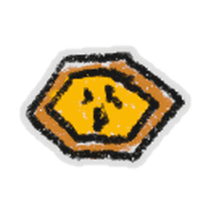

# Accessories

All 47 pages in Accessories, sorted by equipment tier (1 to 3 stars).

## Tier 1

<a class="wiki-card" href="basic-boots.html">Basic Boots</a>
<a class="wiki-card" href="belt-bag.html">Belt Bag</a>
<a class="wiki-card" href="belt-pocket.html">Belt Pocket</a>
<a class="wiki-card" href="blue-guard.html">Blue Guard</a>
<a class="wiki-card" href="bomber-guard.html">Bomber Guard</a>
<a class="wiki-card" href="brave-guard.html">Brave Guard</a>
<a class="wiki-card" href="elite-blue-guard.html">Elite Blue Guard</a>
<a class="wiki-card" href="elite-red-guard.html">Elite Red Guard</a>
<a class="wiki-card" href="hasty-guard.html">Hasty Guard</a>
<a class="wiki-card" href="helmet.html">Helmet</a>
<a class="wiki-card" href="hiking-boots.html">Hiking Boots</a>
<a class="wiki-card" href="looker-guard.html">Looker Guard</a>
<a class="wiki-card" href="propeller-hat.html">Propeller Hat</a>
<a class="wiki-card" href="red-guard.html">Red Guard</a>

## Tier 2

<a class="wiki-card" href="beekeeper-s-boots.html">Beekeeper&#x27;s Boots</a>
<a class="wiki-card" href="beekeeper-s-mask.html">Beekeeper&#x27;s Mask</a>
<a class="wiki-card" href="bubble-mask.html">Bubble Mask</a>
<a class="wiki-card" href="bucko-guard.html">Bucko Guard</a>
<a class="wiki-card" href="cobalt-guard.html">Cobalt Guard</a>
<a class="wiki-card" href="crimson-guard.html">Crimson Guard</a>
<a class="wiki-card" href="fire-mask.html">Fire Mask</a>
<a class="wiki-card" href="honey-mask.html">Honey Mask</a>
<a class="wiki-card" href="honeycomb-belt.html">Honeycomb Belt</a>
<a class="wiki-card" href="mondo-belt-bag.html">Mondo Belt Bag</a>
<a class="wiki-card" href="riley-guard.html">Riley Guard</a>

## Tier 3

<a class="wiki-card" href="coconut-belt.html">Coconut Belt</a>
<a class="wiki-card" href="coconut-clogs.html">Coconut Clogs</a>
<a class="wiki-card" href="demon-mask.html">Demon Mask</a>
<a class="wiki-card" href="diamond-mask.html">Diamond Mask</a>
<a class="wiki-card" href="gummy-boots.html">Gummy Boots</a>
<a class="wiki-card" href="gummy-mask.html">Gummy Mask</a>
<a class="wiki-card" href="petal-belt.html">Petal Belt</a>

## No tier

<a class="wiki-card" href="amulet.html">Amulet</a>
<a class="wiki-card" href="ant-amulet.html">Ant Amulet</a>
<a class="wiki-card" href="b-b-m-mask.html">B.B.M. Mask</a>
<a class="wiki-card wiki-card--noicon" href="bags.html">Bags</a>
<a class="wiki-card" href="cog-amulet.html">Cog Amulet</a>
<a class="wiki-card" href="eviction.html">Eviction</a>
<a class="wiki-card wiki-card--noicon" href="glider.html">Glider</a>
<a class="wiki-card" href="hive-slot.html">Hive Slot</a>
<a class="wiki-card" href="king-beetle-amulet.html">King Beetle Amulet</a>
<a class="wiki-card" href="mondo-b-b-m-mask.html">Mondo B.B.M. Mask</a>
<a class="wiki-card" href="moon-amulet.html">Moon Amulet</a>
<a class="wiki-card wiki-card--noicon" href="parachute.html">Parachute</a>
<a class="wiki-card" href="shell-amulet.html">Shell Amulet</a>
<a class="wiki-card" href="star-amulet.html">Star Amulet</a>
<a class="wiki-card" href="stick-bug-amulet.html">Stick Bug Amulet</a>

