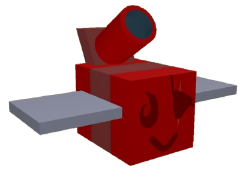
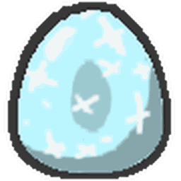

# Bees

Every bee in Re://:Swarm, sorted by rarity. Pick a bee to see its stats, abilities and colours.

## Common

<a class="wiki-card" href="basic-bee.html">Basic Bee</a>

## Rare

<a class="wiki-card" href="bomber-bee.html">Bomber Bee</a>
<a class="wiki-card" href="brave-bee.html">Brave Bee</a>
<a class="wiki-card" href="bumble-bee.html">Bumble Bee</a>
<a class="wiki-card" href="cool-bee.html">Cool Bee</a>
<a class="wiki-card" href="hasty-bee.html">Hasty Bee</a>
<a class="wiki-card" href="looker-bee.html">Looker Bee</a>
<a class="wiki-card" href="rad-bee.html">Rad Bee</a>
<a class="wiki-card" href="rascal-bee.html">Rascal Bee</a>
<a class="wiki-card" href="stubborn-bee.html">Stubborn Bee</a>

## Epic

<a class="wiki-card" href="bubble-bee.html">Bubble Bee</a>
<a class="wiki-card" href="bucko-bee.html">Bucko Bee</a>
<a class="wiki-card" href="commander-bee.html">Commander Bee</a>
<a class="wiki-card" href="demo-bee.html">Demo Bee</a>
<a class="wiki-card" href="exhausted-bee.html">Exhausted Bee</a>
<a class="wiki-card" href="fire-bee.html">Fire Bee</a>
<a class="wiki-card" href="frosty-bee.html">Frosty Bee</a>
<a class="wiki-card" href="honey-bee.html">Honey Bee</a>
<a class="wiki-card" href="rage-bee.html">Rage Bee</a>
<a class="wiki-card" href="riley-bee.html">Riley Bee</a>
<a class="wiki-card" href="shocked-bee.html">Shocked Bee</a>

## Legendary

<a class="wiki-card" href="baby-bee.html">Baby Bee</a>
<a class="wiki-card" href="carpenter-bee.html">Carpenter Bee</a>
<a class="wiki-card" href="demon-bee.html">Demon Bee</a>
<a class="wiki-card" href="diamond-bee.html">Diamond Bee</a>
<a class="wiki-card" href="lion-bee.html">Lion Bee</a>
<a class="wiki-card" href="music-bee.html">Music Bee</a>
<a class="wiki-card" href="ninja-bee.html">Ninja Bee</a>
<a class="wiki-card" href="shy-bee.html">Shy Bee</a>

## Mythic

<a class="wiki-card" href="buoyant-bee.html">Buoyant Bee</a>
<a class="wiki-card" href="fuzzy-bee.html">Fuzzy Bee</a>
<a class="wiki-card" href="mortar-bee.html">Mortar Bee</a>
<a class="wiki-card" href="precise-bee.html">Precise Bee</a>
<a class="wiki-card" href="spicy-bee.html">Spicy Bee</a>
<a class="wiki-card" href="tadpole-bee.html">Tadpole Bee</a>
<a class="wiki-card" href="vector-bee.html">Vector Bee</a>

## Event

<a class="wiki-card" href="bear-bee.html">Bear Bee</a>
<a class="wiki-card" href="cobalt-bee.html">Cobalt Bee</a>
<a class="wiki-card" href="crimson-bee.html">Crimson Bee</a>
<a class="wiki-card" href="digital-bee.html">Digital Bee</a>
<a class="wiki-card" href="festive-bee.html">Festive Bee</a>
<a class="wiki-card" href="gummy-bee.html">Gummy Bee</a>
<a class="wiki-card" href="painter-bee.html">Painter Bee</a>
<a class="wiki-card" href="photon-bee.html">Photon Bee</a>
<a class="wiki-card" href="puppy-bee.html">Puppy Bee</a>
<a class="wiki-card" href="tabby-bee.html">Tabby Bee</a>
<a class="wiki-card" href="vicious-bee.html">Vicious Bee</a>
<a class="wiki-card" href="windy-bee.html">Windy Bee</a>

## More about bees

<a class="wiki-card" href="bees.html">Bees</a>
<a class="wiki-card" href="bees-common.html">Bees/Common</a>
<a class="wiki-card" href="bees-epic.html">Bees/Epic</a>
<a class="wiki-card" href="bees-event.html">Bees/Event</a>
<a class="wiki-card" href="bees-legendary.html">Bees/Legendary</a>
<a class="wiki-card" href="bees-mythic.html">Bees/Mythic</a>
<a class="wiki-card" href="bees-rare.html">Bees/Rare</a>
<a class="wiki-card" href="first-edition-bee.html">First Edition Bee</a>
<a class="wiki-card" href="gifted-bee.html">Gifted Bee</a>
<a class="wiki-card" href="honey-bee-npc.html">Honey Bee (NPC)</a>
<a class="wiki-card" href="rogue-vicious-bee.html">Rogue Vicious Bee</a>
<a class="wiki-card" href="wild-windy-bee.html">Wild Windy Bee</a>

