# Dispensers

Dispensers sorted by the area they are in, like the Fields page.

## Starter Zone

<a class="wiki-card wiki-card--photo" href="honey-dispenser.html">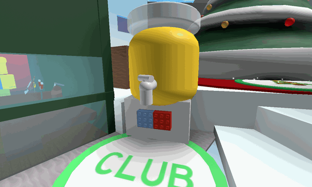Honey Dispenser</a>
<a class="wiki-card wiki-card--photo" href="royal-jelly-dispenser.html">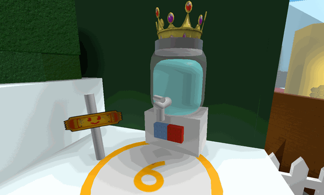Royal Jelly Dispenser</a>
<a class="wiki-card wiki-card--photo" href="free-royal-jelly-dispenser.html">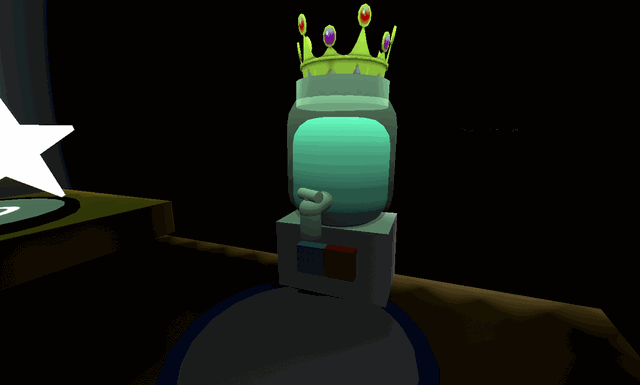Free Royal Jelly Dispenser</a>

## Blue HQ

<a class="wiki-card wiki-card--photo" href="blueberry-dispenser.html">Blueberry Dispenser</a>
<a class="wiki-card wiki-card--photo" href="blue-extract-dispenser.html">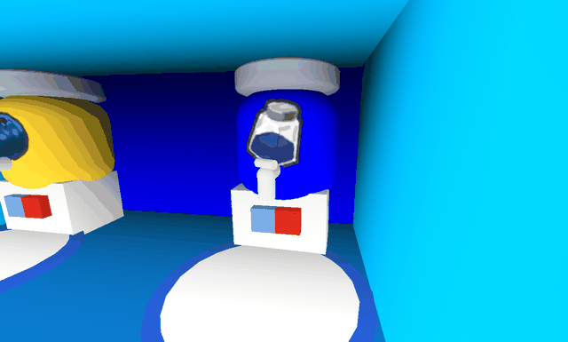Blue Extract Dispenser</a>

## Red HQ

<a class="wiki-card wiki-card--photo" href="strawberry-dispenser.html">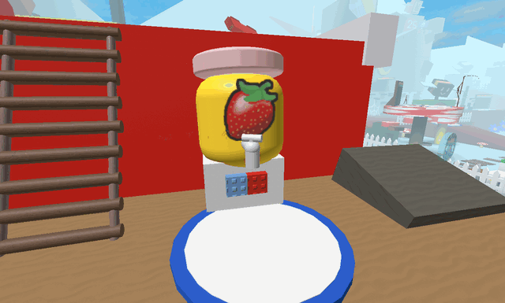Strawberry Dispenser</a>
<a class="wiki-card wiki-card--photo" href="red-extract-dispenser.html">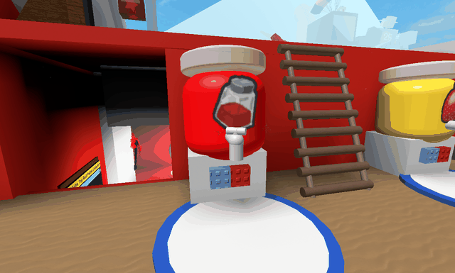Red Extract Dispenser</a>

## 5 Bee Zone

<a class="wiki-card wiki-card--photo" href="vicious-bee-egg-claim.html">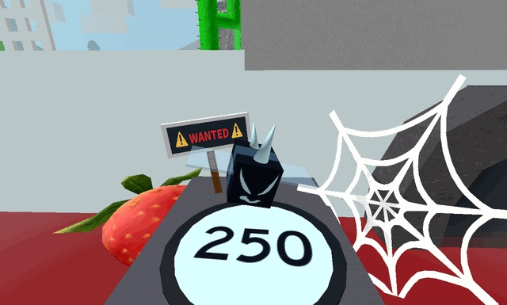Vicious Bee Claimer</a>

## 10 Bee Zone

<a class="wiki-card wiki-card--photo" href="treat-dispenser.html">Treat Dispenser</a>

## 20 Bee Zone

<a class="wiki-card wiki-card--photo" href="ant-pass-dispenser.html">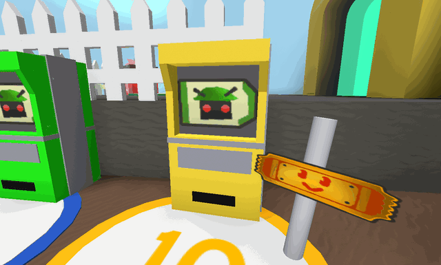Ant Pass Dispenser</a>
<a class="wiki-card wiki-card--photo" href="free-ant-pass-dispenser.html">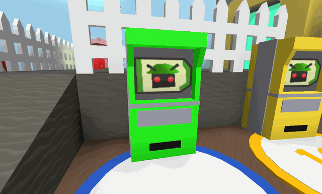Free Ant Pass Dispenser</a>
<a class="wiki-card wiki-card--photo" href="gummy-bee-egg-claim.html">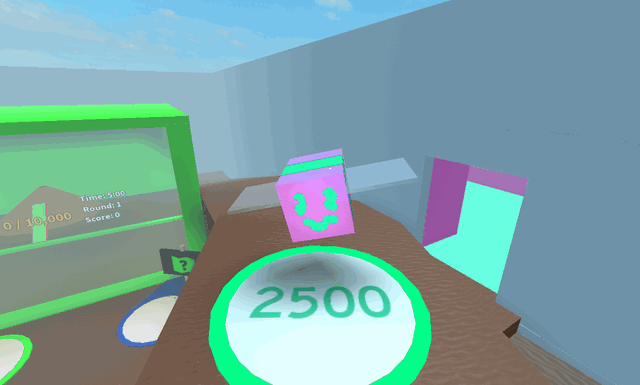Gummy Bee Claimer</a>

## 30 Bee Zone

<a class="wiki-card wiki-card--photo" href="robo-pass-dispenser.html">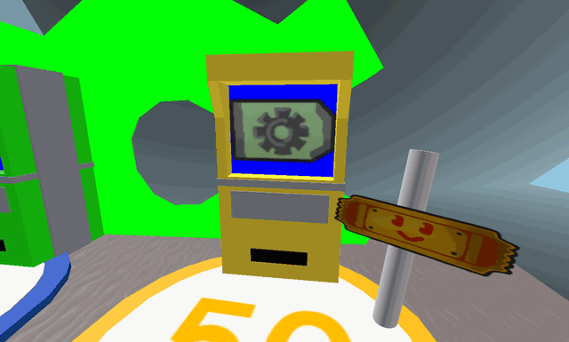Robo Pass Dispenser</a>
<a class="wiki-card wiki-card--photo" href="free-robo-pass-dispenser.html">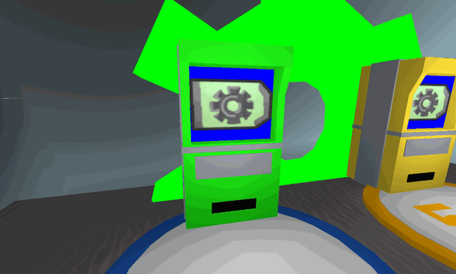Free Robo Pass Dispenser</a>

## 35 Bee Zone

<a class="wiki-card wiki-card--photo" href="coconut-dispenser.html">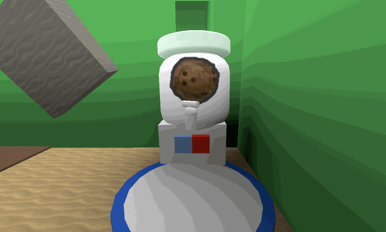Coconut Dispenser</a>

## Gummy Bear's Lair

<a class="wiki-card wiki-card--photo" href="glue-dispenser.html">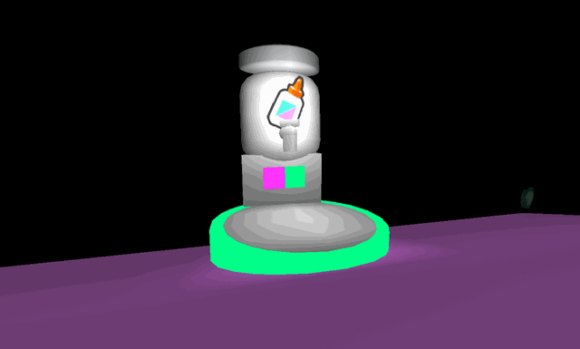Glue Dispenser</a>

## About dispensers

<a class="wiki-card" href="dispensers.html">Dispensers</a>

