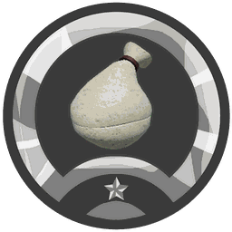
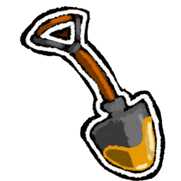
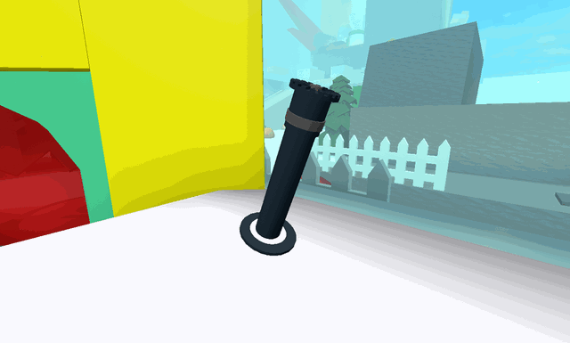
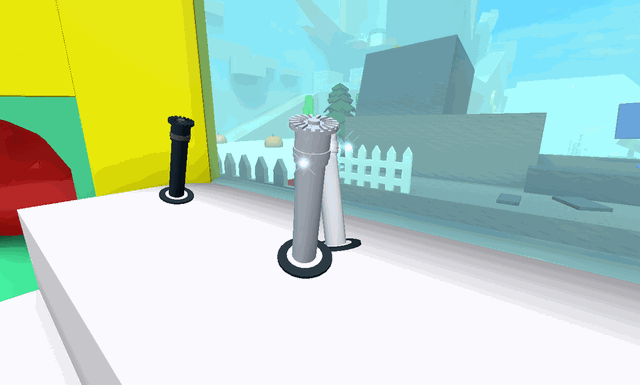
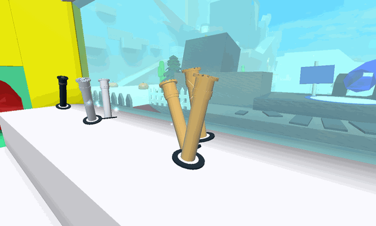
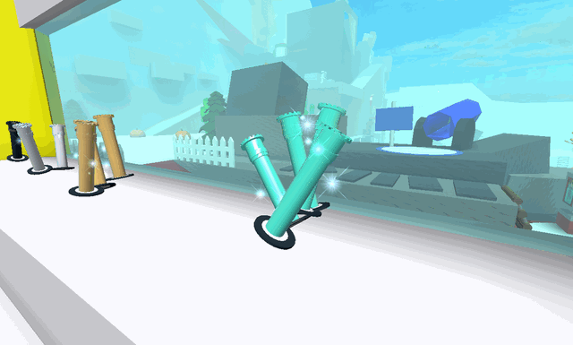
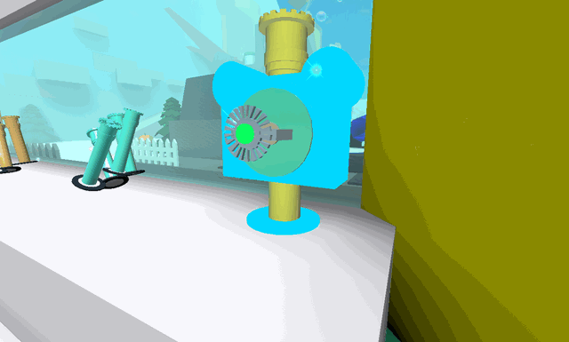

# Equipment

Everything you wear or hold, sorted by slot. Each slot goes from the first one you can get to the best. Stars show the equipment tier (1 to 3).

## Bags

Bags hold your pollen. Better bags hold more and convert faster.

<a class="wiki-card" href="bags.html">Bags</a>
<a class="wiki-card" href="pouch.html">Pouch<small>★</small></a>
<a class="wiki-card" href="jar.html">Jar<small>★</small></a>
<a class="wiki-card" href="backpack.html">Backpack<small>★</small></a>
<a class="wiki-card" href="canister.html">Canister<small>★</small></a>
<a class="wiki-card" href="mega-jug.html">Mega-Jug<small>★</small></a>
<a class="wiki-card" href="compressor.html">Compressor<small>★</small></a>
<a class="wiki-card" href="elite-barrel.html">Elite Barrel<small>★</small></a>
<a class="wiki-card" href="port-o-hive.html">Port-O-Hive<small>★</small></a>
<a class="wiki-card" href="red-port-o-hive.html">Red Port-O-Hive<small>★★</small></a>
<a class="wiki-card" href="blue-port-o-hive.html">Blue Port-O-Hive<small>★★</small></a>
<a class="wiki-card" href="porcelain-port-o-hive.html">Porcelain Port-O-Hive<small>★★</small></a>
<a class="wiki-card" href="coconut-canister.html">Coconut Canister<small>★★★</small></a>

## Tools

Tools collect pollen from flowers. Listed from cheapest to best.

<a class="wiki-card" href="tools.html">Tools</a>
<a class="wiki-card" href="scooper.html">Scooper</a>
<a class="wiki-card" href="rake.html">Rake</a>
<a class="wiki-card" href="clippers.html">Clippers</a>
<a class="wiki-card" href="magnet.html">Magnet</a>
<a class="wiki-card" href="vacuum.html">Vacuum</a>
<a class="wiki-card" href="super-scooper.html">Super-Scooper</a>
<a class="wiki-card" href="pulsar.html">Pulsar</a>
<a class="wiki-card" href="electro-magnet.html">Electro-Magnet</a>
<a class="wiki-card" href="scissors.html">Scissors</a>
<a class="wiki-card" href="honey-dipper.html">Honey Dipper</a>
<a class="wiki-card" href="bubble-wand.html">Bubble Wand</a>
<a class="wiki-card" href="scythe.html">Scythe</a>
<a class="wiki-card" href="golden-rake.html">Golden Rake</a>
<a class="wiki-card" href="spark-staff.html">Spark Staff</a>
<a class="wiki-card" href="porcelain-dipper.html">Porcelain Dipper</a>
<a class="wiki-card" href="petal-wand.html">Petal Wand</a>
<a class="wiki-card" href="tide-popper.html">Tide Popper</a>
<a class="wiki-card" href="dark-scythe.html">Dark Scythe</a>
<a class="wiki-card" href="gummyballer.html">Gummyballer</a>
<a class="wiki-card" href="sticker-seeker.html">Sticker-Seeker</a>

## Hats

<a class="wiki-card" href="helmet.html">Helmet<small>★</small></a>
<a class="wiki-card" href="propeller-hat.html">Propeller Hat<small>★</small></a>
<a class="wiki-card" href="beekeeper-s-mask.html">Beekeeper&#x27;s Mask<small>★★</small></a>
<a class="wiki-card" href="honey-mask.html">Honey Mask<small>★★</small></a>
<a class="wiki-card" href="fire-mask.html">Fire Mask<small>★★</small></a>
<a class="wiki-card" href="bubble-mask.html">Bubble Mask<small>★★</small></a>
<a class="wiki-card" href="gummy-mask.html">Gummy Mask<small>★★★</small></a>
<a class="wiki-card" href="demon-mask.html">Demon Mask<small>★★★</small></a>
<a class="wiki-card" href="diamond-mask.html">Diamond Mask<small>★★★</small></a>

## Left guards

<a class="wiki-card" href="looker-guard.html">Looker Guard<small>★</small></a>
<a class="wiki-card" href="bomber-guard.html">Bomber Guard<small>★</small></a>
<a class="wiki-card" href="red-guard.html">Red Guard<small>★</small></a>
<a class="wiki-card" href="elite-red-guard.html">Elite Red Guard<small>★</small></a>
<a class="wiki-card" href="riley-guard.html">Riley Guard<small>★★</small></a>
<a class="wiki-card" href="crimson-guard.html">Crimson Guard<small>★★</small></a>

## Right guards

<a class="wiki-card" href="brave-guard.html">Brave Guard<small>★</small></a>
<a class="wiki-card" href="hasty-guard.html">Hasty Guard<small>★</small></a>
<a class="wiki-card" href="blue-guard.html">Blue Guard<small>★</small></a>
<a class="wiki-card" href="elite-blue-guard.html">Elite Blue Guard<small>★</small></a>
<a class="wiki-card" href="bucko-guard.html">Bucko Guard<small>★★</small></a>
<a class="wiki-card" href="cobalt-guard.html">Cobalt Guard<small>★★</small></a>

## Belts

<a class="wiki-card" href="belt-pocket.html">Belt Pocket<small>★</small></a>
<a class="wiki-card" href="belt-bag.html">Belt Bag<small>★</small></a>
<a class="wiki-card" href="mondo-belt-bag.html">Mondo Belt Bag<small>★★</small></a>
<a class="wiki-card" href="honeycomb-belt.html">Honeycomb Belt<small>★★</small></a>
<a class="wiki-card" href="petal-belt.html">Petal Belt<small>★★★</small></a>
<a class="wiki-card" href="coconut-belt.html">Coconut Belt<small>★★★</small></a>

## Boots

<a class="wiki-card" href="basic-boots.html">Basic Boots<small>★</small></a>
<a class="wiki-card" href="hiking-boots.html">Hiking Boots<small>★</small></a>
<a class="wiki-card" href="beekeeper-s-boots.html">Beekeeper&#x27;s Boots<small>★★</small></a>
<a class="wiki-card" href="coconut-clogs.html">Coconut Clogs<small>★★★</small></a>
<a class="wiki-card" href="gummy-boots.html">Gummy Boots<small>★★★</small></a>

## Amulets

<a class="wiki-card" href="amulet.html">Amulet</a>
<a class="wiki-card" href="ant-amulet.html">Ant Amulet</a>
<a class="wiki-card" href="cog-amulet.html">Cog Amulet</a>
<a class="wiki-card" href="moon-amulet.html">Moon Amulet</a>
<a class="wiki-card" href="shell-amulet.html">Shell Amulet</a>
<a class="wiki-card" href="star-amulet.html">Star Amulet</a>
<a class="wiki-card" href="stick-bug-amulet.html">Stick Bug Amulet</a>
<a class="wiki-card" href="king-beetle-amulet.html">King Beetle Amulet</a>

## Sprinklers

<a class="wiki-card" href="sprinklers.html">Sprinklers</a>
<a class="wiki-card wiki-card--photo" href="basic-sprinkler.html">Basic Sprinkler</a>
<a class="wiki-card wiki-card--photo" href="silver-soakers.html">Silver Soakers</a>
<a class="wiki-card wiki-card--photo" href="golden-gushers.html">Golden Gushers</a>
<a class="wiki-card wiki-card--photo" href="diamond-drenchers.html">Diamond Drenchers</a>
<a class="wiki-card wiki-card--photo" href="the-supreme-saturator.html">The Supreme Saturator</a>

## Gliding

<a class="wiki-card wiki-card--noicon" href="glider.html">Glider</a>
<a class="wiki-card wiki-card--noicon" href="parachute.html">Parachute</a>

