# Fields

All 27 pages in Fields.

<a class="wiki-card wiki-card--text" href="ant-field.html">Ant Field</a>
<a class="wiki-card" href="bamboo-field.html">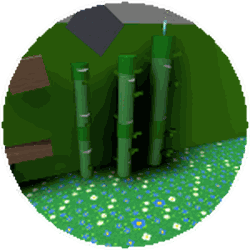Bamboo Field</a>
<a class="wiki-card wiki-card--text" href="blue-brick-field.html">Blue Brick Field</a>
<a class="wiki-card" href="blue-flower-field.html">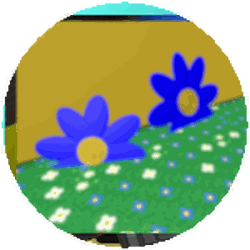Blue Flower Field</a>
<a class="wiki-card" href="cactus-field.html">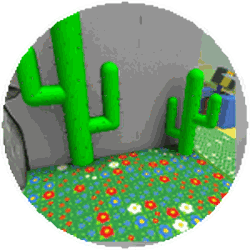Cactus Field</a>
<a class="wiki-card" href="clover-field.html">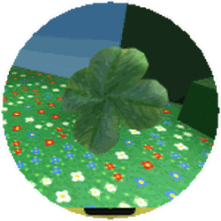Clover Field</a>
<a class="wiki-card" href="coconut-field.html">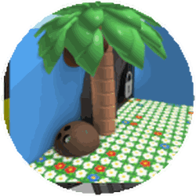Coconut Field</a>
<a class="wiki-card" href="dandelion-field.html">Dandelion Field</a>
<a class="wiki-card wiki-card--text" href="field-boost.html">Field Boost</a>
<a class="wiki-card wiki-card--text" href="field-wind.html">Field Wind</a>
<a class="wiki-card wiki-card--text" href="fields.html">Fields</a>
<a class="wiki-card wiki-card--text" href="flowers.html">Flowers</a>
<a class="wiki-card wiki-card--text" href="hub-field.html">Hub Field</a>
<a class="wiki-card wiki-card--text" href="mixed-brick-field.html">Mixed Brick Field</a>
<a class="wiki-card" href="mountain-top-field.html">Mountain Top Field</a>
<a class="wiki-card" href="mushroom-field.html">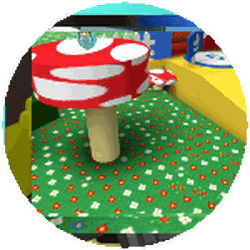Mushroom Field</a>
<a class="wiki-card wiki-card--text" href="pepper-patch.html">Pepper Patch</a>
<a class="wiki-card" href="pine-tree-forest.html">Pine Tree Forest</a>
<a class="wiki-card" href="pineapple-patch.html">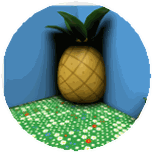Pineapple Patch</a>
<a class="wiki-card" href="pumpkin-patch.html">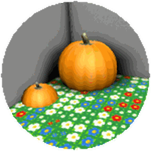Pumpkin Patch</a>
<a class="wiki-card wiki-card--text" href="red-brick-field.html">Red Brick Field</a>
<a class="wiki-card" href="rose-field.html">Rose Field</a>
<a class="wiki-card" href="spider-field.html">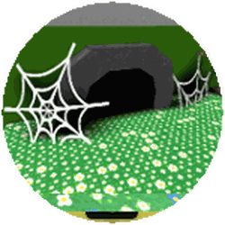Spider Field</a>
<a class="wiki-card" href="strawberry-field.html">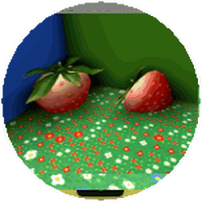Strawberry Field</a>
<a class="wiki-card" href="stump-field.html">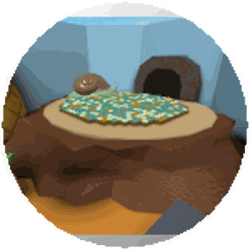Stump Field</a>
<a class="wiki-card" href="sunflower-field.html">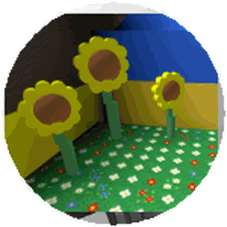Sunflower Field</a>
<a class="wiki-card wiki-card--text" href="white-brick-field.html">White Brick Field</a>

