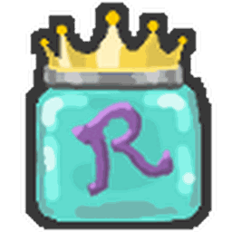
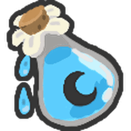

# Items

Inventory items, sorted by what they are for. Equipment, beequips and planters have their own pages.

## About items

<a class="wiki-card" href="items.html">Items</a>

## Treats

Feed these to bees for bond, or to change them.

<a class="wiki-card" href="treats.html">Treats</a>
<a class="wiki-card" href="treat.html">Treat</a>
<a class="wiki-card" href="sunflower-seed.html">Sunflower Seed</a>
<a class="wiki-card" href="strawberry.html">Strawberry</a>
<a class="wiki-card" href="blueberry.html">Blueberry</a>
<a class="wiki-card" href="pineapple.html">Pineapple</a>
<a class="wiki-card" href="bitterberry.html">Bitterberry</a>
<a class="wiki-card" href="moon-charm.html">Moon Charm</a>
<a class="wiki-card" href="neonberry.html">Neonberry</a>
<a class="wiki-card" href="gingerbread-bear.html">Gingerbread Bear</a>
<a class="wiki-card" href="aged-gingerbread-bear.html">Aged Gingerbread Bear</a>
<a class="wiki-card" href="atomic-treat.html">Atomic Treat</a>
<a class="wiki-card" href="gathering-atomic-treat.html">Gathering Atomic Treat</a>
<a class="wiki-card" href="energized-atomic-treat.html">Energized Atomic Treat</a>
<a class="wiki-card" href="critical-atomic-treat.html">Critical Atomic Treat</a>
<a class="wiki-card" href="conversion-atomic-treat.html">Conversion Atomic Treat</a>
<a class="wiki-card" href="swift-atomic-treat.html">Swift Atomic Treat</a>
<a class="wiki-card" href="fierce-atomic-treat.html">Fierce Atomic Treat</a>
<a class="wiki-card" href="ability-atomic-treat.html">Ability Atomic Treat</a>
<a class="wiki-card" href="ic-atomic-treat.html">IC Atomic Treat</a>
<a class="wiki-card" href="star-treat.html">Star Treat</a>

## Jellies and eggs

<a class="wiki-card" href="royal-jelly.html">Royal Jelly</a>
<a class="wiki-card" href="egg.html">Egg</a>

## Boosts

<a class="wiki-card" href="red-extract.html">Red Extract</a>
<a class="wiki-card" href="blue-extract.html">Blue Extract</a>
<a class="wiki-card" href="enzymes.html">Enzymes</a>
<a class="wiki-card" href="oil.html">Oil</a>
<a class="wiki-card" href="glue.html">Glue</a>
<a class="wiki-card" href="glitter.html">Glitter</a>
<a class="wiki-card" href="tropical-drink.html">Tropical Drink</a>
<a class="wiki-card" href="purple-potion.html">Purple Potion</a>
<a class="wiki-card" href="super-smoothie.html">Super Smoothie</a>
<a class="wiki-card" href="marshmallow-bee.html">Marshmallow Bee</a>
<a class="wiki-card" href="stinger.html">Stinger</a>
<a class="wiki-card" href="field-dice.html">Field Dice</a>
<a class="wiki-card" href="smooth-dice.html">Smooth Dice</a>
<a class="wiki-card" href="loaded-dice.html">Loaded Dice</a>
<a class="wiki-card" href="jelly-beans.html">Jelly Beans</a>
<a class="wiki-card" href="gumdrops.html">Gumdrops</a>
<a class="wiki-card" href="coconut.html">Coconut</a>
<a class="wiki-card" href="micro-converter.html">Micro-Converter</a>
<a class="wiki-card" href="honeysuckle.html">Honeysuckle</a>
<a class="wiki-card" href="whirligig.html">Whirligig</a>
<a class="wiki-card" href="bloom-shaker.html">Bloom Shaker</a>

## Summons and beans

<a class="wiki-card" href="magic-bean.html">Magic Bean</a>
<a class="wiki-card" href="festive-bean.html">Festive Bean</a>
<a class="wiki-card" href="cloud-vial.html">Cloud Vial</a>
<a class="wiki-card" href="box-o-frogs.html">Box-O-Frogs</a>
<a class="wiki-card" href="night-bell.html">Night Bell</a>

## Nectar vials

<a class="wiki-card" href="nectar-vial.html">Nectar Vial</a>
<a class="wiki-card" href="comforting-vial.html">Comforting Vial</a>
<a class="wiki-card" href="invigorating-vial.html">Invigorating Vial</a>
<a class="wiki-card" href="motivating-vial.html">Motivating Vial</a>
<a class="wiki-card" href="refreshing-vial.html">Refreshing Vial</a>
<a class="wiki-card" href="satisfying-vial.html">Satisfying Vial</a>
<a class="wiki-card" href="nectar-shower-vial.html">Nectar Shower Vial</a>
<a class="wiki-card" href="nectar-tester.html">Nectar Tester</a>

## Waxes

Waxes upgrade beequips.

<a class="wiki-card" href="waxes.html">Waxes</a>
<a class="wiki-card" href="soft-wax.html">Soft Wax</a>
<a class="wiki-card" href="hard-wax.html">Hard Wax</a>
<a class="wiki-card" href="caustic-wax.html">Caustic Wax</a>
<a class="wiki-card" href="swirled-wax.html">Swirled Wax</a>
<a class="wiki-card" href="fluxite-wax.html">Fluxite Wax</a>
<a class="wiki-card" href="turpentine.html">Turpentine</a>
<a class="wiki-card" href="debug-wax.html">Debug Wax</a>

## Balloons

<a class="wiki-card" href="balloon.html">Balloon</a>
<a class="wiki-card" href="pink-balloon.html">Pink Balloon</a>
<a class="wiki-card" href="red-balloon.html">Red Balloon</a>
<a class="wiki-card" href="white-balloon.html">White Balloon</a>
<a class="wiki-card" href="black-balloon.html">Black Balloon</a>

## Passes and currencies

<a class="wiki-card" href="ticket.html">Ticket</a>
<a class="wiki-card" href="ant-pass.html">Ant Pass</a>
<a class="wiki-card" href="robo-pass.html">Robo Pass</a>
<a class="wiki-card" href="cog.html">Cog</a>
<a class="wiki-card" href="drives.html">Drives</a>
<a class="wiki-card" href="broken-drive.html">Broken Drive</a>
<a class="wiki-card" href="snowflake.html">Snowflake</a>
<a class="wiki-card" href="spirit-petal.html">Spirit Petal</a>
<a class="wiki-card" href="present.html">Present</a>
<a class="wiki-card" href="ornaments.html">Ornaments</a>
<a class="wiki-card" href="translator.html">Translator</a>

## Hive

<a class="wiki-card" href="hive-slot.html">Hive Slot</a>
<a class="wiki-card" href="eviction.html">Eviction</a>

