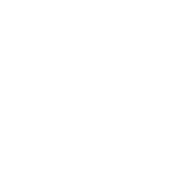

# Mechanics

All 49 pages in Mechanics.

<a class="wiki-card wiki-card--noicon" href="ability-tokens.html">Ability Tokens</a>
<a class="wiki-card" href="amulet.html">Amulet</a>
<a class="wiki-card wiki-card--noicon" href="badges.html">Badges</a>
<a class="wiki-card" href="balloon.html">Balloon</a>
<a class="wiki-card wiki-card--noicon" href="battle-points.html">Battle Points</a>
<a class="wiki-card wiki-card--noicon" href="bee-attack.html">Bee Attack</a>
<a class="wiki-card wiki-card--noicon" href="beequip-generation.html">Beequip Generation</a>
<a class="wiki-card wiki-card--noicon" href="blender.html">Blender</a>
<a class="wiki-card wiki-card--noicon" href="bond.html">Bond</a>
<a class="wiki-card wiki-card--noicon" href="bubble.html">Bubble</a>
<a class="wiki-card wiki-card--noicon" href="buffs-debuffs.html">Buffs &amp; Debuffs</a>
<a class="wiki-card wiki-card--noicon" href="capacity.html">Capacity</a>
<a class="wiki-card" href="cloud.html">Cloud</a>
<a class="wiki-card wiki-card--noicon" href="codes.html">Codes</a>
<a class="wiki-card wiki-card--noicon" href="critical-hits.html">Critical Hits</a>
<a class="wiki-card" href="cub-buddy.html">Cub Buddy</a>
<a class="wiki-card wiki-card--noicon" href="day-night-cycle.html">Day/Night Cycle</a>
<a class="wiki-card wiki-card--noicon" href="emoticons.html">Emoticons</a>
<a class="wiki-card wiki-card--noicon" href="energy.html">Energy</a>
<a class="wiki-card wiki-card--noicon" href="field-boost.html">Field Boost</a>
<a class="wiki-card wiki-card--noicon" href="field-capacity.html">Field Capacity</a>
<a class="wiki-card wiki-card--noicon" href="field-wind.html">Field Wind</a>
<a class="wiki-card" href="flame.html">Flame</a>
<a class="wiki-card wiki-card--noicon" href="flowers.html">Flowers</a>
<a class="wiki-card wiki-card--noicon" href="gifted-bee.html">Gifted Bee</a>
<a class="wiki-card wiki-card--noicon" href="goo.html">Goo</a>
<a class="wiki-card wiki-card--noicon" href="hive.html">Hive</a>
<a class="wiki-card" href="honey.html">Honey</a>
<a class="wiki-card wiki-card--noicon" href="honey-per-pollen.html">Honey Per Pollen</a>
<a class="wiki-card wiki-card--noicon" href="instant-conversion.html">Instant Conversion</a>
<a class="wiki-card wiki-card--noicon" href="leaves.html">Leaves</a>
<a class="wiki-card wiki-card--noicon" href="loot-luck.html">Loot Luck</a>
<a class="wiki-card wiki-card--noicon" href="mechanics.html">Mechanics</a>
<a class="wiki-card wiki-card--noicon" href="movement-collection.html">Movement Collection</a>
<a class="wiki-card wiki-card--noicon" href="music.html">Music</a>
<a class="wiki-card wiki-card--noicon" href="mutation.html">Mutation</a>
<a class="wiki-card wiki-card--noicon" href="nectar.html">Nectar</a>
<a class="wiki-card wiki-card--noicon" href="passive-abilities.html">Passive Abilities</a>
<a class="wiki-card" href="pollen.html">Pollen</a>
<a class="wiki-card wiki-card--noicon" href="pollination.html">Pollination</a>
<a class="wiki-card wiki-card--noicon" href="quests.html">Quests</a>
<a class="wiki-card wiki-card--noicon" href="radiation.html">Radiation</a>
<a class="wiki-card wiki-card--noicon" href="robux-shop.html">Robux Shop</a>
<a class="wiki-card wiki-card--noicon" href="sparkles.html">Sparkles</a>
<a class="wiki-card" href="sprout.html">Sprout</a>
<a class="wiki-card wiki-card--noicon" href="stats.html">Stats</a>
<a class="wiki-card" href="sticker.html">Sticker</a>
<a class="wiki-card wiki-card--noicon" href="system-page.html">System Page</a>
<a class="wiki-card wiki-card--noicon" href="trading.html">Trading</a>

