# Mobs

Field mobs are sorted by bee zone, like the Fields page. Bosses, challenge mobs, event mobs and Puffshrooms come after.

## Starter Zone

<a class="wiki-card" href="ladybug.html">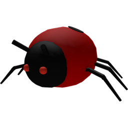Ladybug</a>
<a class="wiki-card" href="rhino-beetle.html">Rhino Beetle</a>

## 5 Bee Zone

<a class="wiki-card" href="spider.html">Spider</a>

## 10 Bee Zone

<a class="wiki-card" href="mantis.html">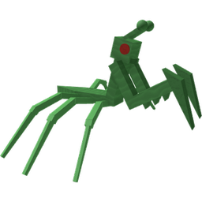Mantis</a>

## 15 Bee Zone

<a class="wiki-card" href="scorpion.html">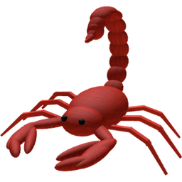Scorpion</a>
<a class="wiki-card" href="werewolf.html">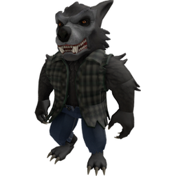Werewolf</a>

## Bosses

Big mobs with long respawn timers, in zone order.

<a class="wiki-card" href="king-beetle.html">King Beetle</a>
<a class="wiki-card" href="stump-snail.html">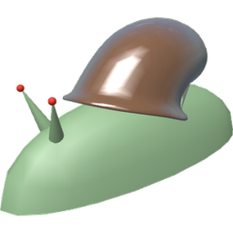Stump Snail</a>
<a class="wiki-card" href="tunnel-bear.html">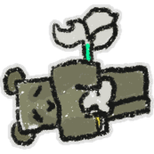Tunnel Bear</a>
<a class="wiki-card" href="cave-monster.html">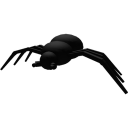Cave Monster</a>
<a class="wiki-card" href="commando-chick.html">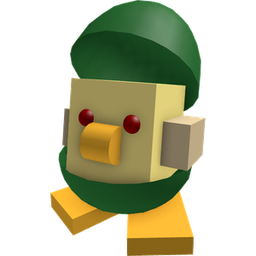Commando Chick</a>
<a class="wiki-card wiki-card--noicon" href="commando-chick-drops.html">Commando Chick/Drops</a>
<a class="wiki-card" href="mondo-chick.html">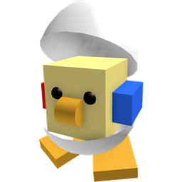Mondo Chick</a>
<a class="wiki-card" href="coconut-crab.html">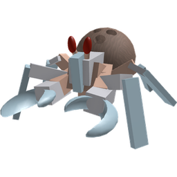Coconut Crab</a>

## Ant Challenge

<a class="wiki-card" href="ants.html">Ants</a>
<a class="wiki-card" href="ant.html">Ant</a>
<a class="wiki-card" href="fire-ant.html">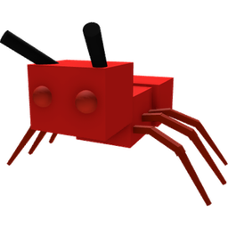Fire Ant</a>
<a class="wiki-card" href="flying-ant.html">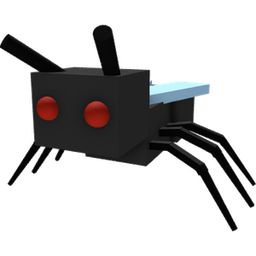Flying Ant</a>
<a class="wiki-card" href="army-ant.html">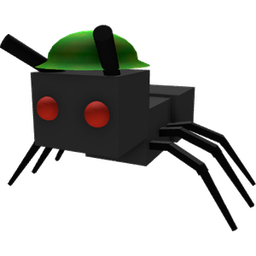Army Ant</a>
<a class="wiki-card" href="giant-ant.html">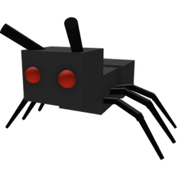Giant Ant</a>

## Robo Bear Challenge

<a class="wiki-card" href="cogmower.html">Cogmower</a>
<a class="wiki-card" href="golden-cogmower.html">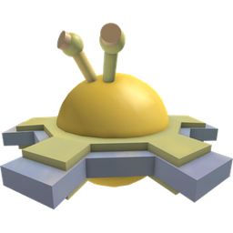Golden Cogmower</a>
<a class="wiki-card" href="cogturret.html">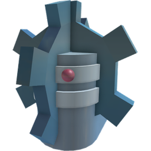Cogturret</a>
<a class="wiki-card" href="mechsquito.html">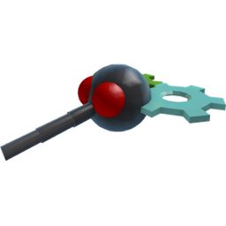Mechsquito</a>
<a class="wiki-card" href="mega-mechsquito.html">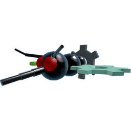Mega Mechsquito</a>

## Stick Bug Challenge

<a class="wiki-card" href="stick-bug.html">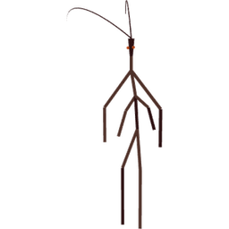Stick Bug</a>
<a class="wiki-card" href="stick-nymph.html">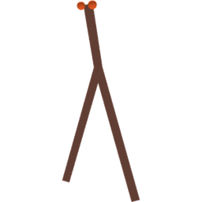Stick Nymph</a>

## Event and party mobs

<a class="wiki-card" href="party-cogmower.html">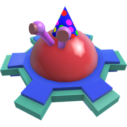Party Cogmower</a>
<a class="wiki-card" href="party-cogturret.html">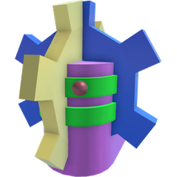Party Cogturret</a>
<a class="wiki-card" href="party-mechsquito.html">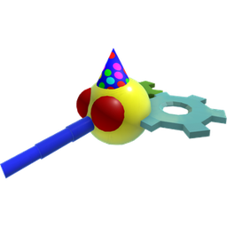Party Mechsquito</a>
<a class="wiki-card" href="party-mega-mechsquito.html">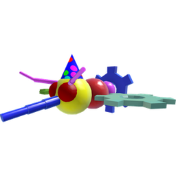Party Mega Mechsquito</a>
<a class="wiki-card" href="rogue-vicious-bee.html">Rogue Vicious Bee</a>
<a class="wiki-card" href="wild-windy-bee.html">Wild Windy Bee</a>
<a class="wiki-card" href="chicks.html">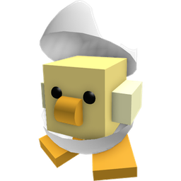Chicks</a>
<a class="wiki-card" href="snowbear.html">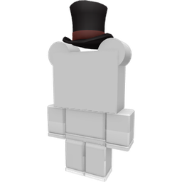Snowbear</a>
<a class="wiki-card" href="festive-nymph.html">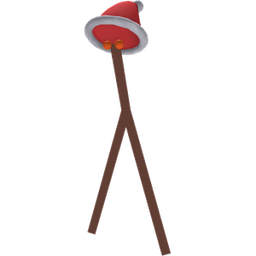Festive Nymph</a>

## Field critters

Passive or wandering mobs that can show up in many fields.

<a class="wiki-card" href="aphid.html">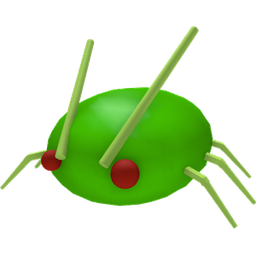Aphid</a>
<a class="wiki-card" href="bean-bug.html">Bean Bug</a>
<a class="wiki-card" href="frog.html">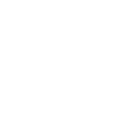Frog</a>
<a class="wiki-card" href="fireflies.html">Fireflies</a>
<a class="wiki-card" href="bloom.html">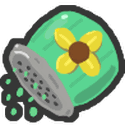Bloom</a>

## Puffshrooms

<a class="wiki-card" href="puffshroom.html">Puffshroom</a>

## About mobs

<a class="wiki-card" href="mobs.html">Mobs</a>

