# Places & Objects

All 41 pages in Places & Objects.

<a class="wiki-card wiki-card--photo" href="ant-gate.html">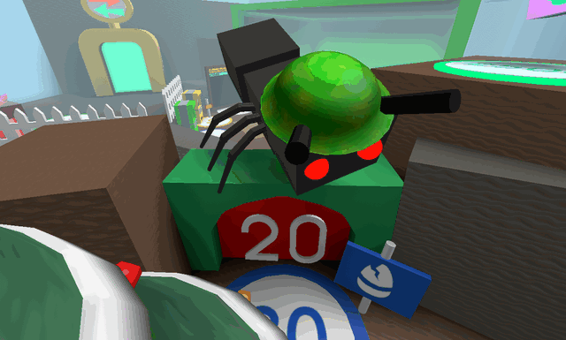Ant Gate</a>
<a class="wiki-card wiki-card--photo" href="badge-bearer-s-guild.html">Badge Bearer&#x27;s Guild</a>
<a class="wiki-card wiki-card--photo" href="basic-bee-gate.html">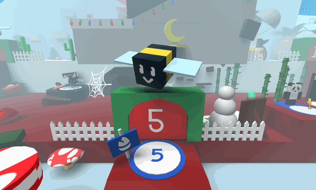Basic Bee Gate</a>
<a class="wiki-card wiki-card--photo" href="bear-gate.html">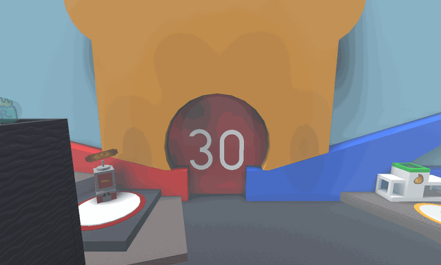Bear Gate</a>
<a class="wiki-card wiki-card--photo" href="blue-cannon.html">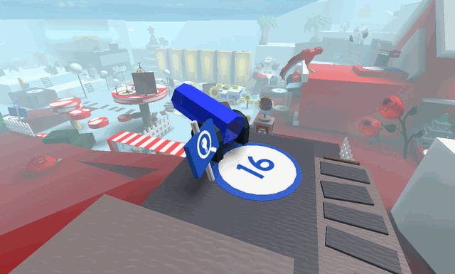Blue Cannon</a>
<a class="wiki-card wiki-card--photo" href="blue-field-booster.html">Blue Field Booster</a>
<a class="wiki-card wiki-card--photo" href="blue-hq.html">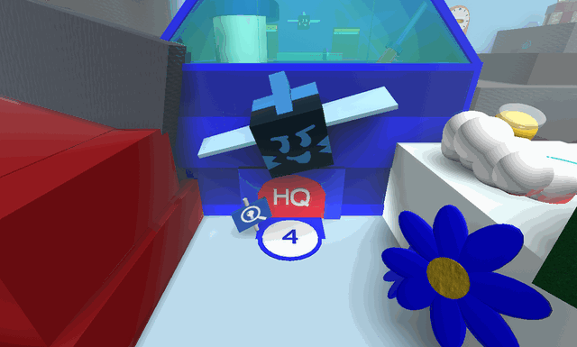Blue HQ</a>
<a class="wiki-card wiki-card--photo" href="blue-teleporter.html">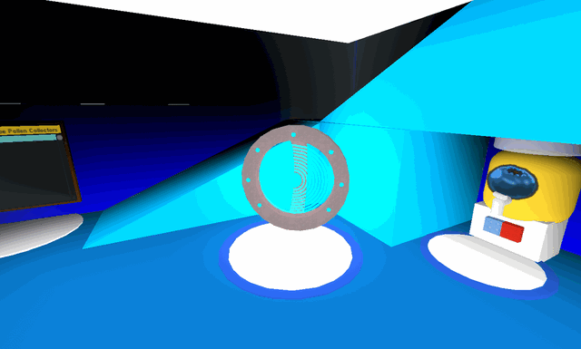Blue Teleporter</a>
<a class="wiki-card wiki-card--photo" href="brave-bee-gate.html">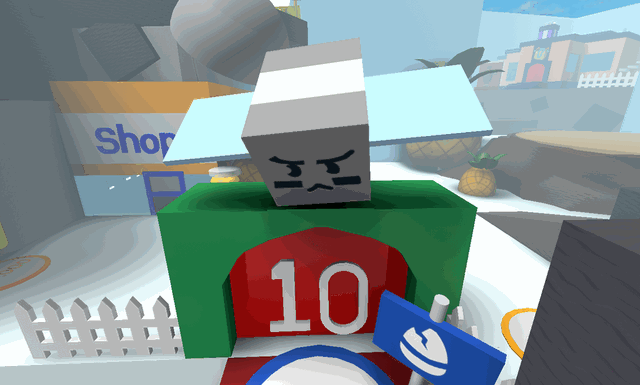Brave Bee Gate</a>
<a class="wiki-card wiki-card--photo" href="coconut-cave.html">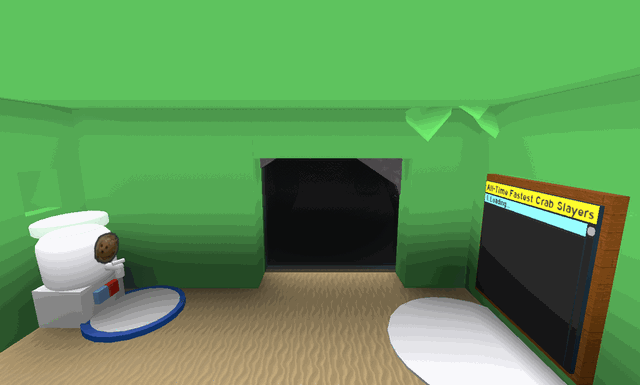Coconut Cave</a>
<a class="wiki-card" href="commando-chick-s-hideout.html">Commando Chick&#x27;s Hideout</a>
<a class="wiki-card wiki-card--photo" href="field-booster.html">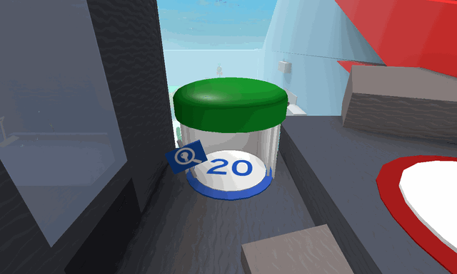Field Booster</a>
<a class="wiki-card wiki-card--photo" href="gummy-bear-s-lair.html">Gummy Bear&#x27;s Lair</a>
<a class="wiki-card wiki-card--photo" href="hive-hub.html">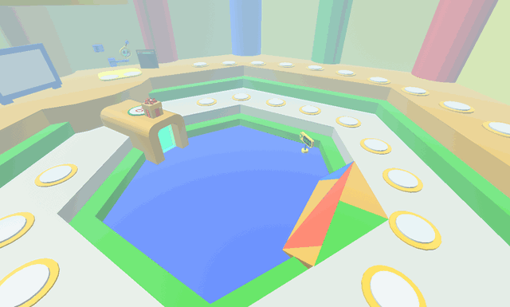Hive Hub</a>
<a class="wiki-card wiki-card--photo" href="honey-bee-gate.html">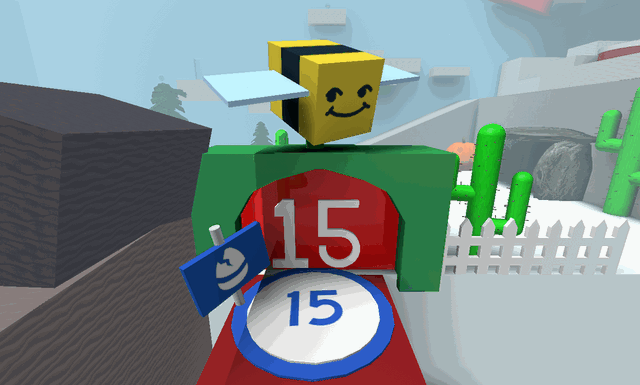Honey Bee Gate</a>
<a class="wiki-card wiki-card--photo" href="instant-converter.html">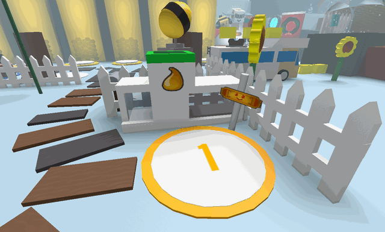Instant Converter</a>
<a class="wiki-card" href="king-beetle-s-lair.html">King Beetle&#x27;s Lair</a>
<a class="wiki-card wiki-card--photo" href="lion-bee-gate.html">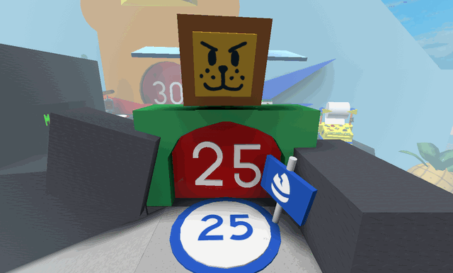Lion Bee Gate</a>
<a class="wiki-card wiki-card--photo" href="melittology-machine.html">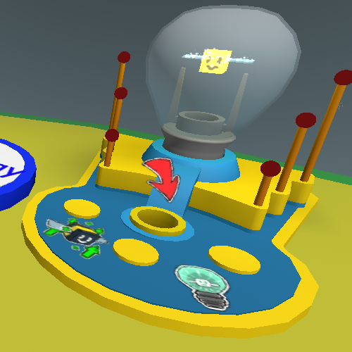Melittology Machine</a>
<a class="wiki-card wiki-card--photo" href="melittology-quest-giver.html">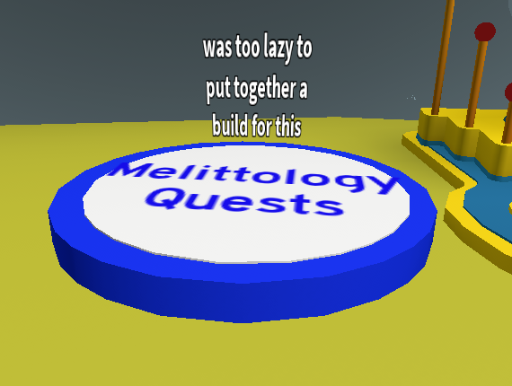Melittology Quests</a>
<a class="wiki-card wiki-card--photo" href="moon-amulet-generator.html">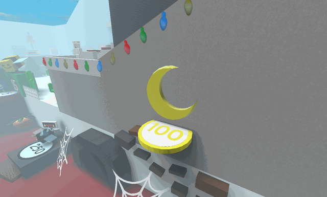Moon Amulet Generator</a>
<a class="wiki-card wiki-card--photo" href="nectar-condenser.html">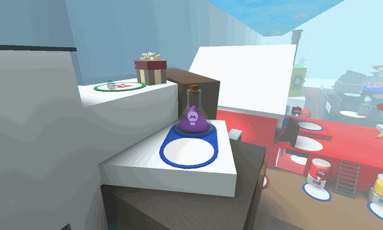Nectar Condenser</a>
<a class="wiki-card wiki-card--photo" href="nectar-pot.html">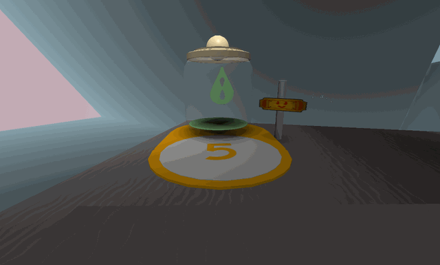Nectar Pot</a>
<a class="wiki-card wiki-card--photo" href="red-cannon.html">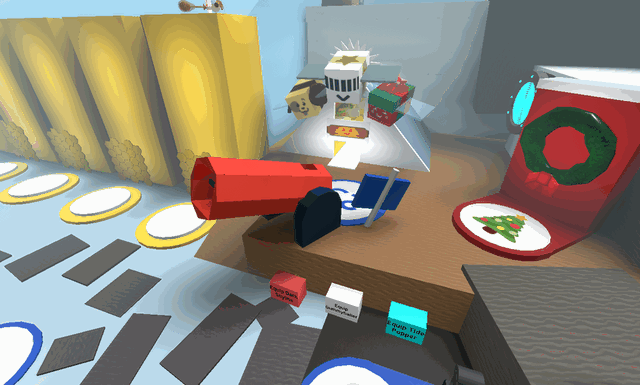Red Cannon</a>
<a class="wiki-card wiki-card--photo" href="red-field-booster.html">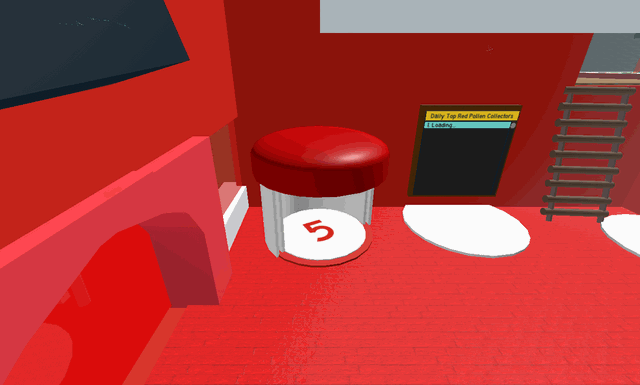Red Field Booster</a>
<a class="wiki-card wiki-card--photo" href="red-hq.html">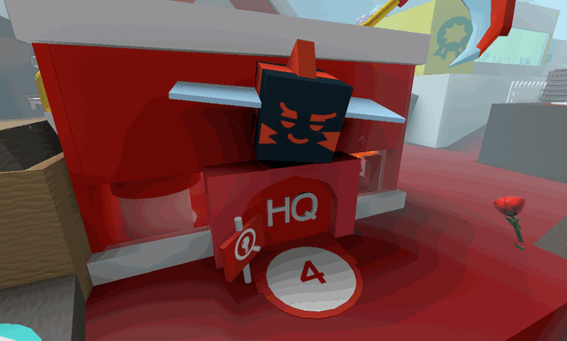Red HQ</a>
<a class="wiki-card wiki-card--photo" href="red-teleporter.html">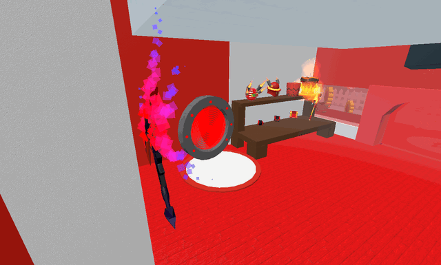Red Teleporter</a>
<a class="wiki-card" href="slingshot.html">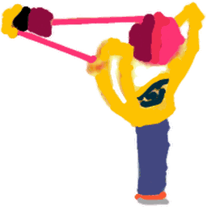Slingshot</a>
<a class="wiki-card wiki-card--photo" href="snowbear-summoner.html">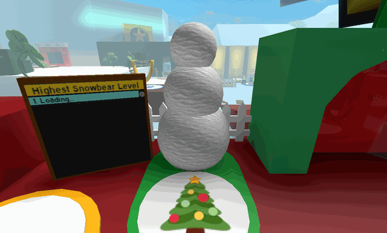Snowbear Summoner</a>
<a class="wiki-card" href="special-sprout-summoner.html">Special Sprout Summoner</a>
<a class="wiki-card wiki-card--photo" href="star-hall.html">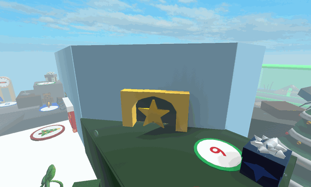Star Hall</a>
<a class="wiki-card wiki-card--photo" href="starter-zone.html">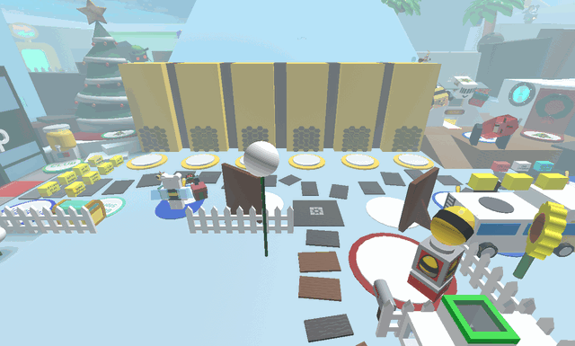Starter Zone</a>
<a class="wiki-card wiki-card--photo" href="sticker-printer.html">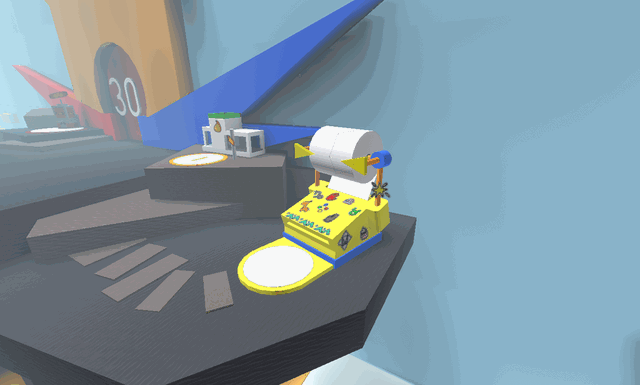Sticker Printer</a>
<a class="wiki-card" href="sticker-stack.html">Sticker Stack</a>
<a class="wiki-card wiki-card--photo" href="ticket-tent.html">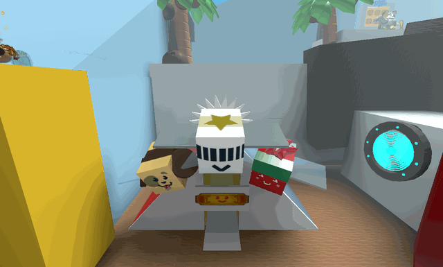Ticket Tent</a>
<a class="wiki-card" href="wealth-clock.html">Wealth Clock</a>
<a class="wiki-card wiki-card--photo" href="werewolf-s-cave.html">Werewolf&#x27;s Cave</a>
<a class="wiki-card wiki-card--photo" href="white-tunnel.html">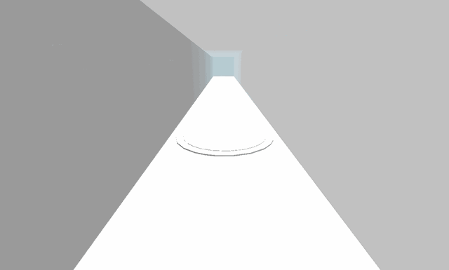White Tunnel</a>
<a class="wiki-card wiki-card--photo" href="wind-shrine.html">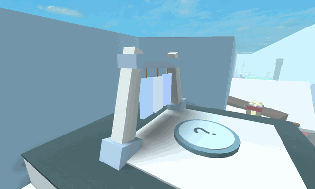Wind Shrine</a>
<a class="wiki-card wiki-card--photo" href="windy-bee-gate.html">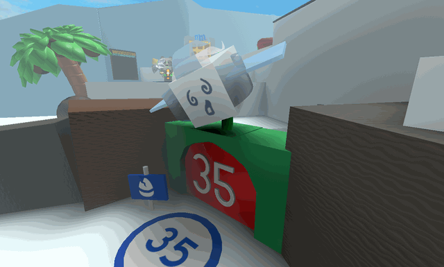Windy Bee Gate</a>
<a class="wiki-card wiki-card--photo" href="yellow-cannon.html">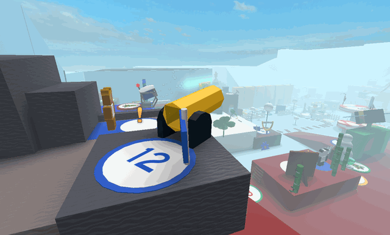Yellow Cannon</a>

