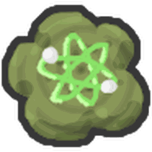

# Probabilities

All 50 pages in Probabilities.

<a class="wiki-card" href="ant-amulet-probability.html">Ant Amulet</a>
<a class="wiki-card" href="autumn-sunhat-probability.html">Autumn Sunhat</a>
<a class="wiki-card" href="bandage-probability.html">Bandage</a>
<a class="wiki-card" href="bang-snap-probability.html">Bang Snap</a>
<a class="wiki-card" href="bead-lizard-probability.html">Bead Lizard</a>
<a class="wiki-card" href="beesmas-top-probability.html">Beesmas Top</a>
<a class="wiki-card" href="beesmas-tree-hat-probability.html">Beesmas Tree Hat</a>
<a class="wiki-card" href="beret-probability.html">Beret</a>
<a class="wiki-card" href="bottle-cap-probability.html">Bottle Cap</a>
<a class="wiki-card" href="bubble-light-probability.html">Bubble Light</a>
<a class="wiki-card" href="camo-bandana-probability.html">Camo Bandana</a>
<a class="wiki-card" href="camphor-lip-balm-probability.html">Camphor Lip Balm</a>
<a class="wiki-card" href="candy-ring-probability.html">Candy Ring</a>
<a class="wiki-card" href="charm-bracelet-probability.html">Charm Bracelet</a>
<a class="wiki-card" href="cog-amulet-probability.html">Cog Amulet</a>
<a class="wiki-card" href="demon-talisman-probability.html">Demon Talisman</a>
<a class="wiki-card" href="electric-candle-probability.html">Electric Candle</a>
<a class="wiki-card" href="elf-cap-probability.html">Elf Cap</a>
<a class="wiki-card" href="festive-wreath-probability.html">Festive Wreath</a>
<a class="wiki-card" href="icicles-probability.html">Icicles</a>
<a class="wiki-card" href="kazoo-probability.html">Kazoo</a>
<a class="wiki-card" href="king-beetle-amulet-probability.html">King Beetle Amulet</a>
<a class="wiki-card" href="lei-probability.html">Lei</a>
<a class="wiki-card" href="lump-of-coal-probability.html">Lump Of Coal</a>
<a class="wiki-card" href="moon-amulet-probability.html">Moon Amulet</a>
<a class="wiki-card" href="mutation-probability.html">Mutation</a>
<a class="wiki-card" href="paper-angel-probability.html">Paper Angel</a>
<a class="wiki-card" href="paperclip-probability.html">Paperclip</a>
<a class="wiki-card" href="peppermint-antennas-probability.html">Peppermint Antennas</a>
<a class="wiki-card" href="pinecone-probability.html">Pinecone</a>
<a class="wiki-card" href="pink-eraser-probability.html">Pink Eraser</a>
<a class="wiki-card" href="pink-shades-probability.html">Pink Shades</a>
<a class="wiki-card" href="poinsettia-probability.html">Poinsettia</a>
<a class="wiki-card" href="reindeer-antlers-probability.html">Reindeer Antlers</a>
<a class="wiki-card" href="rose-headband-probability.html">Rose Headband</a>
<a class="wiki-card" href="shell-amulet-probability.html">Shell Amulet</a>
<a class="wiki-card" href="single-mitten-probability.html">Single Mitten</a>
<a class="wiki-card" href="smiley-sticker-probability.html">Smiley Sticker</a>
<a class="wiki-card" href="snow-tiara-probability.html">Snow Tiara</a>
<a class="wiki-card" href="snowglobe-probability.html">Snowglobe</a>
<a class="wiki-card" href="star-amulet-probability.html">Star Amulet</a>
<a class="wiki-card" href="stick-bug-amulet-probability.html">Stick Bug Amulet</a>
<a class="wiki-card" href="sticker-seeker-quest-machine-probability.html">Sticker-Seeker Quest Machine</a>
<a class="wiki-card" href="sweatband-probability.html">Sweatband</a>
<a class="wiki-card" href="thimble-probability.html">Thimble</a>
<a class="wiki-card" href="thumbtack-probability.html">Thumbtack</a>
<a class="wiki-card" href="toy-drum-probability.html">Toy Drum</a>
<a class="wiki-card" href="toy-horn-probability.html">Toy Horn</a>
<a class="wiki-card" href="warm-scarf-probability.html">Warm Scarf</a>
<a class="wiki-card" href="whistle-probability.html">Whistle</a>

