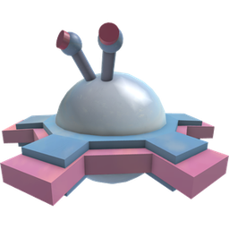

# Cogmower

*Not to be confused with [Golden Cogmowers](golden-cogmower.md), the rarer, golden counterparts of Cogmowers or [Party Cogmowers](party-cogmower.md), the Beesmas Edition of these.*

<aside class="portable-infobox pi-background pi-border-color pi-theme-wikia pi-layout-stacked" role="region">
<h2 class="pi-item pi-item-spacing pi-title pi-secondary-background" data-source="title">Cogmower</h2>
<figure class="pi-item pi-image">

</figure>

<h3 class="pi-data-label pi-secondary-font">Location</h3>

Any field while the <a href="robo-bear-challenge.html">Robo Bear Challenge</a> is active.

</aside>

A **Cogmower** is a mob that exclusively appears during [Robo Bear's Challenge](robo-bear-challenge.md).

This is the second mob in the Robo Bear Challenge that the player encounters, appearing as early as round 5.

Cogmowers rise from the field before slowly moving around the field aimlessly in a straight line, destroying layers and removing goo from flowers upon going near them. when the player switches fields, the Cogmower sinks in the former field and ascends to the field the player is currently/recently standing in to follow the player. Cogmowers bounce in different directions when hitting the field's borders or another cogmower. The higher the level of the Cogmower, the more pollen is drained. They only take half the damage from [Critical Hits](critical-hits.md).

In rounds 10 and 20. Cogmowers are the main target mobs, requiring to defeat 10 in Round 10 and 20 in Round 20. In these rounds, cogmowers do not randomly spawn but will always stay in the same field and not follow the player whenever they stand in another field.

In round 10, cogmowers spawn in 3 sets of fields. The first set always contains 4 cogmowers, spawning in either [Pineapple Patch](pineapple-patch.md), [Bamboo Field](bamboo-field.md), or [Clover Field](clover-field.md). The second set contains 3 cogmowers and will spawn in either [Dandelion Field](dandelion-field.md), [Sunflower Field](sunflower-field.md), or [Strawberry Field](strawberry-field.md). The third set contains 3 cogmowers and will spawn in either [Cactus Field](cactus-field.md), [Pumpkin Patch](pumpkin-patch.md), or [Pine Tree Forest](pine-tree-forest.md).

In round 20, 4 sets of cogmowers spawn and there are 5 cogmowers each set. They spawn in nearly the same fields as round 10, with the addition of the [Rose Field](rose-field.md).

A Cogmower's level can range from 5-22, depending on what round of Robo Bear's Challenge the player is on.

## Health per Level

<table class="mw-collapsible mw-collapsed fandom-table">
<tbody><tr>
<th>Level
</th>
<th>Health
</th></tr>
<tr>
<td>6
</td>
<td>5,400
</td></tr>
<tr>
<td>7
</td>
<td>6,400
</td></tr>
<tr>
<td>8
</td>
<td>7,400
</td></tr>
<tr>
<td>9
</td>
<td>8,400
</td></tr>
<tr>
<td>10
</td>
<td>9,400
</td></tr>
<tr>
<td>11
</td>
<td>11,000
</td></tr>
<tr>
<td>12
</td>
<td>12,000
</td></tr>
<tr>
<td>13
</td>
<td>13,400
</td></tr>
<tr>
<td>14
</td>
<td>15,000
</td></tr>
<tr>
<td>15
</td>
<td>17,000
</td></tr>
<tr>
<td>16
</td>
<td>19,000
</td></tr>
<tr>
<td>17
</td>
<td>20,000
</td></tr>
<tr>
<td>18
</td>
<td>23,000
</td></tr>
<tr>
<td>19
</td>
<td>25,000
</td></tr>
<tr>
<td>20
</td>
<td>30,000
</td></tr>
<tr>
<td>21
</td>
<td>32,000
</td></tr>
<tr>
<td>22
</td>
<td>34,000
</td></tr></tbody></table>

## Strategies

* Cogmowers do not aim for the player, allowing players to sidestep them easily.
* A Cogmower's hitbox is directly in front of it instead of over it, so you can stand inside of one to ensure your bees target them.
* Stand near the Cogmower, this allows your bees to lock on to the Cogmower and quickly deal damage.
* [Vicious Bee](vicious-bee.md) and [Windy Bee](windy-bee.md) provide excellent crowd control, especially since Cogmowers often come in pairs or packs. [Digital Bee](digital-bee.md) can also stun many Cogmowers at once, and allow them to take extra damage via [Mind Hack](ability-tokens.md#Mind_Hack).
* The  *Star Saw'* Passive from the [Supreme Star Amulet](star-amulet.md#Supreme_Star_Amulet) can be useful as it circles you for 30 seconds when activated and can damage multiple Cogmowers simultaneously.
* Frogs, Pollen Haze, and multiple amounts of [Supreme Saturators](the-supreme-saturator.md) can provide great amounts of field regeneration, which can combat the flowers drained by the cogmowers.

## Trivia

* Cogmower is a portmanteau of "Cog" and "Lawnmower'.
* Cogmowers have a unique golden counterpart known as a [Golden Cogmower](golden-cogmower.md).
  * They also have a Beesmas variant called the [Party Cogmower](party-cogmower.md).
* Cogmowers, [Golden Cogmowers](golden-cogmower.md), [Party Cogmowers](party-cogmower.md), [Cogturrets](cogturret.md), [Party Cogturrets](party-cogturret.md), and [Wild Windy Bee](wild-windy-bee.md) are the only mobs that are able to collect layers of flowers.
* If a Cogmower is stunned due to Digital Bee's Mind Hack, and is hit by an unaffected one, it would still bounce.

<table class="mw-collapsible NavTable">
<tbody><tr>
<th class="NavTitle" colspan="3">Mobs
</th></tr>
<tr>
<th class="NavCategory" rowspan="2">Normal
</th>
<td class="NavLinks NavLinksBasicOdd" colspan="2"><b><a href="ladybug.html">Ladybug</a> • <a href="rhino-beetle.html">Rhino Beetle</a> • <a href="aphid.html">Aphid</a> • <a href="spider.html">Spider</a> • <a href="mantis.html">Mantis</a> • <a href="scorpion.html">Scorpion</a> • <a href="werewolf.html">Werewolf</a> • <a href="cave-monster.html">Cave Monster</a></b>
</td></tr>
<tr>
<th class="NavCategory"><a href="aphid.html">Aphids</a>
</th>
<td class="NavLinks NavLinksBasicEven"><b><a href="aphid.html#Normal_Aphid">Aphid</a> • <a href="aphid.html#Rage_Aphid">Rage Aphid</a> • <a href="aphid.html#Armored_Aphid">Armored Aphid</a> • <a href="aphid.html#Diamond_Aphid">Diamond Aphid</a></b>
</td></tr>
<tr>
<th class="NavCategory">Mini-Bosses
</th>
<td class="NavLinks NavLinksBasicOdd" colspan="2"><b><a href="rogue-vicious-bee.html">Rogue Vicious Bee</a> • <a href="wild-windy-bee.html">Wild Windy Bee</a> • <a href="stump-snail.html">Stump Snail</a> • <a href="chicks.html#Commando_Chick">Commando Chick</a> • <a href="snowbear.html">Snowbear</a></b>
</td></tr>
<tr>
<th class="NavCategory">Bosses
</th>
<td class="NavLinks NavLinksBasicEven" colspan="2"><b><a href="king-beetle.html">King Beetle</a> • <a href="tunnel-bear.html">Tunnel Bear</a> • <a href="coconut-crab.html">Coconut Crab</a> • <a href="chicks.html#Mondo_Chick">Mondo Chick</a></b>
</td></tr>
<tr>
<th class="NavCategory" rowspan="5">Challenges
</th>
<th class="NavCategory"><a href="ants.html">Ants</a>
</th>
<td class="NavLinks NavLinksBasicOdd"><b><a href="ant.html">Ant</a> • <a href="army-ant.html">Army Ant</a> • <a href="flying-ant.html">Flying Ant</a> • <a href="giant-ant.html">Giant Ant</a> • <a href="fire-ant.html">Fire Ant</a></b>
</td></tr>
<tr>
<th class="NavCategory"><a href="stick-bug-challenge.html">Stick Bug</a>
</th>
<td class="NavLinks NavLinksBasicEven"><b><a href="stick-bug.html">Stick Bug</a> • <a href="stick-nymph.html">Stick Nymph</a> • <a href="festive-nymph.html">Festive Nymph</a></b>
</td></tr>
<tr>
<th class="NavCategory"><a href="robo-bear-challenge.html">Robo Bear Challenge</a>
</th>
<td class="NavLinks NavLinksBasicEven"><b><a href="mechsquito.html">Mechsquito</a> • <strong class="mw-selflink selflink">Cogmower</strong> • <a href="cogturret.html">Cogturret</a> • <a href="mega-mechsquito.html">Mega Mechsquito</a> • <a href="golden-cogmower.html">Golden Cogmower</a></b>
</td></tr>
<tr>
<th class="NavCategory"><a href="robo-party-cake.html#Robo_Party">Robo Party</a>
</th>
<td class="NavLinks NavLinksBasicOdd"><b><a href="party-mechsquito.html">Party Mechsquito</a> • <a href="party-cogmower.html">Party Cogmower</a> • <a href="party-cogturret.html">Party Cogturret</a> • <a href="party-mega-mechsquito.html">Party Mega Mechsquito</a></b>
</td></tr>
<tr>
<th class="NavCategory">Passive
</th>
<td class="NavLinks NavLinksBasicEven" colspan="2"><b><a href="fireflies.html">Firefly</a> • <a href="bean-bug.html">Bean Bug</a> • <a href="frog.html">Frog</a>  • <a href="puffshroom.html">Puffshroom</a> • <a href="bloom.html">Bloom</a></b>
</td></tr>
<tr>
<th class="NavCategory">Removed
</th>
<td class="NavLinks NavLinksBasicOdd" colspan="2"><b><a href="chicks.html#Chick">Chick</a> • <a href="chicks.html#Hostage_Chick">Hostage Chick</a> • <a href="chicks.html#Spotted_Chick">Spotted Chick</a></b>
</td></tr></tbody></table>
