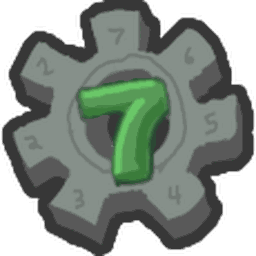

# Cogturret

{ align=right width=150 }

<aside class="portable-infobox pi-background pi-border-color pi-theme-wikia pi-layout-stacked" role="region">
<h2 class="pi-item pi-item-spacing pi-title pi-secondary-background" data-source="title">Cogturret</h2>

<h3 class="pi-data-label pi-secondary-font">Location</h3>

Any field while the <a href="robo-bear-challenge.html">Robo Bear Challenge</a> is active.

</aside>

*Not to be confused with [Party Cogturrets](party-cogturret.md), the Beesmas Edition of these.*

A **Cogturret** is a mob that appears during [Robo Bear Challenge](robo-bear-challenge.md).

This is the third type of mob the Player will encounter while doing the challenge, first appearing at round 11.

Cogturrets always position themselves on the field's edge and follow the player similar to cogmowers where they descend to the former field and ascend to the current/recent field the player has visited. Cogturrets behavior is a fixed cycle. First, Cogturrets hide under the field and move along the field's edges, either randomly or at the player, during this state, cogturrets cannot be targeted. Then, they ascend and become targetable again. After a few seconds, they blast a giant red cog projectile in a straight line that destroys flowers, removing all layers of the flower and any goo covering it. After this, the Cogturret hides again and repeats the cycle.

Cogturrets' level can range from 11 to 22 depending on the current round of the Robo Bear Challenge.

## Health per Level

<table class="mw-collapsible mw-collapsed fandom-table">
<tbody><tr>
<th>Level
</th>
<th>Health
</th></tr>
<tr>
<td>11
</td>
<td>6,800
</td></tr>
<tr>
<td>12
</td>
<td>7,800
</td></tr>
<tr>
<td>13
</td>
<td>8,800
</td></tr>
<tr>
<td>14
</td>
<td>9,800
</td></tr>
<tr>
<td>15
</td>
<td>11,000
</td></tr>
<tr>
<td>16
</td>
<td>12,200
</td></tr>
<tr>
<td>17
</td>
<td>13,200
</td></tr>
<tr>
<td>18
</td>
<td>14,200
</td></tr>
<tr>
<td>19
</td>
<td>15,500
</td></tr>
<tr>
<td>20
</td>
<td>17,000
</td></tr>
<tr>
<td>21
</td>
<td>19,000
</td></tr>
<tr>
<td>22
</td>
<td>20,000
</td></tr></tbody></table>

## Strategies

* Cogturrets aim either at the player or randomly and have a delay on attacking whenever they ascend. Because of this, moving to the side after they fire a cog will often result in Cogturrets missing their attack.
* Cogturrets will always shoot straight at where they are facing so you can avoid their attacks simply by not being in front of them.
* Stand near the Cogturrets, this allows your bees to lock on to the Cogturrets and quickly deal damage.
* [Vicious Bee](vicious-bee.md) and [Windy Bee](windy-bee.md) provide excellent crowd control, especially since Cogturrets often come in pairs or packs. [Digital Bee](digital-bee.md) can also stun many Cogturrets at once and allow them to take extra damage via [Mind Hack](ability-tokens.md#Mind_Hack).

## Trivia

* Cogturrets have a Robo Party variant named [Party Cogturrets](party-cogturret.md).
* Cogturrets, [Cogmowers](cogmower.md), [Golden Cogmowers](golden-cogmower.md), [Party Cogmower](party-cogmower.md), [Party Cogturrets](party-cogturret.md), and [Wild Windy Bee](wild-windy-bee.md) are the only entities who can collect from flowers.

<table class="mw-collapsible NavTable">
<tbody><tr>
<th class="NavTitle" colspan="3">Mobs
</th></tr>
<tr>
<th class="NavCategory" rowspan="2">Normal
</th>
<td class="NavLinks NavLinksBasicOdd" colspan="2"><b><a href="ladybug.html">Ladybug</a> • <a href="rhino-beetle.html">Rhino Beetle</a> • <a href="aphid.html">Aphid</a> • <a href="spider.html">Spider</a> • <a href="mantis.html">Mantis</a> • <a href="scorpion.html">Scorpion</a> • <a href="werewolf.html">Werewolf</a> • <a href="cave-monster.html">Cave Monster</a></b>
</td></tr>
<tr>
<th class="NavCategory"><a href="aphid.html">Aphids</a>
</th>
<td class="NavLinks NavLinksBasicEven"><b><a href="aphid.html#Normal_Aphid">Aphid</a> • <a href="aphid.html#Rage_Aphid">Rage Aphid</a> • <a href="aphid.html#Armored_Aphid">Armored Aphid</a> • <a href="aphid.html#Diamond_Aphid">Diamond Aphid</a></b>
</td></tr>
<tr>
<th class="NavCategory">Mini-Bosses
</th>
<td class="NavLinks NavLinksBasicOdd" colspan="2"><b><a href="rogue-vicious-bee.html">Rogue Vicious Bee</a> • <a href="wild-windy-bee.html">Wild Windy Bee</a> • <a href="stump-snail.html">Stump Snail</a> • <a href="chicks.html#Commando_Chick">Commando Chick</a> • <a href="snowbear.html">Snowbear</a></b>
</td></tr>
<tr>
<th class="NavCategory">Bosses
</th>
<td class="NavLinks NavLinksBasicEven" colspan="2"><b><a href="king-beetle.html">King Beetle</a> • <a href="tunnel-bear.html">Tunnel Bear</a> • <a href="coconut-crab.html">Coconut Crab</a> • <a href="chicks.html#Mondo_Chick">Mondo Chick</a></b>
</td></tr>
<tr>
<th class="NavCategory" rowspan="5">Challenges
</th>
<th class="NavCategory"><a href="ants.html">Ants</a>
</th>
<td class="NavLinks NavLinksBasicOdd"><b><a href="ant.html">Ant</a> • <a href="army-ant.html">Army Ant</a> • <a href="flying-ant.html">Flying Ant</a> • <a href="giant-ant.html">Giant Ant</a> • <a href="fire-ant.html">Fire Ant</a></b>
</td></tr>
<tr>
<th class="NavCategory"><a href="stick-bug-challenge.html">Stick Bug</a>
</th>
<td class="NavLinks NavLinksBasicEven"><b><a href="stick-bug.html">Stick Bug</a> • <a href="stick-nymph.html">Stick Nymph</a> • <a href="festive-nymph.html">Festive Nymph</a></b>
</td></tr>
<tr>
<th class="NavCategory"><a href="robo-bear-challenge.html">Robo Bear Challenge</a>
</th>
<td class="NavLinks NavLinksBasicEven"><b><a href="mechsquito.html">Mechsquito</a> • <a href="cogmower.html">Cogmower</a> • <strong class="mw-selflink selflink">Cogturret</strong> • <a href="mega-mechsquito.html">Mega Mechsquito</a> • <a href="golden-cogmower.html">Golden Cogmower</a></b>
</td></tr>
<tr>
<th class="NavCategory"><a href="robo-party-cake.html#Robo_Party">Robo Party</a>
</th>
<td class="NavLinks NavLinksBasicOdd"><b><a href="party-mechsquito.html">Party Mechsquito</a> • <a href="party-cogmower.html">Party Cogmower</a> • <a href="party-cogturret.html">Party Cogturret</a> • <a href="party-mega-mechsquito.html">Party Mega Mechsquito</a></b>
</td></tr>
<tr>
<th class="NavCategory">Passive
</th>
<td class="NavLinks NavLinksBasicEven" colspan="2"><b><a href="fireflies.html">Firefly</a> • <a href="bean-bug.html">Bean Bug</a> • <a href="frog.html">Frog</a>  • <a href="puffshroom.html">Puffshroom</a> • <a href="bloom.html">Bloom</a></b>
</td></tr>
<tr>
<th class="NavCategory">Removed
</th>
<td class="NavLinks NavLinksBasicOdd" colspan="2"><b><a href="chicks.html#Chick">Chick</a> • <a href="chicks.html#Hostage_Chick">Hostage Chick</a> • <a href="chicks.html#Spotted_Chick">Spotted Chick</a></b>
</td></tr></tbody></table>
