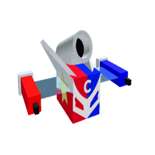
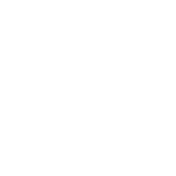

# Crimbolt Bee

Crimbolt Bee

<input type="radio" name="bee-infobox-tab" id="bee-tab-original" checked>
<label for="bee-tab-original">Original</label>
<input type="radio" name="bee-infobox-tab" id="bee-tab-gifted">
<label for="bee-tab-gifted">Gifted</label>

<i>"A harmonious bee embodying the united force of red, white, and blue."</i>

<b>Rarity</b>Event

<b>Color</b>Colorless

<b>Energy</b>1500

<b>Speed</b>21

<b>Attack</b>12

**Crimbolt Bee** is a Colorless [Event bee](bees-event.md) that is only in Re://:Swarm. Its body is red on the left, blue on the right and white on the front, with a "C" crest, and it carries a rocket tube on its back.

Its egg description reads: *"The symbol of all colors in unison. Uses Token Link, Haste, and Crimbolt Rockets, and empowers its hive through Combined Forces."*

It fires rockets at the field with its own ability, Crimbolt Rockets, and also has [Token Link](ability-tokens.md#token-link) and [Haste](ability-tokens.md#haste). Its passive, Combined Forces, boosts Instant Conversion of all three colours and your critical hits.

Crimbolt Bee has no favourite treat. It likes the [Rose Field](rose-field.md) and [Clover Field](clover-field.md), and dislikes the [Pineapple Patch](pineapple-patch.md). Only one can be in a hive.

## Stats

| Stat | Value |
|---|---|
| Rarity | Event |
| Colour | Colorless |
| Energy | 1,500 |
| Speed | 21 |
| Attack | 12 |
| Gather | 75 pollen every 4 seconds |
| Convert | 280 honey every 3 seconds |
| Gifted bonus | x1.2 Pollen, +8% Instant Conversion, +2 Attack |

The bee info panel lists its bonuses as: *+7,400% Energy, +50% Movespeed, +25% Convert Speed, +50% Gather Amount, +180 Convert Amount, +11 Attack.* Two of those don't match its real stats: it gathers 75 pollen against a Basic Bee's 10 (x7.5), and makes 280 honey against 80 (+200).

Crimbolt Bee has the highest Energy of any bee in the game.

## Abilities

### Crimbolt Rockets

<figure class="ability-token"><figcaption>Crimbolt Rockets</figcaption></figure>

*"Causes Crimbolt Bee to fly into the air and fire 3 rockets at random flowers in the field. Each impact collects pollen in the same 13-flower pattern as a regular Bomb token, and every flower struck spawns a Crimbolt Flame."*

The rockets fire 0.45 seconds apart and land on 3 different flowers. Each impact counts as a Bomb and a Buzz Bomb, so it works with Bomb Combo and Bomb Power.

* Attempt cooldown: 6 seconds
* Use cooldown: 24 seconds
* Chance per attempt: 25%
* Token lasts 8 seconds
* Spawns while gathering and in battle

Each rocket that lands in a field has a 1 in 1,750 chance to give the [Menacing Crimbolt Bee](sticker.md) sticker and a 1 in 10,000 chance to give the [Explosion](sticker.md) sticker.

See [Ability Tokens](ability-tokens.md#crimbolt-rockets) for more.

### Token Link

<figure class="ability-token"><figcaption>Token Link</figcaption></figure>

*"Collects all other ability tokens, granting 25 Honey (+10 per lvl) per token collected."*

* Cooldown: 5 seconds
* Chance: 1 in 3

### Haste

<figure class="ability-token"><figcaption>Haste</figcaption></figure>

*"Grants +10% player movespeed for 20 seconds. Stacks up to 10 times."*

* Cooldown: 4.5 seconds
* Chance: 1 in 3

## Passive: Combined Forces

While Crimbolt Bee is in your hive, you get:

* +20% Instant Red, Blue and White Conversion
* +5% [Critical Chance](critical-hits.md)
* +100% [Critical Power](critical-hits.md)
* +5% Honey Per Pollen
* +35% Defense Piercing

## Passive: Trio (Gifted only)

While gathering, a [Gifted](gifted-bee.md) Crimbolt Bee has an independent 33% chance every 4.5 seconds to spawn a Red, Blue and White [Boost](ability-tokens.md#boost) token together. This doesn't lower its other ability chances.

## Crimbolt Flame and Crimbolt's Heat

Every flower a Crimbolt Rocket hits spawns a **Crimbolt Flame**. It works like a normal [Flame](flame.md), collecting pollen every second, but:

* It lasts 6 seconds (longer with flame duration bonuses).
* It is red, white and blue.
* It can never turn into a Dark Flame.
* Standing near it gives **Crimbolt's Heat** instead of Flame Heat.

**Crimbolt's Heat** fills up while you stand near your own Crimbolt Flames, up to 20 seconds. It fills twice as fast as Flame Heat, and more flames fill it faster. Its bonuses grow as it fills. At a full 20 seconds it gives:

* x2 Red, Blue and White Pollen
* x2 Super-Crit Power
* +5% Super-Crit Chance

Crimbolt's Heat and Flame Heat are separate buffs, so you can have both. It is lost when you leave the game. See [Critical Hits](critical-hits.md) for how Super-Crits work.

## How to obtain

* **[Sun Bear](sun-bear.md)'s 15th Crimbolt quest, "Crimbolt's Final Test"**, gives a [Crimbolt Bee Egg](egg.md#crimbolt-bee-egg). See [Crimbolt Quests](sun-bear.md#crimbolt-quests-15).
* **Rebirth 34** rewards a Crimbolt Bee Egg. See [Rebirths](rebirths.md).

Hatching the egg also gives a **Crimbolt Bee Jelly**, which turns any bee into a Crimbolt Bee. Like other Event bees, it can be made Gifted with a [Star Treat](star-treat.md).

The game also has a Gifted Crimbolt Bee Egg, but nothing gives it yet. No shop, code or Robux pack sells any Crimbolt item.

## Stickers

These are the stickers Crimbolt Bee can find for you. Odds are from the game's code.

| | Sticker | How | Chance |
|---|---|---|---|
| { width=40 } | [Menacing Crimbolt Bee](sticker.md) | Each Crimbolt Rockets rocket that lands in a field (3 per token) | 1 in 1,750 per rocket |
| { width=40 } | [Explosion](sticker.md) | Each Crimbolt Rockets rocket that lands in a field | 1 in 10,000 per rocket |

Like any bee, it can also find the stickers listed under [Bee sticker drops](sticker.md#bee-sticker-drops).

## See also

* [Ability Tokens](ability-tokens.md#crimbolt-rockets)
* [Bees/Event](bees-event.md)
* [Sun Bear](sun-bear.md#crimbolt-quests-15)
* [Mortar Bee](mortar-bee.md), which uses the same rocket code but fires one rocket at a time and makes no Crimbolt Flames

## All bees

--8<-- "all-bees.md"
