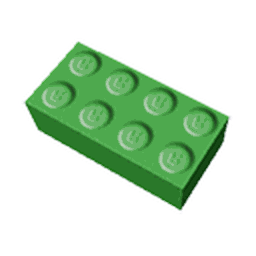

# Daily Top Blue Brick Field Collectors

{ align=right width=150 }

This piece of content goes bye bye.

The following content has been removed from the game. The contents below may be archival, but feel free to edit below.

The **Daily Top Blue Brick Field Collectors** was, at the time, one of the 66 [leaderboards](leaderboards.md) in the game. Unlike other leaderboards, it did not appear in the [System Page](system-page.md), nor anywhere else in-game. This leaderboard measured how much [pollen](pollen.md) players had collected in the [Blue Brick Field](retro-swarm-challenge.md) that day. It reset every day at 12:00 AM CST.

## Prizes

If the player had reached the top 100 by the end of the day, they would be awarded with the 25 [Tickets](ticket.md).

## Trivia

* This, along with the other Brick Field collector leaderboards, and the Daily Top Ant Field Collectors was the only leaderboard not to be displayed anywhere in the game.
* This was tied to be the fourth leaderboard to be removed, tied with the aforementioned leaderboards, and the rest being the [Most Commando Captures](most-commando-captures.md), [Highest Snowbear Level](highest-snowbear-level.md) and [Highest Robo Party Cake Rank](highest-robo-party-cake-rank.md) leaderboard.
