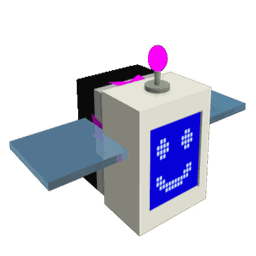

# Digital Bee

<table class="infobox templateBeeDefault">
<tbody><tr>
<td class="templateBeeTitle templateBeeEventText" colspan="3"><b>Digital Bee</b>
</td></tr>
<tr>
<td class="templateBeeTabber" colspan="3">

<h3>Original</h3>

<h3>Gifted</h3>

</td></tr>
<tr>
<td class="templateBeeDesc" colspan="3"><i>"A virtual bee with malfunctioning AI. It corrupts the game itself."</i>
</td></tr>
<tr>
<td class="templateBeeDefaultCell" colspan="3"><b>Rarity</b>   Event
</td></tr>
<tr>
<td class="templateBeeDefaultCell" colspan="3"><b>Color</b>   Colorless
</td></tr>
<tr>
<td class="templateBeeStatCell"><b>Energy</b>   20
</td>
<td class="templateBeeStatCell templateBeeBadStat"><b>Speed</b>   11.9
</td>
<td class="templateBeeStatCell"><b>Attack</b>   1
</td></tr>
<tr>
<td class="templateBeeHeader templateBeeEventText" colspan="3">COLOR SCHEME
</td></tr>
<tr>
<td colspan="3"><table class="templateBeeDefaultStripeTable">
<tbody><tr>
<td>

 

 

 

 

Skin

#717779

#bab088

#e7daaa

</td></tr>
</tbody></table>
</td></tr></tbody></table>

*Not to be confused with Digital Bee's NPC counterpart from the Ready Player Two event.*

**Digital Bee** is a Colorless [Event bee](bees-event.md) that hatches out of a [Digital Bee egg](egg.md#Event_Bee_Eggs), which is available in the [Robo Bear's Shop](robo-bear-s-shop.md) for 7,777,777 [Honey](honey.md), 5 [Red Drives](drives.md#Red_Drive), 5 [Blue Drives](drives.md#Blue_Drive), 5 [White Drives](drives.md#White_Drive), and 5 [Glitched Drives](drives.md#Glitched_Drive). It also requires the player to unlock (not equip) the [Diamond Cog Amulet](cog-amulet.md) to unlock crafting it. If Digital Bee is already owned, 1,000 [Tickets](ticket.md) will be granted instead.

Like all other Event bees, this bee does not have a favorite treat, and the only way to make it gifted is by feeding it a [Star Treat](star-treat.md), [Gingerbread Bears](gingerbread-bear.md) or [Aged Gingerbread Bears](aged-gingerbread-bear.md).

Digital Bee likes the [Dandelion Field](dandelion-field.md), [Mountain Top Field](mountain-top-field.md), and [Coconut Field](coconut-field.md). It dislikes the [Pine Tree Forest](pine-tree-forest.md).

## Stats

* Collects 10 [Pollen](pollen.md) in 4 seconds.
* Makes 80 [Honey](honey.md) in 4 seconds.
* -15% [Movespeed](stats.md#Speed), +10% [Critical Chance](critical-hits.md), up to +1000 Convert Amount, up to +125 Gather Amount, up to +15 Attack, up to +25% Ability Rate
* 🌟 [Gifted Hive Bonus](gifted-bee.md): +1% Ability Duplication Chance

### Abilities

* **[Glitch](ability-tokens.md#Glitch)** Corrupts the Field you're in for 20s (+1s per Level), granting collected [Ability Tokens](ability-tokens.md) a chance to be duplicated (or "Duped").
  * Duped Tokens hover over the field for a duration equal to the lifespan of the original Ability Token x2 (+5% per Digital Bee Level). Standing beneath a Duped Token for 1s causes it to activate.
  * Increasing a field's Corruption increases the chance for abilities to be duplicated (8%-20%) and boosts the pollen collection and Instant Conversion of Duped Abilities (x1.1 - x3 Pollen from Duped Abilities, 20%-90% IC from Duped Abilities). Enhancing Digital Bee with Drives causes this ability to grant more Corruption: Colored Drives increase the Corruption of fields with matching flowers while [Glitched Drives](drives.md#Glitched_Drive) increase the Corruption of all fields.
  * While this is active, Digital Bee will occasionally spawn [☺︎ Tokens](ability-tokens.md). Activating a ☺︎ token temporarily increases the field's Corruption, causes all Duped Tokens to be activated, and collects pollen equal to +50% of Digital Bee's gather amount from a random arrangement of flowers, then multiplies the Pollen collected by +50% per Duped Token collected with 50% being instantly converted. The flowers are stamped for 10s, granting them a x2 pollen multiplier. The stamped flowers also come in a "☺", "&", "?", "\*", or "~" shape. The frequency of ☺︎ tokens increases with the number of [Glitched Drives](drives.md#Glitched_Drive) Digital Bee has been enhanced with.
* **[Mind Hack](ability-tokens.md#Mind_Hack)** Hacks the minds of up to 3 nearby enemies (+1 per every 3 lvls), stunning them for 3s (+0.1s per lvl). While hacked, the enemies take 25% more damage (+0.1% per [Glitched Drive](drives.md#Glitched_Drive) Digital Bee has been enhanced with). Hacking is only half as effective against bosses.
  * If in a field, this also spawns a [☺︎ token](ability-tokens.md#☺).
* **[🌟Gifted Ability: Map Corruption](ability-tokens.md#Map_Corruption)** Digital Bee corrupts a random field by a small amount for all players for 3 minutes (+15s per lvl). The amount of Corruption is increased by the number of Drives Digital Bee has been enhanced with up to 300 corruption (other players receive 1/3 of the corruption).
  * Fields with more flowers matching the color of the most recent colored Drive you've used are more likely to be selected. If your most recent Drive is a Glitched Drive, the field is completely random but gains 25% more Corruption.
* **[Passive: Drive Expansion](passive-abilities.md#Drive_Expansion)** Using a Drive while this bee is active in [Robo Bear's Challenge](robo-bear-challenge.md) corrupts the field you're standing in by an amount proportional to the number of flowers that match the Drive's color (Glitched Drives corrupt all fields equally). Additionally, it permanently enhances this bee, increasing the Corruption of its abilities and granting it the following stats:

:   - Red Drive: +0.03 [Attack](stats.md#Attack)
:   - Blue Drive: +2 [Convert Amount](stats.md#Production_Amount)
:   - White Drive: +0.25 [Gather Amount](stats.md#Gather_Amount)
:   - Glitched Drive: +0.05% [Ability Rate](system-page.md#Bee_Ability_Rate)

* Every 10 [Glitched Drives](drives.md#Glitched_Drive) Enhancements also grants a Hive Bonus of +0.03% Ability Duplication Chance.
* Digital Bee can be enhanced with up to 500 of each type of Drive. You can view the number of enhancements by clicking on Digital Bee's [hive slot](hive-slot.md).
* Upon maxing out with all 2000 Drives, Digital Bee gains +10 [Movespeed](stats.md#Speed) and grants a Hive Bonus of +0.5% Ability Duplication Chance.

<table style="font-size:1.5vh; color:#000; width:100%; background:#fff; padding: 15px 0; border:none; color:#000; border-left:15px #000 solid">
<tbody><tr>
<td style="width:100%; text-align:center">

Digital Bee has a base pollen collection of <b>10 </b> in <b>4 seconds</b>. 

That's equivalent to 2.5  per second. 

(<b>20 </b> in <b>4 seconds</b> with x2 Bee Pollen gamepass)

</td></tr></tbody></table>

<table align="center" class="wikitable" style="text-align:center; width:80%;">
<tbody><tr>
<th colspan="5"> Pollen Collection
</th></tr>
<tr>
<td rowspan="2">Flower Tier
</td><td colspan="1" rowspan="2">Bee Pollen
</td><td colspan="2">with Critical Hit
</td></tr>
<tr>
<td>without Melody
</td><td>with Melody
</td></tr>
<tr>
<td>Single
</td><td>10
</td><td>20
</td><td>30
</td></tr>
<tr>
<td>Double
</td><td>20
</td><td>40
</td><td>60
</td></tr>
<tr>
<td>Triple
</td><td>30
</td><td>60
</td><td>90
</td></tr>
<tr>
<td>Large
</td><td>40
</td><td>80
</td><td>120
</td></tr>
<tr>
<td>Star
</td><td>50
</td><td>100
</td><td>150
</td></tr>
</tbody></table>

<table style="font-size:1.5vh; color:#000; width:100%; background:linear-gradient(to left, #FFB75E, #ED8F03); padding: 15px 0; border:none; color:#fff; border-left:15px #fff solid">
<tbody><tr>
<td style="width:100%; text-align:center">

Digital Bee can make <b>80 </b> in <b>4 seconds</b>!

That's equivalent to <b>20  per second</b>.

(<b>80  in 2 seconds</b> with x2 Honeymaking Speed)

</td></tr>
</tbody></table>

<table align="center" class="wikitable" style="text-align:center; width:75%">
<tbody><tr>
<th>Honey Collection with Science Enhancement
</th></tr>
<tr>
<td>
<h3>Levels 1-8</h3><table align="center" class="wikitable" style="text-align:center;">
<tbody><tr>
<th><i>Science Enhancement</i>
</th><th>Production Rate
</th><th>Number of Produced Honey
</th></tr>
<tr>
<td>1
</td><td>25%
</td><td>100
</td></tr>
<tr>
<td>2
</td><td>50%
</td><td>120
</td></tr>
<tr>
<td>3
</td><td>75%
</td><td>140
</td></tr>
<tr>
<td>4
</td><td>100%
</td><td>160
</td></tr>
<tr>
<td>5
</td><td>125%
</td><td>180
</td></tr>
<tr>
<td>6
</td><td>150%
</td><td>200
</td></tr>
<tr>
<td>7
</td><td>175%
</td><td>220
</td></tr>
<tr>
<td>8
</td><td>200%
</td><td>240
</td></tr>
</tbody></table><h3>Levels 9-16</h3><table align="center" class="wikitable" style="text-align:center;">
<tbody><tr>
<th><i>Science Enhancement</i>
</th><th>Production Rate
</th><th>Number of Produced Honey
</th></tr>
<tr>
<td>9
</td><td>225%
</td><td>260
</td></tr>
<tr>
<td>10
</td><td>250%
</td><td>280
</td></tr>
<tr>
<td>11
</td><td>275%
</td><td>300
</td></tr>
<tr>
<td>12
</td><td>300%
</td><td>320
</td></tr>
<tr>
<td>13
</td><td>325%
</td><td>340
</td></tr>
<tr>
<td>14
</td><td>350%
</td><td>360
</td></tr>
<tr>
<td>15
</td><td>375%
</td><td>380
</td></tr>
<tr>
<td>16
</td><td>400%
</td><td>400
</td></tr>
</tbody></table><h3>Levels 17-24</h3><table align="center" class="wikitable" style="text-align:center;">
<tbody><tr>
<th><i>Science Enhancement</i>
</th><th>Production Rate
</th><th>Number of Produced Honey
</th></tr>
<tr>
<td>17
</td><td>425%
</td><td>420
</td></tr>
<tr>
<td>18
</td><td>450%
</td><td>440
</td></tr>
<tr>
<td>19
</td><td>475%
</td><td>460
</td></tr>
<tr>
<td>20
</td><td>500%
</td><td>480
</td></tr>
<tr>
<td>21
</td><td>525%
</td><td>500
</td></tr>
<tr>
<td>22
</td><td>550%
</td><td>520
</td></tr>
<tr>
<td>23
</td><td>575%
</td><td>540
</td></tr>
<tr>
<td>24
</td><td>600%
</td><td>560
</td></tr>
</tbody></table><h3>Levels 25-31</h3><table align="center" class="wikitable" style="text-align:center;">
<tbody><tr>
<th><i>Science Enhancement</i>
</th><th>Production Rate
</th><th>Number of Produced Honey
</th></tr>
<tr>
<td>25
</td><td>625%
</td><td>580
</td></tr>
<tr>
<td>26
</td><td>650%
</td><td>600
</td></tr>
<tr>
<td>27
</td><td>675%
</td><td>620
</td></tr>
<tr>
<td>28
</td><td>700%
</td><td>640
</td></tr>
<tr>
<td>29
</td><td>725%
</td><td>660
</td></tr>
<tr>
<td>30
</td><td>750%
</td><td>680
</td></tr>
<tr>
<td>31
</td><td>775%
</td><td>700
</td></tr>
</tbody></table>

</td></tr>
</tbody></table>

## Gallery

OriginalDigital.png

Digital Bee's unused face.

Digital Bee Face.png

Digital Bee's face.

Images.dbface gui.png

The decal used for Digital Bee.

FieldCorruption.png

A server wide message when a players' Digital Bee corrupts a field.

Gdbface gui.png

The decal used for Digital Bee's gifted variant.

Hackstatus.png

Digital Bee's Mind Hack ability.

Screenshot 2023-01-27 163310.png

The Field Corruption buff.

The Happy Token.png

Gifted Digital Bee's map corruption token.

CorruptedField.png

The <a href="coconut-field.html">Coconut Field</a> seen while being corrupted.

Digitalpack.png

Digital Bee's icon in the <a href="robux-shop.html">Robux Shop</a>.

DigitalBeePack.jpg

Digital Bee's pack in the Robux Shop.

A Gifted digital bee hive slot.jpg

A Gifted Digital Bee Hive Slot.

Digital Bee HS.jpg

A Digital Bee Hive Slot.

A First Edition Digital Bee.png

A 1st Edition Digital Bee.

Gifted first edition digital bee in hive.jpg

A Gifted 1st Edition Digital Bee.

Captura de pantalla 2024-06-09 145115.png

Digital Bee's unique UI, displaying how many drives it has been upgraded with.

BSSRoboBearUpdateThumb.png

Digital Bee in the Background with <a href="basic-bee.html">Basic Bee</a>, <a href="robo-bear.html">Robo Bear</a>, a <a href="cogmower.html">cogmower</a> and a <a href="mechsquito.html">mechsquito</a> in a version of the game's icon.

BSSRoboBearUpdate2xThumb.png

Digital Bee in the Background with <a href="basic-bee.html">Basic Bee</a>, <a href="robo-bear.html">Robo Bear</a>, a <a href="cogmower.html">cogmower</a> and a <a href="mechsquito.html">mechsquito</a> in a version of the game's icon but with the "X2 EVENT" text.

Duped Token Collection.gif

Collecting a duped ability token.

## Trivia

* Digital Bee first made its appearance in the Ready Player Two event.
  * This also makes Digital Bee the first and only bee to make an appearance in the game before being implemented as an actual bee.
* Digital Bee was available in an old package at the time of its release. It was the only way to obtain the bee other than purchasing it in [Robo Bear's Shop](robo-bear-s-shop.md).
* Digital Bee is the only bee that requires an [amulet](amulet.md) to be unlocked as of right now. It is also the only event bee to require multiple materials to be purchased.
* Digital Bee's favorite operating system is TempleOS, according to Onett.
* Digital Bee is currently the most expensive bee that was sold in the [Robux Shop](robux-shop.md), with a price of 2,500 Robux
* Digital Bee is the only bee that can be upgraded with the use of items, which are [drives](drives.md).
* The shapes that Digital Bee makes when collecting a ☺︎ token are the same shapes made by the bee's NPC counterpart during its field puzzles.
* Digital Bee is the only event bee that has a passive and gifted ability.
  * It is also the only non-mythic bee to have a gifted ability.
* Digital Bee is the only event bee to have a negative stat, whose movespeed has a value of 11.9 which is below the normal speed value (14).
* Digital Bee's ☺ is a reference to an old computer malware called "You are an idiot" aka "youdontknowwhoiam" aka "offiz trojan" which overloads your computer's RAM and CPU usage every time you try to close the program; Digital Bee references this behavior with its ability.
* Digital Bee's gifted form's face resembles the [blue screen of death](https://en.wikipedia.org/wiki/Blue_screen_of_death), which is a common problem for Windows computers.
* Digital Bee, [Windy Bee](windy-bee.md), [Gummy Bee](gummy-bee.md), [Vicious Bee](vicious-bee.md), and [Bear Bee](bear-bee.md) are the only event bees that have an obtainment method not involving tickets.

<table class="mw-collapsible mw-collapsed NavTable">
<tbody><tr>
<th class="NavTitle" colspan="2">Bees
</th></tr>
<tr>
<th class="NavCategory">Common &amp; Rare
</th>
<td class="NavLinks NavLinksRare"><b> <a href="basic-bee.html">Basic Bee</a> •  <a href="bomber-bee.html">Bomber Bee</a>  •  <a href="brave-bee.html">Brave Bee</a> •  <a href="bumble-bee.html">Bumble Bee</a> •  <a href="cool-bee.html">Cool Bee</a> •  <a href="hasty-bee.html">Hasty Bee</a> •  <a href="looker-bee.html">Looker Bee</a> •  <a href="rad-bee.html">Rad Bee</a> •  <a href="rascal-bee.html">Rascal Bee</a> •  <a href="stubborn-bee.html">Stubborn Bee</a></b>
</td></tr>
<tr>
<th class="NavCategory">Epic
</th>
<td class="NavLinks NavLinksEpic"><b> <a href="bubble-bee.html">Bubble Bee</a> •  <a href="bucko-bee.html">Bucko Bee</a> •  <a href="commander-bee.html">Commander Bee</a> •  <a href="demo-bee.html">Demo Bee</a> •  <a href="exhausted-bee.html">Exhausted Bee</a> •  <a href="fire-bee.html">Fire Bee</a> •  <a href="frosty-bee.html">Frosty Bee</a> •  <a href="honey-bee.html">Honey Bee</a> •  <a href="rage-bee.html">Rage Bee</a> •  <a href="riley-bee.html">Riley Bee</a> •  <a href="shocked-bee.html">Shocked Bee</a></b>
</td></tr>
<tr>
<th class="NavCategory">Legendary
</th>
<td class="NavLinks NavLinksLegend"><b> <a href="baby-bee.html">Baby Bee</a> •  <a href="carpenter-bee.html">Carpenter Bee</a> •  <a href="demon-bee.html">Demon Bee</a> •  <a href="diamond-bee.html">Diamond Bee</a> •  <a href="lion-bee.html">Lion Bee</a> •  <a href="music-bee.html">Music Bee</a> •  <a href="ninja-bee.html">Ninja Bee</a> •  <a href="shy-bee.html">Shy Bee</a></b>
</td></tr>
<tr>
<th class="NavCategory">Mythic
</th>
<td class="NavLinks NavLinksMythic"><b> <a href="buoyant-bee.html">Buoyant Bee</a> •  <a href="fuzzy-bee.html">Fuzzy Bee</a> •  <a href="precise-bee.html">Precise Bee</a> •  <a href="spicy-bee.html">Spicy Bee</a> •  <a href="tadpole-bee.html">Tadpole Bee</a> •  <a href="vector-bee.html">Vector Bee</a></b>
</td></tr>
<tr>
<th class="NavCategory">Event
</th>
<td class="NavLinks NavLinksEvent"><b> <a href="bear-bee.html">Bear Bee</a> •  <a href="cobalt-bee.html">Cobalt Bee</a> •  <a href="crimson-bee.html">Crimson Bee</a> •  <strong class="mw-selflink selflink">Digital Bee</strong> •  <a href="festive-bee.html">Festive Bee</a> •  <a href="gummy-bee.html">Gummy Bee</a> •  <a href="photon-bee.html">Photon Bee</a> •  <a href="puppy-bee.html">Puppy Bee</a> •  <a href="tabby-bee.html">Tabby Bee</a> •  <a href="vicious-bee.html">Vicious Bee</a> •  <a href="windy-bee.html">Windy Bee</a></b>
</td></tr></tbody></table>

