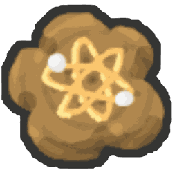

# Energized Atomic Treat

{ align=right width=150 }

*"Always gives a bee an Energy Mutation."*

The **Energized Atomic Treat** is a [treat](treats.md) that always gives a [bee](bees.md) an **Energy** [mutation](mutation.md). It works like an [Atomic Treat](atomic-treat.md), but the mutation is always Energy instead of a random one.

## Effect

* +1,000 [bond](bond.md).
* Always mutates the bee. The new mutation replaces any mutation it already had.

| Mutation | Chance | Value |
|---|---|---|
| % Energy | Always | +10% to +40% |

The value is random and leans towards the low end, but 7% of the time it rolls the maximum. The bee's level doesn't change the range.

## Ways to obtain

* **Rebirth rewards** (rebirth number, with the amount in brackets): 17 (5), 19 (10), 20 (25), 26 (25), 30 (100), 32 (250).

## See also

* [Atomic Treat](atomic-treat.md)
* [Mutation](mutation.md)
* [Treats](treats.md)
