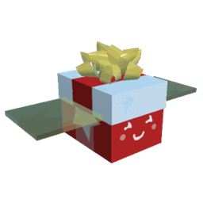

# Festive Bee

Festive Bee

<input type="radio" name="bee-infobox-tab" id="bee-tab-original" checked>
<label for="bee-tab-original">Original</label>
<input type="radio" name="bee-infobox-tab" id="bee-tab-gifted">
<label for="bee-tab-gifted">Gifted</label>

<i>"A jolly bee who loves giving gifts! It's purely motivated by the joy of others."</i>

<b>Rarity</b>Event

<b>Color</b>Red

<b>Energy</b>20

<b>Speed</b>16.1

<b>Attack</b>1

Color Scheme

<b>Skin</b><code>#ad2222</code><code>#227d3d</code><code>#ad2222</code>

**Festive Bee** is a Red [Event bee](bees-event.md). It can be purchased in the [Ticket Tent](ticket-tent.md) for 500 [Tickets](ticket.md).

Like all other Event bees, this bee does not have a favorite treat, and the only way to make it gifted is by feeding it a [Star Treat](star-treat.md), [Gingerbread Bears](gingerbread-bear.md) or [Aged Gingerbread Bears](aged-gingerbread-bear.md).

Festive Bee likes the [Mountain Top Field](mountain-top-field.md), [Mushroom Field](mushroom-field.md), and the [Pine Tree Forest](pine-tree-forest.md). It dislikes the [Blue Flower Field](blue-flower-field.md).

## Stats

* Collects 40 [Pollen](pollen.md) in 4 seconds.
* Makes 150 [Honey](honey.md) in 1 second.
* +20% [Movespeed](stats.md#Speed), +30 [Gather Amount](stats.md#Gather_Amount), +70 [Convert Amount](system-page.md#Convert_Amount), +75% [Convert Speed](system-page.md#Convert_Rate).
* 🌟 [Gifted Hive Bonus](gifted-bee.md): x1.25 [Convert Rate at Hive](system-page.md#Convert_Rate_At_Hive)

### Abilities

* **[Festive Gift](ability-tokens.md#Festive_Gift)**: Grants random gifts including [Treats](treats.md), honey, and "[Festive Blessing](ability-tokens.md#Festive_Blessing)" to all players on the server. Gifts are improved with Level. A message will appear saying "🎁 Festive Gifts from [Player's Display Name]! 🎁". If Gifted, can grant rarer gifts and "[Beesmas Cheer](ability-tokens.md#Beesmas_Cheer)".
* **[Honey Mark](ability-tokens.md#Mark)**  : Marks a random area on the [field](fields.md) for 7 seconds (+0.2s per level) that grants 2 Conversion Links and x1.25 Convert Rate while you stand in it. Stacks up to 3 times.
* **[Red Bomb+](ability-tokens.md#Bomb)**: Collects 10 pollen from 29 surrounding red [Flowers](flowers.md) (+10% pollen per level). You can combo with other bombs to increase power.

<table style="font-size:1.5vh; color:#000; width:100%; background:#fff; padding: 15px 0; border:none; color:#000; border-left:15px #af2136 solid">
<tbody><tr>
<td style="width:100%; text-align:center">

Festive Bee has a base pollen collection of <b>40 </b> in <b>4 seconds</b>. 

That's equivalent to 10  per second. 

(<b>80 </b> in <b>4 seconds</b> with x2 Bee Pollen gamepass)

</td></tr></tbody></table>

<table align="center" class="wikitable" style="text-align:center; width:80%;">
<tbody><tr>
<th colspan="5"> Pollen Collection
</th></tr>
<tr>
<td rowspan="2">Flower Tier
</td><td colspan="2">Bee Pollen
</td><td colspan="2">with Critical Hit
</td></tr>
<tr>
<td>Base Value
</td><td>Red Flower
</td><td>without Melody
</td><td>with Melody
</td></tr>
<tr>
<td>Single
</td><td>40
</td><td>60
</td><td>80
</td><td>120
</td></tr>
<tr>
<td>Double
</td><td>80
</td><td>120
</td><td>160
</td><td>240
</td></tr>
<tr>
<td>Triple
</td><td>120
</td><td>180
</td><td>240
</td><td>360
</td></tr>
<tr>
<td>Large
</td><td>160
</td><td>240
</td><td>320
</td><td>480
</td></tr>
<tr>
<td>Star
</td><td>200
</td><td>300
</td><td>400
</td><td>600
</td></tr>
</tbody></table>

<table align="center" class="wikitable" style="text-align:center; width:80%">
<tbody><tr>
<th colspan="3">Pollen Collection with Boost Tokens
</th></tr>
<tr>
<td>Boost Tokens ( or )
</td><td>Percentage Bonus
</td><td>Collected Pollen
</td></tr>
<tr>
<td>1
</td><td>15%
</td><td>46
</td></tr>
<tr>
<td>2
</td><td>30%
</td><td>52
</td></tr>
<tr>
<td>3
</td><td>45%
</td><td>58
</td></tr>
<tr>
<td>4
</td><td>60%
</td><td>64
</td></tr>
<tr>
<td>5
</td><td>75%
</td><td>70
</td></tr>
<tr>
<td>6
</td><td>90%
</td><td>76
</td></tr>
<tr>
<td>7
</td><td>105%
</td><td>82
</td></tr>
<tr>
<td>8
</td><td>120%
</td><td>88
</td></tr>
<tr>
<td>9
</td><td>135%
</td><td>94
</td></tr>
<tr>
<td>10
</td><td>150%
</td><td>100
</td></tr>
</tbody></table>

<table style="font-size:1.5vh; color:#000; width:100%; background:linear-gradient(to left, #FFB75E, #ED8F03); padding: 15px 0; border:none; color:#fff; border-left:15px #fff solid">
<tbody><tr>
<td style="width:100%; text-align:center">

Festive Bee can make <b>150 </b> in <b>1 second</b>!

 

(<b>150  in 0.5 seconds</b> with x2 Honeymaking Speed)

</td></tr>
</tbody></table>

<table align="center" class="wikitable" style="text-align:center; width:75%">
<tbody><tr>
<th>Honey Collection with Science Enhancement
</th></tr>
<tr>
<td>
<h3>Levels 1-8</h3><table align="center" class="wikitable" style="text-align:center;">
<tbody><tr>
<th><i>Science Enhancement</i>
</th><th>Production Rate
</th><th>Number of Produced Honey
</th></tr>
<tr>
<td>1
</td><td>25%
</td><td>187.5
</td></tr>
<tr>
<td>2
</td><td>50%
</td><td>225
</td></tr>
<tr>
<td>3
</td><td>75%
</td><td>262.5
</td></tr>
<tr>
<td>4
</td><td>100%
</td><td>300
</td></tr>
<tr>
<td>5
</td><td>125%
</td><td>337.5
</td></tr>
<tr>
<td>6
</td><td>150%
</td><td>375
</td></tr>
<tr>
<td>7
</td><td>175%
</td><td>412.5
</td></tr>
<tr>
<td>8
</td><td>200%
</td><td>450
</td></tr>
</tbody></table><h3>Levels 9-16</h3><table align="center" class="wikitable" style="text-align:center;">
<tbody><tr>
<th><i>Science Enhancement</i>
</th><th>Production Rate
</th><th>Number of Produced Honey
</th></tr>
<tr>
<td>9
</td><td>225%
</td><td>487.5
</td></tr>
<tr>
<td>10
</td><td>250%
</td><td>525
</td></tr>
<tr>
<td>11
</td><td>275%
</td><td>562.5
</td></tr>
<tr>
<td>12
</td><td>300%
</td><td>600
</td></tr>
<tr>
<td>13
</td><td>325%
</td><td>637.5
</td></tr>
<tr>
<td>14
</td><td>350%
</td><td>675
</td></tr>
<tr>
<td>15
</td><td>375%
</td><td>712.5
</td></tr>
<tr>
<td>16
</td><td>400%
</td><td>750
</td></tr>
</tbody></table><h3>Levels 17-24</h3><table align="center" class="wikitable" style="text-align:center;">
<tbody><tr>
<th><i>Science Enhancement</i>
</th><th>Production Rate
</th><th>Number of Produced Honey
</th></tr>
<tr>
<td>17
</td><td>425%
</td><td>787.5
</td></tr>
<tr>
<td>18
</td><td>450%
</td><td>825
</td></tr>
<tr>
<td>19
</td><td>475%
</td><td>862.5
</td></tr>
<tr>
<td>20
</td><td>500%
</td><td>900
</td></tr>
<tr>
<td>21
</td><td>525%
</td><td>937.5
</td></tr>
<tr>
<td>22
</td><td>550%
</td><td>975
</td></tr>
<tr>
<td>23
</td><td>575%
</td><td>1012.5
</td></tr>
<tr>
<td>24
</td><td>600%
</td><td>1050
</td></tr>
</tbody></table><h3>Levels 25-31</h3><table align="center" class="wikitable" style="text-align:center;">
<tbody><tr>
<th><i>Science Enhancement</i>
</th><th>Production Rate
</th><th>Number of Produced Honey
</th></tr>
<tr>
<td>25
</td><td>625%
</td><td>1087.5
</td></tr>
<tr>
<td>26
</td><td>650%
</td><td>1125
</td></tr>
<tr>
<td>27
</td><td>675%
</td><td>1162.5
</td></tr>
<tr>
<td>28
</td><td>700%
</td><td>1200
</td></tr>
<tr>
<td>29
</td><td>725%
</td><td>1237.5
</td></tr>
<tr>
<td>30
</td><td>750%
</td><td>1275
</td></tr>
<tr>
<td>31
</td><td>775%
</td><td>1312.5
</td></tr>
</tbody></table>

</td></tr>
</tbody></table>

## Trivia

* When this bee's egg was moved to the [Ticket Tent](ticket-tent.md), it replaced [Gummy Bee](gummy-bee.md)'s spot.
* This was the third Event bee to have ability tokens that can be summoned by non-Event bees (Honey Mark and Red Bomb+), the first being [Photon Bee](photon-bee.md) (Haste) and the second being [Vicious Bee](vicious-bee.md) (Blue Bomb+).
* This bee likes the [Pine Tree Forest](pine-tree-forest.md). This is a reference due to most Christmas trees being pine trees.
  * This also makes it the only red bee to like this field.
* This bee, [Buoyant Bee](buoyant-bee.md), and [Digital Bee](digital-bee.md) are the only bees that can apply buffs to the entire server. (More specifically, Balloons, Festive Gifts, and Field Corruption.)
* This bee, [Rage Bee](rage-bee.md) and [Spicy Bee](spicy-bee.md) are the only red bees to produce tokens that don't give primary benefit to only red (Festive Bee yields Honey Mark tokens and both Rage Bee and Spicy Bee yield [Rage](ability-tokens.md#Rage) tokens).
* This was the second bee available to be bought for Robux, the first being [Bear Bee](bear-bee.md).
  * However, this was the first bee to be obtainable through both [quests](quests.md) and Robux; and the second bee to be obtained through quests overall, the first being Gummy Bee.
* When Festive Gift activates, it plays the first few notes from the classic Christmas song "[Deck the Halls](https://en.wikipedia.org/wiki/Deck_the_Halls)".
  * The first 8 notes play when collecting the Festive Gift token; the next 5 notes play when collecting the Festive Blessing token; and the last 4 notes of the phrase play when collecting the Beesmas Cheer token.
* A [First Edition](first-edition-bee.md) Festive Bee's flag is offset and is placed behind where it normally is to make room for the bee's bow.
* Due to a bug, Festive Bees obtained from the Ticket Tent before the [2019-09-28 Update](updates.md#2019-09-28) might have received a First Edition Flag in that update despite not being a true First Edition Bee.
* It was the only Event bee that could have been obtained in two different ways (excluding Robux packs) at the same time: The Festive Present next to Bee Bear and in the Ticket Tent for 500 tickets during Beesmas 2019.
* This bee, along with [Windy Bee](windy-bee.md), are the only bees with tinted wings when not gifted.
* Bee Bear's Festive Bee is female.
  * Festive Bee was obtainable during the first three Beesmas events with means besides tickets.
  * It could be obtained during Beesmas 2018 by completing the Bee Bear questline or by purchasing the Festive Bee Pack for 1,600 Robux in the [Robux Shop](robux-shop.md).
  * It could have been obtained through the [Festive Present](ornament-presents.md), in the Beesmas 2019 Event. If the player already had Festive Bee, they would instead get 500 [Tickets](ticket.md).
  * In Beesmas 2020, this bee can be obtained after finishing Bee Bear's first questline. If the player already had a Festive Bee, they were awarded 500 [Tickets](ticket.md) instead.
* This bee, [Puppy Bee](puppy-bee.md), and [Demon Bee](demon-bee.md) are the only [bees](bees.md) that have an exclusive [beequip](beequip.md) for themselves.
* Festive Bee is the only non-colorless bee capable of making Mark tokens.
* After Beesmas 2020, the models of Festive and Puppy Bee, wearing their respective exclusive beequips, were moved outside of the main map, just behind [Commando Chick's Hideout](commando-chick-s-hideout.md).
* Festive Bee and [Riley Bee](riley-bee.md) are the only red bees to like three fields.
* Festive bee is the only bee to have a Beesmas-exclusive [sticker](sticker.md).

<table class="mw-collapsible mw-collapsed NavTable">
<tbody><tr>
<th class="NavTitle" colspan="2">Bees
</th></tr>
<tr>
<th class="NavCategory">Common &amp; Rare
</th>
<td class="NavLinks NavLinksRare"><b> <a href="basic-bee.html">Basic Bee</a> •  <a href="bomber-bee.html">Bomber Bee</a>  •  <a href="brave-bee.html">Brave Bee</a> •  <a href="bumble-bee.html">Bumble Bee</a> •  <a href="cool-bee.html">Cool Bee</a> •  <a href="hasty-bee.html">Hasty Bee</a> •  <a href="looker-bee.html">Looker Bee</a> •  <a href="rad-bee.html">Rad Bee</a> •  <a href="rascal-bee.html">Rascal Bee</a> •  <a href="stubborn-bee.html">Stubborn Bee</a></b>
</td></tr>
<tr>
<th class="NavCategory">Epic
</th>
<td class="NavLinks NavLinksEpic"><b> <a href="bubble-bee.html">Bubble Bee</a> •  <a href="bucko-bee.html">Bucko Bee</a> •  <a href="commander-bee.html">Commander Bee</a> •  <a href="demo-bee.html">Demo Bee</a> •  <a href="exhausted-bee.html">Exhausted Bee</a> •  <a href="fire-bee.html">Fire Bee</a> •  <a href="frosty-bee.html">Frosty Bee</a> •  <a href="honey-bee.html">Honey Bee</a> •  <a href="rage-bee.html">Rage Bee</a> •  <a href="riley-bee.html">Riley Bee</a> •  <a href="shocked-bee.html">Shocked Bee</a></b>
</td></tr>
<tr>
<th class="NavCategory">Legendary
</th>
<td class="NavLinks NavLinksLegend"><b> <a href="baby-bee.html">Baby Bee</a> •  <a href="carpenter-bee.html">Carpenter Bee</a> •  <a href="demon-bee.html">Demon Bee</a> •  <a href="diamond-bee.html">Diamond Bee</a> •  <a href="lion-bee.html">Lion Bee</a> •  <a href="music-bee.html">Music Bee</a> •  <a href="ninja-bee.html">Ninja Bee</a> •  <a href="shy-bee.html">Shy Bee</a></b>
</td></tr>
<tr>
<th class="NavCategory">Mythic
</th>
<td class="NavLinks NavLinksMythic"><b> <a href="buoyant-bee.html">Buoyant Bee</a> •  <a href="fuzzy-bee.html">Fuzzy Bee</a> •  <a href="precise-bee.html">Precise Bee</a> •  <a href="spicy-bee.html">Spicy Bee</a> •  <a href="tadpole-bee.html">Tadpole Bee</a> •  <a href="vector-bee.html">Vector Bee</a></b>
</td></tr>
<tr>
<th class="NavCategory">Event
</th>
<td class="NavLinks NavLinksEvent"><b> <a href="bear-bee.html">Bear Bee</a> •  <a href="cobalt-bee.html">Cobalt Bee</a> •  <a href="crimson-bee.html">Crimson Bee</a> •  <a href="digital-bee.html">Digital Bee</a> •  <strong class="mw-selflink selflink">Festive Bee</strong> •  <a href="gummy-bee.html">Gummy Bee</a> •  <a href="photon-bee.html">Photon Bee</a> •  <a href="puppy-bee.html">Puppy Bee</a> •  <a href="tabby-bee.html">Tabby Bee</a> •  <a href="vicious-bee.html">Vicious Bee</a> •  <a href="windy-bee.html">Windy Bee</a></b>
</td></tr></tbody></table>

