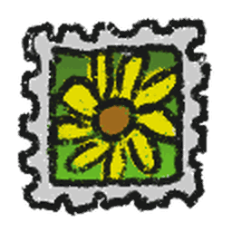

# Fields

{ align=right width=150 }

**Fields**, also referred to as "patches" or "[forests](pine-tree-forest.md)" are square/rectangular areas of [flowers](flowers.md) scattered around the map, where players are able to collect [pollen](pollen.md), which can be converted into [honey](honey.md) at their [hive](hive.md), or by other methods. There are a total of 23 different fields in the game, including those present in the [Ant Challenge](ant-challenge.md) and [Hive Hub](hive-hub.md). Each field consists of flowers, which come in three different colors: blue, red, and white. The flowers also vary each time a player joins a server based on how the field is generated. The more flowers in each square, the more pollen it gives and the faster it regrows; however, [Fuzzy Bee](fuzzy-bee.md) or any bee equipped with a [Poinsettia](poinsettia.md), [Rose Headband](rose-headband.md) or [Lei](lei.md) can pollinate it and increase the number of flowers on a square. [Guiding Star](passive-abilities.md) pollinates flowers when it hovers over a field. Diamond Drain also pollinates blue flowers. Fields can also spawn [Honey](honey.md) and [Treats](treat.md) in form of tokens.

<tabview>
Sunflower Field|Sunflower
Dandelion Field|Dandelion
Mushroom Field|Mushroom
Blue Flower Field|Blue Flower
Clover Field|Clover
Strawberry Field|Strawberry
Spider Field|Spider
Bamboo Field|Bamboo
Pineapple Patch|Pineapple
Stump Field|Stump
Cactus Field|Cactus
Pumpkin Patch|Pumpkin
Pine Tree Forest|Pine Tree
Rose Field|Rose
Hub Field|Hub
Mountain Top Field|Mountain Top
Pepper Patch|Pepper
Coconut Field|Coconut
Ant Field|Ant
</tabview>
