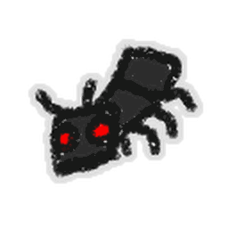

# Fire Ant

{ align=right width=150 }

<aside class="portable-infobox pi-background pi-border-color pi-theme-wikia pi-layout-stacked" role="region">
<h2 class="pi-item pi-item-spacing pi-title pi-secondary-background" data-source="title">Fire Ant</h2>

<h3 class="pi-data-label pi-secondary-font">Location</h3>

<a href="ant-field.html">Ant Field</a> while the <a href="ant-challenge.html">Ant Challenge</a> is active.

</aside>

A **Fire Ant** is one of five [ants](ants.md) that are exclusively found in the [Ant Challenge](ant-challenge.md), past the [Ant Gate](ant-gate.md).

This is the last Ant Challenge [mob](mobs.md) that the player will encounter. Fire Ants typically spawn in the later waves, such as after the first [Giant Ant](giant-ant.md).

Fire Ants are colored red and act the same as Regular Ants, but they leave a damaging flame trail behind them as they move. The flames will linger even after the Fire Ant that left it is defeated. However, the fire disappears after a short amount of time.

A Fire Ant's level can increase depending on what wave of the Ant Challenge the player is on. They can range from level 1 up to level 16.

Fire Ants are one of the most threatening of the five ant types, as their flame trails can stack up on the [field](fields.md).

## Health per Level

<table class="mw-collapsible mw-collapsed fandom-table">
<tbody><tr>
<th>Level
</th>
<th>Health
</th></tr>
<tr>
<td>1
</td>
<td>25
</td></tr>
<tr>
<td>2
</td>
<td>35
</td></tr>
<tr>
<td>3
</td>
<td>45
</td></tr>
<tr>
<td>4
</td>
<td>75
</td></tr>
<tr>
<td>5
</td>
<td>105
</td></tr>
<tr>
<td>6
</td>
<td>135
</td></tr>
<tr>
<td>7
</td>
<td>165
</td></tr>
<tr>
<td>8
</td>
<td>205
</td></tr>
<tr>
<td>9
</td>
<td>245
</td></tr>
<tr>
<td>10
</td>
<td>295
</td></tr>
<tr>
<td>11
</td>
<td>335
</td></tr>
<tr>
<td>12
</td>
<td>385
</td></tr>
<tr>
<td>13
</td>
<td>435
</td></tr>
<tr>
<td>14
</td>
<td>485
</td></tr>
<tr>
<td>15
</td>
<td>545
</td></tr>
<tr>
<td>16
</td>
<td>605
</td></tr></tbody></table>

## Strategies

* Fire Ants move in predetermined straight lines and are quite slow. This enables to player to easily dodge any coming their way.
* Standing near the Fire Ant will allow your [bees](bees.md) to quickly target the Fire Ant to quickly deal damage and defeat it.
* Focus on taking out Fire Ants first as they can make the field very hard to navigate without taking damage from their flame trails. This is especially true if there is a large amount of them on the field.
* Fire Ants will come out in groups and they could overwhelm the player if they are collecting pollen quickly to advance to the next waves. [Vicious Bee](vicious-bee.md) and [Windy Bee](windy-bee.md) provide excellent crowd control with their [Impale](ability-tokens.md#Impale) and [Tornado](ability-tokens.md#Tornado) abilities which could greatly help counter the large amounts of Fire Ants landing on the field. [Digital Bee](digital-bee.md) can also stun many Fire Ants at once and allow them to take extra damage via [Mind Hack](ability-tokens.md#Mind_Hack).
* The player can walk through the gap between the Ant Challenge's window and the field to avoid stepping over fire trails.

## Trivia

* This is the only ant to have a second method of attack.
* They have the same health per level as Regular Ants.
* Noted by [Panda Bear](panda-bear.md), the fire from a Fire Ant is not affected by [defense](system-page.md#Defense), but this seems to be untrue. Addition, having 100% defense (through [Emergency Coconut Shield](passive-abilities.md#Emergency_Coconut_Shield)) will nullify any damage altogether.

<table class="mw-collapsible NavTable">
<tbody><tr>
<th class="NavTitle" colspan="3">Mobs
</th></tr>
<tr>
<th class="NavCategory" rowspan="2">Normal
</th>
<td class="NavLinks NavLinksBasicOdd" colspan="2"><b><a href="ladybug.html">Ladybug</a> • <a href="rhino-beetle.html">Rhino Beetle</a> • <a href="aphid.html">Aphid</a> • <a href="spider.html">Spider</a> • <a href="mantis.html">Mantis</a> • <a href="scorpion.html">Scorpion</a> • <a href="werewolf.html">Werewolf</a> • <a href="cave-monster.html">Cave Monster</a></b>
</td></tr>
<tr>
<th class="NavCategory"><a href="aphid.html">Aphids</a>
</th>
<td class="NavLinks NavLinksBasicEven"><b><a href="aphid.html#Normal_Aphid">Aphid</a> • <a href="aphid.html#Rage_Aphid">Rage Aphid</a> • <a href="aphid.html#Armored_Aphid">Armored Aphid</a> • <a href="aphid.html#Diamond_Aphid">Diamond Aphid</a></b>
</td></tr>
<tr>
<th class="NavCategory">Mini-Bosses
</th>
<td class="NavLinks NavLinksBasicOdd" colspan="2"><b><a href="rogue-vicious-bee.html">Rogue Vicious Bee</a> • <a href="wild-windy-bee.html">Wild Windy Bee</a> • <a href="stump-snail.html">Stump Snail</a> • <a href="chicks.html#Commando_Chick">Commando Chick</a> • <a href="snowbear.html">Snowbear</a></b>
</td></tr>
<tr>
<th class="NavCategory">Bosses
</th>
<td class="NavLinks NavLinksBasicEven" colspan="2"><b><a href="king-beetle.html">King Beetle</a> • <a href="tunnel-bear.html">Tunnel Bear</a> • <a href="coconut-crab.html">Coconut Crab</a> • <a href="chicks.html#Mondo_Chick">Mondo Chick</a></b>
</td></tr>
<tr>
<th class="NavCategory" rowspan="5">Challenges
</th>
<th class="NavCategory"><a href="ants.html">Ants</a>
</th>
<td class="NavLinks NavLinksBasicOdd"><b><a href="ant.html">Ant</a> • <a href="army-ant.html">Army Ant</a> • <a href="flying-ant.html">Flying Ant</a> • <a href="giant-ant.html">Giant Ant</a> • <strong class="mw-selflink selflink">Fire Ant</strong></b>
</td></tr>
<tr>
<th class="NavCategory"><a href="stick-bug-challenge.html">Stick Bug</a>
</th>
<td class="NavLinks NavLinksBasicEven"><b><a href="stick-bug.html">Stick Bug</a> • <a href="stick-nymph.html">Stick Nymph</a> • <a href="festive-nymph.html">Festive Nymph</a></b>
</td></tr>
<tr>
<th class="NavCategory"><a href="robo-bear-challenge.html">Robo Bear Challenge</a>
</th>
<td class="NavLinks NavLinksBasicEven"><b><a href="mechsquito.html">Mechsquito</a> • <a href="cogmower.html">Cogmower</a> • <a href="cogturret.html">Cogturret</a> • <a href="mega-mechsquito.html">Mega Mechsquito</a> • <a href="golden-cogmower.html">Golden Cogmower</a></b>
</td></tr>
<tr>
<th class="NavCategory"><a href="robo-party-cake.html#Robo_Party">Robo Party</a>
</th>
<td class="NavLinks NavLinksBasicOdd"><b><a href="party-mechsquito.html">Party Mechsquito</a> • <a href="party-cogmower.html">Party Cogmower</a> • <a href="party-cogturret.html">Party Cogturret</a> • <a href="party-mega-mechsquito.html">Party Mega Mechsquito</a></b>
</td></tr>
<tr>
<th class="NavCategory">Passive
</th>
<td class="NavLinks NavLinksBasicEven" colspan="2"><b><a href="fireflies.html">Firefly</a> • <a href="bean-bug.html">Bean Bug</a> • <a href="frog.html">Frog</a>  • <a href="puffshroom.html">Puffshroom</a> • <a href="bloom.html">Bloom</a></b>
</td></tr>
<tr>
<th class="NavCategory">Removed
</th>
<td class="NavLinks NavLinksBasicOdd" colspan="2"><b><a href="chicks.html#Chick">Chick</a> • <a href="chicks.html#Hostage_Chick">Hostage Chick</a> • <a href="chicks.html#Spotted_Chick">Spotted Chick</a></b>
</td></tr></tbody></table>
