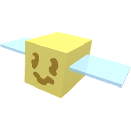
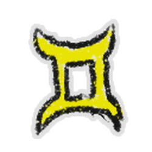

# Fireflies

{ align=right width=180 }

**Fireflies** are passive [mobs](mobs.md) that only appear during [nighttime](day-night-cycle.md). Individually, they produce [sparkles](sparkles.md) on the [flowers](flowers.md) that they land on. Fireflies band together to generate various [items](items.md) for the player.

As soon as nighttime begins, a group of eight fireflies will spawn above the [Star Hall](star-hall.md). These fireflies will then fly to a random fields. Fireflies can fly to the [Spider Field](spider-field.md), [Bamboo Field](bamboo-field.md), [Strawberry Field](strawberry-field.md), [Pineapple Patch](pineapple-patch.md), [Cactus Field](cactus-field.md), or the [Rose Field](rose-field.md). Once they reach the designated field, they will land randomly in a circle, facing towards the center. Fireflies also spawn [sparkles](sparkles.md) on the current flower they are on.

The player can chase a firefly from its position by walking close to it, forcing it to fly up. They will fly up if a player is within a three-flower radius. If a firefly is nudged away, the flower the firefly sat on will generate sparkles. When all eight fireflies are nudged away and fly up, the following might appear in the middle of the firefly formation:

<table class="article-table">
<tbody><tr>
<th>Possible Drops
</th>
<th>Rarity
</th></tr>
<tr>
<td><a href="moon-charm.html">Moon Charms</a>
</td>
<td>Common, increments of 1, 5, 10
</td></tr>
<tr>
<td><a href="glitter.html">Glitter</a>
</td>
<td>Rare
</td></tr>
<tr>
<td><a href="royal-jelly.html#Star_Jelly">Star Jelly</a>
</td>
<td>Very Rare
</td></tr>
<tr>
<td><a href="night-bell.html">Night Bell</a>
</td>
<td>Extremely Rare
</td></tr>
<tr>
<td><a href="star-treat.html">Star Treat</a>
</td>
<td>1/1,000,000[1]
</td></tr>
<tr>
<td><a href="sticker.html#Sticker_Index">Waxing Crescent Moon Sticker</a>
</td>
<td>Rare
</td></tr>
<tr>
<td><a href="sticker.html#Sticker_Index">Glowing Smile Sticker</a>
</td>
<td>Extremely Rare
</td></tr>
<tr>
<td><a href="sticker.html#Sticker_Index">Star Signs</a>
</td>
<td>Extremely Rare
</td></tr>
<tr>
<td><a href="sticker.html#Sticker_Index">Cyan Star Sticker</a>
</td>
<td>Exceptionally Rare
</td></tr>
<tr>
<td><a href="sticker.html#Sticker_Index">Shining Star Sticker</a>
</td>
<td>Exceptionally Rare
</td></tr>
</tbody></table>

The fireflies will continue this cycle in one field three times, and afterward, will target a new field. This cycle repeats until daytime arrives. When daytime arrives, they will fly back above the [Star Hall](star-hall.md) and eventually despawn.

## Trivia

* The face of a firefly is the same decal that a [Gummy Bee](gummy-bee.md) has, however the color of the latter's face is teal, whereas the former's is black.
* Fireflies, [frogs](frog.md), [Chicks](chicks.md#Chick), [Hostage Chicks](chicks.md#Hostage_Chick), [Spotted Chicks](chicks.md#Spotted_Chick), and Bean Bugs are the only passive mobs in the game.
  * Fireflies were the first passive mob introduced to the game.
  * Fireflies are also the only passive mobs to spawn exclusively at night.
* If a player uses a [Night Bell](night-bell.md) when a group of fireflies are leaving, another group will replace them. In an unknown update, the old group will come back instead of a new one.
* Despite the fact there are eight fireflies, the [Glowing Smile Sticker](sticker.md) only shows seven "fireflies".

## References

1. ↑ [[1]](https://discord.com/channels/427553293862961153/427553293862961155/711716939726323794) Discord message from Onett.

<table class="mw-collapsible NavTable">
<tbody><tr>
<th class="NavTitle" colspan="3">Mobs
</th></tr>
<tr>
<th class="NavCategory" rowspan="2">Normal
</th>
<td class="NavLinks NavLinksBasicOdd" colspan="2"><b><a href="ladybug.html">Ladybug</a> • <a href="rhino-beetle.html">Rhino Beetle</a> • <a href="aphid.html">Aphid</a> • <a href="spider.html">Spider</a> • <a href="mantis.html">Mantis</a> • <a href="scorpion.html">Scorpion</a> • <a href="werewolf.html">Werewolf</a> • <a href="cave-monster.html">Cave Monster</a></b>
</td></tr>
<tr>
<th class="NavCategory"><a href="aphid.html">Aphids</a>
</th>
<td class="NavLinks NavLinksBasicEven"><b><a href="aphid.html#Normal_Aphid">Aphid</a> • <a href="aphid.html#Rage_Aphid">Rage Aphid</a> • <a href="aphid.html#Armored_Aphid">Armored Aphid</a> • <a href="aphid.html#Diamond_Aphid">Diamond Aphid</a></b>
</td></tr>
<tr>
<th class="NavCategory">Mini-Bosses
</th>
<td class="NavLinks NavLinksBasicOdd" colspan="2"><b><a href="rogue-vicious-bee.html">Rogue Vicious Bee</a> • <a href="wild-windy-bee.html">Wild Windy Bee</a> • <a href="stump-snail.html">Stump Snail</a> • <a href="chicks.html#Commando_Chick">Commando Chick</a> • <a href="snowbear.html">Snowbear</a></b>
</td></tr>
<tr>
<th class="NavCategory">Bosses
</th>
<td class="NavLinks NavLinksBasicEven" colspan="2"><b><a href="king-beetle.html">King Beetle</a> • <a href="tunnel-bear.html">Tunnel Bear</a> • <a href="coconut-crab.html">Coconut Crab</a> • <a href="chicks.html#Mondo_Chick">Mondo Chick</a></b>
</td></tr>
<tr>
<th class="NavCategory" rowspan="5">Challenges
</th>
<th class="NavCategory"><a href="ants.html">Ants</a>
</th>
<td class="NavLinks NavLinksBasicOdd"><b><a href="ant.html">Ant</a> • <a href="army-ant.html">Army Ant</a> • <a href="flying-ant.html">Flying Ant</a> • <a href="giant-ant.html">Giant Ant</a> • <a href="fire-ant.html">Fire Ant</a></b>
</td></tr>
<tr>
<th class="NavCategory"><a href="stick-bug-challenge.html">Stick Bug</a>
</th>
<td class="NavLinks NavLinksBasicEven"><b><a href="stick-bug.html">Stick Bug</a> • <a href="stick-nymph.html">Stick Nymph</a> • <a href="festive-nymph.html">Festive Nymph</a></b>
</td></tr>
<tr>
<th class="NavCategory"><a href="robo-bear-challenge.html">Robo Bear Challenge</a>
</th>
<td class="NavLinks NavLinksBasicEven"><b><a href="mechsquito.html">Mechsquito</a> • <a href="cogmower.html">Cogmower</a> • <a href="cogturret.html">Cogturret</a> • <a href="mega-mechsquito.html">Mega Mechsquito</a> • <a href="golden-cogmower.html">Golden Cogmower</a></b>
</td></tr>
<tr>
<th class="NavCategory"><a href="robo-party-cake.html#Robo_Party">Robo Party</a>
</th>
<td class="NavLinks NavLinksBasicOdd"><b><a href="party-mechsquito.html">Party Mechsquito</a> • <a href="party-cogmower.html">Party Cogmower</a> • <a href="party-cogturret.html">Party Cogturret</a> • <a href="party-mega-mechsquito.html">Party Mega Mechsquito</a></b>
</td></tr>
<tr>
<th class="NavCategory">Passive
</th>
<td class="NavLinks NavLinksBasicEven" colspan="2"><b><strong class="mw-selflink selflink">Firefly</strong> • <a href="bean-bug.html">Bean Bug</a> • <a href="frog.html">Frog</a>  • <a href="puffshroom.html">Puffshroom</a> • <a href="bloom.html">Bloom</a></b>
</td></tr>
<tr>
<th class="NavCategory">Removed
</th>
<td class="NavLinks NavLinksBasicOdd" colspan="2"><b><a href="chicks.html#Chick">Chick</a> • <a href="chicks.html#Hostage_Chick">Hostage Chick</a> • <a href="chicks.html#Spotted_Chick">Spotted Chick</a></b>
</td></tr></tbody></table>
