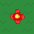
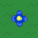
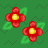
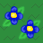
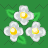
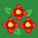
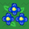

# Flowers

*Are you looking for [Pollen](pollen.md) or [Leaves](leaves.md)?*

**Flowers** can be found in all [fields](fields.md). They can be interacted with using different sources to obtain [pollen](pollen.md) from and later be converted into [honey](honey.md). There are 5 flower sizes: single, double, triple, large, and star. Single, double, triple, large, and star flowers multiply pollen by 1, 2, 3, 4 and 5 per harvest, respectively. This number can be increased with better [tools](tools.md), [badges](badges.md), [ability tokens](ability-tokens.md), [field boosters](field-booster.md), etc. They also have base total pollen amounts of 30, 45, 60, 75 and 90 respectively. Total pollen is how much pollen the player can get before the flower's pollen is depleted and the flower has to regrow. In addition, larger flowers grow at a higher rate than smaller ones. [Sprinklers](sprinklers.md), Clouds and [Bubbles](passive-abilities.md#Gathering_Bubbles) can regenerate flowers while the [pollen haze](ability-tokens.md#Pollen_Haze) [ability](ability-tokens.md) improves flower growth rate.

There are 3 different flower colors: white, red, and blue. [Bees](bees.md) also have these colors, and red/blue bees that harvest flowers of the same color get 50% bonus pollen from it. Also, the color of the pollen plays a large role in many [quests](quests.md) and bee abilities.

Sometimes, a flower patch might emit green [leaves](leaves.md). Collecting pollen from that patch will either grant an [item](items.md), a [sticker](sticker.md), or spawn an [aphid](aphid.md).

<table class="article-table">
<tbody><tr>
<th rowspan="2">Type
</th>
<th colspan="3">Flower
</th>
<th rowspan="2">Locations
</th></tr>
<tr>
<th>White
</th>
<th>Red
</th>
<th>Blue
</th></tr>
<tr>
<td>Single
</td>
<td>
</td>
<td>
</td>
<td>
</td>
<td><a href="sunflower-field.html">Sunflower Field</a>, <a href="dandelion-field.html">Dandelion Field</a>, <a href="mushroom-field.html">Mushroom Field</a>, <a href="clover-field.html">Clover Field</a>, <a href="blue-flower-field.html">Blue Flower Field</a>, <a href="spider-field.html">Spider Field</a>, <a href="strawberry-field.html">Strawberry Field</a>, <a href="bamboo-field.html">Bamboo Field</a>, <a href="pineapple-patch.html">Pineapple Patch</a>, <a href="pine-tree-forest.html">Pine Tree Forest</a>, <a href="rose-field.html">Rose Field</a>, <a href="ant-field.html">Ant Field</a>, <a href="hub-field.html">Hub Field</a>.
</td></tr>
<tr>
<td>Double
</td>
<td>
</td>
<td>
</td>
<td>
</td>
<td>Sunflower Field, Dandelion Field, Mushroom Field, Clover Field, Blue Flower Field, Spider Field, Strawberry Field, Bamboo Field, Pineapple Patch, <a href="cactus-field.html">Cactus Field</a>, <a href="pumpkin-patch.html">Pumpkin Patch</a>, Pine Tree Forest, Rose Field, Hub Field.
</td></tr>
<tr>
<td>Triple
</td>
<td>
</td>
<td>
</td>
<td>
</td>
<td>Spider Field, Strawberry Field, Bamboo Field, Pineapple Patch, <a href="stump-field.html">Stump Field</a>, Cactus Field, Pumpkin Patch, Pine Tree Forest, Rose Field, <a href="mountain-top-field.html">Mountain Top Field</a>, <a href="coconut-field.html">Coconut Field</a>, <a href="pepper-patch.html">Pepper Patch</a>, Hub Field.
</td></tr>
<tr>
<td>Large
</td>
<td>
</td>
<td>
</td>
<td>
</td>
<td>Can only be created by <a href="pollination.html">pollination</a>.
</td></tr>
<tr>
<td>Star
</td>
<td>
</td>
<td>
</td>
<td>
</td>
<td>Can only be created by <a href="pollination.html">pollination</a>.
</td></tr></tbody></table>

## Trivia

* There are decals of yellow flowers in Onett's inventory, but they have never made an appearance in the game itself. They were most likely scrapped during the game's development.
* White flowers are the most common in the game, as practically all fields have white flowers. The only field that doesn't have white flowers is the [Mountain Top Field](mountain-top-field.md).
  * The only field with exactly one color of flowers is the [Spider Field](spider-field.md), the color being white.
* [Stump Field](stump-field.md) is the only blue field to have red flowers.
* The [Ant Field](ant-field.md), Stump Field, Mountain Top Field, [Coconut Field](coconut-field.md), and [Pepper Patch](pepper-patch.md) are the only fields with exactly one type of flower size (single for Ant Field, triple for the rest).
* Star flowers glow during [nighttime](day-night-cycle.md).
* Ant Field flowers hold 50 pollen, plus 10 pollen per tier (up to 90 pollen).
* Before the 2020-04-06 update, the flower designs were different, and the sizes were only small, double, and large.
* If the player looks at a field from a nearly flat angle, the flowers will appear to turn to their corresponding colors.
* [Fuzzy Bee's](fuzzy-bee.md) abilities and [passive ability](passive-abilities.md#Fuzzy_Coat), the [Diamond Drain](passive-abilities.md#Diamond_Drain) passive, the [Guiding Star](passive-abilities.md#Guiding_Star) passive, and a bee with the [Poinsettia](poinsettia.md) or [Lei](lei.md) Beequip are the only ways to pollinate flowers.
* Blue flowers are stated by [Black Bear](black-bear.md) to taste minty, with red flowers tasting spicy, and white flowers tasting neutral.
