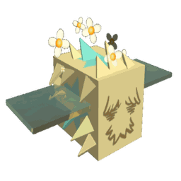

# Fuzzy Bee

Fuzzy Bee

<input type="radio" name="bee-infobox-tab" id="bee-tab-original" checked>
<label for="bee-tab-original">Original</label>
<input type="radio" name="bee-infobox-tab" id="bee-tab-gifted">
<label for="bee-tab-gifted">Gifted</label>

<i>"This unkempt ball of fluff is actually a bee. Its fur aids in the pollination of flowers."</i>

<b>Rarity</b>Mythic

<b>Color</b>Colorless

<b>Energy</b>50

<b>Speed</b>11.9

<b>Attack</b>3

Color Scheme

<b>Skin</b><code>#ab8062</code><code>#ab8062</code><code>#ab8062</code>

**Fuzzy Bee** is a Colorless [Mythic bee](bees-mythic.md).

Fuzzy Bee's favorite treat is [Pineapples](pineapple.md).

Fuzzy Bee likes the [Dandelion Field](dandelion-field.md) and [Pine Tree Forest](pine-tree-forest.md). It dislikes the [Pepper Patch](pepper-patch.md).

## Stats

* Collects 100 [Pollen](pollen.md) in 6 seconds.
* Makes 40 [Honey](honey.md) in 6 seconds.
* +150% [Energy](energy.md), -15% [Movespeed](stats.md#Speed), -50% gather and convert speed, -40 [Convert Amount](system-page.md#Convert_Amount), +90 [Gather Amount](stats.md#Gather_Amount), +2 [Attack](stats.md#Attack).
* 🌟[Gifted Hive Bonus](gifted-bee.md): x1.1 [Bomb Power](system-page.md#Bomb_Pollen).

### Abilities

* **[Fuzz Bombs](ability-tokens.md#Fuzz_Bombs)** Spawns 2 (+1 every 5 bee lvls) fuzz bombs that wander the [Field](fields.md) for 8 seconds. Catching them collects pollen and [Pollinates](pollination.md) nearby [Flowers](flowers.md). The amount of pollen collected scales with buzz bomb multipliers and bee Level.
* **[Buzz Bomb+](ability-tokens.md#Bomb)** Collects 7 pollen from 29 surrounding flowers (+10% pollen per Level). This combined with other bombs will increase power.
* **[🌟Gifted Ability: Pollen Haze](ability-tokens.md#Pollen_Haze)** Summons a yellow haze over the field for 30s that pollinates up to 30 random flowers every second and improves flower growth rate. Bomb Tokens within the haze are automatically collected and pollinate flowers. If there has been a Pollen Haze over the field within the last 3 minutes, this summons fuzz bombs instead.
* **[Passive: Fuzzy Coat](passive-abilities.md#Fuzzy_Coat)** This bee may pollinate up to 5 nearby flowers (9 if gifted) every time it gathers. Pollinated flowers are temporarily upgraded to grant and store more pollen and grow faster. Lower tier flowers have a higher chance of being pollinated.

<table style="font-size:1.5vh; color:#000; width:100%; background:#fff; padding: 15px 0; border:none; color:#000; border-left:15px #000 solid">
<tbody><tr>
<td style="width:100%; text-align:center">

Fuzzy Bee has a base pollen collection of <b>100 </b> in <b>6 seconds</b>. 

That's equivalent to 16.66667  per second. 

(<b>200 </b> in <b>6 seconds</b> with x2 Bee Pollen gamepass)

</td></tr></tbody></table>

<table align="center" class="wikitable" style="text-align:center; width:80%;">
<tbody><tr>
<th colspan="5"> Pollen Collection
</th></tr>
<tr>
<td rowspan="2">Flower Tier
</td><td colspan="1" rowspan="2">Bee Pollen
</td><td colspan="2">with Critical Hit
</td></tr>
<tr>
<td>without Melody
</td><td>with Melody
</td></tr>
<tr>
<td>Single
</td><td>100
</td><td>200
</td><td>300
</td></tr>
<tr>
<td>Double
</td><td>200
</td><td>400
</td><td>600
</td></tr>
<tr>
<td>Triple
</td><td>300
</td><td>600
</td><td>900
</td></tr>
<tr>
<td>Large
</td><td>400
</td><td>800
</td><td>1200
</td></tr>
<tr>
<td>Star
</td><td>500
</td><td>1000
</td><td>1500
</td></tr>
</tbody></table>

<table style="font-size:1.5vh; color:#000; width:100%; background:linear-gradient(to left, #FFB75E, #ED8F03); padding: 15px 0; border:none; color:#fff; border-left:15px #fff solid">
<tbody><tr>
<td style="width:100%; text-align:center">

Fuzzy Bee can make <b>40 </b> in <b>6 seconds</b>!

That's equivalent to <b>6.66667  per second</b>.

(<b>40  in 3 seconds</b> with x2 Honeymaking Speed)

</td></tr>
</tbody></table>

<table align="center" class="wikitable" style="text-align:center; width:75%">
<tbody><tr>
<th>Honey Collection with Science Enhancement
</th></tr>
<tr>
<td>
<h3>Levels 1-8</h3><table align="center" class="wikitable" style="text-align:center;">
<tbody><tr>
<th><i>Science Enhancement</i>
</th><th>Production Rate
</th><th>Number of Produced Honey
</th></tr>
<tr>
<td>1
</td><td>25%
</td><td>50
</td></tr>
<tr>
<td>2
</td><td>50%
</td><td>60
</td></tr>
<tr>
<td>3
</td><td>75%
</td><td>70
</td></tr>
<tr>
<td>4
</td><td>100%
</td><td>80
</td></tr>
<tr>
<td>5
</td><td>125%
</td><td>90
</td></tr>
<tr>
<td>6
</td><td>150%
</td><td>100
</td></tr>
<tr>
<td>7
</td><td>175%
</td><td>110
</td></tr>
<tr>
<td>8
</td><td>200%
</td><td>120
</td></tr>
</tbody></table><h3>Levels 9-16</h3><table align="center" class="wikitable" style="text-align:center;">
<tbody><tr>
<th><i>Science Enhancement</i>
</th><th>Production Rate
</th><th>Number of Produced Honey
</th></tr>
<tr>
<td>9
</td><td>225%
</td><td>130
</td></tr>
<tr>
<td>10
</td><td>250%
</td><td>140
</td></tr>
<tr>
<td>11
</td><td>275%
</td><td>150
</td></tr>
<tr>
<td>12
</td><td>300%
</td><td>160
</td></tr>
<tr>
<td>13
</td><td>325%
</td><td>170
</td></tr>
<tr>
<td>14
</td><td>350%
</td><td>180
</td></tr>
<tr>
<td>15
</td><td>375%
</td><td>190
</td></tr>
<tr>
<td>16
</td><td>400%
</td><td>200
</td></tr>
</tbody></table><h3>Levels 17-24</h3><table align="center" class="wikitable" style="text-align:center;">
<tbody><tr>
<th><i>Science Enhancement</i>
</th><th>Production Rate
</th><th>Number of Produced Honey
</th></tr>
<tr>
<td>17
</td><td>425%
</td><td>210
</td></tr>
<tr>
<td>18
</td><td>450%
</td><td>220
</td></tr>
<tr>
<td>19
</td><td>475%
</td><td>230
</td></tr>
<tr>
<td>20
</td><td>500%
</td><td>240
</td></tr>
<tr>
<td>21
</td><td>525%
</td><td>250
</td></tr>
<tr>
<td>22
</td><td>550%
</td><td>260
</td></tr>
<tr>
<td>23
</td><td>575%
</td><td>270
</td></tr>
<tr>
<td>24
</td><td>600%
</td><td>280
</td></tr>
</tbody></table><h3>Levels 25-31</h3><table align="center" class="wikitable" style="text-align:center;">
<tbody><tr>
<th><i>Science Enhancement</i>
</th><th>Production Rate
</th><th>Number of Produced Honey
</th></tr>
<tr>
<td>25
</td><td>625%
</td><td>290
</td></tr>
<tr>
<td>26
</td><td>650%
</td><td>300
</td></tr>
<tr>
<td>27
</td><td>675%
</td><td>310
</td></tr>
<tr>
<td>28
</td><td>700%
</td><td>320
</td></tr>
<tr>
<td>29
</td><td>725%
</td><td>330
</td></tr>
<tr>
<td>30
</td><td>750%
</td><td>340
</td></tr>
<tr>
<td>31
</td><td>775%
</td><td>350
</td></tr>
</tbody></table>

</td></tr>
</tbody></table>

<table align="center" class="wikitable" style="text-align:center; width:70%">
<tbody><tr>
<td colspan="3"> Egg and Jelly Probability 
</td></tr><tr>
<td>Item
</td><td>Base Probability
</td><td>Probability of getting a particular mythic bee.
</td></tr><tr>
<td style="text-align:left; padding:5px 0 5px 25px;"><a href="egg.html#Basic_Egg">Basic Egg</a>
</td><td>0%
</td><td>0%
</td></tr><tr>
<td style="text-align:left; padding:5px 0 5px 25px;"><a href="egg.html#Silver_Egg">Silver Egg</a>
</td><td>0.1%
</td><td>0.01667%
</td></tr><tr>
<td style="text-align:left; padding:5px 0 5px 25px;"><a href="egg.html#Gold_Egg">Gold Egg</a>
</td><td>1%
</td><td>0.16667%
</td></tr><tr>
<td style="text-align:left; padding:5px 0 5px 25px;"><a href="egg.html#Diamond_Egg">Diamond Egg</a>
</td><td>5%
</td><td>0.83333%
</td></tr><tr>
<td style="text-align:left; padding:5px 0 5px 25px;"><a href="egg.html#Mythic_Egg">Mythic Egg</a>
</td><td>100%
</td><td>16.66667%
</td></tr><tr>
<td style="text-align:left; padding:5px 0 5px 25px;"><a href="royal-jelly.html">Royal Jelly</a>
</td><td>0.004%
</td><td>0.00067%
</td></tr>
</tbody></table>

## Gallery

FuzzyBeeFace.png

Fuzzy Bee's face.

Fuzzybeepack.png

Fuzzy Bee in the Fuzzy Pack.

Giftedfuzzybeehiveslot.png

A Gifted Fuzzy Bee hive slot.

FuzzyAbility.png

Fuzzy Bee's Fuzz Bombs.

Fuzzy bee pollen haze.png

The Pollen Haze aura.

Fuzzybeehiveslot.png

A Fuzzy Bee Hive Slot.

Fuzz Bombs Token.png

Fuzz Bombs ability token.

Pollen Haze Token.png

Pollen Haze ability token.

Bald Fuzzy Bee.png

A Fuzzy Bee without fur.

Bald Gifted fuzzy Bee.png

A Gifted Fuzzy Bee without fur.

## Trivia

* This bee, [Buoyant Bee](buoyant-bee.md), and [Precise Bee](precise-bee.md) are the first Mythic bees to be added since the release of the original Mythic bees.
  * It's also the only Mythic bee to be introduced on its own.
    * Additionally, Fuzzy Bee is the only Mythic bee to be added outside of Beesmas.
* This bee is currently the only bee that can pollinate flowers without the help of a [Beequip](beequip.md).
* This bee may like the Dandelion Field because [dandelions](https://en.wikipedia.org/wiki/Taraxacum) in real life are also soft and fuzzy.
* This bee, [Shy Bee](shy-bee.md), [Ninja Bee](ninja-bee.md), and [Windy Bee](windy-bee.md) are the only bees with one skin color.
* This bee, [Spicy Bee](spicy-bee.md), [Tadpole Bee](tadpole-bee.md), [Buoyant Bee](buoyant-bee.md) and [Digital Bee](digital-bee.md) all have four different [abilities](ability-tokens.md), the most for any [bee](bees.md) in the game.
* The [Fuzzy Bee Egg](egg.md#Specific_Bee_Eggs) was the fifth specific bee egg that could have been bought for [Robux](robux-shop.md), after [Bear Bee](bear-bee.md), [Festive Bee](festive-bee.md), Windy Bee, and [Puppy Bee](puppy-bee.md) and before Precise Bee and Buoyant Bee.
  * Fuzzy Bee was the first non-Event bee that could have been purchased with Robux.
* Fuzz bombs can be popped by using petal Shurikens from the [Petal Wand](petal-wand.md) and [Petal Storm](passive-abilities.md#Petal_Storm), Windy Bee's [tornado](ability-tokens.md#Tornado), and Puppy Bee's [fetch ball](ability-tokens.md#Fetch).
  * Any player can pop fuzz bombs, even if they were summoned by another player's Fuzzy Bee.
* Fuzzy Bee is the only [hive](hive.md) bee that was introduced in 2020 (not counting [Digital Bee](digital-bee.md), as it wasn't usable until 2022).
* Fuzzy Bee's Fuzz Bombs can pop bubbles when the fuzz bombs touch them.
* There was a visual glitch that causes Fuzzy Bee to not have it's fur on it despite the fact it has it when you obtain it through Eggs or Royal Jelly (You will only see Fuzzy Bee's Body and face)

<table class="mw-collapsible mw-collapsed NavTable">
<tbody><tr>
<th class="NavTitle" colspan="2">Bees
</th></tr>
<tr>
<th class="NavCategory">Common &amp; Rare
</th>
<td class="NavLinks NavLinksRare"><b> <a href="basic-bee.html">Basic Bee</a> •  <a href="bomber-bee.html">Bomber Bee</a>  •  <a href="brave-bee.html">Brave Bee</a> •  <a href="bumble-bee.html">Bumble Bee</a> •  <a href="cool-bee.html">Cool Bee</a> •  <a href="hasty-bee.html">Hasty Bee</a> •  <a href="looker-bee.html">Looker Bee</a> •  <a href="rad-bee.html">Rad Bee</a> •  <a href="rascal-bee.html">Rascal Bee</a> •  <a href="stubborn-bee.html">Stubborn Bee</a></b>
</td></tr>
<tr>
<th class="NavCategory">Epic
</th>
<td class="NavLinks NavLinksEpic"><b> <a href="bubble-bee.html">Bubble Bee</a> •  <a href="bucko-bee.html">Bucko Bee</a> •  <a href="commander-bee.html">Commander Bee</a> •  <a href="demo-bee.html">Demo Bee</a> •  <a href="exhausted-bee.html">Exhausted Bee</a> •  <a href="fire-bee.html">Fire Bee</a> •  <a href="frosty-bee.html">Frosty Bee</a> •  <a href="honey-bee.html">Honey Bee</a> •  <a href="rage-bee.html">Rage Bee</a> •  <a href="riley-bee.html">Riley Bee</a> •  <a href="shocked-bee.html">Shocked Bee</a></b>
</td></tr>
<tr>
<th class="NavCategory">Legendary
</th>
<td class="NavLinks NavLinksLegend"><b> <a href="baby-bee.html">Baby Bee</a> •  <a href="carpenter-bee.html">Carpenter Bee</a> •  <a href="demon-bee.html">Demon Bee</a> •  <a href="diamond-bee.html">Diamond Bee</a> •  <a href="lion-bee.html">Lion Bee</a> •  <a href="music-bee.html">Music Bee</a> •  <a href="ninja-bee.html">Ninja Bee</a> •  <a href="shy-bee.html">Shy Bee</a></b>
</td></tr>
<tr>
<th class="NavCategory">Mythic
</th>
<td class="NavLinks NavLinksMythic"><b> <a href="buoyant-bee.html">Buoyant Bee</a> •  <strong class="mw-selflink selflink">Fuzzy Bee</strong> •  <a href="precise-bee.html">Precise Bee</a> •  <a href="spicy-bee.html">Spicy Bee</a> •  <a href="tadpole-bee.html">Tadpole Bee</a> •  <a href="vector-bee.html">Vector Bee</a></b>
</td></tr>
<tr>
<th class="NavCategory">Event
</th>
<td class="NavLinks NavLinksEvent"><b> <a href="bear-bee.html">Bear Bee</a> •  <a href="cobalt-bee.html">Cobalt Bee</a> •  <a href="crimson-bee.html">Crimson Bee</a> •  <a href="digital-bee.html">Digital Bee</a> •  <a href="festive-bee.html">Festive Bee</a> •  <a href="gummy-bee.html">Gummy Bee</a> •  <a href="photon-bee.html">Photon Bee</a> •  <a href="puppy-bee.html">Puppy Bee</a> •  <a href="tabby-bee.html">Tabby Bee</a> •  <a href="vicious-bee.html">Vicious Bee</a> •  <a href="windy-bee.html">Windy Bee</a></b>
</td></tr></tbody></table>

## All bees

--8<-- "all-bees.md"
