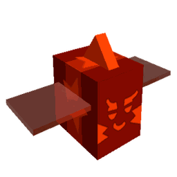

# Gifted Riley Bee

{ align=right width=150 }

*This page is for the quest-giving NPC. For the worker bee version, see the [Riley Bee](riley-bee.md) page.*

<table class="infobox" style="font-size:12px; color:white; width:300px; background:#a58b59;padding:0; border:none; color:#FFF;">
<tbody><tr>
<td colspan="2" style="background-color:#684a12; font-size:2vh; text-align: center; padding: 15px 0; color:#FFF"><b>Gifted Riley Bee</b>
</td></tr>
<tr>
<td colspan="2">
 

</td></tr>
<tr>
<td colspan="2" style="background-color:#684a12; text-align:center">Overview
</td></tr>
<tr>
<td style="padding-left:5px;">Species
</td>
<td>Bee NPC
</td></tr>
<tr>
<td style="padding-left:5px;">Location
</td>
<td>Red HQ
</td></tr>
<tr>
<td style="padding-left:5px;">Bee Prerequisites
</td>
<td>15 and discovered 4 types of red bees
<table>
</table>
</td></tr></tbody></table>

**Gifted Riley Bee** is a [quest giver](quest-givers.md) and one of three permanent Quest Bees, the others being  [Gifted Bucko Bee](gifted-bucko-bee.md) and  [Honey Bee](honey-bee-npc.md). It resides on the roof of the [Red HQ](red-hq.md), next to the Top Riley Bee Helpers [leaderboard](leaderboards.md). The player cannot speak or receive/complete its [Quests](quests.md) without a [Translator](translator.md), which is given by [Science Bear](science-bear.md) three times. The player must complete 150 quests from Gifted Riley Bee to unlock crafting the [Heat-Treated Planter](heat-treated-planter.md), and 250 to unlock crafting the  [Dark Scythe](dark-scythe.md).

## Quests

Gifted Riley Bee is an infinite quest giver whose quests scale up in difficulty the more the player completes them.

For the requirements below, *X* represents the number of quests the player has completed for Gifted Riley Bee plus 1. Requirements are not represented this way are static or may progress in a way not yet determined.

<table class="article-table mw-collapsible mw-collapsed">
<tbody><tr>
<th>Quest
</th>
<th>Requirements
</th></tr>
<tr>
<td>Riley Bee: Abilities
</td>
<td>
<ul><li>Collect <math alttext="{\displaystyle 1000+15\times (X-1)}" xmlns="http://www.w3.org/1998/Math/MathML">
<semantics>
<mrow class="MJX-TeXAtom-ORD">
<mstyle displaystyle="true" scriptlevel="0">
<mn>1000</mn>
<mo>+</mo>
<mn>15</mn>
<mo>×<!-- × --></mo>
<mo stretchy="false">(</mo>
<mi>X</mi>
<mo>−<!-- − --></mo>
<mn>1</mn>
<mo stretchy="false">)</mo>
</mstyle>
</mrow>
<annotation encoding="application/x-tex">{\displaystyle 1000+15\times (X-1)}</annotation>
</semantics>
</math> Red <a href="ability-tokens.html">Ability Tokens</a>.</li></ul>
</td></tr>
<tr>
<td>Riley Bee: Booster
</td>
<td>
<ul><li>Collect <math alttext="{\displaystyle 500+5\times (X-1)}" xmlns="http://www.w3.org/1998/Math/MathML">
<semantics>
<mrow class="MJX-TeXAtom-ORD">
<mstyle displaystyle="true" scriptlevel="0">
<mn>500</mn>
<mo>+</mo>
<mn>5</mn>
<mo>×<!-- × --></mo>
<mo stretchy="false">(</mo>
<mi>X</mi>
<mo>−<!-- − --></mo>
<mn>1</mn>
<mo stretchy="false">)</mo>
</mstyle>
</mrow>
<annotation encoding="application/x-tex">{\displaystyle 500+5\times (X-1)}</annotation>
</semantics>
</math> Red Boost Tokens.</li>
<li>Use the <a href="red-field-booster.html">Red Field Booster</a> 1 Time.</li></ul>
</td></tr>
<tr>
<td>Riley Bee: Clean-up
</td>
<td>
<ul><li>Collect <math alttext="{\displaystyle 250,000\times X}" xmlns="http://www.w3.org/1998/Math/MathML">
<semantics>
<mrow class="MJX-TeXAtom-ORD">
<mstyle displaystyle="true" scriptlevel="0">
<mn>250</mn>
<mo>,</mo>
<mn>000</mn>
<mo>×<!-- × --></mo>
<mi>X</mi>
</mstyle>
</mrow>
<annotation encoding="application/x-tex">{\displaystyle 250,000\times X}</annotation>
</semantics>
</math> <a href="goo.html">Goo</a> from the <a href="mushroom-field.html">Mushroom Field</a>.</li>
<li>Collect <math alttext="{\displaystyle 250,000\times X}" xmlns="http://www.w3.org/1998/Math/MathML">
<semantics>
<mrow class="MJX-TeXAtom-ORD">
<mstyle displaystyle="true" scriptlevel="0">
<mn>250</mn>
<mo>,</mo>
<mn>000</mn>
<mo>×<!-- × --></mo>
<mi>X</mi>
</mstyle>
</mrow>
<annotation encoding="application/x-tex">{\displaystyle 250,000\times X}</annotation>
</semantics>
</math> Goo from the <a href="strawberry-field.html">Strawberry Field</a>.</li>
<li>Collect <math alttext="{\displaystyle 250,000\times X}" xmlns="http://www.w3.org/1998/Math/MathML">
<semantics>
<mrow class="MJX-TeXAtom-ORD">
<mstyle displaystyle="true" scriptlevel="0">
<mn>250</mn>
<mo>,</mo>
<mn>000</mn>
<mo>×<!-- × --></mo>
<mi>X</mi>
</mstyle>
</mrow>
<annotation encoding="application/x-tex">{\displaystyle 250,000\times X}</annotation>
</semantics>
</math> Goo from the <a href="rose-field.html">Rose Field</a>.</li></ul>
</td></tr>
<tr>
<td>Riley Bee: Extraction
</td>
<td>
<ul><li>Collect <math alttext="{\displaystyle 1,000,000\times X}" xmlns="http://www.w3.org/1998/Math/MathML">
<semantics>
<mrow class="MJX-TeXAtom-ORD">
<mstyle displaystyle="true" scriptlevel="0">
<mn>1</mn>
<mo>,</mo>
<mn>000</mn>
<mo>,</mo>
<mn>000</mn>
<mo>×<!-- × --></mo>
<mi>X</mi>
</mstyle>
</mrow>
<annotation encoding="application/x-tex">{\displaystyle 1,000,000\times X}</annotation>
</semantics>
</math> Red <a href="pollen.html">Pollen</a> from the <a href="clover-field.html">Clover Field</a>.</li>
<li>Collect <math alttext="{\displaystyle 1,000,000\times X}" xmlns="http://www.w3.org/1998/Math/MathML">
<semantics>
<mrow class="MJX-TeXAtom-ORD">
<mstyle displaystyle="true" scriptlevel="0">
<mn>1</mn>
<mo>,</mo>
<mn>000</mn>
<mo>,</mo>
<mn>000</mn>
<mo>×<!-- × --></mo>
<mi>X</mi>
</mstyle>
</mrow>
<annotation encoding="application/x-tex">{\displaystyle 1,000,000\times X}</annotation>
</semantics>
</math> Red Pollen from the <a href="cactus-field.html">Cactus Field</a>.</li>
<li>Collect <math alttext="{\displaystyle 1,000,000\times X}" xmlns="http://www.w3.org/1998/Math/MathML">
<semantics>
<mrow class="MJX-TeXAtom-ORD">
<mstyle displaystyle="true" scriptlevel="0">
<mn>1</mn>
<mo>,</mo>
<mn>000</mn>
<mo>,</mo>
<mn>000</mn>
<mo>×<!-- × --></mo>
<mi>X</mi>
</mstyle>
</mrow>
<annotation encoding="application/x-tex">{\displaystyle 1,000,000\times X}</annotation>
</semantics>
</math> Red Pollen from the <a href="pumpkin-patch.html">Pumpkin Patch</a>.</li></ul>
</td></tr>
<tr>
<td>Riley Bee: Goo
</td>
<td>
<ul><li>Collect <math alttext="{\displaystyle 2,500,000\times X}" xmlns="http://www.w3.org/1998/Math/MathML">
<semantics>
<mrow class="MJX-TeXAtom-ORD">
<mstyle displaystyle="true" scriptlevel="0">
<mn>2</mn>
<mo>,</mo>
<mn>500</mn>
<mo>,</mo>
<mn>000</mn>
<mo>×<!-- × --></mo>
<mi>X</mi>
</mstyle>
</mrow>
<annotation encoding="application/x-tex">{\displaystyle 2,500,000\times X}</annotation>
</semantics>
</math> Goo from Red Flowers.</li></ul>
</td></tr>
<tr>
<td>Riley Bee: Medley
</td>
<td>
<ul><li>Collect <math alttext="{\displaystyle 250+5\times (X-1)}" xmlns="http://www.w3.org/1998/Math/MathML">
<semantics>
<mrow class="MJX-TeXAtom-ORD">
<mstyle displaystyle="true" scriptlevel="0">
<mn>250</mn>
<mo>+</mo>
<mn>5</mn>
<mo>×<!-- × --></mo>
<mo stretchy="false">(</mo>
<mi>X</mi>
<mo>−<!-- − --></mo>
<mn>1</mn>
<mo stretchy="false">)</mo>
</mstyle>
</mrow>
<annotation encoding="application/x-tex">{\displaystyle 250+5\times (X-1)}</annotation>
</semantics>
</math> Red Ability Tokens.</li>
<li>Collect <math alttext="{\displaystyle 500,000\times X}" xmlns="http://www.w3.org/1998/Math/MathML">
<semantics>
<mrow class="MJX-TeXAtom-ORD">
<mstyle displaystyle="true" scriptlevel="0">
<mn>500</mn>
<mo>,</mo>
<mn>000</mn>
<mo>×<!-- × --></mo>
<mi>X</mi>
</mstyle>
</mrow>
<annotation encoding="application/x-tex">{\displaystyle 500,000\times X}</annotation>
</semantics>
</math> Goo from the Strawberry Field.</li>
<li>Collect <math alttext="{\displaystyle 3,000,000\times X}" xmlns="http://www.w3.org/1998/Math/MathML">
<semantics>
<mrow class="MJX-TeXAtom-ORD">
<mstyle displaystyle="true" scriptlevel="0">
<mn>3</mn>
<mo>,</mo>
<mn>000</mn>
<mo>,</mo>
<mn>000</mn>
<mo>×<!-- × --></mo>
<mi>X</mi>
</mstyle>
</mrow>
<annotation encoding="application/x-tex">{\displaystyle 3,000,000\times X}</annotation>
</semantics>
</math> Pollen from the Rose Field.</li></ul>
</td></tr>
<tr>
<td>Riley Bee: Mushrooms
</td>
<td>
<ul><li>Collect <math alttext="{\displaystyle 3,000,000\times X}" xmlns="http://www.w3.org/1998/Math/MathML">
<semantics>
<mrow class="MJX-TeXAtom-ORD">
<mstyle displaystyle="true" scriptlevel="0">
<mn>3</mn>
<mo>,</mo>
<mn>000</mn>
<mo>,</mo>
<mn>000</mn>
<mo>×<!-- × --></mo>
<mi>X</mi>
</mstyle>
</mrow>
<annotation encoding="application/x-tex">{\displaystyle 3,000,000\times X}</annotation>
</semantics>
</math> Pollen from the Mushroom Field.</li></ul>
</td></tr>
<tr>
<td>Riley Bee: Petals
</td>
<td>
<ul><li>Catch <math alttext="{\displaystyle 250+10\times \left\lfloor {\frac {X-1}{4}}\right\rfloor }" xmlns="http://www.w3.org/1998/Math/MathML">
<semantics>
<mrow class="MJX-TeXAtom-ORD">
<mstyle displaystyle="true" scriptlevel="0">
<mn>250</mn>
<mo>+</mo>
<mn>10</mn>
<mo>×<!-- × --></mo>
<mrow>
<mo>⌊</mo>
<mrow class="MJX-TeXAtom-ORD">
<mfrac>
<mrow>
<mi>X</mi>
<mo>−<!-- − --></mo>
<mn>1</mn>
</mrow>
<mn>4</mn>
</mfrac>
</mrow>
<mo>⌋</mo>
</mrow>
</mstyle>
</mrow>
<annotation encoding="application/x-tex">{\displaystyle 250+10\times \left\lfloor {\frac {X-1}{4}}\right\rfloor }</annotation>
</semantics>
</math> <a href="bloom.html">Red Bloom Petals</a>.</li>
<li>Catch <math alttext="{\displaystyle 10+5\times \left\lfloor {\frac {X-1}{20}}\right\rfloor }" xmlns="http://www.w3.org/1998/Math/MathML">
<semantics>
<mrow class="MJX-TeXAtom-ORD">
<mstyle displaystyle="true" scriptlevel="0">
<mn>10</mn>
<mo>+</mo>
<mn>5</mn>
<mo>×<!-- × --></mo>
<mrow>
<mo>⌊</mo>
<mrow class="MJX-TeXAtom-ORD">
<mfrac>
<mrow>
<mi>X</mi>
<mo>−<!-- − --></mo>
<mn>1</mn>
</mrow>
<mn>20</mn>
</mfrac>
</mrow>
<mo>⌋</mo>
</mrow>
</mstyle>
</mrow>
<annotation encoding="application/x-tex">{\displaystyle 10+5\times \left\lfloor {\frac {X-1}{20}}\right\rfloor }</annotation>
</semantics>
</math> Red Bloom Petals in the Clover Field.</li>
<li>Catch 10 Red Bloom Petals in the <a href="spider-field.html">Spider Field</a>.</li></ul>
</td></tr>
<tr>
<td>Riley Bee: Picnic
</td>
<td>
<ul><li>Collect <math alttext="{\displaystyle 1,000,000\times X}" xmlns="http://www.w3.org/1998/Math/MathML">
<semantics>
<mrow class="MJX-TeXAtom-ORD">
<mstyle displaystyle="true" scriptlevel="0">
<mn>1</mn>
<mo>,</mo>
<mn>000</mn>
<mo>,</mo>
<mn>000</mn>
<mo>×<!-- × --></mo>
<mi>X</mi>
</mstyle>
</mrow>
<annotation encoding="application/x-tex">{\displaystyle 1,000,000\times X}</annotation>
</semantics>
</math> Pollen from the Mushroom Field.</li>
<li>Collect <math alttext="{\displaystyle 25+5\times \left\lfloor {\frac {X}{10}}\right\rfloor }" xmlns="http://www.w3.org/1998/Math/MathML">
<semantics>
<mrow class="MJX-TeXAtom-ORD">
<mstyle displaystyle="true" scriptlevel="0">
<mn>25</mn>
<mo>+</mo>
<mn>5</mn>
<mo>×<!-- × --></mo>
<mrow>
<mo>⌊</mo>
<mrow class="MJX-TeXAtom-ORD">
<mfrac>
<mi>X</mi>
<mn>10</mn>
</mfrac>
</mrow>
<mo>⌋</mo>
</mrow>
</mstyle>
</mrow>
<annotation encoding="application/x-tex">{\displaystyle 25+5\times \left\lfloor {\frac {X}{10}}\right\rfloor }</annotation>
</semantics>
</math> Strawberry Tokens.</li>
<li>Feed <math alttext="{\displaystyle 25+5\times \left\lfloor {\frac {X}{50}}\right\rfloor }" xmlns="http://www.w3.org/1998/Math/MathML">
<semantics>
<mrow class="MJX-TeXAtom-ORD">
<mstyle displaystyle="true" scriptlevel="0">
<mn>25</mn>
<mo>+</mo>
<mn>5</mn>
<mo>×<!-- × --></mo>
<mrow>
<mo>⌊</mo>
<mrow class="MJX-TeXAtom-ORD">
<mfrac>
<mi>X</mi>
<mn>50</mn>
</mfrac>
</mrow>
<mo>⌋</mo>
</mrow>
</mstyle>
</mrow>
<annotation encoding="application/x-tex">{\displaystyle 25+5\times \left\lfloor {\frac {X}{50}}\right\rfloor }</annotation>
</semantics>
</math> Strawberries to your Bees.</li>
<li>Defeat <math alttext="{\displaystyle 5+10\times \left\lfloor {\frac {X}{10}}\right\rfloor }" xmlns="http://www.w3.org/1998/Math/MathML">
<semantics>
<mrow class="MJX-TeXAtom-ORD">
<mstyle displaystyle="true" scriptlevel="0">
<mn>5</mn>
<mo>+</mo>
<mn>10</mn>
<mo>×<!-- × --></mo>
<mrow>
<mo>⌊</mo>
<mrow class="MJX-TeXAtom-ORD">
<mfrac>
<mi>X</mi>
<mn>10</mn>
</mfrac>
</mrow>
<mo>⌋</mo>
</mrow>
</mstyle>
</mrow>
<annotation encoding="application/x-tex">{\displaystyle 5+10\times \left\lfloor {\frac {X}{10}}\right\rfloor }</annotation>
</semantics>
</math> Fire <a href="ants.html">Ants</a>.</li></ul>
</td></tr>
<tr>
<td>Riley Bee: Pollen
</td>
<td>
<ul><li>Collect <math alttext="{\displaystyle 10,000,000\times X}" xmlns="http://www.w3.org/1998/Math/MathML">
<semantics>
<mrow class="MJX-TeXAtom-ORD">
<mstyle displaystyle="true" scriptlevel="0">
<mn>10</mn>
<mo>,</mo>
<mn>000</mn>
<mo>,</mo>
<mn>000</mn>
<mo>×<!-- × --></mo>
<mi>X</mi>
</mstyle>
</mrow>
<annotation encoding="application/x-tex">{\displaystyle 10,000,000\times X}</annotation>
</semantics>
</math> Red Pollen.</li></ul>
</td></tr>
<tr>
<td>Riley Bee: Rampage
</td>
<td>
<ul><li>Collect <math alttext="{\displaystyle 25+(X-1)}" xmlns="http://www.w3.org/1998/Math/MathML">
<semantics>
<mrow class="MJX-TeXAtom-ORD">
<mstyle displaystyle="true" scriptlevel="0">
<mn>25</mn>
<mo>+</mo>
<mo stretchy="false">(</mo>
<mi>X</mi>
<mo>−<!-- − --></mo>
<mn>1</mn>
<mo stretchy="false">)</mo>
</mstyle>
</mrow>
<annotation encoding="application/x-tex">{\displaystyle 25+(X-1)}</annotation>
</semantics>
</math>Rage Tokens.</li>
<li>Defeat 10 <a href="ladybug.html">Ladybugs</a>.</li>
<li>Defeat <math alttext="{\displaystyle 25+5\times \left\lfloor {\frac {X}{25}}\right\rfloor }" xmlns="http://www.w3.org/1998/Math/MathML">
<semantics>
<mrow class="MJX-TeXAtom-ORD">
<mstyle displaystyle="true" scriptlevel="0">
<mn>25</mn>
<mo>+</mo>
<mn>5</mn>
<mo>×<!-- × --></mo>
<mrow>
<mo>⌊</mo>
<mrow class="MJX-TeXAtom-ORD">
<mfrac>
<mi>X</mi>
<mn>25</mn>
</mfrac>
</mrow>
<mo>⌋</mo>
</mrow>
</mstyle>
</mrow>
<annotation encoding="application/x-tex">{\displaystyle 25+5\times \left\lfloor {\frac {X}{25}}\right\rfloor }</annotation>
</semantics>
</math> Fire Ants.</li></ul>
</td></tr>
<tr>
<td>Riley Bee: Roses
</td>
<td>
<ul><li>Collect <math alttext="{\displaystyle 7,500,000\times X}" xmlns="http://www.w3.org/1998/Math/MathML">
<semantics>
<mrow class="MJX-TeXAtom-ORD">
<mstyle displaystyle="true" scriptlevel="0">
<mn>7</mn>
<mo>,</mo>
<mn>500</mn>
<mo>,</mo>
<mn>000</mn>
<mo>×<!-- × --></mo>
<mi>X</mi>
</mstyle>
</mrow>
<annotation encoding="application/x-tex">{\displaystyle 7,500,000\times X}</annotation>
</semantics>
</math> Pollen from the Rose Field.</li></ul>
</td></tr>
<tr>
<td>Riley Bee: Scavenge
</td>
<td>
<ul><li>Collect <math alttext="{\displaystyle 2,500,000\times X}" xmlns="http://www.w3.org/1998/Math/MathML">
<semantics>
<mrow class="MJX-TeXAtom-ORD">
<mstyle displaystyle="true" scriptlevel="0">
<mn>2</mn>
<mo>,</mo>
<mn>500</mn>
<mo>,</mo>
<mn>000</mn>
<mo>×<!-- × --></mo>
<mi>X</mi>
</mstyle>
</mrow>
<annotation encoding="application/x-tex">{\displaystyle 2,500,000\times X}</annotation>
</semantics>
</math> Red Pollen.</li>
<li>Collect <math alttext="{\displaystyle 500+5\times (X-1)}" xmlns="http://www.w3.org/1998/Math/MathML">
<semantics>
<mrow class="MJX-TeXAtom-ORD">
<mstyle displaystyle="true" scriptlevel="0">
<mn>500</mn>
<mo>+</mo>
<mn>5</mn>
<mo>×<!-- × --></mo>
<mo stretchy="false">(</mo>
<mi>X</mi>
<mo>−<!-- − --></mo>
<mn>1</mn>
<mo stretchy="false">)</mo>
</mstyle>
</mrow>
<annotation encoding="application/x-tex">{\displaystyle 500+5\times (X-1)}</annotation>
</semantics>
</math> Red Ability Tokens.</li>
<li>Collect <math alttext="{\displaystyle 25+10\times \left\lfloor {\frac {X}{10}}\right\rfloor }" xmlns="http://www.w3.org/1998/Math/MathML">
<semantics>
<mrow class="MJX-TeXAtom-ORD">
<mstyle displaystyle="true" scriptlevel="0">
<mn>25</mn>
<mo>+</mo>
<mn>10</mn>
<mo>×<!-- × --></mo>
<mrow>
<mo>⌊</mo>
<mrow class="MJX-TeXAtom-ORD">
<mfrac>
<mi>X</mi>
<mn>10</mn>
</mfrac>
</mrow>
<mo>⌋</mo>
</mrow>
</mstyle>
</mrow>
<annotation encoding="application/x-tex">{\displaystyle 25+10\times \left\lfloor {\frac {X}{10}}\right\rfloor }</annotation>
</semantics>
</math> Strawberry Tokens.</li></ul>
</td></tr>
<tr>
<td>Riley Bee: Skirmish
</td>
<td>
<ul><li>Collect <math alttext="{\displaystyle 1,250,000\times X}" xmlns="http://www.w3.org/1998/Math/MathML">
<semantics>
<mrow class="MJX-TeXAtom-ORD">
<mstyle displaystyle="true" scriptlevel="0">
<mn>1</mn>
<mo>,</mo>
<mn>250</mn>
<mo>,</mo>
<mn>000</mn>
<mo>×<!-- × --></mo>
<mi>X</mi>
</mstyle>
</mrow>
<annotation encoding="application/x-tex">{\displaystyle 1,250,000\times X}</annotation>
</semantics>
</math> Pollen from the Mushroom Field.</li>
<li>Defeat 10 Ladybugs.</li></ul>
</td></tr>
<tr>
<td>Riley Bee: Strawberries
</td>
<td>
<ul><li>Collect <math alttext="{\displaystyle 5,000,000\times X}" xmlns="http://www.w3.org/1998/Math/MathML">
<semantics>
<mrow class="MJX-TeXAtom-ORD">
<mstyle displaystyle="true" scriptlevel="0">
<mn>5</mn>
<mo>,</mo>
<mn>000</mn>
<mo>,</mo>
<mn>000</mn>
<mo>×<!-- × --></mo>
<mi>X</mi>
</mstyle>
</mrow>
<annotation encoding="application/x-tex">{\displaystyle 5,000,000\times X}</annotation>
</semantics>
</math> Pollen from the Strawberry Field.</li></ul>
</td></tr>
<tr>
<td>Riley Bee: Tango
</td>
<td>
<ul><li>Collect <math alttext="{\displaystyle 2,500,000\times X}" xmlns="http://www.w3.org/1998/Math/MathML">
<semantics>
<mrow class="MJX-TeXAtom-ORD">
<mstyle displaystyle="true" scriptlevel="0">
<mn>2</mn>
<mo>,</mo>
<mn>500</mn>
<mo>,</mo>
<mn>000</mn>
<mo>×<!-- × --></mo>
<mi>X</mi>
</mstyle>
</mrow>
<annotation encoding="application/x-tex">{\displaystyle 2,500,000\times X}</annotation>
</semantics>
</math> Red Pollen.</li>
<li>Collect <math alttext="{\displaystyle 500+5\times (X-1)}" xmlns="http://www.w3.org/1998/Math/MathML">
<semantics>
<mrow class="MJX-TeXAtom-ORD">
<mstyle displaystyle="true" scriptlevel="0">
<mn>500</mn>
<mo>+</mo>
<mn>5</mn>
<mo>×<!-- × --></mo>
<mo stretchy="false">(</mo>
<mi>X</mi>
<mo>−<!-- − --></mo>
<mn>1</mn>
<mo stretchy="false">)</mo>
</mstyle>
</mrow>
<annotation encoding="application/x-tex">{\displaystyle 500+5\times (X-1)}</annotation>
</semantics>
</math> Red Ability Tokens.</li>
<li>Defeat 5 <a href="scorpion.html">Scorpions</a>.</li></ul>
</td></tr>
<tr>
<td>Riley Bee: Tour
</td>
<td>
<ul><li>Collect <math alttext="{\displaystyle 1,000,000\times X}" xmlns="http://www.w3.org/1998/Math/MathML">
<semantics>
<mrow class="MJX-TeXAtom-ORD">
<mstyle displaystyle="true" scriptlevel="0">
<mn>1</mn>
<mo>,</mo>
<mn>000</mn>
<mo>,</mo>
<mn>000</mn>
<mo>×<!-- × --></mo>
<mi>X</mi>
</mstyle>
</mrow>
<annotation encoding="application/x-tex">{\displaystyle 1,000,000\times X}</annotation>
</semantics>
</math> Pollen from the Mushroom Field.</li>
<li>Collect <math alttext="{\displaystyle 1,000,000\times X}" xmlns="http://www.w3.org/1998/Math/MathML">
<semantics>
<mrow class="MJX-TeXAtom-ORD">
<mstyle displaystyle="true" scriptlevel="0">
<mn>1</mn>
<mo>,</mo>
<mn>000</mn>
<mo>,</mo>
<mn>000</mn>
<mo>×<!-- × --></mo>
<mi>X</mi>
</mstyle>
</mrow>
<annotation encoding="application/x-tex">{\displaystyle 1,000,000\times X}</annotation>
</semantics>
</math> Pollen from the Strawberry Field.</li>
<li>Collect <math alttext="{\displaystyle 1,000,000\times X}" xmlns="http://www.w3.org/1998/Math/MathML">
<semantics>
<mrow class="MJX-TeXAtom-ORD">
<mstyle displaystyle="true" scriptlevel="0">
<mn>1</mn>
<mo>,</mo>
<mn>000</mn>
<mo>,</mo>
<mn>000</mn>
<mo>×<!-- × --></mo>
<mi>X</mi>
</mstyle>
</mrow>
<annotation encoding="application/x-tex">{\displaystyle 1,000,000\times X}</annotation>
</semantics>
</math> Pollen from the Rose Field.</li>
<li>Defeat 5 Ladybugs.</li>
<li>Defeat 3 Scorpions.</li></ul>
</td></tr></tbody></table>

## Rewards

The reward will vary depending on the number of quests the player has completed. Rewards will always contain one [Red Extract](red-extract.md) and [Honey](honey.md).

Completing Riley Bee’s “Petals” quest rewards 1 [Bloom Shaker](bloom-shaker.md) as well.

The amount of honey the player receives when completing a quest is based on this table, where *Q* is the number of quests the player has completed plus 1. Only the highest value in the table is taken.

<table class="article-table mw-collapsible mw-collapsed">
<tbody><tr>
<th>Quest Milestone
</th>
<th>Honey Amount
</th></tr>
<tr>
<td>Every 100th quest
</td>
<td><math alttext="{\displaystyle 25,000,000\times Q}" xmlns="http://www.w3.org/1998/Math/MathML">
<semantics>
<mrow class="MJX-TeXAtom-ORD">
<mstyle displaystyle="true" scriptlevel="0">
<mn>25</mn>
<mo>,</mo>
<mn>000</mn>
<mo>,</mo>
<mn>000</mn>
<mo>×<!-- × --></mo>
<mi>Q</mi>
</mstyle>
</mrow>
<annotation encoding="application/x-tex">{\displaystyle 25,000,000\times Q}</annotation>
</semantics>
</math>
</td></tr>
<tr>
<td>Every 5th quest
</td>
<td><math alttext="{\displaystyle 2,500,000\times \left\lfloor Q^{0.95}\right\rfloor }" xmlns="http://www.w3.org/1998/Math/MathML">
<semantics>
<mrow class="MJX-TeXAtom-ORD">
<mstyle displaystyle="true" scriptlevel="0">
<mn>2</mn>
<mo>,</mo>
<mn>500</mn>
<mo>,</mo>
<mn>000</mn>
<mo>×<!-- × --></mo>
<mrow>
<mo>⌊</mo>
<msup>
<mi>Q</mi>
<mrow class="MJX-TeXAtom-ORD">
<mn>0.95</mn>
</mrow>
</msup>
<mo>⌋</mo>
</mrow>
</mstyle>
</mrow>
<annotation encoding="application/x-tex">{\displaystyle 2,500,000\times \left\lfloor Q^{0.95}\right\rfloor }</annotation>
</semantics>
</math>
</td></tr>
<tr>
<td>All other quests
</td>
<td><math alttext="{\displaystyle 1,000,000\times \left\lfloor Q^{0.9}\right\rfloor }" xmlns="http://www.w3.org/1998/Math/MathML">
<semantics>
<mrow class="MJX-TeXAtom-ORD">
<mstyle displaystyle="true" scriptlevel="0">
<mn>1</mn>
<mo>,</mo>
<mn>000</mn>
<mo>,</mo>
<mn>000</mn>
<mo>×<!-- × --></mo>
<mrow>
<mo>⌊</mo>
<msup>
<mi>Q</mi>
<mrow class="MJX-TeXAtom-ORD">
<mn>0.9</mn>
</mrow>
</msup>
<mo>⌋</mo>
</mrow>
</mstyle>
</mrow>
<annotation encoding="application/x-tex">{\displaystyle 1,000,000\times \left\lfloor Q^{0.9}\right\rfloor }</annotation>
</semantics>
</math>
</td></tr></tbody></table>

In addition to [Red Extract](red-extract.md) and [Honey](honey.md) for completing each quest, certain thresholds may reward other items as well:

* If the player has reached a quest milestone, they're given a reward based on the below table:

<table class="article-table mw-collapsible mw-collapsed">
<tbody><tr>
<th>Quest Number
</th>
<th>Reward
</th></tr>
<tr>
<td>3
</td>
<td>1 <a href="stinger.html">Stinger</a>
</td></tr>
<tr>
<td>9
</td>
<td>10 <a href="stinger.html">Stingers</a>
</td></tr>
<tr>
<td>25
</td>
<td>1 <a href="royal-jelly.html#Star_Jelly">Star Jelly</a>
</td></tr>
<tr>
<td>50
</td>
<td>1 <a href="egg.html#Gifted_Gold_Egg">Gifted Gold Egg</a>
</td></tr>
<tr>
<td>64
</td>
<td>1 <a href="sticker.html#Sticker_Index">Basic Red Hive Skin</a>
</td></tr>
<tr>
<td>75
</td>
<td>10 <a href="stinger.html">Stingers</a>
</td></tr>
<tr>
<td>100
</td>
<td>1 <a href="egg.html#Gifted_Diamond_Egg">Gifted Diamond Egg</a>
</td></tr>
<tr>
<td>111
</td>
<td>500 <a href="strawberry.html">Strawberries</a>
</td></tr>
<tr>
<td>125
</td>
<td>10 <a href="stinger.html">Stingers</a>
</td></tr>
<tr>
<td>150
</td>
<td>20 <a href="stinger.html">Stingers</a>

Access to the <a href="heat-treated-planter.html">Heat-Treated Planter</a>

</td></tr>
<tr>
<td>175
</td>
<td>10 <a href="stinger.html">Stingers</a>
</td></tr>
<tr>
<td>200
</td>
<td>20 <a href="stinger.html">Stingers</a>
</td></tr>
<tr>
<td>222
</td>
<td>100,000 <a href="treat.html">Treats</a>
</td></tr>
<tr>
<td>250
</td>
<td>1 <a href="egg.html#Gifted_Diamond_Egg">Gifted Diamond Egg</a>

Access to the  <a href="dark-scythe.html">Dark Scythe</a>

</td></tr>
<tr>
<td>500, 750, 1000
</td>
<td>1 <a href="egg.html#Gifted_Diamond_Egg">Gifted Diamond Egg</a>
</td></tr></tbody></table>

* If it isn't a milestone, the game checks if the current quest's rank is divisible by 25, and rewards a [Star Jelly](royal-jelly.md#Star_Jelly) if true.
* Else, the game checks if the current quest's rank is divisible by 5, and rewards an item picked from this table, where Q is the number of quests the player has completed plus 1. An item is also rewarded at a 5% probability for any other quest.

<table class="article-table mw-collapsible mw-collapsed">
<tbody><tr>
<th>Item
</th>
<th>Amount
</th>
<th>Chance to be picked
</th></tr>
<tr>
<td><a href="treat.html">Treat</a>
</td>
<td><math alttext="{\displaystyle (1+\left\lfloor {\sqrt {Q}}\right\rfloor \times 25}" xmlns="http://www.w3.org/1998/Math/MathML">
<semantics>
<mrow class="MJX-TeXAtom-ORD">
<mstyle displaystyle="true" scriptlevel="0">
<mo stretchy="false">(</mo>
<mn>1</mn>
<mo>+</mo>
<mrow>
<mo>⌊</mo>
<mrow class="MJX-TeXAtom-ORD">
<msqrt>
<mi>Q</mi>
</msqrt>
</mrow>
<mo>⌋</mo>
</mrow>
<mo>×<!-- × --></mo>
<mn>25</mn>
</mstyle>
</mrow>
<annotation encoding="application/x-tex">{\displaystyle (1+\left\lfloor {\sqrt {Q}}\right\rfloor \times 25}</annotation>
</semantics>
</math>
</td>
<td>~23.175%
</td></tr>
<tr>
<td><a href="royal-jelly.html">Royal Jelly</a>
</td>
<td><math alttext="{\displaystyle (1+\left\lfloor {\sqrt {Q}}\right\rfloor \times 5}" xmlns="http://www.w3.org/1998/Math/MathML">
<semantics>
<mrow class="MJX-TeXAtom-ORD">
<mstyle displaystyle="true" scriptlevel="0">
<mo stretchy="false">(</mo>
<mn>1</mn>
<mo>+</mo>
<mrow>
<mo>⌊</mo>
<mrow class="MJX-TeXAtom-ORD">
<msqrt>
<mi>Q</mi>
</msqrt>
</mrow>
<mo>⌋</mo>
</mrow>
<mo>×<!-- × --></mo>
<mn>5</mn>
</mstyle>
</mrow>
<annotation encoding="application/x-tex">{\displaystyle (1+\left\lfloor {\sqrt {Q}}\right\rfloor \times 5}</annotation>
</semantics>
</math>
</td>
<td>~17.381%
</td></tr>
<tr>
<td><a href="gumdrops.html">Gumdrops</a>
</td>
<td>25
</td>
<td>~11.587%
</td></tr>
<tr>
<td><a href="strawberry.html">Strawberry</a>
</td>
<td><math alttext="{\displaystyle (1+\left\lfloor Q^{0.25}\right\rfloor \times 10}" xmlns="http://www.w3.org/1998/Math/MathML">
<semantics>
<mrow class="MJX-TeXAtom-ORD">
<mstyle displaystyle="true" scriptlevel="0">
<mo stretchy="false">(</mo>
<mn>1</mn>
<mo>+</mo>
<mrow>
<mo>⌊</mo>
<msup>
<mi>Q</mi>
<mrow class="MJX-TeXAtom-ORD">
<mn>0.25</mn>
</mrow>
</msup>
<mo>⌋</mo>
</mrow>
<mo>×<!-- × --></mo>
<mn>10</mn>
</mstyle>
</mrow>
<annotation encoding="application/x-tex">{\displaystyle (1+\left\lfloor Q^{0.25}\right\rfloor \times 10}</annotation>
</semantics>
</math>
</td>
<td>~11.587%
</td></tr>
<tr>
<td><a href="ticket.html">Ticket</a>
</td>
<td>5
</td>
<td>~11.587%
</td></tr>
<tr>
<td><a href="stinger.html">Stinger</a>
</td>
<td>5
</td>
<td>~11.587%
</td></tr>
<tr>
<td><a href="magic-bean.html">Magic Bean</a>
</td>
<td>3
</td>
<td>~11.587%
</td></tr>
<tr>
<td><a href="stinger.html">Stinger</a>
</td>
<td>10
</td>
<td>~1.159%
</td></tr>
<tr>
<td><a href="red-extract.html">Red Extract</a>
</td>
<td>10
</td>
<td>~0.116%
</td></tr>
<tr>
<td><a href="enzymes.html">Enzymes</a>
</td>
<td>10
</td>
<td>~0.116%
</td></tr>
<tr>
<td><a href="stinger.html">Stinger</a>
</td>
<td>10
</td>
<td>~0.116%
</td></tr></tbody></table>

## Dialogue

<table class="article-table mw-collapsible mw-collapsed">
<tbody><tr>
<th>Quest
</th>
<th>Dialogue
</th></tr>
<tr>
<td>Initial Talk
</td>
<td>

<i>- Trying to talk -</i> 
BzzzzZZz buzz Bzz. Bzz BZZ bz buzzz zz!! (Gifted Riley Bee is speaking in buzzes)

<i>- You leave -</i> 
Bzz buzz?!

<i>- You use the translator -</i> 
Get this thing out of my face!! ... Whoa - you understood me? I'm speaking with a beekeeper! That's radder than a Rad Bee!! I'm Riley Bee, Leader of the Red Bees. And this is the Red Headquarters! Here, the Red Bees and I coordinate, plan, train, and strategize... We've discovered how to boost the red flower fields! We've developed highly advanced Red Guards! That's why WE'RE the best. Red ROCKS - Blue just can't keep up! You look like a promising Red Beekeeper! But to truly become a Red Master, you'll need some guidance. Complete my quests, and I'll reward you with some [Red Extracts]! Those can be used to boost your red pollen collection... Or to craft some of our state-of-the-art red equipment! Each time you perform a quest for me, they'll become more difficult. But every once in a while, you may just earn yourself some RIGHTEOUS rewards! Sound good? OK! Talk to me again when you're ready to start.

</td></tr>
<tr>
<td>Repeatable Quests
</td>
<td>

<i>- Accepting -</i> 
It's time for another red-related quest. Complete it, and you'll be 1 step closer to becoming a Red Master! AND - you'll earn yourself a [Red Extract]! [Red Extracts] boost red pollen by x1.25 for 10 minutes... And they're used to craft some radical red equipment. After every 5th quest, I'll give you a bonus... And every once in a while - that bonus may be HUGE!!!! I've loaded the next quest into your Quest Menu. Get it done and report back!

<i>- During -</i> 
Each time you complete one of my quests, they get harder! Harder and harder - they just keep going!!! Want to know why? CAUSE RED BEES DON'T QUIT! That's why WE'RE ON TOP!!! Go out there and finish my quest!

<i>- Completion -</i> 
Right on right on right on!!! Good work out there, you're advancing the red cause! Here's a Red Extract to help you advance even more!! We gotta keep working, keep on fighting... Keep on keeping on to keep ahead of the Blue Bees! RED RULES!!!!!

</td></tr>
<tr>
<td>Exclusive Beesmas Dialogue 2018
</td>
<td>Can't stand this cold!!!! You know us here at Red HQ - we're all about that HEAT! But you know what, I'd be lying if I said it didn't look pretty. <b>You are given a choice to give a present to Gifted Riley Bee or continue talking like normal. You choose to give them a present.</b> GET OUT!!!!!!. Awee, see, I was right when I took you to be a fine beekeeper. And a good person too! So what'd you get me?? ... RIGHT ON! It's a strawberry scented air freshener! The kind you hang on the reer [sic] view mirror of a car. I don't have a car, and I can't smell it very well out here... BUT I LOVE IT! Here, here - this is for you. MERRY BEESMAS from the Red Bees at the Red Headquarters!
</td></tr>
<tr>
<td>Exclusive Beesmas Dialogue 2020
</td>
<td>Bucko Bee better not use that Snow Machine! It's TOO DANG COLD! <b>You are given a choice to give a present to Gifted Riley Bee or continue talking like normal. You choose to give them a present.</b> NUH-UH! You didn't! You DID! Let me open it, let me open it! ...(krumple krumple)... OH. MY. GOSH! It's a bPad Air. 4th generation!!! The newest model! Bubble Bee Man must have gotten my letter this year. He went all out! I can use this to play ROBLOX, and Re://:Swarm! Man, now I feel silly. I got a gift too, but it's not even in the same league. I hope you like it anyways. It includes the [Electric Candle Ornament]! With this on the Beesmas Tree, you'll receive the following boosts: +25% Convert Rate +25% Capacity in the Rose Field and Mushroom Field and +10% Pollen from Flames! Merry Beesmas! Now if you'll excuse me, I've gotta setup my bPad, oh boy oh boy.
</td></tr>
<tr>
<td>Exclusive Beesmas Dialogue 2021
</td>
<td>Bucko Bee better not use that Snow Machine! It's TOO DANG COLD! <b>You are given a choice to give a present to Gifted Riley Bee or continue talking like normal. You choose to give them a present.</b> NUH-UH! You didn't! You DID! Let me open it, let me open it! ...(krumple krumple)... Whaaat? It's a [Dark Scythe]!!!! How on earth did you afford this? Do you realize how rare these are? We've only got 1 in the whole HQ! Man, now I feel silly. I got you a gift too, but it's not even in the same league. Hope you'll like it anyways. It includes the [Electric Candle Ornament]! With that on the Beesmas Tree, you'll receive the following boosts: +25% Convert Rate +25% Capacity in the Rose Field and Mushroom Field and +10% Pollen from Flames! Merry Beesmas! Now if you'll excuse me, I've gotta setup my bPad, oh boy oh boy.
</td></tr>
<tr>
<td>Exclusive Beesmas Dialogue 2022
</td>
<td>Bucko Bee better not use that Snow Machine! It's TOO DANG COLD! <b>You are given a choice to give a present to Gifted Riley Bee or continue talking like normal. You choose to give them a present.</b> WHAT! A GIFT? No way! Youuuuuuuu <i>[sic]</i> Well hand it over! Come on! ...(krumple krumple)... Oh... my... gumdrops... A permanent Precise Mark! How did you get this?? Did it just, like, fail to despawn? Man, I know some beekeepers who would DIE for one of these. This is going to raise the Red HQ straight to the top! I got you something too. Not quite as OP though. It's the [Electric Candle Ornament]! With that on the Beesmas Tree, you'll receive the following boosts: +25% Convert Rate +25% Capacity in the Rose Field and Mushroom Field and +10% Pollen from Flames! Now let's get out there and heat up the Honeydays! RED ROCKS!
</td></tr>
<tr>
<td>Exclusive Beesmas Dialogue 2024 Summer
</td>
<td>Bucko Bee better not use that Snow Machine! It's TOO DANG COLD! <b>You are given a choice to give a present to Gifted Riley Bee or continue talking like normal. You choose to give them a present.</b> What's that in your hands?? GET OUT!! A [present] for me? What could it be?! ...(krumple krumple)... WOOOOW! It's a whole book of [Red Palm Hand Stickers]! How many are in here??? Like 50? This is crazy! I'm going to stick these all over the HQ. And if I don't want to talk to someone I'll just stick one of these on them. And I'll say "talk to the hand", LOL! That'll be awesome! Thanks so much! And hey. I got YOU a [present] too... It's the [Electric Candle Ornament]! With that on the Beesmas Tree, you'll receive these boosts: +25% Convert Rate, +25% Capacity in the Rose Field and Mushroom Field, and +15% Pollen from Flames! That should heat things up for the Honeydays!
</td></tr>
<tr>
<td>Exclusive Beesmas Dialogue 2024 Winter
</td>
<td>I should have built a roof like Bucko Bee... <b>You are given a choice to give a present to Gifted Riley Bee or continue talking like normal. You choose to give them a present.</b> NUH-UH! You didn’t! You DID! Let me open it, let me open it! ...(krumple krumple)... Alright! Some rechargeable wing warmers!!! Between these and the candles, I MIGHT be able to make it through this stupid, cold, long winter. Just barely. Thank you!! Now here's your gift: the [Electric Candle Ornament]! With that on the Beesmas Tree, you’ll receive these boosts: +25% Convert Rate +25% Capacity in the Rose and Mushroom Field and +15% Pollen from Flames! Merry Beesmas! Now if you’ll excuse me, I’m gonna go warm up my flappers.
</td></tr></tbody></table>

## Beesmas Quest - Riley Bee's Honeyday Candles

### 2025

This piece of content goes bye bye.

The following content has been removed from the game. The contents below may be archival, but feel free to edit below.

<table class="article-table mw-collapsible mw-collapsed">
<tbody><tr>
<th>Requirements
</th>
<th>Rewards
</th></tr>
<tr>
<td>
<ul><li>Collect 500,000,000 Pollen from the <a href="rose-field.html">Rose Field</a>.</li>
<li>Collect 50,000,000 Pollen from the <a href="red-brick-field.html">Red Brick Field</a>.</li>
<li>Catch 1,000 <a href="bloom.html">Red Bloom</a> Petals.</li>
<li>Catch 100 Scarlet Bloom Petals.</li>
<li>Use 25 <a href="soft-wax.html">Soft Waxes</a>.</li>
<li>Use 25 <a href="hard-wax.html">Hard Waxes</a>.</li>
<li>Spawn 5,000 <a href="flame.html">Flames</a>.</li>
<li>Defeat 5 Fire <a href="ants.html">Ants</a>.</li></ul>
</td>
<td>

2,000,000,000 <a href="honey.html">Honey</a> 
25 <a href="ticket.html">Tickets</a> 
25 <a href="red-extract.html">Red Extracts</a> 
1 <a href="red-balloon.html">Red Balloon</a> 
5 <a href="swirled-wax.html">Swirled Waxes</a> 
1 <a href="electric-candle.html">Electric Candle</a> 
5 <a href="gingerbread-bear.html">Gingerbread Bears</a> 
Access to the <a href="honeyday-candles.html">Honeyday Candles</a>

</td></tr></tbody></table>

<table class="article-table mw-collapsible mw-collapsed">
<tbody><tr>
<th>Dialogue
</th></tr>
<tr>
<td>

<i>- Accepting -</i>

This is the worst Beesmas ever! It's so cold the Fire Bees can't even ignite the flowers. Demon Bee is threatening to return to the underworld. And Spicy Bee's engine is freezing up! The Blue Bees are trying to make it even WORSE with their Snow Machine! But there's still hope... if we can ignite the Honeyday Candles. They'll provide enough heat to get Red HQ operational again. But we'll need your help! Hurry up, before we all freeze to death!

<i>- During -</i>

N/A

<i>- Completion -</i>

Hurry hurry hurry, light them up! Everyone look! The beekeeper's lighting the candles! Yaaaaaaaaaaay! We're saved! With the Honeyday Candles lit, the Red Bes are back in action! Now every 4 hours, you can use it to recuit 3 temporary Red Bees for 30 minutes... And it'll also give you some Wax! Usually [Soft Wax], but sometimes rarer ones! It's pretty rad! Well, thanks for bringing warmth back to Beesmas. Tell Bucko Bee the Snow Machine is powerless now! Happy Honeydays!

</td></tr></tbody></table>

### 2024 (Winter)

This piece of content goes bye bye.

The following content has been removed from the game. The contents below may be archival, but feel free to edit below.

<table class="article-table mw-collapsible mw-collapsed">
<tbody><tr>
<th>Requirements
</th>
<th>Rewards
</th></tr>
<tr>
<td>
<ul><li>Collect 1,000,000,000 Red <a href="pollen.html">Pollen</a>.</li>
<li>Collect 300,000,000 Pollen from the <a href="rose-field.html">Rose Field</a>.</li>
<li>Collect 200,000,000 Pollen from the <a href="cactus-field.html">Cactus Field</a>.</li>
<li>Collect 50,000,000 Pollen with the <a href="scythe.html">Scythe</a>.</li>
<li>Collect 500 Red <a href="ability-tokens.html#Boost">Boost Tokens</a>.</li>
<li>Spawn 1,000 <a href="flame.html">Flames</a>.</li>
<li>Collect 50 <a href="soft-wax.html">Soft Waxes</a>.</li>
<li>Collect 10 <a href="hard-wax.html">Hard Waxes</a>.</li>
<li>Defeat 10 Fire <a href="ants.html">Ants</a>.</li>
<li>Pop 1 Rare <a href="puffshroom.html">Puffshroom</a> in the Rose Field.</li></ul>
</td>
<td>2,500,000,000 <a href="honey.html">Honey</a> 

10 <a href="ticket.html">Tickets</a> 
25 <a href="red-extract.html">Red Extracts</a> 
1 <a href="caustic-wax.html">Caustic Wax</a> 
3 <a href="red-balloon.html">Red Balloons</a> 
1 <a href="electric-candle.html">Electric Candle</a> 
5 <a href="gingerbread-bear.html">Gingerbread Bears</a> 
Access to the <a href="honeyday-candles.html">Honeyday Candles</a>

</td></tr></tbody></table>

<table class="article-table mw-collapsible mw-collapsed">
<tbody><tr>
<th>Dialogue
</th></tr>
<tr>
<td><i>- Accepting -</i> 

This is the worst Beesmas ever! It's so cold the Fire Bees can't even ignite the flowers. Demon Bee is threatening to return to the underworld. And Spicy Bee's engine is freezing up! The Blue Bees are trying to make it even WORSE with their Snow Machine! But there's still hope... if we can ignite the Honeyday Candles. They'll provide enough heat to get Red HQ operational again. But we'll need your help! Hurry up, before we all freeze to death!

<i>- During -</i> 
N/A

<i>- Completion -</i> 
Go go go! Light em up! Everyone look! The beekeeper's lighting the candles! Yaaaaaaaaaaay! We won't freeze to death! With the Honeyday Candles lit, the Red Bees are back in action! Now every 4 hours, you can use it to recruit 3 temporary Red Bees for 30 minutes... And it'll also give you some Wax! Usually [Soft Wax], but sometimes rarer ones! Thank you so much! Now I can finally start enjoying Beesmas! And I hope you can as well! Have fun out there! Just don't you dare help Bucko Bee with that Snow Machine, got it?

</td></tr></tbody></table>

### 2024 (Summer)

This piece of content goes bye bye.

The following content has been removed from the game. The contents below may be archival, but feel free to edit below.

<table class="article-table mw-collapsible mw-collapsed">
<tbody><tr>
<th>Requirements
</th>
<th>Rewards
</th></tr>
<tr>
<td>
<ul><li>Collect 10,000,000 <a href="goo.html">Goo</a> from Red Flowers.</li>
<li>Collect 5,000,000 Pollen with the <a href="scythe.html">Scythe</a>.</li>
<li>Collect 10,000,000 Pollen from the <a href="retro-swarm-challenge.html">Red Brick Field</a>.</li>
<li>Collect 30 Tokens from <a href="red-clay-planter.html">Red Clay Planters</a>.</li>
<li>Spawn 250 <a href="flame.html">Flames</a>.</li>
<li>Use 10 <a href="soft-wax.html">Soft Waxes</a>.</li>
<li>Obtain 4 Blowing Leaf or 4 Waxing Crescent Moon <a href="sticker.html">Stickers</a> to give to Riley Bee.</li>
<li>Obtain 1 Scythe <a href="sticker.html">Sticker</a> to give to Riley Bee.</li>
<li>Obtain 1 Red Palm Hand, 1 Alert Icon or 3 Small Flame <a href="sticker.html">Sticker</a> to give to Riley Bee.</li></ul>
</td>
<td>50,000,000 <a href="honey.html">Honey</a> 

25 <a href="ticket.html">Tickets</a> 
25 <a href="red-extract.html">Red Extracts</a> 
1 <a href="royal-jelly.html#Star_Jelly">Star Jelly</a> 
1 <a href="electric-candle.html">Electric Candle</a> 
2 <a href="red-balloon.html">Red Balloons</a> 
5 <a href="gingerbread-bear.html">Gingerbread Bears</a> 
Access to the <a href="honeyday-candles.html">Honeyday Candles</a>

</td></tr></tbody></table>

<table class="article-table mw-collapsible mw-collapsed">
<tbody><tr>
<th>Dialogue
</th></tr>
<tr>
<td>

<i>- Accepting -</i> 
WHY is it so COLD in the summer??? It just ain't right. Is this some sort of sick joke? The flowers are going to DIE if it keeps snowing like this! It's just not right. Not natural. Everything's falling apart around here! What the heck did Bucko Bee do? The Blue Bees have really gone too far this time. At least we've got these candles. Once we light them up, it'll be a little warmer... But I can't leave my post so I'll need you to do it! Completing this quest should ignite their flames. But please hurry! I'm freezing my wings off!

<i>- During -</i> 
N/A

<i>- Completion -</i> 
Go go go! Light 'em up! Everyone look! The beekeeper's lighting the candles! Yaaaaaaaaaaay! We won't freeze to death! With the Honeyday Candles lit, the Red Bees are back in action! Now every 4 hours, you can use it to recruit 3 temporary Red Bees for 30 minutes... And it'll also give you some Wax! Usually [Soft Wax], but sometimes rarer ones! Thank you so much! Now I can finally start enjoying Beesmas! And I hope you can as well! Have fun out there! Just don't you dare help Bucko Bee with that Snow Machine, got it?

</td></tr></tbody></table>

### 2022

This piece of content goes bye bye.

The following content has been removed from the game. The contents below may be archival, but feel free to edit below.

<table class="article-table mw-collapsible mw-collapsed">
<tbody><tr>
<th>Requirements
</th>
<th>Rewards
</th></tr>
<tr>
<td>
<ul><li>Collect 50,000,000 Red <a href="pollen.html">Pollen</a>.</li>
<li>Collect 8 Hours of Invigorating Nectar.</li>
<li>Collect 100 <a href="soft-wax.html">Soft Waxes</a>.</li>
<li>Spawn 1000 Flames.</li>
<li>Defeat 10 <a href="ants.html#Fire_Ant">Fire Ants</a>.</li></ul>
</td>
<td>100,000,000 <a href="honey.html">Honey</a> 

1 <a href="robo-pass.html">Robo Pass</a> 
1 <a href="invigorating-vial.html">Invigorating Vial</a> 
10 <a href="red-extract.html">Red Extracts</a> 
1 <a href="red-balloon.html">Red Balloon</a> 
5 <a href="gingerbread-bear.html">Gingerbread Bears</a> 
Access to the <a href="honeyday-candles.html">Honeyday Candles</a>

</td></tr></tbody></table>

<table class="article-table mw-collapsible mw-collapsed">
<tbody><tr>
<th>Dialogue
</th></tr>
<tr>
<td>

<i>- Accepting -</i> 
This is the worst Beesmas ever! It's so cold the Fire Bees can't even ignite the flowers. Demon Bee is threatening to return to the underworld. And Spicy Bee's engine is freezing up! The Blue Bees are trying to make it even WORSE with their snow machine! But there's still hope...if we can ignite the Honeyday Candles. They'll provide enough heat to get Red HQ operational again. But we'll need your help! Hurry up, before we all freeze to death: Collect 50,000,000 Red Pollen... Collect 8 hours of Invigorating Nectar... Collect 100 Soft Waxes... Spawn 1,000 Flames... And defeat 10 Fire Ants!

<i>- During -</i> 
N/A

<i>- Completion -</i> 
Hurry hurry hurry, light them up! Everyone look! The beekeeper's lighting the candles! Yaaaaaaaaaaay! We're saved! With the Honeyday Candles lit, the Red Bees are back in action! Now every 4 hours, you can use it to recruit 3 temporary Red Bees for 30 minutes... And it'll also give you some Wax! Usually [Soft Wax], but sometimes rarer ones! Waxes can be used to improve a bee's Beequip. Beequips with higher potential are more likely to roll better stats. If you have a beequip with high potential and want to test your luck, test one out! To use a Wax, just drag it to the hive slot of the bee holding the Beequip you want to alter. It's pretty rad! Well, thanks for bringing warmth back to Beesmas. Tell Bucko Bee the Snow Machine is powerless now! Happy Honeydays!

</td></tr></tbody></table>

### 2021

This piece of content goes bye bye.

The following content has been removed from the game. The contents below may be archival, but feel free to edit below.

<table class="article-table mw-collapsible mw-collapsed">
<tbody><tr>
<th>Requirements
</th>
<th>Rewards
</th></tr>
<tr>
<td>
<ul><li>Collect 100,000,000 Red <a href="pollen.html">Pollen</a>.</li>
<li>Defeat 5 Rare Puffshrooms on the <a href="mushroom-field.html">Mushroom Field</a>.</li>
<li>Defeat 5 Rare Puffshrooms on the <a href="strawberry-field.html">Strawberry Field</a>.</li>
<li>Defeat 5 Rare Puffshrooms on the <a href="rose-field.html">Rose Field</a>.</li>
<li>Collect 4 Hours of Satisfying Nectar from Planters.</li>
<li>Collect 4 Hours of Invigorating Nectar from Planters.</li>
<li>Spawn 250 Flames.</li>
<li>Use 10 Soft Waxes.</li></ul>
</td>
<td>250,000,000 <a href="honey.html">Honey</a> 

5 <a href="ticket.html">Tickets</a> 
1 <a href="ticket-planter.html">Ticket Planter</a> 
5 <a href="gingerbread-bear.html">Gingerbread Bears</a> 
25 <a href="red-extract.html">Red Extracts</a> 
1 <a href="caustic-wax.html">Caustic Wax</a> 
3 <a href="oil.html">Oils</a> 
Access to the <a href="honeyday-candles.html">Honeyday Candles</a>

</td></tr></tbody></table>

<table class="article-table mw-collapsible mw-collapsed">
<tbody><tr>
<th>Dialogue
</th></tr>
<tr>
<td>

<i>- Accepting -</i> 
This is the worst Beesmas ever! It's so cold the Fire Bees can't even ignite the flowers. Demon Bee is threatening to return to the underworld. And Spicy Bee's engine is freezing up! The Blue Bees are trying to make it even WORSE with their Snow Machine! But there's still hope... if we can ignite the Honeyday Candles. They'll provide enough heat to get Red HQ operational again. But we'll need your help! Hurry up, before we all freeze to death: Collect 100,000,000 Red Pollen... Defeat 5 Rare Puffshrooms on the Mushroom Field... Defeat 5 Rare Puffshrooms on the Strawberry Field... Defeat 5 Rare Puffshrooms on the Rose Field... Collect 4 hours of Satisfying Nectar... Collect 4 hours of Invigorating Nectar... Spawn 250 Flames... And use 10 Soft Wax.

<i>- During -</i> 
N/A

<i>- Completion -</i> 
Hurry hurry hurry, light them up! Everyone look! The beekeeper's lighting the candles! Yaaaaaaaaaaay! We're saved! With the Honeyday Candles lit, the Red Bees are back in action! Now every 4 hours, you can use it to recruit 3 temporary Red Bees for 30 minutes... And it'll also give you some Wax! Usually [Soft Wax], but sometimes rarer ones! Waxes can be used to upgrade a Bee's Beequip. Beequips with higher potential are more likely to roll better stats. If you have a beequip with high potential and want to test your luck, test them out! To use a Wax, just drag it to the hive slot of the bee holding the Beequip you want to alter. It's pretty rad! Well, thanks for bringing warmth back to Beesmas. Tell Bucko Bee the Snow Machine is powerless now! Happy Honeydays!

</td></tr></tbody></table>

### 2020

This piece of content goes bye bye.

The following content has been removed from the game. The contents below may be archival, but feel free to edit below.

<table class="article-table mw-collapsible mw-collapsed">
<tbody><tr>
<th>Requirements
</th>
<th>Rewards
</th></tr>
<tr>
<td>
<ul><li>Collect 150,000,000 Red <a href="pollen.html">Pollen</a>.</li>
<li>Collect 50,000,000 Pollen from the <a href="mushroom-field.html">Mushroom Field</a>.</li>
<li>Collect 50,000,000 Pollen from the <a href="pineapple-patch.html">Pineapple Patch</a>.</li>
<li>Spawn 500 Flames.</li>
<li>Collect 500 Red <a href="ability-tokens.html#Bomb">Bomb</a> tokens.</li>
<li>Use 5 <a href="oil.html">Oils</a>.</li></ul>
</td>
<td>250,000,000 <a href="honey.html">Honey</a> 

5 <a href="gingerbread-bear.html">Gingerbread Bears</a> 
5 <a href="field-dice.html">Field Dice</a> 
5 <a href="red-extract.html">Red Extracts</a> 
Access to the <a href="honeyday-candles.html">Honeyday Candles</a>

</td></tr></tbody></table>

<table class="article-table mw-collapsible mw-collapsed">
<tbody><tr>
<th>Dialogue
</th></tr>
<tr>
<td>

<i>- Accepting -</i> 
This is the worst Beesmas ever! It's so cold the Fire Bees can't even ignite the flowers. Demon Bee is threatening to return to the underworld. And Spicy Bee's engine is freezing up! The Blue Bees are trying to make it even WORSE with their Snow Machine! But there's still hope... if we can ignite the Honeyday Candles. They'll provide enough heat to get Red HQ operational again. But we'll need your help! Hurry up, before we all freeze to death: Collect 150,000,000 Red Pollen... Collect 50,000,000 Pollen from the Mushroom Field... Collect 50,000,000 Pollen from the Pineapple Patch... Spawn 500 Flames... Defeat 50 Scorpions <i>[sic, collect 500 red bomb tokens]</i> ... And use 5 [Oils]!

<i>- During -</i> 
N/A

<i>- Completion -</i> 
Hurry hurry hurry, light them up! Yaaaaaaaaaaay! We're saved! With the Honeyday Candles lit, the Red Bees are back in action! Now every 4 hours, you can use it to recruit 3 temporary Red Bees for 30 minutes... And it'll also give you a [Swirled Wax]! [Swirled Waxes] can be used to re-roll the stats of a Bee's Beequip, for better or worse. Beequips with higher potential are more likely to roll better stats. If you have a beequip with high potential and want to test your luck, test them out! To use a [Swirled Wax], just drag it to the hive slot of the bee holding the Beequip you want to alter. It's pretty rad! Well, thanks for bringing warmth back to Beesmas. Tell Bucko Bee the Snow Machine is powerless now! Happy Honeydays!

</td></tr></tbody></table>

## Other quests

### 2019 Ornament Quest - Riley Bee's Ornament

This piece of content goes bye bye.

The following content has been removed from the game. The contents below may be archival, but feel free to edit below.

<table class="article-table mw-collapsible mw-collapsed">
<tbody><tr>
<th>Requirements
</th>
<th>Reward
</th></tr>
<tr>
<td>
<ul><li>Collect 250,000,000 Red Pollen</li>
<li>Collect 100,000,000 Red Pollen from the Cactus Field</li>
<li>Collect 500 Strawberry Tokens</li>
<li>Defeat 25 Scorpions</li>
<li>Defeat 10 Fire Ants</li>
<li>Use the Red Field Booster 5 Times</li></ul>
</td>
<td>250,000,000 <a href="honey.html">Honey</a> 

5 <a href="ticket.html">Tickets</a> 
5 <a href="red-extract.html">Red Extracts</a> 
 Electric Candle <a href="ornaments.html">Ornament</a>

</td></tr></tbody></table>

<table class="article-table mw-collapsible mw-collapsed">
<tbody><tr>
<th>Dialogue
</th></tr>
<tr>
<td>

<i>- Accepting -</i> 
YEAH!!!! BEESMAS!!!! What you get me this year? Let me see! ... Oh, we're not doing presents this year? Aww man... Well, that's alright! We can still work to SPICE up the Beesmas tree! I've got an idea for a perfect ornament to represent the Red Bees. Let's just say it's going to be pretty hot! Here's what I'll need from you: Collect 250,000,000 Red pollen... Collect 100,000,000 Red pollen from the Cactus Field... Collect 500 Strawberry Tokens... Defeat 25 Scorpions... Defeat 10 Fire Ants... And use the Red Field Booster 5 Times! OK, give it all you've got. We can't let the Blue Bees show us up!

<i>- During -</i> 
N/A

<i>- Completion -</i> 
Right on!!! With that out of the way, let me finish up... ...(Snip snip snip)... ...(Glue glue glue)... OOOOO! SMOKIN' HOT! It's the [Electric Candle Ornament]! With that flashing LED flame, we'll stand out on the tree for sure! It represents the firey-hot nature of the Red Bees! And the new Flame Heat mechanic. Stand near any flame created by a Fire Bee or an ability like Ignite to build up Flame Heat. The higher your Flame Heat, the more Red Pollen, Red Instant Conversion, and Bee Attack you have! Yep. This candle will completely out-shine whatever the Blue Bees put on the tree. With it on the Beesmas Tree, you'll receive the following boosts: +10% Capacity; x1.1 Red pollen; x1.25 Pollen from the Mushroom Field; And x1.25 Pollen from the Rose Field! Happy holidays!!

</td></tr></tbody></table>

### Egg Hunt 2019 Quest - Egg Hunt: Riley Bee

This piece of content goes bye bye.

The following content has been removed from the game. The contents below may be archival, but feel free to edit below.

<table class="article-table mw-collapsible mw-collapsed">
<tbody><tr>
<th>Requirement
</th>
<th>Reward
</th></tr>
<tr>
<td>
<ul><li>Collect 10,000,000 Goo from the <a href="rose-field.html">Rose Field</a>.</li>
<li>Collect 2,500,000 Red Pollen from the <a href="clover-field.html">Clover Field</a>.</li>
<li>Collect 200 <a href="strawberry.html">Strawberry</a> Tokens.</li>
<li>Collect 800 Red Bomb Tokens.</li>
<li>Collect 5 Red <a href="jelly-beans.html">Jelly Bean</a> Tokens.</li>
<li>Defeat 50 Fire <a href="ants.html">Ants</a>.</li></ul>
</td>
<td>15,000,000 <a href="honey.html">Honey</a> 

5 <a href="marshmallow-bee.html">Marshmallow Bees</a> 
10 <a href="red-extract.html">Red Extracts</a> 
10 <a href="stinger.html">Stingers</a> 
5 <a href="field-dice.html">Field Dice</a> 
5 <a href="jelly-beans.html">Jelly Beans</a> 
 x7 <a href="mushroom-field.html">Mushroom Field</a> Boost (but you would receive only x5 due to the max stack)

</td></tr></tbody></table>

<table class="article-table mw-collapsible mw-collapsed">
<tbody><tr>
<th>Dialogue
</th></tr>
<tr>
<td>

<i>- Accepting -</i> 
Egg Hunt Time! We each get to give you a limited time quest, huh? Well I won't go easy just cause it's an event! That's right, hotshot. You wouldn't be talking to me if you couldn't handle it! This [Marshmallow Bee] is so cute I don't want to give it up. Plus I've got a LOT more to give out as a reward, so it's got to be a challenge. So rev up those bees of yours and get ready to rock!

<i>- During -</i> 
I'd figured I'd put a little of everything in the Egg Hunt quest. Really go all out cause it's a special occasion. That's how we do it here in the Red HQ! We go all out!

<i>- Completion -</i> 
Egg Hunt, more like (Strawberry) and Red Bomb hunt, am I right? Haha!! That was pretty tough, wasn't I right? Not tough enough to stop you and your RED BEES! Can't stop us! Now here's a special Egg Hunt basket prepared right here in the Red HQ. It's got TONS of rad stuff!! You'll see over there.

</td></tr></tbody></table>

## Gallery

Wingless Riley.png

Gifted Riley Bee appears "wingless."

Honeyday Candles.png

The Honeyday Candles after completing Gifted Riley Bee's Beesmas Quest.

## Trivia

* Since the quests are all chosen at random, including the first, the formula for the first requirements of any quest is, "x multiplied by (number of Gifted Riley Bee quests completed +1)"
* Gifted Riley Bee is one of the three NPCs that are based on [bees](bees.md), the others being Gifted Bucko Bee and Honey Bee (NPC).
* Gifted Riley Bee is the first and only quest giver so far to be in the Red HQ.
* There was a [visual glitch](glitches.md#Wingless_Bees) where if you looked through the glass roof over the Red HQ and looked at Gifted Riley Bee, Gifted Riley Bee would have appeared wingless. However, in the [2019-09-28 Update](updates.md#2019-09-28), the glass roof was removed.
* While Gifted Riley Bee says to defeat 50 scorpions in the Honeyday Candles 2020 dialogue, the requirement was replaced with collecting 500 red bomb tokens.
* Gifted Riley Bee says that the 2021 Honeyday Candles give a [Swirled Waxes](swirled-wax.md) for each use, but the candles can actually give all types of waxes and at a varying amount, with Swirled Waxes being a rare drop. This is because before the [2021-26-12 Update](updates.md#2021-12-26), Swirled Wax was the only wax in the game and was given after every use.
* The second half of the dialogue of Gifted Riley Bee's Beesmas 2021 present dialogue is repeated from Beesmas 2020's as Gifted Riley Bee mentions setting up the bPad.
* The "bPad" is obviously a reference to the iPad, with the "i" being replaced with a "b" given that Riley Bee is a bee.

<table class="mw-collapsible NavTable">
<tbody><tr>
<th class="NavTitle" colspan="3">Quest Givers
</th></tr>
<tr>
<th class="NavCategory">Permanent Bears
</th>
<td class="NavLinks NavLinksBasicOdd"> <b><a href="black-bear.html">Black Bear</a></b> •  <b><a href="mother-bear.html">Mother Bear</a></b> •  <b><a href="brown-bear.html">Brown Bear</a></b> •  <b><a href="panda-bear.html">Panda Bear</a></b> •  <b><a href="science-bear.html">Science Bear</a></b>

 <b><a href="dapper-bear.html">Dapper Bear</a></b> •  <b><a href="polar-bear.html">Polar Bear</a></b> •  <b><a href="robo-bear.html">Robo Bear</a></b> • <b><a href="spirit-bear.html">Spirit Bear</a></b>

</td></tr>
<tr>
<th class="NavCategory">Traveling Bears
</th>
<td class="NavLinks NavLinksBasicEven"> <b><a href="sun-bear.html">Sun Bear</a></b> •  <b><a href="gummy-bear.html">Gummy Bear</a></b> •  <b><a href="bee-bear.html">Bee Bear</a></b>
</td></tr>
<tr>
<th class="NavCategory">Other
</th>
<td class="NavLinks NavLinksBasicOdd"> <b><a href="gifted-bucko-bee.html">Gifted Bucko Bee</a></b> •  <b><strong class="mw-selflink selflink">Gifted Riley Bee</strong></b> •  <b><a href="honey-bee-npc.html">Honey Bee</a></b>

 <b><a href="onett.html">Onett</a></b> •  <b><a href="bubble-bee-man.html">Bubble Bee Man</a></b>

</td></tr></tbody></table>
