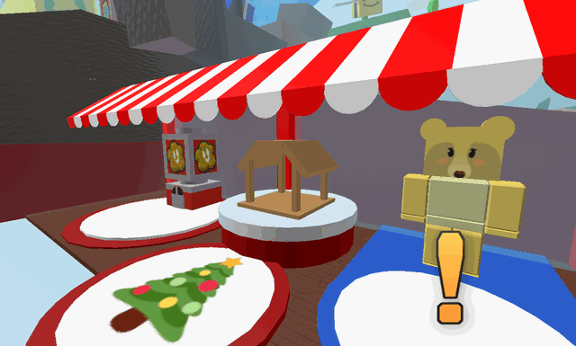

# Gingerbread House

{ align=right width=150 }

The **Gingerbread House** is a Beesmas-exclusive machine which can be assembled after completing [Mother Bear](mother-bear.md)'s Beesmas quest.

It sits between [Mother Bear](mother-bear.md) and the [Treat Shop](treat-shop.md). When activated, the house gives 1 [Gingerbread Bear](gingerbread-bear.md) for every 2 playtime hours, which can be built up over time.

If the player attempts to use the Gingerbread House before it is completed, it will display text that reads: This Gingerbread House is far from complete...

<figure class="mw-halign-center" style="text-align:center"><figcaption>The Gingerbread House stand before Mother Bear&#x27;s Beesmas quest is completed.</figcaption></figure>

## Overview

The Gingerbread House has gumdrops for decorations at the corners, a [Gingerbread Bear](gingerbread-bear.md) in the middle, and a candy cane acting as a possible chimney.

Its only use is to produce a Gingerbread Bear every 2 **in-game** hours. If the player is offline, it does not generate any, unless they have redeemed an [Offline Voucher](sticker.md#Sticker_Index), in which it will stay active for up to 24 hours after they log out.

Upon completing the quest, the Gingerbread House can be used immediately for one Gingerbread Bear.

## Trivia

* The Gingerbread House stores multiple gingerbread bears at the same time, meaning that multiple gingerbread bears can be collected in one go after 4 or more hours.
* Even though **the cooldown to collect resets once it was collected**, **the timer for generating gingerbread bears does not**. For example, if a player with 3 hours in-game checks the house, they will only get 1 gingerbread bear and the cooldown will reset to 2 hours. The timer saves that extra hour, so the player will get 2 gingerbread bears if they collect after 3 more hours (6 hours total).
  * This now has been changed and now the timer saves.
* The Gingerbread House was introduced in Beesmas 2020, and has returned on each Beesmas since.
* Quest givers such as [Bee Bear](bee-bear.md) require the player to interact with the Gingerbread House a varying amount of times.
