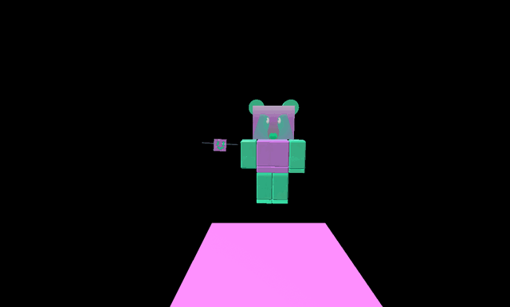

# Gummy Bear's Lair

{ .wiki-photo }

**Gummy Bear's Lair** is a location that can only be accessed by having a [Goo Hotshot Badge](badges.md#Goo_Badge) or above.

To get into the lair, touch the [Gummy Bee](gummy-bee.md) model on the [Gummy Bee Claimer](gummy-bee-egg-claim.md) and use a [gumdrop](gumdrops.md). The player can reach the egg claim by going behind the Ant Leaderboard and following the path (where there's also an [ant pass](ant-pass.md) token). They can also climb the Stinger Dispenser, go across the gate and reach the Egg Claim or use a cannon, such as the [Red](red-cannon.md) or [Yellow](yellow-cannon.md) Cannon in combination with the [Parachute](parachute.md)/[Glider](glider.md).

If the player doesn't have the Goo Hotshot Badge, then the following message will prompt:
Only Goo Hotshots can hear Gummy Bee...

Otherwise, the player will be prompted to use gumdrops to enter the Lair with this message:

The Gummy Bee wants Gumdrops

The lair contains [Gummy Bear](gummy-bear.md) and Gummy Bee. It also has the [Glue Dispenser](glue-dispenser.md), which activates the [Unlimited Gumdrops](passive-abilities.md) passive, allowing [gumdrops](gumdrops.md) to not decrease in count when used. Additionally, it has a shop that sells the [Gummy Mask](gummy-mask.md), [Gummy Boots](gummy-boots.md) and the [Gummyballer](gummyballer.md).

## Shop

<table class="article-table">
<tbody><tr>
<th width="25%">Item
</th>
<th width="20%">Cost
</th>
<th width="55%">Description
</th></tr>
<tr>
<td><figure class="mw-halign-center" typeof="mw:File"><figcaption></figcaption></figure> 

<a href="gummy-mask.html">Gummy Mask</a>

</td>
<td>5B <a href="honey.html">Honey</a> 

250 <a href="glue.html">Glues</a> 
100 <a href="enzymes.html">Enzymes</a> 
100 <a href="oil.html">Oils</a> 
100 <a href="glitter.html">Glitter</a> 
1 <a href="satisfying-vial.html">Satisfying Vial</a>

</td>
<td>

"The official mask of a Gummy Soldier."

<ul><li>+75% <a href="system-page.html#Goo">Goo</a>.</li>
<li>+10% <a href="system-page.html#Goo_Conversion">Goo Conversion</a>.</li>
<li>x1.25 <a href="system-page.html#White_Pollen">White Pollen</a>.</li>
<li>+25% <a href="system-page.html#Pollen">Pollen</a>.</li>
<li>x1.5 <a href="system-page.html#Capacity_Multiplier">Capacity</a>.</li>
<li>x1.5 <a href="field-capacity.html">White Field Capacity</a>.</li>
<li>+30% <a href="system-page.html#Defense">Defense</a>.</li>
<li>+20% <a href="system-page.html#Bee_Ability_Rate">Bee Ability Rate</a>.</li>
<li><a href="passive-abilities.html#Coin_Scatter">+Passive: Coin Scatter</a> (see <a href="honey-mask.html">Honey Mask</a>, needs <a href="honey-mask.html">Honey Mask</a> in order to use).</li>
<li><a href="passive-abilities.html#Gummy_Morph">+Passive: Gummy Morph</a>.</li></ul>
</td></tr>
<tr>
<td><figure class="mw-halign-center" typeof="mw:File"><figcaption></figcaption></figure> 

<a href="gummy-boots.html">Gummy Boots</a>

</td>
<td>100B <a href="honey.html">Honey</a> 

500 <a href="glue.html">Glues</a> 
250 <a href="glitter.html">Glitter</a> 
250 <a href="red-extract.html">Red Extracts</a> 
250 <a href="blue-extract.html">Blue Extracts</a> 
1 <a href="satisfying-vial.html">Satisfying Vial</a> 
1 <a href="motivating-vial.html">Motivating Vial</a>

</td>
<td>

"Squishy boots that leave a trail of Goo wherever you go."

<ul><li>+25% <a href="goo.html">Goo</a>.</li>
<li>+20% <a href="pollen.html">Pollen</a>.</li>
<li>+3 <a href="system-page.html#Attack_Multiplier">Bee Attack</a>.</li>
<li>+50% <a href="system-page.html#Honey_From_Tokens">Honey From Tokens</a>.</li>
<li>+8 <a href="system-page.html#Movespeed">Player Movespeed</a>.</li>
<li>+22 <a href="system-page.html#Jump_Power">Jump Power</a>.</li>
<li>+16 <a href="movement-collection.html">Movement Collection</a>.</li>
<li><a href="passive-abilities.html#Coconut_Haste">+Passive: Coconut Haste</a> (does not require <a href="coconut-clogs.html">Coconut Clogs</a> purchased in order to use).</li>
<li><a href="passive-abilities.html#Goo_Trail">+Passive: Goo Trail</a>.</li></ul>
</td></tr>
<tr>
<td><figure class="mw-halign-center" typeof="mw:Error mw:File"><figcaption></figcaption></figure> 

<a href="gummyballer.html">Gummyballer</a>

</td>
<td>10T <a href="honey.html">Honey</a> 

1,500 <a href="glue.html">Glues</a> 
2,000 <a href="gumdrops.html">Gumdrops</a> 
50 <a href="caustic-wax.html">Caustic Waxes</a> 
50 <a href="super-smoothie.html">Super Smoothies</a> 
5 <a href="turpentine.html">Turpentines</a> 
3 <a href="satisfying-vial.html">Satisfying Vials</a>

</td>
<td>
<ul><li>Conjures up a delectable arsenal of gummy wrecking balls. Bombard Marks and Honey Tokens for massive gooey gains.</li></ul>
</td></tr></tbody></table>

## Gummy Bear's Dialogue

When the player walks up to Gummy Bear without having the Gummy Mask or Gummy Boots bought, he will say the following in chat and through **notifications**:

Gummy Bear: "What's sweeter than honey?"  

"Glorious gumdrops... they're just the start!"  

"A sweet and sour, ooey-gooey universe..."  

"Can't you see it too?" (slight pause)  

"What's that Gummy Bee?"  

"They're not seeing clearly?"  

"YOU'RE ALWAYS RIGHT!"  

"GOO-dbye, beekeeper... HAH!"

After he finishes his speech, Gummy Bear will instantly kill the player, sending the player back to their [hive](hive.md).

If the player owns the Gummy Mask or the Gummy Boots, they can talk to Gummy Bear, but he does not give a quest, unless it is Beesmas. It is not required to have either of the two equipped to talk to him.

<table class="article-table mw-collapsible mw-collapsed">
<tbody><tr>
<th>Dialogue
</th></tr>
<tr>
<td>A beekeeper approaches, Gummy Bee!

<i>The player is given two options: "Talk to Gummy Bear" or "Return to hive".</i>

<i>-Talk to Gummy Bear-</i>

Our Gummy Army marches forward at a steady, viscous pace. An inevitable ooze that envelopes all things, uniting us all! This glorious gummy world awaits you and your Gummy Bee as well. A place where nothing is bitter, and EVERYTHING is sweet!

<i>-Return to hive-</i>

Back to work, soldier!

<i>The player is teleported to their hive.</i>

 
If the player has bought the Gummy Mask after Beesmas 2021, only the dialogue of talking to Gummy Bear will activate.

</td></tr></tbody></table>

## Notes

* Players should avoid going to Gummy Bear's Lair if they have a lot of [pollen](pollen.md) in their [container](bags.md), as they will eventually die due to Gummy Bear killing them or by the player needing to reset their character. However, the player can avoid losing pollen by rejoining the game, using a [Micro-Converter](micro-converter.md) to convert all of the pollen beforehand, or using a [Whirligig](whirligig.md).
  * During Beesmas 2020 and 2021, the player would be able to exit the lair if they have given Gummy Bear a present.

## Token locations

* 1 [Glitter](glitter.md) behind the Gummy Boots case.
* 1 [Star Jelly](royal-jelly.md#Star_Jelly) in front of Gummy Bear.
* 1 [Enzymes](enzymes.md) in the corner of the lair.

## Trivia

* Before Beesmas 2020, the only way to leave the lair without exiting or losing connection to the game is to die. The player can die by either courtesy of [Gummy Bear](gummy-bear.md) or by resetting their character.
* This is currently the only location not connected to the mountain; instead, it is high up in the sky. The player is able to see the silhouette of the lair if they look closely at the sky.
* [Bee Bear](bee-bear.md) refers to Gummy Bear as **naughty** in 2018, most likely because he kills the player upon finishing his dialogue, and the fact that he tried to "invade" the mountain.
* Originally, the lair required the Goo Ace Badge or above, which was a mistake on Onett's end. It was quickly fixed to allow people with Goo Hotshot as well, so there could be more players that could actually access the lair.
* This, the Ace Shop, and the [Badge Bearer's Guild](badge-bearer-s-guild.md) are the only places that require [badges](badges.md) to enter them.
  * Gummy Bear's Lair is the only location that requires a specific badge to enter.
* Before the 2019-04-05 update, the [Gummy Bee](gummy-bee.md) that was used to teleport was on top of the [Ticket Tent](ticket-tent.md). Now Gummy Bee is replaced with a model of [Festive Bee](festive-bee.md) and was instead put at the [Ant Field](fields.md).
* When Gummy Bear's Lair first came out, it said, “Gummy Bee wants 1 [Gumdrop](gumdrops.md).” Now, it says “The Gummy Bee wants Gumdrops.”
  * However, if the player is visiting Gummy Bear's Lair for the first time, standing on the Gummy Bee model will say "The Gummy Bee wants 1 Gumdrops."
* [Spirit Bear](spirit-bear.md) mentions how to get to the lair in her quest dialogue.
* Some players may experience lag when they are getting close to Gummy Bear.
* This shop and the [Petal Shop](petal-shop.md) are the only shops with items in a triangular formation.
* The player can experience minor glitches in the lair.
  * When the player walks up to Gummy Bear, he sometimes fails to kill the player after he finishes his speech.
  * After Gummy Bear kills the player, their body parts will slip down until they reach the end of the shop. If the player presses E at the right time, they will be stuck in the shop, resulting in the Shop Trap glitch. Only leaving the game could fix this glitch.
  * On rare occasions, [Wild Windy Bee](wild-windy-bee.md) can push the player to Gummy Bear's Lair, making them glitch into it.

<table class="mw-collapsible mw-collapsed NavTable">
<tbody><tr>
<th class="NavTitle" colspan="2">Locations
</th></tr>
<tr>
<th class="NavCategory"><a href="fields.html">Fields</a>
</th>
<td class="NavLinks NavLinksBasicOdd"><b><a href="sunflower-field.html">Sunflower Field</a> • <a href="dandelion-field.html">Dandelion Field</a> • <a href="mushroom-field.html">Mushroom Field</a> • <a href="blue-flower-field.html">Blue Flower Field</a> • <a href="clover-field.html">Clover Field</a> • <a href="spider-field.html">Spider Field</a> • <a href="bamboo-field.html">Bamboo Field</a> • <a href="strawberry-field.html">Strawberry Field</a> • <a href="pineapple-patch.html">Pineapple Patch</a> • <a href="stump-field.html">Stump Field</a> • <a href="cactus-field.html">Cactus Field</a> • <a href="pumpkin-patch.html">Pumpkin Patch</a> • <a href="pine-tree-forest.html">Pine Tree Forest</a> • <a href="rose-field.html">Rose Field</a> • <a href="ant-field.html">Ant Field</a> • <a href="hub-field.html">Hub Field</a> • <a href="mountain-top-field.html">Mountain Top Field</a> • <a href="coconut-field.html">Coconut Field</a> • <a href="pepper-patch.html">Pepper Patch</a></b>
</td></tr>
<tr>
<th class="NavCategory"><a href="shops.html">Shops</a>
</th>
<td class="NavLinks NavLinksBasicEven"><b><a href="basic-egg-shop.html">Basic Egg Shop</a> • <a href="boost-market.html">Boost Market</a> • <a href="treat-shop.html">Treat Shop</a> • <a href="gumdrop-shop.html">Gumdrop Shop</a> • <a href="royal-jelly-shop.html">Royal Jelly Shop</a> • <a href="ticket-shop.html">Ticket Shop</a> • <a href="noob-shop.html">Noob Shop</a> • <a href="pro-shop.html">Pro Shop</a> • <a href="magic-bean-shop.html">Magic Bean Shop</a> • <a href="badge-bearer-s-guild.html">Badge Bearer's Guild</a> • <a href="dapper-bear-s-shop.html">Dapper Bear's Shop</a> • <a href="stinger-shop.html">Stinger Shop</a> • <a href="mountain-top-shop.html">Mountain Top Shop</a> • <a href="blue-hq.html">Blue HQ</a> • <a href="red-hq.html">Red HQ</a> • <a href="hub-field-shop.html">Hub Field Shop</a> • <a href="robo-bear-s-shop.html">Robo Bear's Shop</a> • <a href="petal-shop.html">Petal Shop</a> • <a href="coconut-cave.html">Coconut Cave</a> • <a href="ticket-tent.html">Ticket Tent</a> • <a href="robux-shop.html">Robux Shop</a></b>
</td></tr>
<tr>
<th class="NavCategory">Gates
</th>
<td class="NavLinks NavLinksBasicOdd"><b><a href="basic-bee-gate.html">Basic Bee Gate</a> • <a href="brave-bee-gate.html">Brave Bee Gate</a> • <a href="honey-bee-gate.html">Honey Bee Gate</a> • <a href="ant-gate.html">Ant Gate</a> • <a href="lion-bee-gate.html">Lion Bee Gate</a> • <a href="bear-gate.html">Bear Gate</a> • <a href="windy-bee-gate.html">Windy Bee Gate</a></b>
</td></tr>
<tr>
<th class="NavCategory">Machines
</th>
<td class="NavLinks NavLinksBasicEven"><b><a href="honey-dispenser.html">Honey Dispenser</a> • <a href="royal-jelly-dispenser.html">Royal Jelly Dispenser</a> • <a href="treat-dispenser.html">Treat Dispenser</a> • <a href="instant-converter.html">Instant Converter</a> • <a href="wealth-clock.html">Wealth Clock</a> • <a href="moon-amulet-generator.html">Moon Amulet Generator</a> • <a href="memory-match.html">Memory Match</a> • <a href="blue-field-booster.html">Blue Field Booster</a> • <a href="red-field-booster.html">Red Field Booster</a> • <a href="field-booster.html">Field Booster</a> • <a href="blueberry-dispenser.html">Blueberry Dispenser</a> • <a href="strawberry-dispenser.html">Strawberry Dispenser</a> • <a href="blue-extract-dispenser.html">Blue Extract Dispenser</a> • <a href="red-extract-dispenser.html">Red Extract Dispenser</a> • <a href="honeystorm.html">Honeystorm</a> • <a href="special-sprout-summoner.html">Special Sprout Summoner</a> • <a href="free-ant-pass-dispenser.html">Free Ant Pass Dispenser</a> • <a href="ant-pass-dispenser.html">Ant Pass Dispenser</a> • <a href="glue-dispenser.html">Glue Dispenser</a> • <a href="blender.html">Blender</a> • <a href="coconut-dispenser.html">Coconut Dispenser</a> • <a href="mythic-meteor-shower.html">Mythic Meteor Shower</a> • <a href="free-robo-pass-dispenser.html">Free Robo Pass Dispenser</a> • <a href="robo-pass-dispenser.html">Robo Pass Dispenser</a> • <a href="sticker-stack.html">Sticker Stack</a> • <a href="sticker-printer.html">Sticker Printer</a> • <a href="nectar-condenser.html">Nectar Condenser</a></b>
</td></tr>
<tr>
<th class="NavCategory">Transportation
</th>
<td class="NavLinks NavLinksBasicOdd"><b><a href="slingshot.html">Slingshot</a> • <a href="yellow-cannon.html">Yellow Cannon</a> • <a href="blue-cannon.html">Blue Cannon</a> • <a href="red-cannon.html">Red Cannon</a> • <a href="blue-teleporter.html">Blue Teleporter</a> • <a href="red-teleporter.html">Red Teleporter</a></b>
</td></tr>
<tr>
<th class="NavCategory"><a href="leaderboards.html">Leaderboards</a>
</th>
<td class="NavLinks NavLinksBasicEven"><b><a href="daily-top-honeymakers.html">Daily Top Honeymakers</a> • <a href="all-time-top-honeymakers.html">All-Time Top Honeymakers</a> • <a href="all-time-top-battlers-most-battle-points.html">All-Time Top Battlers</a> • Top Ant Exterminators • Fastest Crab Slayers • Top Stick Bug Fighters • Top Bucko Bee Helpers • Top Riley Bee Helpers • <a href="most-commando-captures.html">Most Commando Captures</a> • Top Brown Bear Helpers • All-Time Top Red Collectors • All-Time Top Blue Collectors • All-Time Top White Collectors • Daily Top Red Collectors • Daily Top Blue Collectors • Daily Top White Collectors • Highest Damage to a Single Puffshroom • Tallest Sticker Stack • Highest Robo Bear Challenge Scores • <a href="highest-snowbear-level.html">Highest Snowbear Level</a> • <a href="highest-robo-party-cake-rank.html">Highest Robo Party Cake Rank</a></b>
</td></tr>
<tr>
<th class="NavCategory">Other Places
</th>
<td class="NavLinks NavLinksBasicOdd"><b><a href="hive.html">Hive</a> • <a href="obstacle-courses.html">Obstacle Courses</a> • King Beetle Lair • <a href="white-tunnel.html">White Tunnel</a> • <a href="werewolf-s-cave.html">Werewolf's Cave</a> • <a href="ant-challenge.html">Ant Challenge</a> • <a href="star-hall.html">Star Hall</a> • <strong class="mw-selflink selflink">Gummy Bear's Lair</strong> • <a href="ant-challenge-info.html">Ant Challenge Info</a> • <a href="vicious-bee-egg-claim.html">Vicious Bee Claimer</a> • <a href="gummy-bee-egg-claim.html">Gummy Bee Claimer</a> • <a href="wind-shrine.html">Wind Shrine</a> • <a href="mazes.html">Mazes</a> • <a href="hive-hub.html">Hive Hub</a> • <a href="sticker-seeker-quest-machine.html">Sticker-Seeker Quest Machine</a></b>
</td></tr>
<tr>
<th class="NavCategory">Event Locations
</th>
<td class="NavLinks NavLinksBasicEven"><b><a href="beesmas-tree.html">Beesmas Tree</a> • <a href="gift-boxes.html">Gift Boxes</a> • <a href="honey-wreath.html">Honey Wreath</a> • <a href="stockings.html">Stockings</a> • <a href="gingerbread-house.html">Gingerbread House</a> • <a href="snowbear-summoner.html">Snowbear Summoner</a> • <a href="beesmas-lights.html">Beesmas Lights</a> • <a href="samovar.html">Samovar</a> • <a href="beesmas-feast.html">Beesmas Feast</a> • <a href="onett-s-lid-art.html">Onett's Lid Art</a> • <a href="wind-shrine.html#Galentine_Shrine">Galentine Shrine</a> • <a href="memory-match.html#Winter_Memory_Match">Winter Memory Match</a> • <a href="snow-machine.html">Snow Machine</a> • <a href="honeyday-candles.html">Honeyday Candles</a> • <a href="robo-party-cake.html">Robo Party Cake</a> • <a href="gummy-beacon.html">Gummy Beacon</a> • <a href="naughty-list.html">Naughty List</a></b>
</td></tr></tbody></table>
