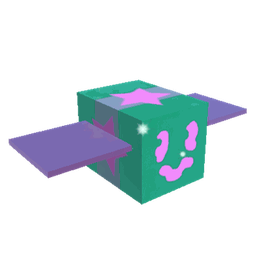

# Gummy Bee

Gummy Bee

<input type="radio" name="bee-infobox-tab" id="bee-tab-original" checked>
<label for="bee-tab-original">Original</label>
<input type="radio" name="bee-infobox-tab" id="bee-tab-gifted">
<label for="bee-tab-gifted">Gifted</label>

<i>"A squishy bee who's sweet as sugar. Covers flowers in goo to grant you bonus honey!"</i>

<b>Rarity</b>Event

<b>Color</b>Colorless

<b>Energy</b>50

<b>Speed</b>14

<b>Attack</b>4

Color Scheme

<b>Skin</b><code>#ff77f4</code><code>#1aff6b</code><code>#ff77f4</code>

**Gummy Bee** is a Colorless [Event bee](bees-event.md). It can be purchased for 2,500 [Gumdrops](gumdrops.md) from the [Gummy Bee Egg Claim](gummy-bee-egg-claim.md).

Like all other Event bees, this bee does not have a favorite treat, and the only way to make it gifted is by feeding it a [Star Treat](star-treat.md), [Gingerbread Bears](gingerbread-bear.md) or [Aged Gingerbread Bears](aged-gingerbread-bear.md).

Gummy Bee likes the [Pineapple Patch](pineapple-patch.md), [Mountain Top Field](mountain-top-field.md), and the [Stump Field](stump-field.md). It dislikes the [Pumpkin Patch](pumpkin-patch.md).

## Stats

* Collects 10 [Pollen](pollen.md) in 4 seconds.
* Makes 700 [Honey](honey.md) in 4 seconds.
* +150% [Energy](energy.md), +620 [Convert Amount](system-page.md#Convert_Amount), +2 [Attack](stats.md#Attack).
* 🌟 [Gifted Hive Bonus](gifted-bee.md): +5% [Honey Per Pollen](system-page.md#Honey_Per_Pollen).

### Abilities

* **[Gumdrop Barrage](ability-tokens.md#Gumdrop_Barrage)** Launches Gumdrops in a large area, covering the field in goo. [Flowers](flowers.md) covered in goo grant bonus Honey that increases with the size of the Goo puddle.
* **[Glob](ability-tokens.md#Glob)** Covers 49 surrounding flowers in goo. If gifted, covers 81 Flowers instead.

<table style="font-size:1.5vh; color:#000; width:100%; background:#fff; padding: 15px 0; border:none; color:#000; border-left:15px #000 solid">
<tbody><tr>
<td style="width:100%; text-align:center">

Gummy Bee has a base pollen collection of <b>10 </b> in <b>4 seconds</b>. 

That's equivalent to 2.5  per second. 

(<b>20 </b> in <b>4 seconds</b> with x2 Bee Pollen gamepass)

</td></tr></tbody></table>

<table align="center" class="wikitable" style="text-align:center; width:80%;">
<tbody><tr>
<th colspan="5"> Pollen Collection
</th></tr>
<tr>
<td rowspan="2">Flower Tier
</td><td colspan="1" rowspan="2">Bee Pollen
</td><td colspan="2">with Critical Hit
</td></tr>
<tr>
<td>without Melody
</td><td>with Melody
</td></tr>
<tr>
<td>Single
</td><td>10
</td><td>20
</td><td>30
</td></tr>
<tr>
<td>Double
</td><td>20
</td><td>40
</td><td>60
</td></tr>
<tr>
<td>Triple
</td><td>30
</td><td>60
</td><td>90
</td></tr>
<tr>
<td>Large
</td><td>40
</td><td>80
</td><td>120
</td></tr>
<tr>
<td>Star
</td><td>50
</td><td>100
</td><td>150
</td></tr>
</tbody></table>

<table style="font-size:1.5vh; color:#000; width:100%; background:linear-gradient(to left, #FFB75E, #ED8F03); padding: 15px 0; border:none; color:#fff; border-left:15px #fff solid">
<tbody><tr>
<td style="width:100%; text-align:center">

Gummy Bee can make <b>700 </b> in <b>4 seconds</b>!

That's equivalent to <b>175  per second</b>.

(<b>700  in 2 seconds</b> with x2 Honeymaking Speed)

</td></tr>
</tbody></table>

<table align="center" class="wikitable" style="text-align:center; width:75%">
<tbody><tr>
<th>Honey Collection with Science Enhancement
</th></tr>
<tr>
<td>
<h3>Levels 1-8</h3><table align="center" class="wikitable" style="text-align:center;">
<tbody><tr>
<th><i>Science Enhancement</i>
</th><th>Production Rate
</th><th>Number of Produced Honey
</th></tr>
<tr>
<td>1
</td><td>25%
</td><td>875
</td></tr>
<tr>
<td>2
</td><td>50%
</td><td>1050
</td></tr>
<tr>
<td>3
</td><td>75%
</td><td>1225
</td></tr>
<tr>
<td>4
</td><td>100%
</td><td>1400
</td></tr>
<tr>
<td>5
</td><td>125%
</td><td>1575
</td></tr>
<tr>
<td>6
</td><td>150%
</td><td>1750
</td></tr>
<tr>
<td>7
</td><td>175%
</td><td>1925
</td></tr>
<tr>
<td>8
</td><td>200%
</td><td>2100
</td></tr>
</tbody></table><h3>Levels 9-16</h3><table align="center" class="wikitable" style="text-align:center;">
<tbody><tr>
<th><i>Science Enhancement</i>
</th><th>Production Rate
</th><th>Number of Produced Honey
</th></tr>
<tr>
<td>9
</td><td>225%
</td><td>2275
</td></tr>
<tr>
<td>10
</td><td>250%
</td><td>2450
</td></tr>
<tr>
<td>11
</td><td>275%
</td><td>2625
</td></tr>
<tr>
<td>12
</td><td>300%
</td><td>2800
</td></tr>
<tr>
<td>13
</td><td>325%
</td><td>2975
</td></tr>
<tr>
<td>14
</td><td>350%
</td><td>3150
</td></tr>
<tr>
<td>15
</td><td>375%
</td><td>3325
</td></tr>
<tr>
<td>16
</td><td>400%
</td><td>3500
</td></tr>
</tbody></table><h3>Levels 17-24</h3><table align="center" class="wikitable" style="text-align:center;">
<tbody><tr>
<th><i>Science Enhancement</i>
</th><th>Production Rate
</th><th>Number of Produced Honey
</th></tr>
<tr>
<td>17
</td><td>425%
</td><td>3675
</td></tr>
<tr>
<td>18
</td><td>450%
</td><td>3850
</td></tr>
<tr>
<td>19
</td><td>475%
</td><td>4025
</td></tr>
<tr>
<td>20
</td><td>500%
</td><td>4200
</td></tr>
<tr>
<td>21
</td><td>525%
</td><td>4375
</td></tr>
<tr>
<td>22
</td><td>550%
</td><td>4550
</td></tr>
<tr>
<td>23
</td><td>575%
</td><td>4725
</td></tr>
<tr>
<td>24
</td><td>600%
</td><td>4900
</td></tr>
</tbody></table><h3>Levels 25-31</h3><table align="center" class="wikitable" style="text-align:center;">
<tbody><tr>
<th><i>Science Enhancement</i>
</th><th>Production Rate
</th><th>Number of Produced Honey
</th></tr>
<tr>
<td>25
</td><td>625%
</td><td>5075
</td></tr>
<tr>
<td>26
</td><td>650%
</td><td>5250
</td></tr>
<tr>
<td>27
</td><td>675%
</td><td>5425
</td></tr>
<tr>
<td>28
</td><td>700%
</td><td>5600
</td></tr>
<tr>
<td>29
</td><td>725%
</td><td>5775
</td></tr>
<tr>
<td>30
</td><td>750%
</td><td>5950
</td></tr>
<tr>
<td>31
</td><td>775%
</td><td>6125
</td></tr>
</tbody></table>

</td></tr>
</tbody></table>

## Gallery

Dfsfd.png

Gummy Bee's old hive slot design.

Gifted Gummy Bee hive.PNG

A Gifted Gummy Bee hive slot.

Kfff.png

Gummy Bee's face.

First edition gummy.png

A First Edition Gummy Bee.

Gifted First Edition Gummy Bee.png

A First Edition Gifted Gummy Bee.

RobloxScreenShot20180808 181426797.png

Gummy Bee in the Ticket Tent.

Gummy be on top of the ticket tent.jpg

Gummy Bee outside of the Ticket Tent.

Normal Gummy bee when gummy morph is activated.jpeg

Gummy Bee when Gummy Morph is active.

GummyBee.png

Gifted Gummy Bee when Gummy Morph is active.

GummyBeeGlow.jpeg

Gummy Bee emitting a faint light.

GummyBeeEggClaim.png

The Gummy Bee egg claim.

Glob.png

A Glob token.

GumdropBarrage.png

Gumdrop Barrage token.

BSSGummyInvasionUpdate.png

Gummy Bee in the game's <a href="re-swarm.html#Icons">icon</a> during the Gummy Invasion.

Basix updore.PNG

Gummy Bee in one of the game's icons.

BSSHeMadeAStatementSoGoo-d.png

Gummy Bee's render in one the game's icons.

## Trivia

* There is a model of the Gummy Bee on the [Gummy Bee Egg Claim](gummy-bee-egg-claim.md). Using [gumdrops](gumdrops.md) right after touching it and receiving the message; "The Gummy Bee wants gumdrops" will teleport the player to [Gummy Bear's Lair](gummy-bear-s-lair.md). The player must have the [Goo Hotshot Badge](badges.md#Goo_Badge) to enter the lair, or else there is a message that says "Only Goo Hotshots can hear Gummy Bee...".
* Gummy Bee is the only [Event bee](bees-event.md) that doesn't have extra body parts.
* Gummy Bee and [Fireflies](fireflies.md) share the same face, which resembles [Basic Bee's](basic-bee.md) face.
* The Gummy Bee is the fourth [Event bee](bees-event.md) to be released in an [Update](updates.md).
  * This bee was also the first bee to ever be a prize for completing the [Quests](quests.md) of a Traveling Bear.
  * It was also the third bee to have been unobtainable for a while.
* The Gummy Bee, [Bear Bee](bear-bee.md), [Tabby Bee](tabby-bee.md), [Puppy Bee](puppy-bee.md), [Festive Bee](festive-bee.md), [Digital Bee](digital-bee.md), and [Windy Bee](windy-bee.md) are the only Event bees which can be a [First Edition Bee](first-edition-bee.md).
* This is the only bee that is translucent.
* The Gummy Bee was once obtainable through completing all 15 quests of [Gummy Bear](gummy-bear.md).
  * Before the [2019-04-05 Update](updates.md#2019-04-05), the player could buy Gummy Bee in the [Ticket Tent](ticket-tent.md) for 500 [Tickets](ticket.md).
  * [Festive Bee](festive-bee.md) took the place of Gummy Bee in the Ticket Tent after the 2019-04-05 Update.
* The Gummy Bee and [Diamond Bee](diamond-bee.md) are the only bees that have a sparkle effect that surrounds their bodies.
* Gummy Bee emits a faint light from its eyes that can be easily seen in dark places.
* This is the only Event bee to have a Mask based on it, the [Gummy Mask](gummy-mask.md).
  * The other bees that have a mask based off them are [Honey Bee](honey-bee.md), [Diamond Bee](diamond-bee.md), [Demon Bee](demon-bee.md), [Bubble Bee](bubble-bee.md), and [Fire Bee](fire-bee.md).
* Gummy Bee is the third bee in the game to at some point cost a currency besides tickets, the first being Bear Bee (Robux), the second being [Vicious Bee](vicious-bee.md) ([Stingers](stinger.md)), and the fourth being [Windy Bee](windy-bee.md) ([Cloud Vials](cloud-vial.md)).
* This bee, [Bear Bee](bear-bee.md), [Festive Bee](festive-bee.md), [Photon Bee](photon-bee.md), and [Tabby Bee](tabby-bee.md) are the only bees whose signature abilities are directly buffed by being gifted.
* If it were to be bought by buying gumdrops from the [Gumdrop Shop](gumdrop-shop.md), it would cost 834 [Tickets](ticket.md), with 2 [gumdrops](gumdrops.md) left over.
* When [Gummy Morph](passive-abilities.md#Gummy_Morph) is active, this bee has the highest base attack, an attack of 303 being about 30 times the base attack of [Lion Bee](lion-bee.md).
* Gummy Bee can find two stickers when in a specific field:
  * Gummy Bee has a chance to find a Launching Rocket [Sticker](sticker.md) in the [Clover Field](clover-field.md).
  * Gummy Bee has a very rare chance to find a Yellow Sticky Hand [Sticker](sticker.md) in the [Sunflower Field](sunflower-field.md).
* In the in-game stat menu for Gummy Bee, its convert amount is stated to be 720 more than the normal amount (80). However, it is actually 620 more.

<table class="mw-collapsible mw-collapsed NavTable">
<tbody><tr>
<th class="NavTitle" colspan="2">Bees
</th></tr>
<tr>
<th class="NavCategory">Common &amp; Rare
</th>
<td class="NavLinks NavLinksRare"><b> <a href="basic-bee.html">Basic Bee</a> •  <a href="bomber-bee.html">Bomber Bee</a>  •  <a href="brave-bee.html">Brave Bee</a> •  <a href="bumble-bee.html">Bumble Bee</a> •  <a href="cool-bee.html">Cool Bee</a> •  <a href="hasty-bee.html">Hasty Bee</a> •  <a href="looker-bee.html">Looker Bee</a> •  <a href="rad-bee.html">Rad Bee</a> •  <a href="rascal-bee.html">Rascal Bee</a> •  <a href="stubborn-bee.html">Stubborn Bee</a></b>
</td></tr>
<tr>
<th class="NavCategory">Epic
</th>
<td class="NavLinks NavLinksEpic"><b> <a href="bubble-bee.html">Bubble Bee</a> •  <a href="bucko-bee.html">Bucko Bee</a> •  <a href="commander-bee.html">Commander Bee</a> •  <a href="demo-bee.html">Demo Bee</a> •  <a href="exhausted-bee.html">Exhausted Bee</a> •  <a href="fire-bee.html">Fire Bee</a> •  <a href="frosty-bee.html">Frosty Bee</a> •  <a href="honey-bee.html">Honey Bee</a> •  <a href="rage-bee.html">Rage Bee</a> •  <a href="riley-bee.html">Riley Bee</a> •  <a href="shocked-bee.html">Shocked Bee</a></b>
</td></tr>
<tr>
<th class="NavCategory">Legendary
</th>
<td class="NavLinks NavLinksLegend"><b> <a href="baby-bee.html">Baby Bee</a> •  <a href="carpenter-bee.html">Carpenter Bee</a> •  <a href="demon-bee.html">Demon Bee</a> •  <a href="diamond-bee.html">Diamond Bee</a> •  <a href="lion-bee.html">Lion Bee</a> •  <a href="music-bee.html">Music Bee</a> •  <a href="ninja-bee.html">Ninja Bee</a> •  <a href="shy-bee.html">Shy Bee</a></b>
</td></tr>
<tr>
<th class="NavCategory">Mythic
</th>
<td class="NavLinks NavLinksMythic"><b> <a href="buoyant-bee.html">Buoyant Bee</a> •  <a href="fuzzy-bee.html">Fuzzy Bee</a> •  <a href="precise-bee.html">Precise Bee</a> •  <a href="spicy-bee.html">Spicy Bee</a> •  <a href="tadpole-bee.html">Tadpole Bee</a> •  <a href="vector-bee.html">Vector Bee</a></b>
</td></tr>
<tr>
<th class="NavCategory">Event
</th>
<td class="NavLinks NavLinksEvent"><b> <a href="bear-bee.html">Bear Bee</a> •  <a href="cobalt-bee.html">Cobalt Bee</a> •  <a href="crimson-bee.html">Crimson Bee</a> •  <a href="digital-bee.html">Digital Bee</a> •  <a href="festive-bee.html">Festive Bee</a> •  <strong class="mw-selflink selflink">Gummy Bee</strong> •  <a href="photon-bee.html">Photon Bee</a> •  <a href="puppy-bee.html">Puppy Bee</a> •  <a href="tabby-bee.html">Tabby Bee</a> •  <a href="vicious-bee.html">Vicious Bee</a> •  <a href="windy-bee.html">Windy Bee</a></b>
</td></tr></tbody></table>

