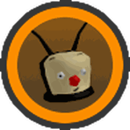

# Gummy Mask

<aside class="portable-infobox pi-background pi-border-color pi-theme-wikia pi-layout-stacked" role="region">
<h2 class="pi-item pi-item-spacing pi-title pi-secondary-background" data-source="title1">Gummy Mask</h2>
<figure class="pi-item pi-image" data-source="image1">

</figure>

<h3 class="pi-data-label pi-secondary-font">Description</h3>

"The official mask of a Gummy Soldier."

<h3 class="pi-data-label pi-secondary-font">Cost</h3>

5,000,000,000 <a href="honey.html">Honey</a>, 250 <a href="glue.html">Glue</a>, 100 <a href="enzymes.html">Enzymes</a>, 100 <a href="oil.html">Oil</a>, 100 <a href="glitter.html">Glitter</a> and 1 <a href="nectar-vial.html#Satisfying_Vial">Satisfying Vial</a>.

<h3 class="pi-data-label pi-secondary-font">Bonus Stats</h3>

+75% Goo 
+10% Goo Conversion x1.25 White Pollen +25% Pollen x1.5 Capacity x1.5 White Field Capacity +30% Defense +20% Bee Ability Rate +Passive: Coin Scatter (Needs Honey Mask) +Passive: Gummy Morph

</aside>

The **Gummy Mask** is a mask available for purchase in [Gummy Bear's Lair](gummy-bear-s-lair.md). It can be reached by touching the [Gummy Bee](gummy-bee.md) model on the [Gummy Bee Egg Claim](gummy-bee-egg-claim.md) and using [gumdrops](gumdrops.md) if the player has obtained the [Goo Hotshot](badges.md#Goo_Badge) badge.

<table class="article-table">
<tbody><tr>
<th>Crafting Ingredients
</th></tr>
<tr>
<td>5B <a href="honey.html">Honey</a> 

250 <a href="glue.html">Glues</a> 
100 <a href="enzymes.html">Enzymes</a> 
100 <a href="oil.html">Oils</a> 
100 <a href="glitter.html">Glitter</a> 
1 <a href="satisfying-vial.html">Satisfying Vial</a>

</td></tr></tbody></table>

Once 30 regular gumdrops are used or 10 [Ability Tokens](ability-tokens.md) from Gummy Bee are collected, Gummy Mask's passive ability (Gummy Morph) activates with the following sound file:

The appearance of the Gummy Mask has a teal gumdrop on top emitting tiny bubbles. Below that is a pink dome with a neon teal disc and a pink disc underneath. The Gummy Bee face is placed on a pink barrier surrounding the player's face.

## Stats

* +75% [Goo](goo.md)
* +10% [Goo Conversion](system-page.md#Goo_Conversion)
* x1.25 [White Pollen](system-page.md#White_Pollen)
* +25% [Pollen](pollen.md)
* x1.5 [Capacity](capacity.md)
* x1.5 [White Field Capacity](field-capacity.md)
* +30% [Defense](system-page.md#Defense)
* +20% [Bee Ability Rate](system-page.md#Bee_Ability_Rate)
* [+Passive: Coin Scatter](passive-abilities.md#Coin_Scatter) (Requires [Honey Mask](honey-mask.md) in order to use):
  * The passive is activated every 20 [Mark Tokens](ability-tokens.md#Mark). When it does, 300% of the player's total [Hive Convert Amount](system-page.md#Convert_Total) will be converted and scattered into honey tokens, which cannot be collected through a [Token Link](ability-tokens.md#Token_Link) (visible only to the player, Honey Tokens last one minute). The passive has a cooldown of two minutes before being able to be used again.
* [+Passive: Gummy Morph](passive-abilities.md#Gummy_Morph):
  * The Gummy Mask will trigger every 30 [gumdrops](gumdrops.md) used OR 10 [Gummy Bee](gummy-bee.md) ability tokens collected (+1 stack per gumdrops used, +3 stacks every Gummy Bee ability). When it triggers, it will turn you into [Gummy Bear](gummy-bear.md), your Gummy Bee will glow and leave a trail. In addition, the field will be fully covered in goo. As Gummy Bear, you will gain +75% goo, instantly converting all of it, and have increased jump power and player speed. As Gummy Bee glows, it will gather 1000% more pollen, gain +300 attack, and move 200% faster for 10 seconds. This passive does not have any cooldown time.

## Gallery

The Gummy Mask icon

## Trivia

* If the ingredients to craft this item were to be crafted, a total of 5,000,000,000 Honey, 75,000 [Blueberries](blueberry.md), 75,000 [Strawberries](strawberry.md), 92,500 [Pineapples](pineapple.md), 5,000 [Sunflower Seeds](sunflower-seed.md), 8,000 [Royal Jellies](royal-jelly.md), 100 [Magic Beans](magic-bean.md) and 1 [Satisfying Vial](satisfying-vial.md) of nectar are needed.
* Upon activating the Gummy Morph, [Gummy Bee](gummy-bee.md) will have the highest Base Attack Power of 303 damage in total.
* This is the only mask that represents an [Event bee](bees-event.md) (Gummy Bee), as the other masks are based on [Epic](bees-epic.md) and [Legendary Bees](bees-legendary.md).
* The Gummy Mask was nerfed in the [2019-04-05 Update](updates.md#2019-04-05) because it was too powerful.
  * It was later buffed a little in the [2019-04-17 Update](updates.md#2019-04-17), as people were complaining that it was extremely bad with the nerf.
* Before the [2019-09-28 Update](updates.md#2019-09-28), if the [Unlimited Gumdrops](buffs-debuffs.md#From_Areas) buff is active, the passive ability would not be activated from gumdrops. This is because gumdrops in the inventory weren't technically consumed upon use with the Unlimited Gumdrops buff.
  * After the update, it can now be activated with Unlimited Gumdrops.
* The [music](music.md) that plays when the Gummy Bear Morph is active is a slight rendition of [Gummy Bear's](gummy-bear.md) theme that plays in the Gummy Bear's Lair.
* This and the [Honey Mask](honey-mask.md) are the only masks in the game that requires a badge to access and purchase.
  * Coincidentally, the Honey Mask is also required to unlock the coin scatter ability on this mask.
* The Gummy Mask is the only mask in the game that requires a specific badge to access it.
  * This is the only way to get a Bear Morph ability without Robux and codes before the [2024-05-23 Update](updates.md#2024-05-23).
* Either this mask or the [Gummy Boots](gummy-boots.md) were needed in order to receive Gummy Bear's Beesmas quest.
* The Gummy Morph icon is the same icon as the one for the Goo badge.
* This and the Strange Goggles are the only items that are required to interact with NPCs. However, during Beesmas, the Honey Mask was also needed to give [Honey Bee](honey-bee-npc.md) a present and to receive its Beesmas quest.
* This, the [Demon Mask](demon-mask.md) and the [Diamond Mask](diamond-mask.md) are the only masks with decorative accessories (Gummy Mask has a teal gumdrop).
* This is the 3rd most expensive item requiring [Glue](glue.md). In front of the Gummy Mask is [Gummy Boots](gummy-boots.md) (2nd) and [Gummyballer](gummyballer.md) (1st).
* The morph lasts a bit longer than the field being covered in goo during Gummy Morph.

<table class="mw-collapsible autocollapse" style="margin:auto; background:#000; font-size: 10pt; border:5px solid #56CB5A; width: 100%; border-radius: 20px; -moz-border-radius: 20px; -webkit-border-radius: 20px; -khtml-border-radius: 20px; -icab-border-radius: 20px; -o-border-radius: 20px;">
<tbody><tr>
<th colspan="2" style="padding-bottom: 1px; background:#FFEB7C; color:#000; border-radius: 15px; -moz-border-radius: 15px; -webkit-border-radius: 15px; -khtml-border-radius: 15px; -icab-border-radius: 15px; -o-border-radius: 15px; padding: 2px 15px;">Items
</th></tr>
<tr>
<td colspan="2">

<table class="mw-collapsible mw-collapsed NavTable">
<tbody><tr>
<th class="NavTitle" colspan="3">Inventory
</th></tr>
<tr>
<th class="NavCategory">Sub-Inventories
</th>
<td class="NavLinks NavLinksBasicOdd" colspan="2"><b> <a href="sticker.html">Sticker</a> •  <a href="beequip.html">Beequip Case</a></b>
</td></tr>
<tr>
<th class="NavCategory" rowspan="8">Regular
</th>
<td class="NavLinks NavLinksBasicEven" colspan="2"><b> <a href="sprinklers.html">Sprinkler Builder</a> •  <a href="gumdrops.html">Gumdrops</a> •  <a href="coconut.html">Coconut</a> •  <a href="stinger.html">Stinger</a> •  <a href="micro-converter.html">Micro-Converter</a> •  <a href="honeysuckle.html">Honeysuckle</a> •  <a href="whirligig.html">Whirligig</a> •  <a href="jelly-beans.html">Jelly Beans</a> •  <a href="magic-bean.html">Magic Bean</a> •  <a href="cloud-vial.html">Cloud Vial</a> •  <a href="night-bell.html">Night Bell</a> •  <a href="ant-pass.html">Ant Pass</a> •  <a href="robo-pass.html">Robo Pass</a> •  <a href="box-o-frogs.html">Box-O-Frogs</a> •   <a href="turpentine.html">Turpentine</a> •  <a href="egg.html">Eggs</a> •  <a href="royal-jelly.html">Royal Jelly</a> •  <a href="royal-jelly.html#Star_Jelly">Star Jelly</a></b> •  <a href="bloom-shaker.html">Bloom Shaker</a><b></b>
</td></tr>
<tr>
<th class="NavCategory">Crafting Materials
</th>
<td class="NavLinks NavLinksBasicOdd"><b> <a href="red-extract.html">Red Extract</a> •  <a href="blue-extract.html">Blue Extract</a> •  <a href="glitter.html">Glitter</a> •  <a href="glue.html">Glue</a> •  <a href="oil.html">Oil</a> •  <a href="enzymes.html">Enzymes</a> •  <a href="tropical-drink.html">Tropical Drink</a> •  <a href="purple-potion.html">Purple Potion</a> •  <a href="super-smoothie.html">Super Smoothie</a></b>
</td></tr>
<tr>
<th class="NavCategory">Dice
</th>
<td class="NavLinks NavLinksBasicEven"><b> <a href="field-dice.html">Field Dice</a> •  <a href="smooth-dice.html">Smooth Dice</a> •  <a href="loaded-dice.html">Loaded Dice</a></b>
</td></tr>
<tr>
<th class="NavCategory">Treats
</th>
<td class="NavLinks NavLinksBasicOdd"><b> <a href="treat.html">Treat</a> •  <a href="star-treat.html">Star Treat</a> •  <a href="atomic-treat.html">Atomic Treat</a> •  <a href="sunflower-seed.html">Sunflower Seed</a> •  <a href="strawberry.html">Strawberry</a> •  <a href="pineapple.html">Pineapple</a> •  <a href="blueberry.html">Blueberry</a> •  <a href="bitterberry.html">Bitterberry</a> •  <a href="neonberry.html">Neonberry</a> •  <a href="moon-charm.html">Moon Charm</a></b>
</td></tr>
<tr>
<th class="NavCategory">Drives
</th>
<td class="NavLinks NavLinksBasicEven"><b> <a href="drives.html#White_Drive">White Drive</a> •  <a href="drives.html#Red_Drive">Red Drive</a> •  <a href="drives.html#Blue_Drive">Blue Drive</a> •  <a href="drives.html#Glitched_Drive">Glitched Drive</a> •  <a href="broken-drive.html">Broken Drive</a></b>
</td></tr>
<tr>
<th class="NavCategory">Nectar Vials
</th>
<td class="NavLinks NavLinksBasicOdd"><b> <a href="comforting-vial.html">Comforting Vial</a> •  <a href="invigorating-vial.html">Invigorating Vial</a> •  <a href="motivating-vial.html">Motivating Vial</a> •  <a href="refreshing-vial.html">Refreshing Vial</a> •  <a href="satisfying-vial.html">Satisfying Vial</a> •  <a href="nectar-shower-vial.html">Nectar Shower Vial</a></b>
</td></tr>
<tr>
<th class="NavCategory">Balloons
</th>
<td class="NavLinks NavLinksBasicEven"><b> <a href="pink-balloon.html">Pink Balloon</a> •  <a href="red-balloon.html">Red Balloon</a> •  <a href="white-balloon.html">White Balloon</a> •  <a href="black-balloon.html">Black Balloon</a></b>
</td></tr>
<tr>
<th class="NavCategory">Waxes
</th>
<td class="NavLinks NavLinksBasicOdd"><b> <a href="soft-wax.html">Soft Wax</a> •  <a href="hard-wax.html">Hard Wax</a> •  <a href="caustic-wax.html">Caustic Wax</a> •  <a href="swirled-wax.html">Swirled Wax</a></b>
</td></tr>
<tr>
<th class="NavCategory" rowspan="5">Limited or Event
</th>
<th class="NavCategory">Quest Exclusive
</th>
<td class="NavLinks NavLinksBasicEven"><b> <a href="translator.html">Translator</a> •  <a href="spirit-petal.html">Spirit Petal</a> •  <a href="debug-wax.html">Debug Wax</a> •  <a href="nectar-tester.html">Nectar Tester</a></b> •  <a href="bbm-s-apology.html">BBM's Apology</a><b></b>
</td></tr>
<tr>
<th class="NavCategory">Beesmas
</th>
<td class="NavLinks NavLinksBasicOdd"><b> <a href="present.html">Present</a> •  <a href="festive-bean.html">Festive Bean</a> •  <a href="snowflake.html">Snowflake</a> •  <a href="gingerbread-bear.html">Gingerbread Bear</a> •  <a href="aged-gingerbread-bear.html">Aged Gingerbread Bear</a></b>
</td></tr>
<tr>
<th class="NavCategory">Removed
</th>
<td class="NavLinks NavLinksBasicEven"><b> <a href="eviction.html">Eviction</a> •  Plastic Egg</b>
</td></tr>
<tr>
<th class="NavCategory">Unobtainable
</th>
<td class="NavLinks NavLinksBasicOdd"><b> 7-Pronged Cog</b>
</td></tr>
<tr>
<th class="NavCategory">Other
</th>
<td class="NavLinks NavLinksBasicEven"><b> <a href="marshmallow-bee.html">Marshmallow Bee</a></b>
</td></tr>
<tr>
<th class="NavCategory">Currencies
</th>
<td class="NavLinks NavLinksBasicOdd" colspan="2"><b> <a href="brick.html">Brick</a> •  <a href="cog.html">Cog</a> •  <a href="ticket.html">Ticket</a></b>
</td></tr></tbody></table>
</td></tr>
<tr>
<td colspan="2">

<link href="mw-data:TemplateStyles:r348" rel="mw-deduplicated-inline-style"/>
<table class="mw-collapsible mw-collapsed NavTable">
<tbody><tr>
<th class="NavTitle" colspan="2">Tools
</th></tr>
<tr>
<th class="NavCategory">Pollen Collectors
</th>
<td class="NavLinks NavLinksBasicOdd"><b> <a href="scooper.html">Scooper</a> •  <a href="rake.html">Rake</a> •  <a href="clippers.html">Clippers</a> •  <a href="magnet.html">Magnet</a> •  <a href="vacuum.html">Vacuum</a> •  <a href="super-scooper.html">Super-Scooper</a> •  <a href="pulsar.html">Pulsar</a> •  <a href="electro-magnet.html">Electro-Magnet</a> •  <a href="scissors.html">Scissors</a> •  <a href="honey-dipper.html">Honey Dipper</a> •  <a href="bubble-wand.html">Bubble Wand</a> •  <a href="scythe.html">Scythe</a> •  <a href="sticker-seeker.html">Sticker-Seeker</a> •  <a href="golden-rake.html">Golden Rake</a> •  <a href="spark-staff.html">Spark Staff</a> •  <a href="porcelain-dipper.html">Porcelain Dipper</a> •  <a href="petal-wand.html">Petal Wand</a> •  <a href="dark-scythe.html">Dark Scythe</a> •  <a href="tide-popper.html">Tide Popper</a> •  <a href="gummyballer.html">Gummyballer</a></b>
</td></tr>
<tr>
<th class="NavCategory">Sprinklers
</th>
<td class="NavLinks NavLinksBasicEven"><b> <a href="basic-sprinkler.html">Basic Sprinkler</a> •  <a href="silver-soakers.html">Silver Soakers</a> •  <a href="golden-gushers.html">Golden Gushers</a> •  <a href="diamond-drenchers.html">Diamond Drenchers</a> •  <a href="the-supreme-saturator.html">The Supreme Saturator</a></b>
</td></tr>
<tr>
<th class="NavCategory">Gliding Tools
</th>
<td class="NavLinks NavLinksBasicOdd"><b> <a href="parachute.html">Parachute</a> •  <a href="glider.html">Glider</a></b>
</td></tr></tbody></table>
</td></tr>
<tr>
<td colspan="2">

<link href="mw-data:TemplateStyles:r348" rel="mw-deduplicated-inline-style"/>
<table class="mw-collapsible mw-collapsed NavTable">
<tbody><tr>
<th class="NavTitle" colspan="2">Accessories
</th></tr>
<tr>
<th class="NavCategory">Bags
</th>
<td class="NavLinks NavLinksBasicOdd"><b> <a href="pouch.html">Pouch</a> •  <a href="jar.html">Jar</a> •  <a href="backpack.html">Backpack</a> •  <a href="canister.html">Canister</a> •  <a href="mega-jug.html">Mega-Jug</a> •  <a href="compressor.html">Compressor</a> •  <a href="elite-barrel.html">Elite Barrel</a> •  <a href="port-o-hive.html">Port-O-Hive</a> •  <a href="red-port-o-hive.html">Red Port-O-Hive</a> •  <a href="blue-port-o-hive.html">Blue Port-O-Hive</a> •  <a href="porcelain-port-o-hive.html">Porcelain Port-O-Hive</a> •  <a href="coconut-canister.html">Coconut Canister</a></b>
</td></tr>
<tr>
<th class="NavCategory">Guards
</th>
<td class="NavLinks NavLinksBasicEven"><b> <a href="brave-guard.html">Brave Guard</a> •  <a href="hasty-guard.html">Hasty Guard</a> •  <a href="bomber-guard.html">Bomber Guard</a> •  <a href="looker-guard.html">Looker Guard</a> •  <a href="blue-guard.html">Blue Guard</a> •  <a href="elite-blue-guard.html">Elite Blue Guard</a> •  <a href="bucko-guard.html">Bucko Guard</a> •  <a href="cobalt-guard.html">Cobalt Guard</a> •  <a href="red-guard.html">Red Guard</a> •  <a href="elite-red-guard.html">Elite Red Guard</a> •  <a href="riley-guard.html">Riley Guard</a> •  <a href="crimson-guard.html">Crimson Guard</a></b>
</td></tr>
<tr>
<th class="NavCategory">Hats
</th>
<td class="NavLinks NavLinksBasicOdd"><b> <a href="helmet.html">Helmet</a> •  Strange Goggles •  <a href="propeller-hat.html">Propeller Hat</a> •  <a href="beekeeper-s-mask.html">Beekeeper's Mask</a> •  <a href="honey-mask.html">Honey Mask</a> •  <a href="fire-mask.html">Fire Mask</a> •  <a href="bubble-mask.html">Bubble Mask</a> •  <a href="demon-mask.html">Demon Mask</a> •  <a href="diamond-mask.html">Diamond Mask</a> •  <strong class="mw-selflink selflink">Gummy Mask</strong> •  <a href="b-b-m-mask.html">B.B.M. Mask</a> •  <a href="mondo-b-b-m-mask.html">Mondo B.B.M. Mask</a></b>
</td></tr>
<tr>
<th class="NavCategory">Belts
</th>
<td class="NavLinks NavLinksBasicEven"><b> <a href="belt-pocket.html">Belt Pocket</a> •  <a href="belt-bag.html">Belt Bag</a> •  <a href="mondo-belt-bag.html">Mondo Belt Bag</a> •  <a href="honeycomb-belt.html">Honeycomb Belt</a> •  <a href="petal-belt.html">Petal Belt</a> •  <a href="coconut-belt.html">Coconut Belt</a></b>
</td></tr>
<tr>
<th class="NavCategory">Boots
</th>
<td class="NavLinks NavLinksBasicOdd"><b> <a href="basic-boots.html">Basic Boots</a> •  <a href="hiking-boots.html">Hiking Boots</a> •  <a href="beekeeper-s-boots.html">Beekeeper's Boots</a>  •  <a href="coconut-clogs.html">Coconut Clogs</a> •  <a href="gummy-boots.html">Gummy Boots</a></b>
</td></tr>
<tr>
<th class="NavCategory">Amulets
</th>
<td class="NavLinks NavLinksBasicEven"><b> <a href="king-beetle-amulet.html">King Beetle Amulet</a> •  <a href="moon-amulet.html">Moon Amulet</a> •  <a href="ant-amulet.html">Ant Amulet</a> •  <a href="star-amulet.html">Star Amulet</a> •  <a href="shell-amulet.html">Shell Amulet</a> •  <a href="stick-bug-amulet.html">Stick Bug Amulet</a> •  <a href="cog-amulet.html">Cog Amulet</a></b>
</td></tr></tbody></table>
</td></tr>
<tr>
<td colspan="2">

<link href="mw-data:TemplateStyles:r348" rel="mw-deduplicated-inline-style"/>
<table class="mw-collapsible mw-collapsed NavTable">
<tbody><tr>
<th class="NavTitle" colspan="2">Beequips
</th></tr>
<tr>
<th class="NavCategory">Non-seasonal
</th>
<td class="NavLinks NavLinksBasicOdd"><b> <a href="thimble.html">Thimble</a> •  <a href="sweatband.html">Sweatband</a> •  <a href="bandage.html">Bandage</a> •  <a href="thumbtack.html">Thumbtack</a> •  <a href="camo-bandana.html">Camo Bandana</a> •  <a href="bottle-cap.html">Bottle Cap</a> •  <a href="kazoo.html">Kazoo</a> •  <a href="smiley-sticker.html">Smiley Sticker</a> •  <a href="whistle.html">Whistle</a> •  <a href="charm-bracelet.html">Charm Bracelet</a> •  <a href="paperclip.html">Paperclip</a> •  <a href="beret.html">Beret</a> •  <a href="bang-snap.html">Bang Snap</a> •  <a href="bead-lizard.html">Bead Lizard</a> •  <a href="pink-shades.html">Pink Shades</a> •  <a href="lei.html">Lei</a> •  <a href="demon-talisman.html">Demon Talisman</a> •  <a href="camphor-lip-balm.html">Camphor Lip Balm</a> •  <a href="autumn-sunhat.html">Autumn Sunhat</a> •  <a href="rose-headband.html">Rose Headband</a> •  <a href="pink-eraser.html">Pink Eraser</a> •  <a href="candy-ring.html">Candy Ring</a></b>
</td></tr>
<tr>
<th class="NavCategory">Beesmas
</th>
<td class="NavLinks NavLinksBasicEven"><b> <a href="elf-cap.html">Elf Cap</a> •  <a href="single-mitten.html">Single Mitten</a> •  <a href="warm-scarf.html">Warm Scarf</a> •  <a href="peppermint-antennas.html">Peppermint Antennas</a> •  <a href="beesmas-top.html">Beesmas Top</a> •  <a href="pinecone.html">Pinecone</a> •  <a href="icicles.html">Icicles</a>  •  <a href="beesmas-tree-hat.html">Beesmas Tree Hat</a> •  <a href="bubble-light.html">Bubble Light</a> •  <a href="snow-tiara.html">Snow Tiara</a> •  <a href="snowglobe.html">Snowglobe</a> •  <a href="reindeer-antlers.html">Reindeer Antlers</a> •  <a href="toy-horn.html">Toy Horn</a> •  <a href="paper-angel.html">Paper Angel</a> •  <a href="toy-drum.html">Toy Drum</a> •  <a href="lump-of-coal.html">Lump Of Coal</a> •  <a href="poinsettia.html">Poinsettia</a> •  <a href="electric-candle.html">Electric Candle</a> •  <a href="festive-wreath.html">Festive Wreath</a></b>
</td></tr></tbody></table>
</td></tr>
<tr>
<td colspan="2">

<link href="mw-data:TemplateStyles:r348" rel="mw-deduplicated-inline-style"/>
<table class="mw-collapsible mw-collapsed NavTable">
<tbody><tr>
<th class="NavTitle" colspan="2">Planters
</th></tr>
<tr>
<th class="NavCategory">One-time Use
</th>
<td class="NavLinks NavLinksBasicOdd"><b> <a href="paper-planter.html">Paper Planter</a> •  <a href="ticket-planter.html">Ticket Planter</a> •  <a href="sticker-planter.html">Sticker Planter</a> •  <a href="festive-planter.html">Festive Planter</a></b>
</td></tr>
<tr>
<th class="NavCategory">Permanent
</th>
<td class="NavLinks NavLinksBasicEven"><b> <a href="plastic-planter.html">Plastic Planter</a> •  <a href="candy-planter.html">Candy Planter</a> •  <a href="red-clay-planter.html">Red Clay Planter</a> •  <a href="blue-clay-planter.html">Blue Clay Planter</a> •  <a href="tacky-planter.html">Tacky Planter</a> •  <a href="pesticide-planter.html">Pesticide Planter</a> •  <a href="petal-planter.html">Petal Planter</a> •  <a href="heat-treated-planter.html">Heat-Treated Planter</a> •  <a href="hydroponic-planter.html">Hydroponic Planter</a> •  <a href="the-planter-of-plenty.html">The Planter Of Plenty</a></b>
</td></tr></tbody></table>
</td></tr></tbody></table>
