# Honey Bee

Honey Bee

<input type="radio" name="bee-infobox-tab" id="bee-tab-original" checked>
<label for="bee-tab-original">Original</label>
<input type="radio" name="bee-infobox-tab" id="bee-tab-gifted">
<label for="bee-tab-gifted">Gifted</label>

<i>"A satisfied bee always full with the finest honey. If you're lucky it will share some."</i>

<b>Rarity</b>Epic

<b>Color</b>Colorless

<b>Energy</b>20

<b>Speed</b>14

<b>Attack</b>2

Color Scheme

<b>Skin</b><code>#e5cf38</code><code>#1b2a35</code><code>#e5cf38</code>

*This page is for the worker bee. For the NPC version, see [Honey Bee (NPC)](honey-bee-npc.md).*

**Honey Bee** is a Colorless [Epic Bee](bees-epic.md).

Honey Bee's favorite treat is [Pineapples](pineapple.md).

Honey Bee likes the [Pumpkin Patch](pumpkin-patch.md) and the [Mountain Top Field](mountain-top-field.md). It dislikes the [Spider Field](spider-field.md).

## Stats

* Collects 10 [Pollen](pollen.md) in 4 seconds.
* Makes 360 [Honey](honey.md) in 2 seconds.
* +280 [Convert Amount](system-page.md#Convert_Amount), +50% convert speed, +1 [Attack](stats.md#Attack).
* 🌟 [Gifted Hive Bonus](gifted-bee.md): x1.5 [Honey From Tokens](system-page.md#Honey_From_Tokens).

### Abilities

*  **[Honey Gift](ability-tokens.md#Honey_Gift)** Sometimes spawns a honey token. The amount of honey is equal to 100x (x being the bee's level).
* 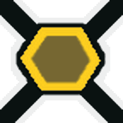 **[Honey Mark](ability-tokens.md#Mark)** Marks a random area on the [Field](fields.md) for 7 seconds (+0.2s per Level) that grants 2 Conversion Links and x1.25 [Convert Rate](system-page.md#Convert_Rate) when you stand in it. Stacks up to 3 times.

<table style="font-size:1.5vh; color:#000; width:100%; background:#fff; padding: 15px 0; border:none; color:#000; border-left:15px #000 solid">
<tbody><tr>
<td style="width:100%; text-align:center">

Honey Bee has a base pollen collection of <b>10 </b> in <b>4 seconds</b>. 

That's equivalent to 2.5  per second. 

(<b>20 </b> in <b>4 seconds</b> with x2 Bee Pollen gamepass)

</td></tr></tbody></table>

<table align="center" class="wikitable" style="text-align:center; width:80%;">
<tbody><tr>
<th colspan="5"> Pollen Collection
</th></tr>
<tr>
<td rowspan="2">Flower Tier
</td><td colspan="1" rowspan="2">Bee Pollen
</td><td colspan="2">with Critical Hit
</td></tr>
<tr>
<td>without Melody
</td><td>with Melody
</td></tr>
<tr>
<td>Single
</td><td>10
</td><td>20
</td><td>30
</td></tr>
<tr>
<td>Double
</td><td>20
</td><td>40
</td><td>60
</td></tr>
<tr>
<td>Triple
</td><td>30
</td><td>60
</td><td>90
</td></tr>
<tr>
<td>Large
</td><td>40
</td><td>80
</td><td>120
</td></tr>
<tr>
<td>Star
</td><td>50
</td><td>100
</td><td>150
</td></tr>
</tbody></table>

<table style="font-size:1.5vh; color:#000; width:100%; background:linear-gradient(to left, #FFB75E, #ED8F03); padding: 15px 0; border:none; color:#fff; border-left:15px #fff solid">
<tbody><tr>
<td style="width:100%; text-align:center">

Honey Bee can make <b>360 </b> in <b>2 seconds</b>!

That's equivalent to <b>180  per second</b>.

(<b>360  in 1 second</b> with x2 Honeymaking Speed)

</td></tr>
</tbody></table>

<table align="center" class="wikitable" style="text-align:center; width:75%">
<tbody><tr>
<th>Honey Collection with Science Enhancement
</th></tr>
<tr>
<td>
<h3>Levels 1-8</h3><table align="center" class="wikitable" style="text-align:center;">
<tbody><tr>
<th><i>Science Enhancement</i>
</th><th>Production Rate
</th><th>Number of Produced Honey
</th></tr>
<tr>
<td>1
</td><td>25%
</td><td>450
</td></tr>
<tr>
<td>2
</td><td>50%
</td><td>540
</td></tr>
<tr>
<td>3
</td><td>75%
</td><td>630
</td></tr>
<tr>
<td>4
</td><td>100%
</td><td>720
</td></tr>
<tr>
<td>5
</td><td>125%
</td><td>810
</td></tr>
<tr>
<td>6
</td><td>150%
</td><td>900
</td></tr>
<tr>
<td>7
</td><td>175%
</td><td>990
</td></tr>
<tr>
<td>8
</td><td>200%
</td><td>1080
</td></tr>
</tbody></table><h3>Levels 9-16</h3><table align="center" class="wikitable" style="text-align:center;">
<tbody><tr>
<th><i>Science Enhancement</i>
</th><th>Production Rate
</th><th>Number of Produced Honey
</th></tr>
<tr>
<td>9
</td><td>225%
</td><td>1170
</td></tr>
<tr>
<td>10
</td><td>250%
</td><td>1260
</td></tr>
<tr>
<td>11
</td><td>275%
</td><td>1350
</td></tr>
<tr>
<td>12
</td><td>300%
</td><td>1440
</td></tr>
<tr>
<td>13
</td><td>325%
</td><td>1530
</td></tr>
<tr>
<td>14
</td><td>350%
</td><td>1620
</td></tr>
<tr>
<td>15
</td><td>375%
</td><td>1710
</td></tr>
<tr>
<td>16
</td><td>400%
</td><td>1800
</td></tr>
</tbody></table><h3>Levels 17-24</h3><table align="center" class="wikitable" style="text-align:center;">
<tbody><tr>
<th><i>Science Enhancement</i>
</th><th>Production Rate
</th><th>Number of Produced Honey
</th></tr>
<tr>
<td>17
</td><td>425%
</td><td>1890
</td></tr>
<tr>
<td>18
</td><td>450%
</td><td>1980
</td></tr>
<tr>
<td>19
</td><td>475%
</td><td>2070
</td></tr>
<tr>
<td>20
</td><td>500%
</td><td>2160
</td></tr>
<tr>
<td>21
</td><td>525%
</td><td>2250
</td></tr>
<tr>
<td>22
</td><td>550%
</td><td>2340
</td></tr>
<tr>
<td>23
</td><td>575%
</td><td>2430
</td></tr>
<tr>
<td>24
</td><td>600%
</td><td>2520
</td></tr>
</tbody></table><h3>Levels 25-31</h3><table align="center" class="wikitable" style="text-align:center;">
<tbody><tr>
<th><i>Science Enhancement</i>
</th><th>Production Rate
</th><th>Number of Produced Honey
</th></tr>
<tr>
<td>25
</td><td>625%
</td><td>2610
</td></tr>
<tr>
<td>26
</td><td>650%
</td><td>2700
</td></tr>
<tr>
<td>27
</td><td>675%
</td><td>2790
</td></tr>
<tr>
<td>28
</td><td>700%
</td><td>2880
</td></tr>
<tr>
<td>29
</td><td>725%
</td><td>2970
</td></tr>
<tr>
<td>30
</td><td>750%
</td><td>3060
</td></tr>
<tr>
<td>31
</td><td>775%
</td><td>3150
</td></tr>
</tbody></table>

</td></tr>
</tbody></table>

<table align="center" class="wikitable" style="text-align:center; width:70%">
<tbody><tr>
<td colspan="3"> Egg and Jelly Probability 
</td></tr><tr>
<td>Item
</td><td>Base Probability
</td><td>Probability of getting a particular epic bee.
</td></tr><tr>
<td style="text-align:left; padding:5px 0 5px 25px;">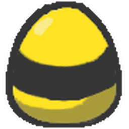<a href="egg.html#Basic_Egg">Basic Egg</a>
</td><td>2.5%
</td><td>0.22727%
</td></tr><tr>
<td style="text-align:left; padding:5px 0 5px 25px;">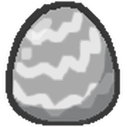<a href="egg.html#Silver_Egg">Silver Egg</a>
</td><td>30%
</td><td>2.72727%
</td></tr><tr>
<td style="text-align:left; padding:5px 0 5px 25px;">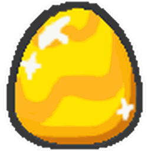<a href="egg.html#Gold_Egg">Gold Egg</a>
</td><td>79%
</td><td>7.18182%
</td></tr><tr>
<td style="text-align:left; padding:5px 0 5px 25px;"><a href="egg.html#Diamond_Egg">Diamond Egg</a>
</td><td>0%
</td><td>0%
</td></tr><tr>
<td style="text-align:left; padding:5px 0 5px 25px;"><a href="egg.html#Mythic_Egg">Mythic Egg</a>
</td><td>0%
</td><td>0%
</td></tr><tr>
<td style="text-align:left; padding:5px 0 5px 25px;"><a href="royal-jelly.html">Royal Jelly</a>
</td><td>27%
</td><td>2.45455%
</td></tr>
</tbody></table>

## Trivia

* There is a gate dedicated to the bee, the [Honey Bee Gate](honey-bee-gate.md) (or the 15 Bee Zone).
* The only way to obtain a [Honey Bee Egg](egg.md#Honey_Bee_Egg) is to defeat [cave monsters](cave-monster.md).
  * This may be the reason why Honey Bee dislikes the [Spider Field](spider-field.md), due to the similarities between [spiders](spider.md) and cave monsters.
* The [Honey Mask](honey-mask.md), which can be purchased in the [Ace Badge](badges.md) area of the [Badge Bearer's Guild](badge-bearer-s-guild.md), resembles Honey Bee's face decal and color scheme.
* Before the 2018-11-25 Update, the [Gifted](gifted-bee.md) Hive Bonus of Honey Bee was +250% [Conversion Rate](system-page.md#Convert_Rate). This was later updated to x1.5 Honey From Tokens.
* Honey Bee is one of the two bees that generate honey gifts, the other being [Diamond Bee](diamond-bee.md).
* Honey Bee was given the honey mark ability after the 2019-04-05 update.
* Both Honey Bee and [Bubble Bee](bubble-bee.md) emit the same bubble effect, although the colors of these 2 bees are different.
* Along with [Bumble Bee](bumble-bee.md) and [Carpenter Bee](carpenter-bee.md), Honey Bee are based on bees found in real life, though they don't show resemblance to the actual bee.
* During Beesmas 2020 and 2021, players were able to receive a Honey Bee Jelly if they gave a present to [Honey Bee (NPC)](honey-bee-npc.md).
  * During Beesmas 2021, [Honey Bee Jelly](royal-jelly.md#Specific_Bee_Jelly) was also available by purchasing the Honeysuckle Bundle from Bee Bear's Catalog.

<table class="mw-collapsible mw-collapsed NavTable">
<tbody><tr>
<th class="NavTitle" colspan="2">Bees
</th></tr>
<tr>
<th class="NavCategory">Common &amp; Rare
</th>
<td class="NavLinks NavLinksRare"><b> <a href="basic-bee.html">Basic Bee</a> •  <a href="bomber-bee.html">Bomber Bee</a>  • 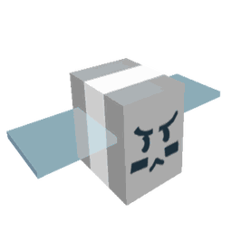 <a href="brave-bee.html">Brave Bee</a> •  <a href="bumble-bee.html">Bumble Bee</a> •  <a href="cool-bee.html">Cool Bee</a> •  <a href="hasty-bee.html">Hasty Bee</a> •  <a href="looker-bee.html">Looker Bee</a> •  <a href="rad-bee.html">Rad Bee</a> •  <a href="rascal-bee.html">Rascal Bee</a> •  <a href="stubborn-bee.html">Stubborn Bee</a></b>
</td></tr>
<tr>
<th class="NavCategory">Epic
</th>
<td class="NavLinks NavLinksEpic"><b> <a href="bubble-bee.html">Bubble Bee</a> •  <a href="bucko-bee.html">Bucko Bee</a> • 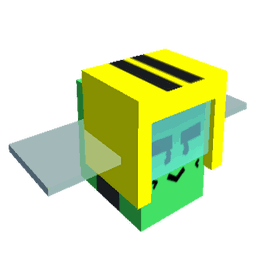 <a href="commander-bee.html">Commander Bee</a> •  <a href="demo-bee.html">Demo Bee</a> •  <a href="exhausted-bee.html">Exhausted Bee</a> •  <a href="fire-bee.html">Fire Bee</a> •  <a href="frosty-bee.html">Frosty Bee</a> •  <strong class="mw-selflink selflink">Honey Bee</strong> •  <a href="rage-bee.html">Rage Bee</a> •  <a href="riley-bee.html">Riley Bee</a> •  <a href="shocked-bee.html">Shocked Bee</a></b>
</td></tr>
<tr>
<th class="NavCategory">Legendary
</th>
<td class="NavLinks NavLinksLegend"><b>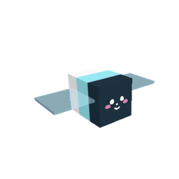 <a href="baby-bee.html">Baby Bee</a> • 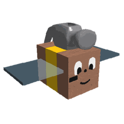 <a href="carpenter-bee.html">Carpenter Bee</a> •  <a href="demon-bee.html">Demon Bee</a> •  <a href="diamond-bee.html">Diamond Bee</a> • 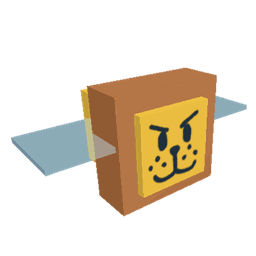 <a href="lion-bee.html">Lion Bee</a> •  <a href="music-bee.html">Music Bee</a> •  <a href="ninja-bee.html">Ninja Bee</a> • 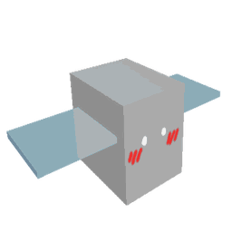 <a href="shy-bee.html">Shy Bee</a></b>
</td></tr>
<tr>
<th class="NavCategory">Mythic
</th>
<td class="NavLinks NavLinksMythic"><b>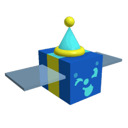 <a href="buoyant-bee.html">Buoyant Bee</a> • 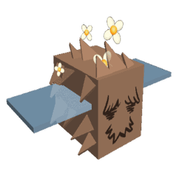 <a href="fuzzy-bee.html">Fuzzy Bee</a> • 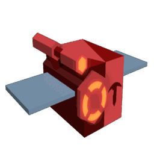 <a href="precise-bee.html">Precise Bee</a> • 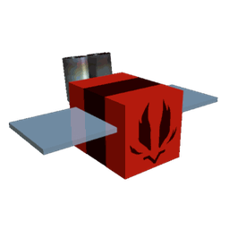 <a href="spicy-bee.html">Spicy Bee</a> •  <a href="tadpole-bee.html">Tadpole Bee</a> • 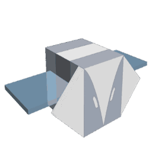 <a href="vector-bee.html">Vector Bee</a></b>
</td></tr>
<tr>
<th class="NavCategory">Event
</th>
<td class="NavLinks NavLinksEvent"><b>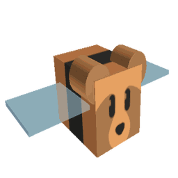 <a href="bear-bee.html">Bear Bee</a> •  <a href="cobalt-bee.html">Cobalt Bee</a> •  <a href="crimson-bee.html">Crimson Bee</a> •  <a href="digital-bee.html">Digital Bee</a> •  <a href="festive-bee.html">Festive Bee</a> • 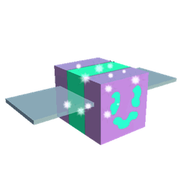 <a href="gummy-bee.html">Gummy Bee</a> •  <a href="photon-bee.html">Photon Bee</a> • 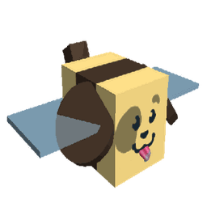 <a href="puppy-bee.html">Puppy Bee</a> • 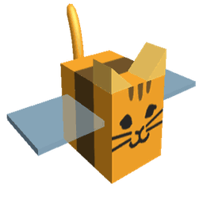 <a href="tabby-bee.html">Tabby Bee</a> •  <a href="vicious-bee.html">Vicious Bee</a> • 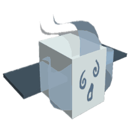 <a href="windy-bee.html">Windy Bee</a></b>
</td></tr></tbody></table>

## All bees

--8<-- "all-bees.md"
