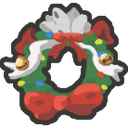
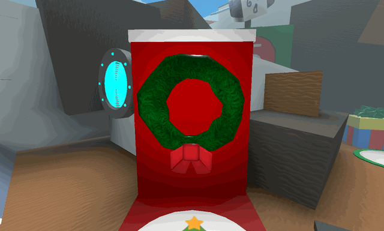

# Honey Wreath

{ align=right width=150 }

This piece of content goes bye bye.

The following content has been removed from the game. The contents below may be archival, but feel free to edit below.

The **Honey Wreath** is one of the Beesmas machines which can be unlocked after completing [Black Bear](black-bear.md)'s Honey Wreath [quest](quests.md).

When used, it converts all of the [pollen](pollen.md) in the player's bag into [honey](honey.md), multiplied by the player's [Honey Per Pollen](honey-per-pollen.md), scattering eight honey tokens around them to collect. The amount of honey obtained is also multiplied by [Honey From Tokens](system-page.md#Honey_From_Tokens). It has a cooldown of 30 minutes, and is located between [35 Bee Zone](windy-bee-gate.md) and the [Ticket Tent](ticket-tent.md).

The Honey Wreath can be upgraded by completing Honey Bee's Beesmas quest, "Honey Bee’s Honey Wreath?". This causes the wreath to grant 50% more honey and additionally [summon](bees.md#Summoned_Bees) a level 20 [Honey Bee](honey-bee.md) that lasts for 30 minutes.

If the player attempts to use the Honey Wreath before it is decorated, it will display text reading:
This Wreath looks frankly uninspired...

<figure class="mw-halign-center" style="text-align:center"><figcaption>The Honey Wreath.</figcaption></figure>

## Appearance

Before completing Black Bear's quest, it looks like an ordinary wreath. After completing the "Black Bear's Honey Wreath" quest, the wreath is decorated with honey icons and the Flight of the Bumble Egg. After the player completes Honey Bee's "Honey Bee's Honey Wreath?" quest, it changes to have a Gifted [Honey Bee](honey-bee.md) face in the center of the wreath.

## Trivia

* The wreath model comes from the [Christmas Wreath hat](https://www.roblox.com/catalog/42844877/Christmas-Wreath) on Roblox's catalog.
* The egg that is hung on the wreath is the Flight of the Bumble Egg. It is a limited item that could be worn on your avatar. It was only obtainable during the Egg Hunt 2019 event.
* Similar to [coconuts](coconut.md), the amount of honey received from the wreath is increased by [Honey From Tokens](system-page.md#Honey_From_Tokens).
* This is one of the 4 Beesmas machines that grants the player temporary bees (only if the "Honey Bee’s Honey Wreath?" quest is completed), the others being the [Honeyday Candles](honeyday-candles.md), the [Gummy Beacon](gummy-beacon.md) and [Onett's Lid Art](onett-s-lid-art.md).
* If the player uses the Honey Wreath with less than 801 [Pollen](pollen.md) in their bag, the tokens will each reward 100 [Honey](honey.md) (800 [Honey](honey.md) in total), which is modified by [Honey Per Pollen](honey-per-pollen.md) and [Honey From Tokens](system-page.md#Honey_From_Tokens).
* Using the Honey Wreath is required for a few of [Bee Bear's](bee-bear.md) quests during his visits, and it is also required for [Honey Bee's](honey-bee-npc.md) Beesmas Quest.
* The Honey Bee given by Honey Wreath can collect pollen for the player is also able to attack the mobs the player's bees are attacking. e.g. if the player's bees attack the [King Beetle](king-beetle.md), the bee summoned from the Honey Wreath will also attack the King Beetle.
  * If the player goes to their hive to convert their pollen, the Honey Bee given by the Honey Wreath does not convert any pollen and stays idle near the player. However, the bees are able to convert when a [Honey Mark](ability-tokens.md#Mark) is active.
