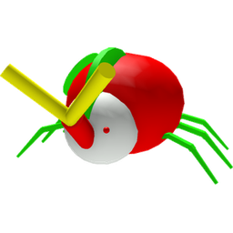

# King Beetle

<aside class="portable-infobox pi-background pi-border-color pi-theme-wikia pi-layout-stacked" role="region">
<h2 class="pi-item pi-item-spacing pi-title pi-secondary-background" data-source="title">King Beetle</h2>
<figure class="pi-item pi-image">

</figure>

<h3 class="pi-data-label pi-secondary-font">Location</h3>

<a href="king-beetle-s-lair.html">King Beetle's Lair</a>

<h3 class="pi-data-label pi-secondary-font">Respawns Every</h3>

24 hours (20 hours 24 minutes with a Gifted Vicious Bee)

</aside>

The **King Beetle** is a level 7 boss mob that resides in his [lair](king-beetle-s-lair.md). The entrance to his lair is on the wall between the [Blue Flower Field](blue-flower-field.md) and the [Clover Field](clover-field.md), above the blue flower closest to the [Blue HQ](blue-hq.md) via a transparent wall. He has 2,500 health and deals 40 damage to the player per hit if the player has no [Defense](system-page.md#Defense).

He takes 1 day (24 hours) to respawn after being defeated (20 hours and 24 minutes with a [Gifted](gifted-bee.md) [Vicious Bee](vicious-bee.md)). The rewards for defeating him vary, but always include 150 [Battle Points](battle-points.md), as well as [Honey](honey.md), [Royal Jellies](royal-jelly.md), [Tickets](ticket.md) and [Bond](bond.md).

There is a one-in-seven (approximately 14%) chance that he will drop a [King Beetle Amulet](king-beetle-amulet.md) when defeated. Having more [Loot Luck](loot-luck.md) increases the probabilities of other drops but doesn't improve the probability of a King Beetle Amulet dropping. After the 2019-02-01 Update, King Beetle drops honey tokens and rewards in a token circle around the center of the lair unlike all other mobs who drop the circle around the place of their death (except for [Stump Snail](stump-snail.md), [Tunnel Bear](tunnel-bear.md), and [Rogue Vicious Bee](rogue-vicious-bee.md)) unless the player receives a King Beetle Amulet, in which it goes directly into the player's inventory.

## Drops

### First Defeat

<table class="article-table">
<tbody><tr>
<td>150 <a href="battle-points.html">Battle Points</a> 

500 <a href="bond.html">Bond</a> 
1,000,000 <a href="honey.html">Honey</a> (multiplied by <a href="system-page.html#Honey_From_Tokens">Honey From Tokens</a> if no <a href="amulet.html">Amulet</a> is rewarded) 
100 <a href="treat.html">Treats</a> 
1-5 <a href="royal-jelly.html">Royal Jellies</a> 
5 <a href="ticket.html">Tickets</a>

</td></tr></tbody></table>

### Guaranteed (Subsequent)

<table class="article-table">
<tbody><tr>
<td>150 <a href="battle-points.html">Battle Points</a> 

500 <a href="bond.html">Bond</a> 
1,000,000 <a href="honey.html">Honey</a> (multiplied by Honey From Tokens/2, if no Amulet) 
5 <a href="gumdrops.html">Gumdrops</a> 
3 <a href="royal-jelly.html">Royal Jellies</a> 
5 <a href="ticket.html">Tickets</a> 
<a href="moon-charm.html">Moon Charms</a> (Increments of 5, 10, 15, 20, 25, 50, or 100)

</td></tr></tbody></table>

### Possible drops

<table class="article-table">
<tbody><tr>
<td><a href="king-beetle-amulet.html">King Beetle Amulet</a> (1/7 chance) 

5-25 <a href="ticket.html">Tickets</a> 
1-25 <a href="royal-jelly.html">Royal Jelly</a> 
<a href="ant-pass.html">Ant Pass</a> 
<a href="robo-pass.html">Robo Pass</a> 
5-250 <a href="gumdrops.html">Gumdrops</a> 
5-250 <a href="treat.html">Treats</a> 
<a href="sunflower-seed.html">Sunflower Seeds</a> (Increments of 25 or 100) 
<a href="strawberry.html">Strawberries</a> (Increments of 25 or 100) 
<a href="blueberry.html">Blueberries</a> (Increments of 25 or 100) 
<a href="pineapple.html">Pineapples</a> (Increments of 25 or 100) 
<a href="neonberry.html">Neonberries</a> (Increments of 1, 5, or 10) 
<a href="red-extract.html">Red Extracts</a> (Increments of 1, 3, 5 or 10) 
<a href="blue-extract.html">Blue Extracts</a> (Increments of 1, 3, 5 or 10) 
<a href="glue.html">Glues</a> (Common) 
1-10 <a href="magic-bean.html">Magic Bean</a> (Common) 
<a href="oil.html">Oils</a> (Common) 
<a href="glitter.html">Glitter</a> (Common) 
<a href="enzymes.html">Enzymes</a> (Common, increments of 1 or 5) 
<a href="smooth-dice.html">Smooth Dice</a> (Rare) 
<a href="royal-jelly.html#Star_Jelly">Star Jelly</a> (Rare) 
<a href="purple-potion.html">Purple Potions</a> (Rare, Increments of 1 or 3) 
<a href="night-bell.html">Night Bell</a> (Extremely Rare) 
<a href="egg.html#Silver_Egg">Silver Egg</a> (Rare) 
<a href="egg.html#Gold_Egg">Gold Egg</a> (Very Rare) 
<a href="sticker.html#Sticker_Index">Basic Blue Hive Skin</a> (Very Rare) 
<a href="sticker.html#Sticker_Index">Basic Red Hive Skin</a> (Very Rare) 
<a href="egg.html#Diamond_Egg">Diamond Egg</a> (Extremely Rare) 
<a href="egg.html#Star_Egg">Star Egg</a> (Unfathomably Rare) 
<a href="peppermint-antennas.html">Peppermint Antennas</a> (Beesmas only) 
<a href="gingerbread-bear.html">Gingerbread Bear</a> (Beesmas only)

</td></tr></tbody></table>

## Strategies

Defeating a King Beetle is challenging and he might kill players several times before they succeed (It's recommended that players don't fight King Beetle with a full bag). Here are some recommended strategies for defeating him:

* Use King Beetle's predictable pattern of behavior to stop and run. He moves toward the player, stops to "aim," and then lunges. If the player stays still long enough for him to aim (about 3 seconds), but then quickly moves away, King Beetle will lunge at where the player used to be, not where the player has moved to. Thus, this method entails running along the edge of the lair, stopping, looking at King Beetle and waiting for him to lock onto the player, and then quickly jumping and running to a different point along the edge of the lair. Rinse and repeat until he is defeated.
* Circling King Beetle allows the player to defeat King Beetle faster. If the player keeps circling around their King Beetle while keeping a good distance from him, their bees can get very close to King Beetle. Though the player might get hit the first few times, the beetle will most likely be defeated.
* Run around the lair and occasionally look at his health. It's very helpful if players have Rage Bees, so they can run around and grab the tokens. However, if the player is too far away from him, their bees will come back to them rather than attacking the beetle. Building up maximum [Haste](ability-tokens.md#Haste) can help, although it may run out before King Beetle gets defeated. Using the [Parachute](parachute.md) or [Glider](glider.md) can also help since gliding through the air can be faster than running.
* If the player is certain that their bees will kill him before they die, they can just wait for their bees to defeat him while the player stands in front of King Beetle, doing nothing during the process.
* If a Rogue Vicious Bee is active in the Clover Field, players can trick it into damaging King Beetle.
* Due to a bug, if the player gets the King Beetle stuck on the clue 'Song Name' by standing in the top right corner, King Beetle cannot attack them. This may take several attempts to work.
* If the player gets too far from King Beetle, their bees will follow them instead of attacking it. But if the player gets too close, it's very easy to accidentally touch its aura which will damage the player.
* If more than one player is trying to fight King Beetle at the same time, his pattern of behavior can become less predictable. It can also be difficult to tell which King Beetle is targeting them. For best results, wait for the other player's King Beetle to be defeated before entering its lair.
* If the player's bees' levels are lower than 7, their attempts to attack will most likely miss. This will make defeating it take much longer than if they were level 7 or above.
* When dodging King Beetle, keep in mind he does not follow directly behind the player but can sidestep to get in their way.
* If you die, the King Beetle's health will reset, unlike [Commando Chick](commando-chick.md) and [Stump Snail](stump-snail.md).

## Tips

Some things can help the player defeat King Beetle, regardless of which strategy the player chooses.

* Having more bees and having bees with high attack power such as [Lion Bee](lion-bee.md), [Vicious Bee](vicious-bee.md), [Crimson Bee](crimson-bee.md), [Cobalt Bee](cobalt-bee.md), [Riley Bee](riley-bee.md), [Bucko Bee](bucko-bee.md), [Rage Bee](rage-bee.md), [Brave Bee](brave-bee.md), and [Precise Bee](precise-bee.md).
* Having high-level bees so attacks don't miss (Recommended level 5–7 with at least one Rage Bee and 20 [bees](bees.md)).
* Wearing an Accessory that can boost [Bee Attack](system-page.md#Bee_Attack), [Move speed](system-page.md#Movespeed), [Jump Power](system-page.md#Jump_Power), or Defense, such as guards.
* Collecting [Rage](ability-tokens.md#Rage), [Focus](ability-tokens.md#Focus) and [Melody](ability-tokens.md#Melody) tokens can be helpful, especially if the player has fewer bees. Collecting [haste](ability-tokens.md#Haste) and [bear morph](ability-tokens.md#Bear_Morph) tokens can also help dodge King Beetle's attack.
* While it is possible to defeat King Beetle using the arrow keys to move, WASD is the suggested method, because it allows the player to keep looking at King Beetle while they are moving.
* The Parachute or Glider can be used to quickly get out of King Beetle's attack path.
* Having at least 20-25 bees with all of them at least level 7 is usually enough to defeat King Beetle using the above strategies.
* Using a [Stinger](stinger.md) can be useful with low level bees.

## Trivia

* King Beetle used to guarantee an amulet upon death.
* In the back right corner of the lair, there is something written on the floor. This is a hint for a [code](codes.md).
  * The clue is "Song Name", which refers to the music that plays in the lair. If the player checks [Onett's inventory](https://www.roblox.com/library/1598349092/crawlers), the user will see that it's called Crawlers.
* King Beetle was the first boss to be added to the game.
* King Beetle has the fifth-largest amount of health in the game for any mob, with [Tunnel Bear](tunnel-bear.md) being the fourth, [Coconut Crab](coconut-crab.md) the third, [Mondo Chick](chicks.md#Mondo_Chick) the second, and [Stump Snail](stump-snail.md) the first. On certain occasions, Rogue Vicious Bee, [Wild Windy Bee](wild-windy-bee.md), [Aphids](aphid.md), and [Stick Bug](stick-bug.md) will have more health depending on their level. In this case, King Beetle can be considered the weakest boss in terms of health.
* King Beetle and Stump Snail are the only mobs that can drop an amulet, the [King Beetle Amulet](king-beetle-amulet.md) and the [Shell Amulet](shell-amulet.md) respectively.
* There was a myth that clicking on King Beetle has an effect. However, this was disproven as Onett has confirmed that King Beetle does not even have a [click detector](http://robloxdev.com/api-reference/class/ClickDetector).
* Before the 2018-07-11 Update, King Beetle took two days to respawn after being defeated, granted more battle points and despawned after about 5 minutes.
* King Beetle is a hybrid of a [Rhino Beetle](rhino-beetle.md) and a [Ladybug](ladybug.md), as stated by Onett on Discord.[1]
* Onett stated that the King Beetle emits toxins that makes the player hallucinate, which is why both he and his lair are strangely colored.[2]
* An active King Beetle's health bar can be seen through the Clover Field and the Blue Flower Field.
* King Beetle is the only boss that doesn't have a time limit to kill it.
  * King beetle is also the only boss to drop its loot in a circle.

## References

1. ↑ <https://discord.com/channels/427553293862961153/427553293862961155/510686006392127508> Discord message from Onett.
2. ↑ <https://discord.com/channels/427553293862961153/427553293862961155/510686138504314880> Discord message from Onett.

<table class="mw-collapsible NavTable">
<tbody><tr>
<th class="NavTitle" colspan="3">Mobs
</th></tr>
<tr>
<th class="NavCategory" rowspan="2">Normal
</th>
<td class="NavLinks NavLinksBasicOdd" colspan="2"><b><a href="ladybug.html">Ladybug</a> • <a href="rhino-beetle.html">Rhino Beetle</a> • <a href="aphid.html">Aphid</a> • <a href="spider.html">Spider</a> • <a href="mantis.html">Mantis</a> • <a href="scorpion.html">Scorpion</a> • <a href="werewolf.html">Werewolf</a> • <a href="cave-monster.html">Cave Monster</a></b>
</td></tr>
<tr>
<th class="NavCategory"><a href="aphid.html">Aphids</a>
</th>
<td class="NavLinks NavLinksBasicEven"><b><a href="aphid.html#Normal_Aphid">Aphid</a> • <a href="aphid.html#Rage_Aphid">Rage Aphid</a> • <a href="aphid.html#Armored_Aphid">Armored Aphid</a> • <a href="aphid.html#Diamond_Aphid">Diamond Aphid</a></b>
</td></tr>
<tr>
<th class="NavCategory">Mini-Bosses
</th>
<td class="NavLinks NavLinksBasicOdd" colspan="2"><b><a href="rogue-vicious-bee.html">Rogue Vicious Bee</a> • <a href="wild-windy-bee.html">Wild Windy Bee</a> • <a href="stump-snail.html">Stump Snail</a> • <a href="chicks.html#Commando_Chick">Commando Chick</a> • <a href="snowbear.html">Snowbear</a></b>
</td></tr>
<tr>
<th class="NavCategory">Bosses
</th>
<td class="NavLinks NavLinksBasicEven" colspan="2"><b><strong class="mw-selflink selflink">King Beetle</strong> • <a href="tunnel-bear.html">Tunnel Bear</a> • <a href="coconut-crab.html">Coconut Crab</a> • <a href="chicks.html#Mondo_Chick">Mondo Chick</a></b>
</td></tr>
<tr>
<th class="NavCategory" rowspan="5">Challenges
</th>
<th class="NavCategory"><a href="ants.html">Ants</a>
</th>
<td class="NavLinks NavLinksBasicOdd"><b><a href="ant.html">Ant</a> • <a href="army-ant.html">Army Ant</a> • <a href="flying-ant.html">Flying Ant</a> • <a href="giant-ant.html">Giant Ant</a> • <a href="fire-ant.html">Fire Ant</a></b>
</td></tr>
<tr>
<th class="NavCategory"><a href="stick-bug-challenge.html">Stick Bug</a>
</th>
<td class="NavLinks NavLinksBasicEven"><b><a href="stick-bug.html">Stick Bug</a> • <a href="stick-nymph.html">Stick Nymph</a> • <a href="festive-nymph.html">Festive Nymph</a></b>
</td></tr>
<tr>
<th class="NavCategory"><a href="robo-bear-challenge.html">Robo Bear Challenge</a>
</th>
<td class="NavLinks NavLinksBasicEven"><b><a href="mechsquito.html">Mechsquito</a> • <a href="cogmower.html">Cogmower</a> • <a href="cogturret.html">Cogturret</a> • <a href="mega-mechsquito.html">Mega Mechsquito</a> • <a href="golden-cogmower.html">Golden Cogmower</a></b>
</td></tr>
<tr>
<th class="NavCategory"><a href="robo-party-cake.html#Robo_Party">Robo Party</a>
</th>
<td class="NavLinks NavLinksBasicOdd"><b><a href="party-mechsquito.html">Party Mechsquito</a> • <a href="party-cogmower.html">Party Cogmower</a> • <a href="party-cogturret.html">Party Cogturret</a> • <a href="party-mega-mechsquito.html">Party Mega Mechsquito</a></b>
</td></tr>
<tr>
<th class="NavCategory">Passive
</th>
<td class="NavLinks NavLinksBasicEven" colspan="2"><b><a href="fireflies.html">Firefly</a> • <a href="bean-bug.html">Bean Bug</a> • <a href="frog.html">Frog</a>  • <a href="puffshroom.html">Puffshroom</a> • <a href="bloom.html">Bloom</a></b>
</td></tr>
<tr>
<th class="NavCategory">Removed
</th>
<td class="NavLinks NavLinksBasicOdd" colspan="2"><b><a href="chicks.html#Chick">Chick</a> • <a href="chicks.html#Hostage_Chick">Hostage Chick</a> • <a href="chicks.html#Spotted_Chick">Spotted Chick</a></b>
</td></tr></tbody></table>
