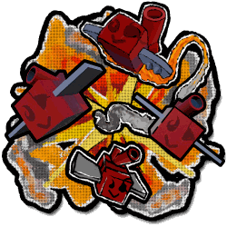

# Mortar Bee

Mortar Bee

<input type="radio" name="bee-infobox-tab" id="bee-tab-original" checked>
<label for="bee-tab-original">Original</label>
<input type="radio" name="bee-infobox-tab" id="bee-tab-gifted">
<label for="bee-tab-gifted">Gifted</label>

<i>"A lazy artillery bee who would rather shell the field than work."</i>

<b>Rarity</b>Mythic

<b>Color</b>Red

<b>Energy</b>50

<b>Speed</b>8

<b>Attack</b>20

Color Scheme

<b>Skin</b><code>#960300</code><code>#720800</code><code>#960300</code>

**Mortar Bee** is a Red [Mythic bee](bees-mythic.md). It never gathers pollen or makes honey. Instead it fires mortar shells at the field and at enemies.

Mortar Bee's favorite treat is [Strawberries](strawberry.md).

The game uses the same picture for normal and Gifted Mortar Bee.

## Stats

* Does not collect [pollen](pollen.md) or make [honey](honey.md).
* 🌟 [Gifted Hive Bonus](gifted-bee.md): x1.75 Bomb Pollen.

### Abilities

Mortar Bee has no active abilities, only passives.

* **Passive: Mortar Shell.** This bee never gathers pollen or makes honey. Instead, it hovers high above the field and fires a mortar shell every 9 seconds, usually aimed at one of your other bees in the field, collecting 30 pollen (+10% per level) from 29 flowers. Shells are boosted by Bomb Combo. Each flower hit has a 2% chance (+0.1% per level, +2% if Gifted) to spawn a Flame, and each shell has a 1% chance (+0.05% per level, +0.5% if Gifted) to degrow the flowers where it lands. Each bee caught in the blast instantly converts 5% of your pollen.
* **Passive: Scorching Shells.** In battle, this bee fires mortar shells at enemies that explode on impact, dealing 50% damage to other enemies within 15 studs. Each hit has a 10% chance (15% if Gifted) to set the enemy on fire, dealing 50% of this bee's attack every second for 5 seconds. Enemies cannot be set on fire again until 10 seconds after the burn ends.
* **Passive: Steam Engine.** This bee's movespeed increases by up to 50% and its fire rate increases by up to 25% with Flame Heat.
* **Passive: Sluggish.** Movespeed buffs are 50% less effective on this bee.
* **Passive: Inspiring Shell** (Gifted only). When Gifted, this bee has the same chance as other bees to generate Inspire. When it does, it immediately fires an extra bomb-sized shell regardless of cooldown, collecting 15 pollen (+5% per level) from 13 flowers. This shell grants Inspire and pollinates flowers like a Fuzz Bomb, but never spawns Flames.

## Gallery

<figure><figcaption>Happy Mortar Bee sticker</figcaption></figure>
<figure><figcaption>Old Mortar Bee shop pack image</figcaption></figure>
<figure><figcaption>Flying Mortar Bee sticker</figcaption></figure>

## All bees

--8<-- "all-bees.md"
