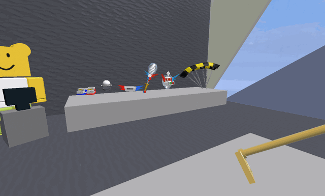

# Mountain Top Shop

{ .wiki-photo }

<figure class="mw-halign-right" typeof="mw:Error mw:File"><figcaption>the Mountain Top Shop at an angle.</figcaption></figure>

The **Mountain Top Shop**, also called the **Top Shop**, is a [shop](shops.md) located past the [Lion Bee Gate](lion-bee-gate.md). Before the [Mountain Top Field's](mountain-top-field.md) name was known, this shop used to be called the **25 Bee Shop**. The shop sells various high-end [items](items.md) and is run by [Top Bear](top-bear.md).

There is a [Royal Jelly](royal-jelly.md) token on the roof and a [Ticket](ticket.md) token in a corner inside the shop. In addition, the respawn timer for the [Mondo Chick](mondo-chick.md) can be found on the side facing the Mountain Top Field.

### Tools

<table class="article-table">
<tbody><tr>
<th>Item
</th>
<th style="width: 27%;">Cost
</th>
<th>Description
</th></tr>
<tr>
<td><figure class="mw-halign-center" typeof="mw:Error mw:File"><figcaption></figcaption></figure>
<a href="golden-rake.html">Golden Rake</a> 

</td>
<td>20,000,000 <a href="honey.html">Honey</a>
</td>
<td>Collects 7 <a href="pollen.html">Pollen</a> from 4 lines of 4 patches in 0.75 seconds.

Every 5th scoop is supercharged to reach farther and collect more!

</td></tr>
<tr>
<td><figure class="mw-halign-center" typeof="mw:Error mw:File"><figcaption></figcaption></figure>
<a href="spark-staff.html">Spark Staff</a>

</td>
<td>60,000,000 <a href="honey.html">Honey</a>
</td>
<td>Collects ALL pollen from the 3 tallest nearby flowers in 0.6 seconds.
</td></tr>
<tr>
<td><figure class="mw-halign-center" typeof="mw:Error mw:File"><figcaption></figcaption></figure>
<a href="porcelain-dipper.html">Porcelain Dipper</a>

</td>
<td>150,000,000 <a href="honey.html">Honey</a>
</td>
<td>Collects 3 Pollen from 49 surrounding patches in 0.7 seconds, increasing white pollen by 50%.

Every 10th scoop summons a pillar of light that collects massive pollen!

</td></tr></tbody></table>

### Bags

<table class="article-table">
<tbody><tr>
<th>Item
</th>
<th style="width: 27%;">Cost
</th>
<th>Description
</th></tr>
<tr>
<td><figure class="mw-halign-center" typeof="mw:File"><figcaption></figcaption></figure>
<a href="porcelain-port-o-hive.html">Porcelain Port-O-Hive</a>

</td>
<td>250,000,000 <a href="honey.html">Honey</a> 

3 <a href="glitter.html">Glitter</a> 
3 <a href="soft-wax.html">Soft Waxes</a> 
10 <a href="moon-charm.html">Moon Charms</a>

</td>
<td>A rare and precious Port-O-Hive that boosts <a href="system-page.html#White_Pollen">white pollen</a>.
<ul><li>+6,000,000 Capacity.</li>
<li>+250% <a href="system-page.html#Convert_Rate">Convert Rate</a>.</li>
<li>+10% <a href="system-page.html#Instant_Conversion">Instant Conversion</a>.</li>
<li>+50% White Pollen.</li>
<li>x1.25 Convert Rate at Hive.</li></ul>
</td></tr></tbody></table>

### Accessories

<table class="article-table">
<tbody><tr>
<th>Item
</th>
<th style="width: 27%;">Cost
</th>
<th>Description
</th></tr>
<tr>
<td><figure class="mw-halign-center" typeof="mw:File"><figcaption></figcaption></figure>
<a href="beekeeper-s-mask.html">Beekeeper's Mask</a>

</td>
<td>20,000,000 <a href="honey.html">Honey</a> 

5 <a href="enzymes.html">Enzymes</a> 
3 <a href="glue.html">Glues</a> 
1 <a href="glitter.html">Glitter</a>

</td>
<td>A veiled hat only worn by real-deal beekeepers.
<ul><li>+20% <a href="system-page.html#Pollen">Pollen</a>.</li>
<li>+20% Bee Gather Pollen.</li>
<li>+10% <a href="system-page.html#Bee_Ability_Rate">Bee Ability Rate</a>.</li>
<li>+25% <a href="system-page.html#Defense">Defense</a>.</li></ul>
</td></tr>
<tr>
<td><figure class="mw-halign-center" typeof="mw:File"><figcaption></figcaption></figure>
<a href="mondo-belt-bag.html">Mondo Belt Bag</a>

</td>
<td>12,400,000 <a href="honey.html">Honey</a> 

150 <a href="pineapple.html">Pineapples</a> 
150 <a href="sunflower-seed.html">Sunflower Seeds</a> 
10 <a href="stinger.html">Stingers</a> 
1 <a href="soft-wax.html">Soft Wax</a>

</td>
<td>A highly-embelished [sic] Belt Bag imported from a far away land.
<ul><li>+100,000 Capacity.</li>
<li>+50 <a href="system-page.html#Convert_Amount">Convert Amount</a>.</li>
<li>+75% <a href="system-page.html#Loot_Luck">Loot Luck</a>.</li>
<li>+10% <a href="system-page.html#Buzz_Bomb_Pollen">Buzz Bomb Pollen</a>.</li>
<li>+1 <a href="system-page.html#Colorless_Attack">Colorless Bee Attack</a>.</li></ul>
</td></tr>
<tr>
<td><figure class="mw-halign-center" typeof="mw:File"><figcaption></figcaption></figure>
<a href="beekeeper-s-boots.html">Beekeeper's Boots</a>

</td>
<td>15,000,000 <a href="honey.html">Honey</a> 

5 <a href="oil.html">Oils</a> 
3 <a href="blue-extract.html">Blue Extracts</a> 
3 <a href="red-extract.html">Red Extracts</a>

</td>
<td>Practical and stylish boots that aid in the beekeeping process.
<ul><li>+25% <a href="system-page.html#Bee_Gather_Pollen">Bee Gather Pollen</a>.</li>
<li>+6 <a href="system-page.html#Movespeed">Player Movespeed</a>.</li>
<li>+20 <a href="system-page.html#Jump_Power">Jump Power</a>.</li>
<li>+10 <a href="movement-collection.html">Movement Collection</a>.</li>
<li>+1 <a href="system-page.html#Bee_Attack">Bee Attack</a>.</li></ul>
</td></tr></tbody></table>

### Other

<table class="article-table">
<tbody><tr>
<th>Item
</th>
<th style="width: 27%;">Cost
</th>
<th>Description
</th></tr>
<tr>
<td><figure class="mw-halign-center" typeof="mw:Error mw:File"><figcaption></figcaption></figure>
<a href="glider.html">Glider</a>

</td>
<td>5,000,000 <a href="honey.html">Honey</a>
</td>
<td>Floats much faster than the <a href="parachute.html">Parachute</a>, allowing you to fly through the sky! Press jump while in the air to open.
</td></tr>
<tr>
<td><figure class="mw-halign-center" typeof="mw:Error mw:File"><figcaption></figcaption></figure>
<a href="hive-slot.html">Hive Slot</a>

</td>
<td>Varies on how many hive slots the player has bought
</td>
<td>Increases the capacity of your hive, allowing you to hatch an additional bee!
</td></tr></tbody></table>

## Music

When in the shop, the following audio plays:

## Trivia

* [Mondo Belt Bag](mondo-belt-bag.md) and [Beekeeper's Boots](beekeeper-s-boots.md) could've also been obtained by completing [Sun Bear's](sun-bear.md) quests before he left during his first visit.
* This shop is the only place in the game where the player can purchase additional [hive slots](hive-slot.md).
* Top Bear was introduced in 2018-07-11 update, which means this shop was once not run by any bear before said update.
* This shop used to have the eviction for sale until the 2019-09-28 update, when it was removed.
* When the game was first released, the only item in this shop was the Glider until the 2018-04-10 update added the [Beekeeper's Mask](beekeeper-s-mask.md) and Hive Slots.

<table class="mw-collapsible mw-collapsed NavTable">
<tbody><tr>
<th class="NavTitle" colspan="2">Locations
</th></tr>
<tr>
<th class="NavCategory"><a href="fields.html">Fields</a>
</th>
<td class="NavLinks NavLinksBasicOdd"><b><a href="sunflower-field.html">Sunflower Field</a> • <a href="dandelion-field.html">Dandelion Field</a> • <a href="mushroom-field.html">Mushroom Field</a> • <a href="blue-flower-field.html">Blue Flower Field</a> • <a href="clover-field.html">Clover Field</a> • <a href="spider-field.html">Spider Field</a> • <a href="bamboo-field.html">Bamboo Field</a> • <a href="strawberry-field.html">Strawberry Field</a> • <a href="pineapple-patch.html">Pineapple Patch</a> • <a href="stump-field.html">Stump Field</a> • <a href="mixed-brick-field.html">Mixed Brick Field</a> • <a href="blue-brick-field.html">Blue Brick Field</a> • <a href="red-brick-field.html">Red Brick Field</a> • <a href="white-brick-field.html">White Brick Field</a> • <a href="cactus-field.html">Cactus Field</a> • <a href="pumpkin-patch.html">Pumpkin Patch</a> • <a href="pine-tree-forest.html">Pine Tree Forest</a> • <a href="rose-field.html">Rose Field</a> • <a href="ant-field.html">Ant Field</a> • <a href="hub-field.html">Hub Field</a> • <a href="mountain-top-field.html">Mountain Top Field</a> • <a href="coconut-field.html">Coconut Field</a> • <a href="pepper-patch.html">Pepper Patch</a></b>
</td></tr>
<tr>
<th class="NavCategory"><a href="shops.html">Shops</a>
</th>
<td class="NavLinks NavLinksBasicEven"><b><a href="basic-egg-shop.html">Basic Egg Shop</a> • <a href="boost-market.html">Boost Market</a> • <a href="treat-shop.html">Treat Shop</a> • <a href="gumdrop-shop.html">Gumdrop Shop</a> • <a href="royal-jelly-shop.html">Royal Jelly Shop</a> • <a href="ticket-shop.html">Ticket Shop</a> • <a href="noob-shop.html">Noob Shop</a> • <a href="pro-shop.html">Pro Shop</a> • <a href="magic-bean-shop.html">Magic Bean Shop</a> • <a href="badge-bearer-s-guild.html">Badge Bearer's Guild</a> • <a href="dapper-bear-s-shop.html">Dapper Bear's Shop</a> • <a href="stinger-shop.html">Stinger Shop</a> • <strong class="mw-selflink selflink">Mountain Top Shop</strong> • <a href="blue-hq.html">Blue HQ</a> • <a href="red-hq.html">Red HQ</a> • <a href="hub-field-shop.html">Hub Field Shop</a> • <a href="robo-bear-s-shop.html">Robo Bear's Shop</a> • <a href="petal-shop.html">Petal Shop</a> • <a href="coconut-cave.html">Coconut Cave</a> • <a href="ticket-tent.html">Ticket Tent</a> • <a href="robux-shop.html">Robux Shop</a></b>
</td></tr>
<tr>
<th class="NavCategory">Gates
</th>
<td class="NavLinks NavLinksBasicOdd"><b><a href="basic-bee-gate.html">Basic Bee Gate</a> • <a href="brave-bee-gate.html">Brave Bee Gate</a> • <a href="honey-bee-gate.html">Honey Bee Gate</a> • <a href="ant-gate.html">Ant Gate</a> • <a href="lion-bee-gate.html">Lion Bee Gate</a> • <a href="bear-gate.html">Bear Gate</a> • <a href="windy-bee-gate.html">Windy Bee Gate</a></b>
</td></tr>
<tr>
<th class="NavCategory">Machines
</th>
<td class="NavLinks NavLinksBasicEven"><b><a href="honey-dispenser.html">Honey Dispenser</a> • <a href="royal-jelly-dispenser.html">Royal Jelly Dispenser</a> • <a href="treat-dispenser.html">Treat Dispenser</a> • <a href="instant-converter.html">Instant Converter</a> • <a href="wealth-clock.html">Wealth Clock</a> • <a href="moon-amulet-generator.html">Moon Amulet Generator</a> • <a href="memory-match.html">Memory Match</a> • <a href="blue-field-booster.html">Blue Field Booster</a> • <a href="red-field-booster.html">Red Field Booster</a> • <a href="field-booster.html">Field Booster</a> • <a href="blueberry-dispenser.html">Blueberry Dispenser</a> • <a href="strawberry-dispenser.html">Strawberry Dispenser</a> • <a href="honeystorm.html">Honeystorm</a> • <a href="special-sprout-summoner.html">Special Sprout Summoner</a> • <a href="free-ant-pass-dispenser.html">Free Ant Pass Dispenser</a> • <a href="ant-pass-dispenser.html">Ant Pass Dispenser</a> • <a href="glue-dispenser.html">Glue Dispenser</a> • <a href="blender.html">Blender</a> • <a href="coconut-dispenser.html">Coconut Dispenser</a> • <a href="mythic-meteor-shower.html">Mythic Meteor Shower</a> • <a href="free-robo-pass-dispenser.html">Free Robo Pass Dispenser</a> • <a href="robo-pass-dispenser.html">Robo Pass Dispenser</a> • <a href="sticker-stack.html">Sticker Stack</a> • <a href="sticker-printer.html">Sticker Printer</a> • <a href="nectar-condenser.html">Nectar Condenser</a></b>
</td></tr>
<tr>
<th class="NavCategory">Transportation
</th>
<td class="NavLinks NavLinksBasicOdd"><b><a href="slingshot.html">Slingshot</a> • <a href="yellow-cannon.html">Yellow Cannon</a> • <a href="blue-cannon.html">Blue Cannon</a> • <a href="red-cannon.html">Red Cannon</a> • <a href="blue-teleporter.html">Blue Teleporter</a> • <a href="red-teleporter.html">Red Teleporter</a></b>
</td></tr>
<tr>
<th class="NavCategory"><a href="leaderboards.html">Leaderboards</a>
</th>
<td class="NavLinks NavLinksBasicEven"><b><a href="daily-top-honeymakers.html">Daily Top Honeymakers</a> • <a href="all-time-top-honeymakers.html">All-Time Top Honeymakers</a> • <a href="all-time-top-battlers-most-battle-points.html">All-Time Top Battlers</a> • Top Ant Exterminators • Fastest Crab Slayers • Top Stick Bug Fighters • Top Bucko Bee Helpers • Top Riley Bee Helpers • <a href="most-commando-captures.html">Most Commando Captures</a> • Top Brown Bear Helpers • All-Time Top Red Collectors • All-Time Top Blue Collectors • All-Time Top White Collectors • Daily Top Red Collectors • Daily Top Blue Collectors • Daily Top White Collectors • Highest Damage to a Single Puffshroom • Tallest Sticker Stack • Highest Robo Bear Challenge Scores • <a href="highest-snowbear-level.html">Highest Snowbear Level</a> • <a href="highest-robo-party-cake-rank.html">Highest Robo Party Cake Rank</a></b>
</td></tr>
<tr>
<th class="NavCategory">Other Places
</th>
<td class="NavLinks NavLinksBasicOdd"><b><a href="hive.html">Hive</a> • <a href="obstacle-courses.html">Obstacle Courses</a> • King Beetle Lair • <a href="white-tunnel.html">White Tunnel</a> • <a href="werewolf-s-cave.html">Werewolf's Cave</a> • <a href="ant-challenge.html">Ant Challenge</a> • <a href="star-hall.html">Star Hall</a> • <a href="gummy-bear-s-lair.html">Gummy Bear's Lair</a> • <a href="ant-challenge-info.html">Ant Challenge Info</a> • <a href="vicious-bee-egg-claim.html">Vicious Bee Egg Claim</a> • <a href="gummy-bee-egg-claim.html">Gummy Bee Egg Claim</a> • <a href="wind-shrine.html">Wind Shrine</a> • <a href="mazes.html">Mazes</a> • <a href="hive-hub.html">Hive Hub</a> • <a href="sticker-seeker-quest-machine.html">Sticker-Seeker Quest Machine</a></b>
</td></tr>
<tr>
<th class="NavCategory">Event Locations
</th>
<td class="NavLinks NavLinksBasicEven"><b><a href="beesmas-tree.html">Beesmas Tree</a> • Computer • <a href="gift-boxes.html">Gift Boxes</a> • <a href="honey-wreath.html">Honey Wreath</a> • <a href="stockings.html">Stockings</a> • <a href="gingerbread-house.html">Gingerbread House</a> • <a href="snowbear-summoner.html">Snowbear Summoner</a> • <a href="beesmas-lights.html">Beesmas Lights</a> • <a href="samovar.html">Samovar</a> • <a href="beesmas-feast.html">Beesmas Feast</a> • <a href="onett-s-lid-art.html">Onett's Lid Art</a> • <a href="wind-shrine.html#Galentine_Shrine">Galentine Shrine</a> • <a href="memory-match.html#Winter_Memory_Match">Winter Memory Match</a> • <a href="snow-machine.html">Snow Machine</a> • <a href="honeyday-candles.html">Honeyday Candles</a> • <a href="robo-party-cake.html">Robo Party Cake</a> • <a href="gummy-beacon.html">Gummy Beacon</a> • <a href="naughty-list.html">Naughty List</a></b>
</td></tr></tbody></table>

