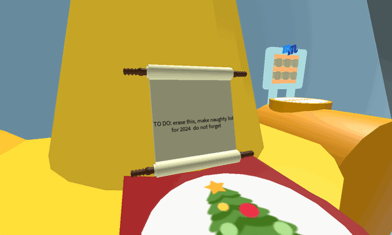

# Naughty List

{ .wiki-photo }

<table style="color: #fff; background-color:#1c68355c; margin: 10px auto; border: 2px solid #ffffffd9; border-left: 15px solid #ffffffd9; border-radius: 5px">
<tbody><tr>
<td style="padding-left: 10px; width: 100px; font-size: 2vh; vertical-align: middle;">
</td>
<td style="padding: 0.25em 0.5em;">
<b>This piece of content is unobtainable or inaccessible.</b>
This content can no longer be obtained or accessed but still exists in the game. This content may still be subject to updates, so feel free to edit below.

</td></tr></tbody></table>

<figure class="thumb" style="width: 203px" typeof="mw:File/Thumb">  <figcaption class="thumbcaption"> 
Bubble Bee Man's Naughty List after completing his Beesmas quest.
 </figcaption> </figure>

The **Naughty List** is a recurring Beesmas machine that is unlocked after completing [Bubble Bee Man](bubble-bee-man.md)'s Beesmas quest. As the quest is currently unavailable, this machine cannot be used.

It is located on top of the [30 Bee Gate](bear-gate.md), between [Night Memory Match](memory-match.md) and Bubble Bee Man. When used, a voiceline of presumably Bubble Bee Man saying "*Naughty Naughty Naughty"* will play server wide, and a lump of coal will fall onto each player in the server, which deals lethal damage if the player does not move out of the way. The falling coal is similar to [Coconut Crab](coconut-crab.md)'s *Coconut Attack*. If a player is killed by the falling coal, the player receives a [Lump Of Coal](lump-of-coal.md) [Beequip](beequip.md) and the [Beesmas Repentance buff](buffs-debuffs.md#Buffs) for 2 hours. Players can use the Naughty List every 8 hours.

If a player attempts to use it without completing Bubble Bee Man's quest, the pop up will read: There aren't any names on the Naughty List. That can't be right...

## Audio

## Trivia

* The [Honey Wreath](honey-wreath.md) and [Onett's Lid Art](onett-s-lid-art.md) are the only Beesmas decorations to have voices play upon activation.
  * It is also the only Beesmas decoration to play an audio that contains words.
* If a player stands on a mob while the coal was falling, it can kill the player and deal 100 damage to the [mob](mobs.md).
* The names that the player could see that are stated are: Aardvark Joe, Apple BEe *[sic]*, and Applebee's Cofounder 1.
* The Naughty List is tied for the Beesmas machine with the longest cooldown, being tied with [Onett's Lid Art](onett-s-lid-art.md) and the [Gummy Beacon](gummy-beacon.md).
* This is the only machine able to damage both players and hostile mobs.
* The Beesmas Repentance Buff does not stack. However, the duration of the buff does stack.
* After finishing Bubble Bee Man's quest, the dialog states that the player can use it every 22 hours. However, the player can use it every 8 hours.
* If two or more players use the Naughty List at the same time, you can receive two or more Lumps of Coal while only dying once.
* During Beesmas 2025, it was added into the game but never accessible due to Bubble Bee Man never receiving his quest. It still has yet to be removed despite the event ending.
