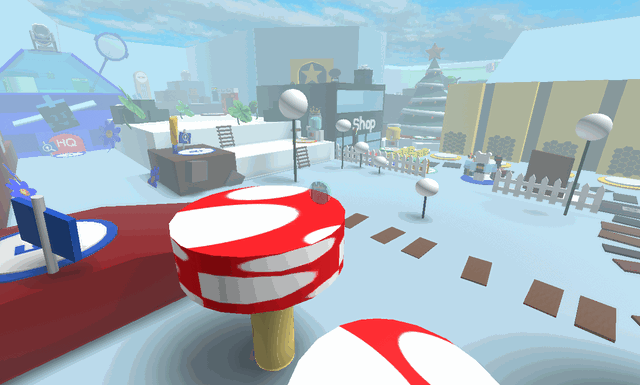

# Obstacle Courses

{ .wiki-photo }

**Obstacle Courses**, sometimes referred to as "obbies" for short, are short platforming challenges. Several of these exist on the main map, each having a reward or a shop at the end. Some are easy, while others are challenging. It gives the player something to do and helps them by rewarding the player with several [items](items.md) such as [tickets](ticket.md), royal jelly, or even a star jelly. There are also obstacle courses that lead to certain masks that the player can purchase.

## Mushroom Field Obby

This obstacle course is located in the [Mushroom Field](mushroom-field.md). It is the first obstacle course that players can access. Players do not need anything that will make them jump higher, but the obstacle course would be easier if they do. From the first step of the mushroom to the second step, there is an invisible wall.

On the biggest mushroom, there are a total of three circular pads, two red and one white. After the pads, there are three circles in the air, which are red with white dots representing mushrooms. On the end of the course, there is another mushroom with a royal jelly token on it.

Players can skip this obstacle course with the [Parachute](parachute.md)/[Glider](glider.md) and any method that'll get them high enough in the air, such as the [Yellow Cannon](yellow-cannon.md).

## Lava Obby

This obstacle course is hidden behind the [Honey Dispenser](honey-dispenser.md) or through a hole through a wall in the [Noob Shop](noob-shop.md). After the player enters, there will be green blocks surrounded by lava. If the player touches the lava, they will die instantly. The [Parachute](parachute.md)/[Glider](glider.md), [Propeller Hat](propeller-hat.md) or Gummy Boots/Coconut Clogs is recommended for this obstacle course. Though, jumping rapidly upon hitting lava can keep the player alive. Upon hitting lava, the player must rapidly jump until they can jump on a platform. Then, they can continue with the obby as normal.

The first four blocks are in a straight line. Then, the player will arrive at a split path. If the player keeps going forward, they will find the shop for the [Demon Mask](demon-mask.md). However, the player will need a decent jump power to be able to jump over one of the large ledges. If the player turns left, they come across 6 more blocks with a left turn. They get higher all the way to a small hole at the end, with a royal jelly just inside it. When the player goes through the hole, they end up on top of an awning inside the [Noob Shop](noob-shop.md). The player thus is able to go out from the Noob Shop instead of redoing the obstacle course.

Players can bypass this obstacle course by jumping and gliding from the shelf above the hat and belt to the top of the awning. The player needs a highly enhanced jumping ability to do so ([Beekeeper's Boots](beekeeper-s-boots.md) at minimum, plus [Bear Morph](ability-tokens.md#Bear_Morph) if the player has it), and the player may need the Glider instead of the Parachute.

Alternatively, players can stand on top of [Noob Bear](noob-bear.md)'s cash register, then hop up onto the awning to collect the royal jelly. The Propeller Hat or the Beekeeper's Boots have enough jump power to allow them to reach the awning.

In the Egg Hunt Event, players could obtain a Plastic Egg token by immediately turning right after entering. This has been replaced by a ticket token yielding 3 tickets.

## Commando Chick's Hideout Obby

This obstacle course is located between the [Blue HQ](blue-hq.md) and the [Wealth Clock](wealth-clock.md), the same location where the Golden Present obstacle course was. There is a hole in the wall, with vines blocking the entrance. To pass through, players must use the [Clippers](clippers.md), [Scissors](scissors.md), or the [Scythe](scythe.md) to cut the vines down. The vines are then permanently cut down, meaning they do not need to cut the vines again. This obstacle course consists of evenly spaced blocks, gradually getting higher, that the player must jump across to reach the arena.

The [Commando Chick's Hideout](commando-chick-s-hideout.md) is located past this obstacle course.

When the vines blocking the entrance are being cut down, the following audio plays:

The Commando Chick's Hideout Obby is, in fact, a newer version of the Golden Present obby, which had made its debut in Beesmas 2019 in order to serve as a challenge for people trying to get to the Golden Present. After the end of Beesmas 2020, the Golden Present obby was removed, only to return in the Egg Hunt 2020 event as the Commando Chick's Hideout obby. The only difference between the former and the latter is that the latter has vines to cut through.

## Bamboo Field Obby

This obstacle course is located between the [Spider Field](spider-field.md) and the [Bamboo Field](bamboo-field.md). Players need at least 5 bees to get here. Players do not need anything that will make them jump higher to finish the course.

First, there are 9 rocks, alternating between brown and gray. The first three go from the Spider Field to the Bamboo Field, then the next three go in the opposite direction, and then there are three more in the original direction. After those, there are three bamboo sticks, and the royal jelly is on the last stick. The [Moon Amulet Generator](moon-amulet-generator.md) is also accessible by this obstacle course.

Players can skip this obstacle course with the parachute, jumping down from the ramp to the 25 Bee Zone and any method that'll get the player high enough in the air, such as the [Slingshot](slingshot.md).

## Dapper Bear's Shop Obby

The Dapper Shop Obby can be accessed by going to the right wall of [Dapper Bear's Shop](dapper-bear-s-shop.md) and jumping on the three protruding planter displays. There are two paths the player can take afterward. The first one is to jump onto a gray ledge on the right, and then jumping onto the roof of the shop, where the player can find a [honeysuckle](honeysuckle.md), royal jelly, and [smooth dice](smooth-dice.md) token, and the [Mythic Gift Box](gift-boxes.md) (now unavailable). The second is to jump on an orange ledge partially covered by a roof, and then jumping on two moon platforms (the player must wait until nighttime and have a Moon Amulet) to reach a star jelly token. However, if the moon platforms are disabled, they can be skipped by using the [Hiking Boots](hiking-boots.md), [Glider](glider.md), and a stack of Haste+. Using the Hiking Boots can help with completing the obby if the moon platforms are active. The jump power is low enough to not bump into the roof, but high enough to be able to grab the [Star Jelly](royal-jelly.md) at the end. The [Basic Boots](basic-boots.md) lack the jumping power boost the [Hiking Boots](hiking-boots.md) have to grab the [Star Jelly](royal-jelly.md) at the end, so it's not recommended to use those, A [Glider](glider.md) is also recommended in case you hit the ceiling on one of the moon platforms.

## Cloud Obby

This obby is located past the [Honey Bee Gate](honey-bee-gate.md), starting close to [Polar Bear](polar-bear.md), and ending on the tallest tree in [Pine Tree Forest](pine-tree-forest.md). Players will require the Parachute or Glider to pass it.

To the left of Polar Bear, players should climb the cliffs to the highest one. Using the [parachute](parachute.md) or [glider](glider.md), they should then make the jump to the next two cliffs. Turn left and jump/glide along the tops of the four clouds. The player will be met with the entrance to the Diamond Room on the last cloud. Next to the last cloud is a pine tree with a royal jelly above it. Players can walk right off the cloud into the royal jelly token to collect it.

Players can bypass this obstacle course with the Parachute/Glider and the [Red Cannon](red-cannon.md). Alternatively, players can skip a variable amount by parachuting/gliding down from the 25 bee zone.

## Diamond Room

The Diamond Room is a room located at the close of the Cloud Obby. The room leads to a [glitter](glitter.md) token, the [Diamond Mask](diamond-mask.md) and a sky-blue room with 2 moons serving as parkour. The moons will only become collidable if the player has a [Moon Amulet](moon-amulet.md) during nighttime. If the player owns the Diamond Mask, the moons will always be solid and will turn blue. With enough speed and the [Glider](glider.md) you can skip the moons entirely.

## 30 Bee Zone Obby

The 30 Bee Zone obstacle course is located to the right of [Onett](onett.md). This is the last obstacle course that players can reach. During the day the moons leading to on top of the bear gate are slightly invisible and not solid, thus making it inaccessible during the day. If it is night and the player has a Moon Amulet, they can parkour up to the Bear Gate. The moon platforms will lead the player up to [Bubble Bee Man](bubble-bee-man.md). There is also a royal jelly token in front of Bubble Bee Man and an [enzymes](enzymes.md) token with the [Night Memory Match](memory-match.md) on the other side. There used to be a [present](present.md) where the enzymes are. As of the 2019-12-23 update, Onett added more moons to make the obstacle course easier.

## Hive Hub Obby

Added in the 2024-07-17 Beesmas update, this obstacle course is located at the entrance of the [Hive Hub](hive-hub.md). Each platform has a large gap, encouraging you to use the [Glider](glider.md) for every jump you take. These platforms lead the player to a Smooth Dice token, a [Red Balloon](red-balloon.md) token, and a [Gingerbread Bear](gingerbread-bear.md) token for both 2024/25 Beesmas events.

## Mythic Present Obby

This piece of content goes bye bye.

The following content has been removed from the game. The contents below may be archival, but feel free to edit below.

The Mythic Present obstacle course was located to the left of the [Stump Field](stump-field.md) and could only be accessible during Beesmas 2019 and 2020. To get to this obstacle course, the player had to go through the [Brave Bee Gate](brave-bee-gate.md) and head to the left of the Stump Field. There would have been a hole in the wall containing the obstacle course. This obstacle course consisted of many purple balls that the player had to jump across to reach the end. At the end of the obstacle course, the Mythic Present was found on a stair-like platform. To the left of the present was a royal jelly token that gave 1 royal jelly. To the right was a [micro-converter](micro-converter.md) token that gave 3 micro-converters. If a player were to go out of the map to the place where this obstacle course was during the Beesmas 2019 Event and slide against the wall, the player would die because the floor still kills players.

