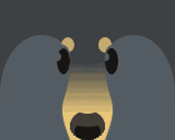
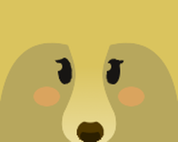
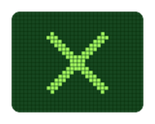
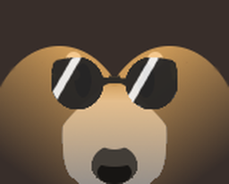
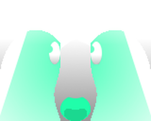
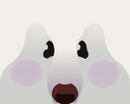

# Onett

<table class="infobox" style="font-size:12px; color:white; width:300px; background:#a58b59;padding:0; border:none; color:#FFF;">
<tbody><tr>
<td colspan="2" style="background-color:#684a12; font-size:2vh; text-align: center; padding: 15px 0; color:#FFF"><b>Onett</b>
</td></tr>
<tr>
<td colspan="2">
 

</td></tr>
<tr>
<td colspan="2" style="background-color:#684a12; text-align:center">Overview
</td></tr>
<tr>
<td style="padding-left:5px;">Species
</td>
<td>Robloxian
</td></tr>
<tr>
<td style="padding-left:5px;">Location
</td>
<td>Behind the <a href="bear-gate.html">Bear Gate</a>.
</td></tr>
<tr>
<td style="padding-left:5px;">Bee Prerequisites
</td>
<td>30 bees
<table>
</table>
</td></tr></tbody></table>

*This is the quest-giver Onett. To see the developer page of Onett, click here.*

**Onett** is a quest giver located past the [Bear Gate](bear-gate.md). He gives out a series of five challenging [quests](quests.md). The rewards for the last quest include a [Star Treat](star-treat.md). His quests require the player to complete different tasks, requesting the player to collect 3,673,750,000 [pollen](pollen.md), 136,000,000 [goo](goo.md), 153,000 [tokens](ability-tokens.md), and to defeat 940 [mobs](mobs.md) throughout all of his Star Journey quests.

## Quests

Onett currently has 5 quests.

<table class="article-table mw-collapsible mw-collapsed">
<tbody><tr>
<th>Quest Name
</th>
<th>Requirements
</th>
<th>Rewards
</th></tr>
<tr>
<td>Star Journey 1
</td>
<td>
<ul><li>Collect 25,000,000 White <a href="pollen.html">Pollen</a>.</li>
<li>Collect 10,000,000 Pollen from the <a href="pumpkin-patch.html">Pumpkin Patch</a>.</li>
<li>Collect 5,000,000 Pollen from the <a href="pineapple-patch.html">Pineapple Patch</a>.</li>
<li>Collect 2,500,000 Pollen from the <a href="dandelion-field.html">Dandelion Field</a>.</li>
<li>Collect 1,000,000 <a href="goo.html">Goo</a> from White Flowers.</li>
<li>Collect 2,500 Haste Tokens.</li>
<li>Collect 100 Honey Tokens.</li>
<li>Defeat 10 <a href="ants.html#Giant_Ant">Giant Ants</a>.</li>
<li>Defeat 5 <a href="werewolf.html">Werewolves</a>.</li></ul>
</td>
<td>5,000,000 <a href="honey.html">Honey</a> 

25x <a href="royal-jelly.html">Royal Jelly</a> 
1,000x <a href="treats.html">Treat</a> 
10x <a href="ticket.html">Ticket</a> 
25x <a href="pineapple.html">Pineapple</a>

</td></tr>
<tr>
<td>Star Journey 2
</td>
<td>
<ul><li>Collect 50,000,000 Red Pollen.</li>
<li>Collect 25,000,000 Pollen from the <a href="rose-field.html">Rose Field</a>.</li>
<li>Collect 12,500,000 Pollen from the <a href="strawberry-field.html">Strawberry Field</a>.</li>
<li>Collect 6,250,000 Pollen from the <a href="mushroom-field.html">Mushroom Field</a>.</li>
<li>Collect 5,000,000 <a href="goo.html">Goo</a> from Red Flowers.</li>
<li>Collect 5,000 <a href="ability-tokens.html#Boost">Red Boost</a> Tokens.</li>
<li>Collect 150 <a href="strawberry.html">Strawberry</a> Tokens.</li>
<li>Collect 500 Honey Tokens.</li>
<li>Defeat 100 <a href="ants.html#Fire_Ant">Fire Ants</a>.</li>
<li>Defeat 100 <a href="ladybug.html">Ladybugs</a>.</li>
<li>Use the <a href="red-teleporter.html">Red Portal</a> 10 Times.</li>
<li>Use the <a href="red-field-booster.html">Red Field Booster</a> 5 Times.</li></ul>
</td>
<td>10,000,000 Honey 

50x Royal Jelly 
2,000x Treat 
15x Ticket

</td></tr>
<tr>
<td>Star Journey 3
</td>
<td>
<ul><li>Collect 100,000,000 Blue Pollen.</li>
<li>Collect 50,000,000 Pollen from <a href="pine-tree-forest.html">Pine Tree Forest</a>.</li>
<li>Collect 25,000,000 Pollen from <a href="bamboo-field.html">Bamboo Field</a>.</li>
<li>Collect 12,500,000 Pollen from <a href="blue-flower-field.html">Blue Flower Field</a>.</li>
<li>Collect 10,000,000 Goo from Blue Flowers.</li>
<li>Collect 7,500 Blue Boost Tokens.</li>
<li>Collect 250 <a href="blueberry.html">Blueberry</a> Tokens.</li>
<li>Collect 1,000 Honey Tokens.</li>
<li>Defeat 200 <a href="ants.html#Flying_Ant">Flying Ants</a>.</li>
<li>Defeat 200 <a href="rhino-beetle.html">Rhino Beetles</a>.</li>
<li>Defeat 1 <a href="king-beetle.html">King Beetle</a>.</li>
<li>Use the <a href="blue-teleporter.html">Blue Portal</a> 20 Times.</li>
<li>Use the <a href="blue-field-booster.html">Blue Field Booster</a> 10 Times.</li></ul>
</td>
<td>25,000,000 Honey 

75x Royal Jelly 
5,000x Treat 
20x Ticket

</td></tr>
<tr>
<td>Star Journey 4
</td>
<td>
<ul><li>Collect 250,000,000 White Pollen.</li>
<li>Collect 15,000,000 Goo from the <a href="sunflower-field.html">Sunflower Field</a>.</li>
<li>Collect 15,000,000 Goo from the Pineapple Patch.</li>
<li>Collect 15,000,000 Goo from the Pumpkin Patch.</li>
<li>Collect 5,000 Focus Tokens.</li>
<li>Collect 5,000 Token Links.</li>
<li>Collect 5,000 Honey Tokens.</li>
<li>Defeat 150 <a href="ants.html#Army_Ant">Army Ants</a>.</li>
<li>Defeat 30 <a href="mantis.html">Mantises</a>.</li>
<li>Defeat 30 <a href="scorpion.html">Scorpions</a>.</li>
<li>Defeat 3 <a href="king-beetle.html">King Beetles</a>.</li>
<li>Defeat 1 <a href="tunnel-bear.html">Tunnel Bear</a>.</li></ul>
</td>
<td>50,000,000 Honey 

100x Royal Jelly 
7,000x Treat 
25x Ticket

</td></tr>
<tr>
<td>Star Journey 5
</td>
<td>
<ul><li>Collect 1,000,000,000 White Pollen.</li>
<li>Collect 1,000,000,000 Red Pollen.</li>
<li>Collect 1,000,000,000 Blue Pollen.</li>
<li>Collect 100,000,000 Pollen from the <a href="spider-field.html">Spider Field</a>.</li>
<li>Collect 25,000,000 Goo from White Flowers.</li>
<li>Collect 25,000,000 Goo from the <a href="cactus-field.html">Cactus Field</a>.</li>
<li>Collect 25,000,000 Goo from the <a href="clover-field.html">Clover Field</a>.</li>
<li>Collect 100,000 <a href="ability-tokens.html">Ability Tokens</a>.</li>
<li>Collect 10,000 Bomb Tokens.</li>
<li>Collect 1,000 Baby Love Tokens.</li>
<li>Collect 10,000 Honey Tokens.</li>
<li>Defeat 50 <a href="spider.html">Spiders</a>.</li>
<li>Defeat 50 Giant Ants.</li>
<li>Defeat 5 King Beetles.</li>
<li>Defeat 5 Tunnel Bears.</li></ul>
</td>
<td>100,000,000 Honey 

10,000x Treat 
50x Ticket 
1x <a href="star-treat.html">Star Treat</a>

</td></tr></tbody></table>

## Dialogue

<table class="article-table mw-collapsible mw-collapsed">
<tbody><tr>
<th>Quest
</th>
<th>Dialogue
</th></tr>
<tr>
<td>Star Journey 1
</td>
<td>Whoa! You made it to the very top of the mountain! That was a lot faster than I expected. So fast that I haven't even finished getting this place ready... I'm working on opening this big lid over here. It's pretty tricky... stuck real tight. When I get it open I'll probably need you guys to help me out with whatever's inside. Until then, I guess I can put you and your bees to the test. You'll have until I get this thing open to finish 5 quests. Complete all 5 and I'll give you a [Star Treat]. A [Star Treat] always converts a bee into a Gifted bee. And as a matter of fact, they're the only way to obtain Gifted Event bees. These quests are absurdly hard. The point is to keep you top beekeepers busy! If you're not up to the challenge don't complain to me!!!!!! I got a lot to do!!!!!!!!!!! Sorry, I got a little carried away there... Anyways, I've put quest #1 in your Quest menu.

<i>-During-</i>

This lid is stuck on tight. I'm working hard to figure out how to open it. But in the meanwhile, let's play a game!  &gt;&gt; ☺️ These clever fry make excellent sleuthers &gt;&gt; One rhymes with Teddy, the other rhymes named blank. It's not actually named blank though. That's the game, you gotta figure out the word.

<i>-Completion-</i>

Re://:Swarm is my first ROBLOX game. I use this as my excuse every time I run into problems! If I was a little more experienced, I bet this area would be done by now. You're lucky I'm not! You get to do these quests!

</td></tr>
<tr>
<td>Star Journey 2
</td>
<td>Who would have thought a ROBLOX game would require so much work? A simple lid like this is taking me weeks to open... The bears and bees don't make it any easier! They're friendly to you all but they always give me problems. If they keep complaining I'm getting rid of all the fields except the Dandelion Field! I wouldn't really do that though. Anyways, I'll put quest #2 in your Quest menu.

<i>-During-</i>

The worst part about the bears is having to write their lines. They don't say much, but even that's too much for me! I'M NOT A WRITER!!!! Why can't the bears just think for themselves? I'm looking at you Science Bear.

<i>-Completion-</i>

"Simulator" games seem all about the rush of a reward after pushing through monotonous tasks. Not so different from what motivates most of us to work in real lives! The promise of a reward gives meaning to our work... at least that's how we feel. I really think it's the work itself that keeps us playing! Do you think that mean's <i>[sic]</i> I also enjoy opening this lid? Um... I won't think about it too hard. Three more quests and you'll get that [Star Treat].

</td></tr>
<tr>
<td>Star Journey 3
</td>
<td>I really like bees and bears even if I sometimes get tired of them. I don't think anyone can deny how impressive bees are. So coordinated and organized. Not only that, but they pollinate plants and make us honey. Bees really feel like a force for good don't they? Bears are great because they look like big dogs. They seem like gentle giants even though I know they usually arent. <i>[sic]</i> In this game we just focus on the good stuff about bears and bees I guess. The bees don't even have stingers. Anyways, what was I doing? Oh yeah! I'll put the next Star Journey quest in your Quest menu. This one has a lot of blue stuff. Ok, now I'll get to... opening this lid?

<i>-During-</i>

The red and blue dichotomy isn't as interesting as I hoped for. I'll keep trying to differentiate them cause right now they're basically mirror images of eachother.<i>[sic]</i> At least it gives some variety on a superficial level! (cough) Ok well let's get back to work.

<i>-Completion-</i>

Oh, nice you're done! By the way... Did you know the King Beetle has a 1 in 7 chance of dropping a [King Beetle Amulet]? Also, every time you defeat a King Beetle, the quality of amulets you get from it tends to go up. This caps out at 100 King Beetle kills. I hoped this mechanic would make defeating the King Beetle more exciting. We'll see how that works out... Anyways here's a bunch of stuff as a reward! I know that was hard. Nothing compared to the next two though.

</td></tr>
<tr>
<td>Star Journey 4
</td>
<td>ROBLOX is really something else! The developer studio is simple to use and Lua is a versatile and forgiving scripting language. If you had told me a year ago I'd be working on a ROBLOX game full time... I never would have believed you! I didn't even know making ROBLOX games full time was a thing. It has been a ton of fun and extremely rewarding. I'm excited to keep working on Re://:Swarm and more ROBLOX games in the future. But I got to stay focused on opening this lid first... If only I had more upper arm strength. Maybe if my bees had arms... Anyways, get ready for a tough one. I've put the 4th quest in your quest menu.

<i>-During-</i>

Do you have a favorite bee? I like Rascal Bee's laughing face. I also love Tabby Bee because it looks like my cat. And I'm sure you can tell I like Basic Bee a lot. I put Basic Bee in every game icon cause <i>[sic]</i> it's #1.

<i>-Completion-</i>

Wow! You really like making honey! Oh - how was the goo collecting? Thought you were safe with Gummy Bear gone didn't you? Hah! I spent a long time making the goo so you guys are going to use it whether you like it or not. (Actually I'll try to save it for only the most difficult quests) 1 more quest to go! Then you get that [Star Treat]!

</td></tr>
<tr>
<td>Star Journey 5
</td>
<td>You've made a lot of progress on these quests but I've hardly nudged this lid open at all. Hopefully this last one will take you a long time. This update is designed to extend the end game - that's the main goal. Gifted Bees brings a new "tier" past Legendary. Leveling bees offers a new use for honey. The Ant Challenge gives you a repeatable objective that'll always let you challenge yourself. And the [Star Amulets] act as the ultimate end game goal. You need 30 different Gifted Bee types to obtain a [Diamond Star Amulet]! Even the top players in the world should take a while to reach that. That's the plan anyhow... It'll all have to hold you over until I get this "lid" OPEN. Time for the last Star Journey quest! Good Luck!!

<i>-During-</i>

It's tricky to give a simulator game longevity, especially without rebirths. On top of that, I'm running out of resources on this map - if I add too much more, it'll increase the lag! The game is already pretty laggy sometimes as I'm sure you've seen. I'll work on that after this lid comes off.

<i>-Completion-</i>

Holy moly! You and your bees did it all! You must be in like the top 0.01% of ALL players! You must really want this [Star Treat]. It's all yours! I really appreciate the dedication you've shown to the game by the way. Players like you are the ones who keep me motivated the most! I promise I'll keep working to give you guys more goals and keep Re://:Swarm growing. First thing I got to do is open this lid! I'll let you know when I've finished.

</td></tr>
<tr>
<td>Conclusion
</td>
<td>I like honey but I don't like it THAT much.
</td></tr>
<tr>
<td>Egg Hunt Event Conclusion
</td>
<td>Should my NPC do something for the Egg Hunt? Probably... give me a while and I might come up with something.
</td></tr></tbody></table>

## Ornament Quest

This piece of content goes bye bye.

The following content has been removed from the game. The contents below may be archival, but feel free to edit below.

<table class="article-table mw-collapsible mw-collapsed">
<tbody><tr>
<th><b>Quest</b>
</th>
<th><b>Requirements</b>
</th>
<th><b>Reward</b>
</th></tr>
<tr>
<td>Onett's Ornament
</td>
<td>
<ul><li>Collect 5,000,000 <a href="pollen.html">Pollen</a> from the <a href="mountain-top-field.html">Mountain Top Field</a></li>
<li>Collect 1,000,000 <a href="goo.html">Goo</a></li>
<li>Craft 50 Ingredients with the <a href="blender.html">Blender</a></li>
<li>Collect 100 Tokens from <a href="sparkles.html">Sparkles</a></li></ul>
</td>
<td>5,000,000 <a href="honey.html">Honey</a> 

5x <a href="ticket.html">Ticket</a> 
5x <a href="micro-converter.html">Micro-Converter</a> 
<a href="ornaments.html">Candy Cane Reindeer Ornament</a>

</td></tr></tbody></table>

<table class="article-table mw-collapsible mw-collapsed">
<tbody><tr>
<th>Quest
</th>
<th>Dialogue
</th></tr>
<tr>
<td>Onett's Ornament
</td>
<td>Oh hey! Merry Beesmas... (Yawn) Sorry I'm a little tired. The holidays are my best busiest time of the year by far. With Christmas comes a flood of Robux gift cards... And if your game doesn't have anything flashy and seasonal to offer, then you miss out! ROBLOX is really competitive nowadays. And Bee Swarm is almost 2 years old. It's getting a little outdated... but we're still going strong! Anyways, I've been busy working on this update to try to complete. The Mythic Bees especially. Each one has to be special and unique. But with new unique features comes bugs, soo... That's why I haven't been able to open this lid... ... Anyways, I've also been busy coming up with the perfect [Ornament] idea. I think you're really going to like it. It's really, really cool. You do these, and I'll finish making it: Collect 5,000,000 Pollen from the Mountain Top Field... Collect 1,000,000 Goo... Craft 50 Ingredients in the Blender... And collect 100 Tokens from Sparkles. Sparkles are, you know, those sparkly patches that happen on flowers. Whenever a Firefly sits on them, or when the fruits come to life and blow bubbles at them. Hurry up cause I'm really excited to show you my [Ornament].

<i>-During-</i>

N/A

<i>-Completion-</i>

Oh boy oh boy oh boy! Now I can finish up this [Ornament]. ...(Snip snip snip)... ...(Glue glue glue)... Hmm... give me a second. ...(Knock knock knock)... Well... yeah it looks pretty good! Look! It's the [Candy Cane Reindeer Ornament]!! I took a regular candy cane and made it look like that reindeer... I'm not sure if it's a copywrited <i>[sic]</i> reindeer, so I'll just call him "Ruby". I used brown pipe cleaners for it's <i>[sic]</i> antlers! And the nose, I had to use a metalic <i>[sic]</i> gold pom pom. I couldn't find a red pom pom. And I glued 2 googly eyes on it. 🎵 Ruby the red-nos... 🎵 Ruby the gold-nosed candy cane 🎵 🎵 You'll go down in history! 🎵 I'm glad you like it. Anyways, With this on the Beesmas Tree, you'll receive the following boosts: +10% Capacity; x1.2 Tool Pollen; And x1.25 Pollen from the Mountain Top Field! OK. So, let me explain some more things. The bees can obtain "mutations" in this update which grants bonus stats. One of the main ways to obtain these mutations is to use [Royal Jellies] (or [Star Jellies]) On bees that are radioactive. You can tell they're radioactive cause their slot glows. Also they'll have this icon on their hive slot: ☢️ Radioactivity only lasts for around 10 minutes. How do they become radioactive? Well, I have multiple ways planned... But right now, you'll need to feed them [Neonberries]. At the moment, [Neonberries] are rare drops from certain monsters. But there will be more sources in the future. Another way to give a bee a mutation is to feed them [Bitterberries]. Although it's technically possible for [Bitterberries] to mutate a bee at any time... They're much, much more likely to cause a mutation if fed to a radioactive bee! Once you have bees with mutations, those bees will occasionally become radioactive at random. When they do, they have a chance to make bees in neighboring hive slots radioactive as well. This means it will become easier to obtain radioactive bees as you obtain more bees with mutations. I'll expand on this in the next update, but I figured I'd explain the gist of it for now. Anyways, Merry Beesmas! Well, it's not really an "official" Beesmas event, But <i>[sic]</i> Beesmas sort of become <i>[sic]</i> canon in the Bee Swarm world last year... It's just a simulator game but we're still trying to keep things consistent. ... Back to you, Beesmas Tree!

</td></tr></tbody></table>

## Event Dialogue

### Christmas Day 2025

<table class="article-table mw-collapsible mw-collapsed">
<tbody><tr>
<th>Dialogue
</th></tr>
<tr>
<td>Hello! It's me, the developer of Re://:Swarm. Here to wish you a Merry Beesmas! If you've been good this year, that is. Hehehe 😈 I'm dressed as Krampus, the scarier Santa who carries naughty kids down to the underworld. But don't worry. The only place I'll trap anyone is in this never ending bee game! Thank you all so much for such a remarkable year of honeymaking. This has been an [sic] crazy, record breaking year for the platform as a whole! Many of my friends have made huge hits, which have reached more players than we ever thought possible. I'm incredibly proud of them, and of you [sic] the players, for manifesting such cool, living little worlds! We have something special going on here! To thank you for playing during this time of year, I'd like to give a few gifts: A [Present] you can exchange with an NPC of your choice for a helpful Ornament, A [Star Jelly] which can transform a bee into a random powerful "Gifted" Bee, Some other smaller doodads... And the [🎁 Honeyday Event Buff]! Which grants x2 Pollen and Convert Rate for 48 hours. Talk to Bee Bear to get the Beesmas festivities started. This is the perfect time of year to make progress on your hive! Thanks again to this community for your incredible, unwavering dedication. Happy Honeydays!
</td></tr></tbody></table>

## Beesmas Quest - Onett's Yard Art on the Lid

### 2025

This piece of content goes bye bye.

The following content has been removed from the game. The contents below may be archival, but feel free to edit below.

<table class="article-table mw-collapsible mw-collapsed">
<tbody><tr>
<th>Requirements
</th>
<th>Rewards
</th></tr>
<tr>
<td>
<ul><li>Pop 1,000 Level 5+ Blooms.</li>
<li>Catch 1,000 <a href="bloom.html">Petals</a> in the <a href="mountain-top-field.html">Mountain Top Field</a>.</li>
<li>Collect 10,000,000 <a href="pollen.html">Pollen</a> with <a href="bumble-bee.html">Bumble Bees</a>.</li>
<li>Collect 12 Hours of Motivating <a href="nectar.html">Nectar</a>.</li>
<li>Collect 250 Stacks of <a href="ability-tokens.html#Inspire">Inspire</a>.</li>
<li>Collect 250 <a href="ability-tokens.html#Baby_Love">Baby Love</a> Tokens.</li>
<li>Collect 25 <a href="ability-tokens.html#Tabby_Love">Tabby Love</a> Tokens.</li>
<li>Boost the Mountain Top Field 10 times.</li>
<li>Defeat 3 <a href="giant-ant.html">Giant Ants</a>.</li>
<li>Defeat 2 <a href="king-beetle.html">King Beetles</a>.</li>
<li>Defeat 1 <a href="stump-snail.html">Stump Snail</a>.</li>
<li>Obtain 1 Shining Star, Cyan Star, or Black Star <a href="sticker.html">Sticker</a> to give to Onett.</li></ul>
</td>
<td>

500,000,000 <a href="honey.html">Honey</a> 
1 <a href="sticker.html#Sticker_Index">Ticket Voucher</a> 
1 <a href="festive-planter.html">Festive Planter</a> 
1 <a href="royal-jelly.html#Star_Jelly">Star Jelly</a> 
1 <a href="super-smoothie.html">Super Smoothie</a> 
5 <a href="gingerbread-bear.html">Gingerbread Bears</a> 
Access to <a href="onett-s-lid-art.html">Onett's Lid Art</a>

</td></tr></tbody></table>

<table class="article-table mw-collapsible mw-collapsed">
<tbody><tr>
<th>Dialogue
</th></tr>
<tr>
<td>

I wonder, how many peoples Beesmases [sic] this is the first one of. Or... you know what I mean. A lot of people have shown up on the mountain recently, and they might not even know what Beesmas is all about! That's why I want to put some art up that'll really "wow" them. I'm thinking... something that makes a statement. You could call it commentary. But I'd call it - it's just about the magic of bees. Uh huh. Here we see a moonlit manager, which I drew. Sat upon the lid, which I've struggled to open for almost 8 years now. Surrounding a cradle, a whole Bee Swarm crew... But somethings [sic] missing. ANd I just can't figure it out. If I don't come up with that final element, that final "WOW" factor... Then all these new players will probably just go right back to their deers and gardens and brainrots. Think, Onett, think. ... This is going to be difficult.

<i>-During-</i>

N/A

<i>-Completion-</i>

Hmm, yeaaah... Ok, I think it's coming to me now... What this work of art needs... Is the pure joy, innocence, and charm... And pure helplessness maybe...? Of a Baby Bee!!! What does this all mean? Who knows, not me. Art is for the world to interpret not the artist. I live in the moment and I just channel stuff and let it speak through me.  (cough) Ok.  And I'm tired and I've been awake a long time and it just felt "right", you know?  Just a little baby in a manger, like us all, just trying to get by. I don't know. All I know is, the Yard Art is done, and you are free to gander at it once every 8 hours. When you do, it'll summon 3 temporary bees to join your swarm for 30 minutes. It'll also give you a variety of random gifts. Hopefully to make up for all the time you spent on this quest. And best of all, it'll summon a 🌟 Guiding Star 🌟in a random field for you and your friends to use! Guiding Stars boost pollen, convert rate, capacity for all players in the field. They usually go to fields you've collected the least in, so they're a great way to catch up on your badges. Anyways, I hope you're enjoying the Honeydays! And if you're new here, I hope you haven't found the quests too hard! Thanks to new and old players alike, for coming to celebrate winter right here. Happy Honeymaking!

</td></tr></tbody></table>

## Trivia

* He is the first and only robloxian-species [quest giver](quest-givers.md).
  * He and the Mysterious Figure are the only NPCs of the robloxian-species.
  * He is the only quest giver whose appearance changes during every event.
* There is a [Statue of Onett](easter-eggs.md#Onett_Statue) on top of the 6th [hive](hive.md) (from Left to Right) with the [Honey Dipper](honey-dipper.md) and the [Port-O-Hive](port-o-hive.md) as a backpack, while the Onett NPC has a [Porcelain Dipper](porcelain-dipper.md), [Porcelain Port-O-Hive](porcelain-port-o-hive.md), [Mondo Belt Bag](mondo-belt-bag.md), [Riley Guard](riley-guard.md), [Bucko Guard](bucko-guard.md), [Beekeeper's Mask](beekeeper-s-mask.md), and [Beekeeper's Boots](beekeeper-s-boots.md).
  * The pollen in the backpack of said statue is a [Code](codes.md).
* Star Journey 1 was originally planned for players to collect 500 [haste tokens](ability-tokens.md#Haste), not 5,000. But because of a scripting error, the requirement was set to 5,000 haste tokens.
  * The requirement was later reduced to 2,500 haste tokens.
* The total amount of [pollen](pollen.md) required to complete his quests is 3,673,750,000 pollen and the total amount of [Goo](goo.md) required to complete the quests is 136,000,000 goo.
* The amount of pollen in Onett's backpack (32318) represents the date when [Re://:Swarm](re-swarm.md) was first released (on March 23, 2018).
* Ever since [Gummy Bear](gummy-bear.md) left, Onett's and [Science Bear's](science-bear.md) quests were the only ones that included collecting goo. However, the 2018-11-25 update introduced [Gifted Bucko Bee](gifted-bucko-bee.md) and [Gifted Riley Bee](gifted-riley-bee.md), requiring goo for their "Clean-up," "Goo," and "Medley" quests. During all three of the Beesmas Events, [Bee Bear](bee-bear.md) also required goo in certain quests, and during the Egg Hunt 2019 Event, [Polar Bear](polar-bear.md) also required collecting goo for his "Egg Hunt: Polar Bear" quest. [Spirit Bear](spirit-bear.md) also has goo requirements for her quests.
* He and [Panda Bear](panda-bear.md) were the first quest givers to give quests that required defeating [Tunnel Bear](tunnel-bear.md), with Science Bear being the last.
* On Onett's backpack, it says that its capacity is the equivalent to 500k. However, considering the [items](items.md) he wears, it should be about at least 900k of total capacity.
* Onett gives 8 quests (including limited quests), the least of all non-event quest givers in the game.
  * If counting event quests, he is surpassed by [Bubble Bee Man](bubble-bee-man.md), who gives 4 of them and [Stick Bug](stick-bug.md), who gives only 3.
* Onett is currently the fourth to last quest giver to be accessed in the game, the third to last being Bubble Bee Man, the second to last being Spirit Bear, and the last being [Dapper Bear](dapper-bear.md).
* During the Beesmas events 2018-2021, Onett wore a wreath around his head.
* During Beesmas 2022, Onett wore a robot mask and a cog on his belt.
* During Beesmas, once the player finished all of their quests, the player could give him a [Present](present.md). However, there was a temporary glitch where it wasn't possible to give him one.
* Onett, Tunnel Bear, and Gummy Bear were "Naughty" in 2018, as stated by Bee Bear.
  * Onett was also the only NPC who could have been given a present to who was on Bee Bear's "naughty" list.
* If the player had finished all of his quests during the Beesmas 2019 event, Onett stated that he's been "twisting the lid the wrong way for months."
* He is one of the two quest givers who did not give an Egg Hunt quest, the other being [Honey Bee](honey-bee-npc.md).
* During the Egg Hunt 2020 Event, Onett wore the Swarming Egg of the Hive, which given to players when they completed the egg hunt with [Sun Bear](sun-bear.md).
* When you give Onett a present in Beesmas 2020, the present you gave him includes a collection of Korean skin care products. The detail that states the products are specifically Korean refers to how Korean skin care products are generally very high-quality.
* Onett the quest giver and the statue are the only NPCs with a bag.
* During Beesmas 2020, there was a temporary glitch which allowed players to claim the Honeyday Event buff and other stuff from Onett by talking to him (or rejoining the game) multiple times. This glitch was soon fixed after a shutdown.
* Onett and [Polar Bear](polar-bear.md) are the only NPCs whose interaction have been a requirement to complete a [quest](quests.md).
  * The player needs to talk to Onett for [Mother Bear's](mother-bear.md) "⌛Waiting With Sun Bear (5/6): And Mother Bear. Again" quest.
* In the 2026-04-23 update, all Port-O-Hive variants have its mesh scaled down due to a bug. Its cause is unknown.

<table class="mw-collapsible NavTable">
<tbody><tr>
<th class="NavTitle" colspan="3">Quest Givers
</th></tr>
<tr>
<th class="NavCategory">Permanent Bears
</th>
<td class="NavLinks NavLinksBasicOdd"> <b><a href="black-bear.html">Black Bear</a></b> •  <b><a href="mother-bear.html">Mother Bear</a></b> •  <b><a href="brown-bear.html">Brown Bear</a></b> •  <b><a href="panda-bear.html">Panda Bear</a></b> •  <b><a href="science-bear.html">Science Bear</a></b>

 <b><a href="dapper-bear.html">Dapper Bear</a></b> •  <b><a href="polar-bear.html">Polar Bear</a></b> •  <b><a href="robo-bear.html">Robo Bear</a></b> • <b><a href="spirit-bear.html">Spirit Bear</a></b>

</td></tr>
<tr>
<th class="NavCategory">Traveling Bears
</th>
<td class="NavLinks NavLinksBasicEven"> <b><a href="sun-bear.html">Sun Bear</a></b> •  <b><a href="gummy-bear.html">Gummy Bear</a></b> •  <b><a href="bee-bear.html">Bee Bear</a></b>
</td></tr>
<tr>
<th class="NavCategory">Other
</th>
<td class="NavLinks NavLinksBasicOdd"> <b><a href="gifted-bucko-bee.html">Gifted Bucko Bee</a></b> •  <b><a href="gifted-riley-bee.html">Gifted Riley Bee</a></b> •  <b><a href="honey-bee-npc.html">Honey Bee</a></b>

 <b><strong class="mw-selflink selflink">Onett</strong></b> •  <b><a href="bubble-bee-man.html">Bubble Bee Man</a></b>

</td></tr></tbody></table>
