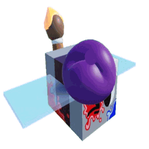

# Painter Bee Event

{ align=right width=150 }

The **Painter Bee event** is a Re://:Swarm update built around the new [Painter Bee](painter-bee.md). During the event the game is titled *[PAINTER BEE] Re://:Swarm*.

## What's new

* **[Painter Bee](painter-bee.md)** and its Gifted variant, an Event bee that paints and pollinates flowers.
* **[Painter Stickers](painter-stickers.md)**: new stickers that stack into Painter Bee's Artistic Hive Skin.
* **[Fluxite Wax](fluxite-wax.md)**: a wax that rerolls a [Beequip](beequip.md)'s potential.
* **[Supreme Puffshroom](supreme-puffshroom.md)**: a new [Puffshroom](puffshroom.md) rarity above Mythic.

## Getting Painter Bee

* **Rebirth 35** rewards a Painter Bee Egg.
* **Vouchers:** Painter Bee Voucher and 1st Edition Painter Bee Voucher.
* Each egg also gives a Painter Bee Jelly. See [Painter Bee](painter-bee.md#how-to-obtain).

## Shop

### Painter Bee's Colorful Haul

A [Robux Shop](robux-shop.md) pack that leaves on **October 9, 2026 at 17:00 UTC**. It contains 8 stickers:

* 1st Edition Painter Bee Voucher
* Red, Blue and White Paint Splatter
* Painter Bee's Artistic Hive Skin
* Painter Bee Painting
* Gifted Painter Bee
* Painter's Doodle

The Supreme Puffshroom sticker is not in the pack.

### Fluxite Wax

[Fluxite Wax](fluxite-wax.md) is also sold in the Robux Shop.

## Codes

| Code | Reward | Status |
|---|---|---|
| `splat!` | Chicken's Blessing and a random Paint Splatter sticker | Active |
| `celebration!` | Honeyday Event rewards: Joyous Gubbee sticker, Translator, and boosts on Stump, Pepper and Coconut fields | Expired |

See [Codes](codes.md) for every code.
