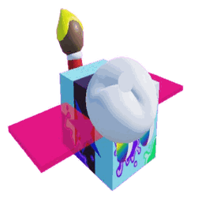

# Painter Bee

Painter Bee

<input type="radio" name="bee-infobox-tab" id="bee-tab-original" checked>
<label for="bee-tab-original">Original</label>
<input type="radio" name="bee-infobox-tab" id="bee-tab-gifted">
<label for="bee-tab-gifted">Gifted</label>

<i>"An artistic bee who sees every field as a blank canvas."</i>

<b>Rarity</b>Event

<b>Color</b>Colorless

<b>Energy</b>45

<b>Speed</b>12

<b>Attack</b>4

Color Scheme

<b>Skin</b><code>#929baa</code><code>#572590</code><code>#929baa</code>

**Painter Bee** is a Colorless [Event bee](bees-event.md) added in the [Painter Bee event](painter-bee-event.md). Its body is grey, and the [Gifted](gifted-bee.md) version is light blue.

Painter Bee paints flowers in your **Paint colour** and pollinates them. You pick your Paint colour (Red, Blue or White) in the Painter panel.

Like other Event bees, it has no favourite treat and no favourite fields.

## Stats

| Stat | Value |
|---|---|
| Rarity | Event |
| Colour | Colorless |
| Energy | 45 |
| Speed | 12 |
| Attack | 4 |
| Gather | 20 pollen every 4 seconds |
| Convert | 215 honey every 5 seconds |
| Gifted bonus | +15% Pollen |

Bonuses compared to a Basic Bee: +10 Gather Amount, +135 Convert Amount, -14.28% Movespeed, +125% Energy, +3 Attack, -25% Convert Speed.

## Abilities

### Color Splat

Turns 18 surrounding flowers your Paint colour for 10 seconds (+2 seconds every 2 levels) and pollinates them.

* Cooldown: 20 seconds
* Chance: 25%

Collecting a Color Splat token can give a [Paint Splatter sticker](painter-stickers.md) in your Paint colour (1 in 1,000).

### Painter's Haze

Summons a haze in your Paint colour over the field for 30 seconds. Every second it repaints and pollinates a random 3x3 patch of flowers, turning them your Paint colour for 10 seconds (+2 seconds every 2 levels).

* Cooldown: 75 seconds
* Chance: 1 in 6

Only one haze can exist at a time. While a haze is active, and for 1 minute after it ends, this ability uses Color Splat instead.

Summoning a Painter's Haze can give the Gifted Painter Bee sticker (1 in 5,000).

## Passive: Paint Residue

Every flower Painter Bee gathers from is painted your Paint colour for 10 seconds (+2 seconds every 2 levels) and pollinated.

If that flower is already your colour and at max tier, the paint goes to another flower in the field instead.

## How to obtain

* **Painter Bee Egg:** always hatches a Painter Bee and also gives a Painter Bee Jelly.
* **1st Edition Painter Bee Egg:** always hatches a 1st Edition Painter Bee and gives a 1st Edition Painter Bee Jelly, so it can never be lost.
* **Painter Bee Voucher** and **1st Edition Painter Bee Voucher:** each turns into the matching egg. One redemption per account.
* **Rebirth 35** rewards a Painter Bee Egg.
* The 1st Edition Painter Bee Voucher comes in the Painter Bee's Colorful Haul pack (see [Painter Bee event](painter-bee-event.md#shop)).

## See also

* [Painter Bee event](painter-bee-event.md)
* [Painter Stickers](painter-stickers.md)
* [Bees/Event](bees-event.md)

## All bees

--8<-- "all-bees.md"
